# Dragonfly × URMA RC / RM 阶段总结

**当前 RC 架构、数据路径、B7 性能口径与 RM 资源模型梳理**

日期：2026-09-09

## 1. 文档目的与证据口径

本文用于汇总当前 Dragonfly × URMA 适配阶段中已经梳理清楚的 RC 数据路径、并发模型、registered memory 生命周期、completion 路由、B7 测试方法与性能结论，以及 RM 模式相对 RC 的资源模型差异和后续研究方向。

证据等级统一使用：
[源码确认]：已从当前实现或对应源码调用链确认；
[官方文档确认]：已从 URMA/UB 或 Dragonfly 官方资料确认；
[实验验证]：已在真实 provider / B7/B8 环境跑通；
[日志/指标推断]：由日志、统计或时间线推断；
[架构分析]：基于当前模型的合理分析；
[尚待源码确认]：概念明确但具体实现字段/函数仍需源码核对；
[尚待环境验证]：代码或方案已存在，但还未在目标 provider 真机闭环。

## 2. 当前 URMA RC 总体架构

[源码确认 / 实验验证] 当前 RC 运行时可以概括为：dfdaemon 进程内维护 process-wide UrmaFabric；Fabric 持有 owner/progress thread、shared JFC、process-wide registered TX/RX pool；每个远端 Peer 对应一条 persistent RC Lane；一条 Lane 可以同时承载多个 Piece Transfer；每个 Transfer 再通过 Window / Chunk 做有界流水线。

核心层次：
Process → Peer → Persistent RC Lane → Piece Transfer → Window → Chunk。

Lane 是长期 transport connection；Transfer 是某个 Piece 的一次实际传输实例。一个 Piece 重试时可以对应新的 Transfer。transfer_id 是 lane-local 的，因此 (lane_id, transfer_id) 才能唯一标识一次 RC Piece Transfer。

### 图 2-1 当前 RC 运行时层次

> 示意图表达架构层次，不表示所有对象都严格一一对应源码 struct。

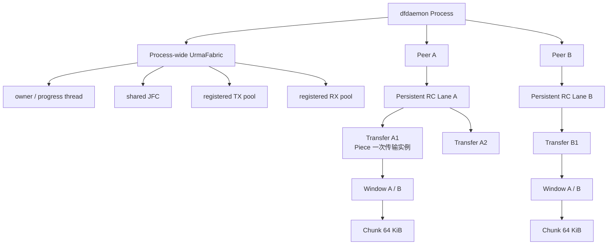

### 图 2-2 核心 identity 层次

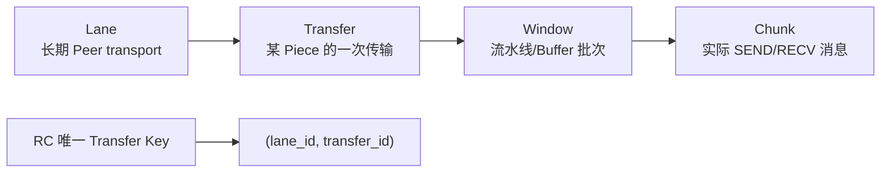

## 3. RC 建连：descriptor exchange → import → bind

[源码确认] RC 不是知道远端 IP 后直接 bind。双方先各自创建本地 Jetty，并通过 TCP control / OOB 通道交换可序列化 Jetty descriptor。收到远端 descriptor 后，在本地调用 import 得到 remote target handle，再执行 bind(local Jetty, imported remote target)。两边完成后 Lane 进入 Ready。

首次 Peer 关系建立的逻辑时序：
1) create local Jetty；
2) TCP control 交换 descriptor；
3) import remote descriptor；
4) bind local Jetty ↔ remote target；
5) RC Lane Ready；
6) 后续多个 Piece 复用同一 persistent Lane。

Scheduler 负责告诉 Child 哪个 Parent 有 Piece；Jetty descriptor 并不是 Scheduler 下发，而是在 Child 与 Parent 的 URMA control connection 上交换。

### 图 3-1 RC 首次建连时序

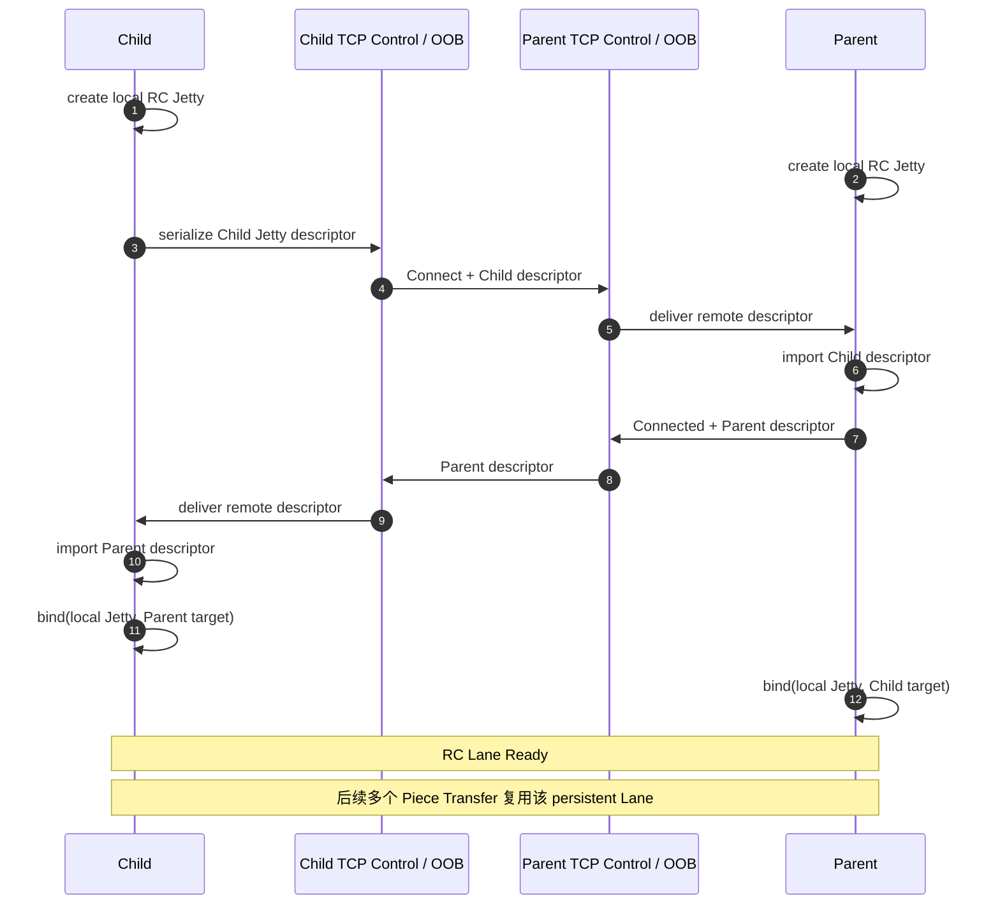

### 图 3-2 OOB 的作用

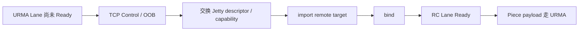

## 4. 并发模型：Lane / Transfer / Window / Chunk

[源码确认 / 实验验证] 当前 RC 至少有三层并发：
1) Peer/Lane 并发，例如 B7 的 L8；
2) 同一 Lane 上的 Piece Transfer 并发，例如 CC8；
3) 单个 Transfer 内 Window pipeline，例如 pipelineDepth=2。

B7 L8 的真实含义：物理上仍是两台机器，但 node2 启动 8 个独立 child daemon，每个 daemon 作为独立 Peer 与 node1 Parent 建立一条 persistent RC Lane。因此是 8 个 Peer × 1 Lane/Peer，不是一个 Child 与一个 Parent 建 8 条 Lane，也不是一个文件做 8-lane striping。

L8 × CC8 表示最多 8 条 Lane × 每 Lane 8 个 active Piece Transfer，即理论最多 64 个 active Transfer。这些 Transfer 分布在 8 个独立 task 中，而不是一个 1 GiB 文件跨 8 Lane 并行下载。

Window 是流水线和 registered-buffer 的逻辑批次；Chunk 才是真正 SEND/RECV 的消息/WR 单元。典型配置 chunk=64 KiB，maxInflightChunks=16，因此 1 Window≈1 MiB；pipelineDepth=2 表示每个 Transfer 最多同时持有两个 Window。

### 图 4-1 三层并发模型

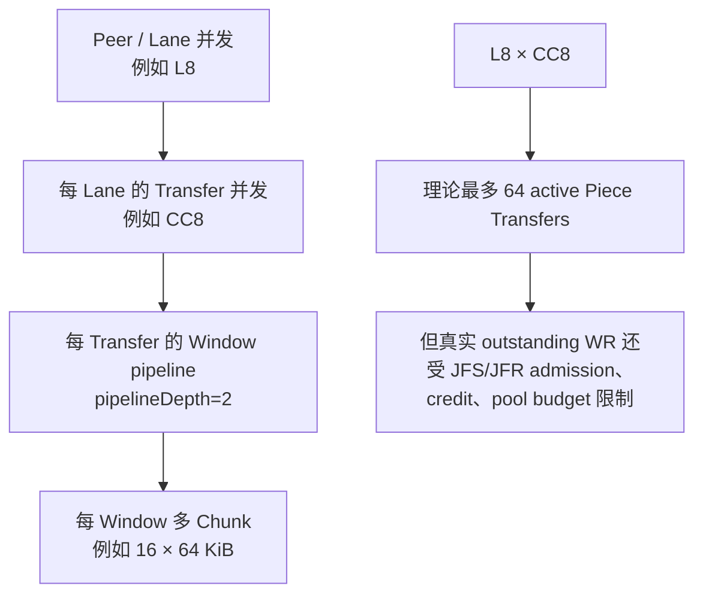

### 图 4-2 B7 L8 的真实拓扑

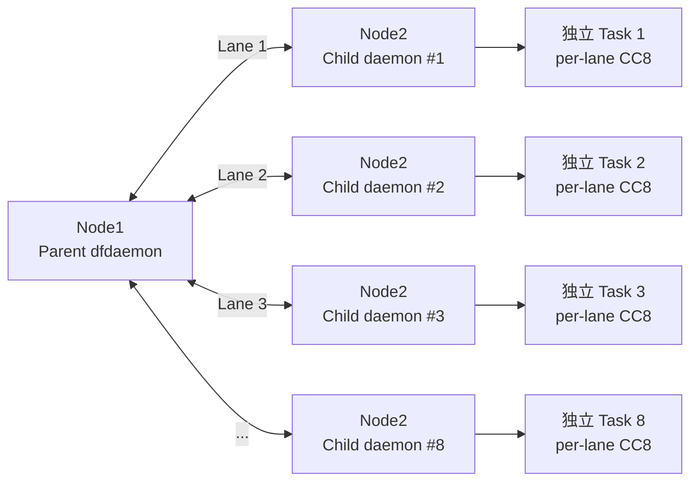

> 这张图特别用于避免把 L8 误解成“一个 Child 和一个 Parent 之间开 8 条 Lane”或“一个文件 8-lane striping”。

## 5. RC TX 数据路径

[源码确认] Parent TX 主路径：
Dragonfly task file → MappedPiece / RangeReader → acquire TxWindowLease → fill registered TX Window → 按 Chunk post SEND_IMM → SEND CQE → retire/refill/recycle TX slot。

MappedPiece 路径仍存在 source → registered TX 的 CPU copy，因此 mmap 不等于整个 TX 零拷贝。RangeReader 也直接填 registered TX destination，但依然存在 source-fill 成本。

TX double ring：pipelineDepth=2 时形成 Window A/B。典型流水线是 fill A → SEND A || fill B → SEND B || refill A，以隐藏 source-fill。第二个 Window 是 optional performance resource；拿不到时退化为 ring1，但仍继续走 URMA。

TX slot 的核心生命周期约束：SEND CQE 之前 provider/NIC 仍可能读取该 slot，因此 CPU 不能提前 refill；只有 SEND completion 退休后才能安全复用。

### 图 5-1 RC TX 数据路径

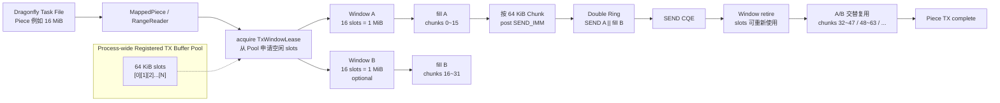

### 图 5-2 TX slot 生命周期

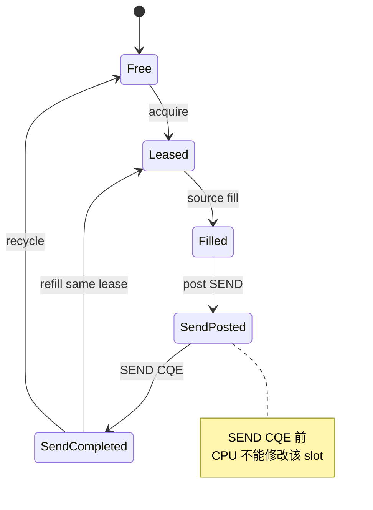

## 6. RC RX 数据路径

[源码确认 / 实验验证] Child RX 主路径：
reserve complete RX Window → post RECV WR → 全部 post 成功后发送 RecvPosted/credit → Parent SEND_IMM → NIC DMA 到 registered RX → RECV CQE → CompletionRouter → RegisteredRxWindowLease → CRC32 || pwrite/pwritev → 两个 consumer 都完成 → recycle RX slots。

RecvPosted 本质是 receive-ready barrier/credit：只有 Child 真正准备好 receive buffer 后，Parent 才被允许 SEND。RX budget 不足时会自然形成 backpressure，而不是 Parent 把数据硬塞进 Child。

RECV CQE 只表示 NIC/provider 已完成写入，不代表 RX slot 可以立即复用。Storage 还需要读取 registered memory 做 CRC 和 positional pwrite/pwritev，因此必须等待所有 consumer 完成后才能 recycle/repost。

production RX 路径已去掉额外 userspace staging copy：NIC DMA → registered RX spans → CRC/pwrite。兼容型 Downloader adapter 可能仍有 Bytes 聚合，但 production normal path 直接消费 registered lease。

### 图 6-1 RC RX 主路径

```mermaid
flowchart LR

    %% =========================
    %% RX Registered Buffer Pool
    %% =========================
    subgraph POOL["Process-wide Registered RX Buffer Pool"]
        P["64 KiB slots<br/>[0][1][2]...[N]"]
    end

    A["acquire RegisteredRxWindowLease<br/>从 Pool 申请空闲 slots"]

    P -.-> A

    A --> WA["Window A<br/>16 slots = 1 MiB"]
    A --> WB["Window B<br/>16 slots = 1 MiB<br/>optional"]

    %% =========================
    %% Post RECV
    %% =========================
    WA --> PRA["post RECV for Window A<br/>16 × 64 KiB"]
    WB --> PRB["post RECV for Window B<br/>16 × 64 KiB"]

    PRA --> READY["整个 Window RECV 全部 post 成功"]
    PRB --> READY

    READY --> CREDIT["发送 RecvPosted / credit<br/>通知 Parent 可以 SEND"]

    %% =========================
    %% Receive Data
    %% =========================
    CREDIT --> DMA["Parent SEND_IMM<br/>NIC DMA 写入 registered RX slots"]

    DMA --> CQ["RECV CQE<br/>user_ctx + local_id + imm_data"]

    CQ --> ROUTE["CompletionRouter<br/>校验 slot / generation / transfer / chunk"]

    %% =========================
    %% Window Complete
    %% =========================
    ROUTE --> COMPLETE["Window 内所有 Chunk 收齐"]

    COMPLETE --> STORAGE["RegisteredRxWindowLease<br/>交给 Storage"]

    STORAGE --> CRC["CRC32"]
    STORAGE --> WRITE["pwrite / pwritev"]

    CRC --> JOIN["两个 consumer 都完成"]
    WRITE --> JOIN

    %% =========================
    %% Recycle
    %% =========================
    JOIN --> RE["Window retire / recycle<br/>slots 可重新 post RECV"]

    RE --> NEXT["A/B 交替复用<br/>继续接收后续 Window"]

    NEXT --> DONE["Piece RX complete"]

```

### 图 6-2 RX slot 生命周期

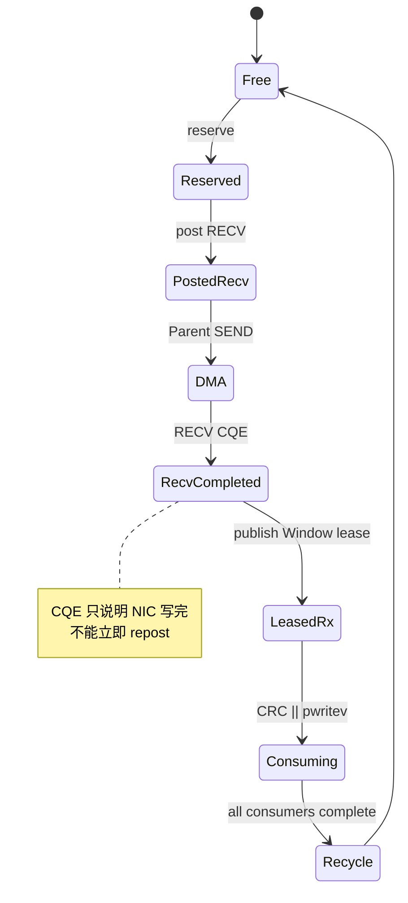

### 图 6-3 RX backpressure

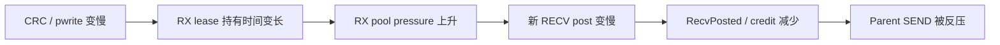

## 7. Registered Memory、slot、lease 与 generation

[源码确认] 当前不是每个 Piece 动态 register/unregister，而是 dfdaemon 进程级预注册一块 Segment，划分为 TX/RX region，再切成固定 slot，Transfer 通过 lease 临时借用 slot。

TX128 / RX32 是 process-level registered working-set budget，不是单次文件大小，也不是“最多只能发 128 MiB / 收 32 MiB”。slot 会不断 recycle，因此可以传输任意更大的文件。

典型 64 KiB slot 下：TX128 MiB≈2048 TX slots；RX32 MiB≈512 RX slots。若 Window=1 MiB，则 RX32 能同时承载约 32 个 1 MiB receive Window；Window 被 CRC/pwrite 消费后会回收继续使用。

generation 用于防 stale/late CQE：同一个 slot 会被反复复用，slot_id 只能说明物理位置，slot_id + generation 才能确认当前 CQE 是否属于这一代 ownership。

TX/RX budget 不要求对称。TX 生命周期主要受 SEND completion 控制；RX 生命周期还要额外等待 CRC/pwrite，因此 RX 需要根据实际 pipeline/backpressure 独立调优。当前 RX32 是已用配置，不等于已经证明最优。

### 图 7-1 Process-wide Registered Memory Pool

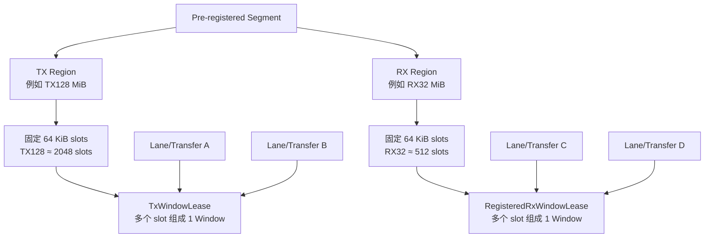

### 图 7-2 为什么 1 GiB 文件不需要 1 GiB registered memory

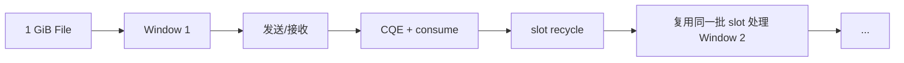

### 图 7-3 generation 防 stale CQE

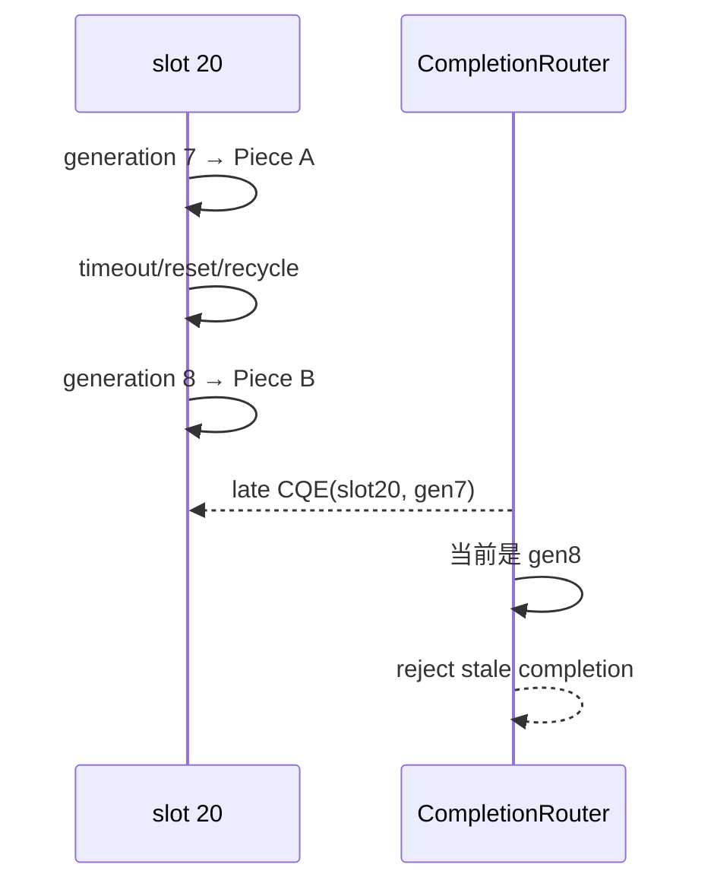

## 8. Completion 路由：local_id / user_ctx / SEND_IMM

[源码确认 / 实验验证] same-lane 多 Piece 后，Lane 不再能唯一标识 Piece，因此必须引入显式 Transfer/Chunk identity。

三类 identity 的职责：
local_id：provider/native completion 提供，用于定位本地 Lane/Jetty 等 native identity；
user_ctx：Child/本地在 post WR 时写入，用于定位本地 operation、slot、generation；
SEND_IMM：Parent/发送方随消息携带，用于标识远端业务身份，如 transfer_id + chunk sequence。

可简化记忆：
user_ctx = “这块本地 buffer 是谁/哪一代”；
SEND_IMM = “这次收到的数据是谁的”；
local_id = “从哪条本地 transport/lane 上来的”。

因此 CompletionRouter 需要联合校验 lane、slot、generation、transfer、sequence、length 等信息，防止 stale CQE、slot 复用、duplicate/unexpected chunk 以及同 Lane 多 Piece 串包。

### 图 8-1 CompletionRouter 的三类 identity

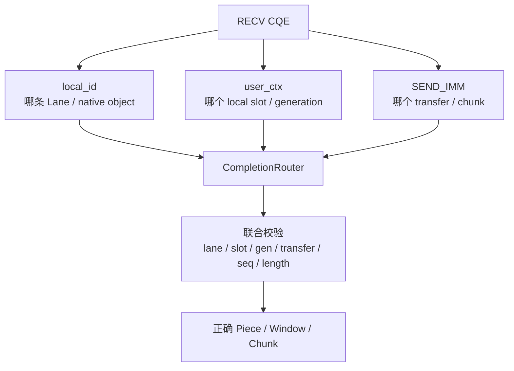

### 图 8-2 为什么并发后不能只靠 user_ctx

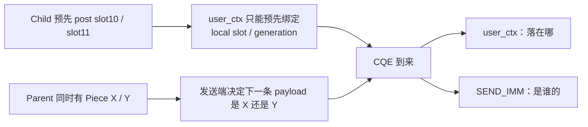

### 图 8-3 RC 中 Transfer 的唯一性

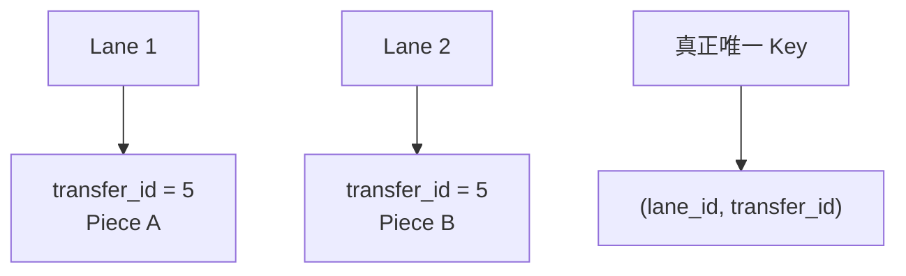

## 9. 当前 RC 完整时序（简化版）

正常成功路径：
1) dfget 请求 local dfdaemon；
2) dfdaemon 通过 Scheduler 获取 Parent/Piece 信息；
3) Child 与 Parent 建立或复用 persistent RC Lane；
4) 为 Piece 创建/登记 Transfer；
5) Child reserve RX Window，post RECV；
6) 完整 Window 的 RECV 全部成功后发送 RecvPosted；
7) Parent acquire TX Window，从 task file fill 到 registered TX；
8) Parent 按 Chunk SEND_IMM(target implicit by bound Lane, imm=transfer/chunk)；
9) Child NIC DMA 到 registered RX，CQE 经 CompletionRouter 路由；
10) Window 全部 Chunk 完成后交给 CRC32 || pwritev；
11) consumer 都结束后 recycle RX；
12) 所有 Window 完成、校验成功后 Piece Done/finish；
13) Transfer retire，但 persistent Lane 保留供后续 Piece 复用。

### 图 9-1 Current URMA RC End-to-End Sequence

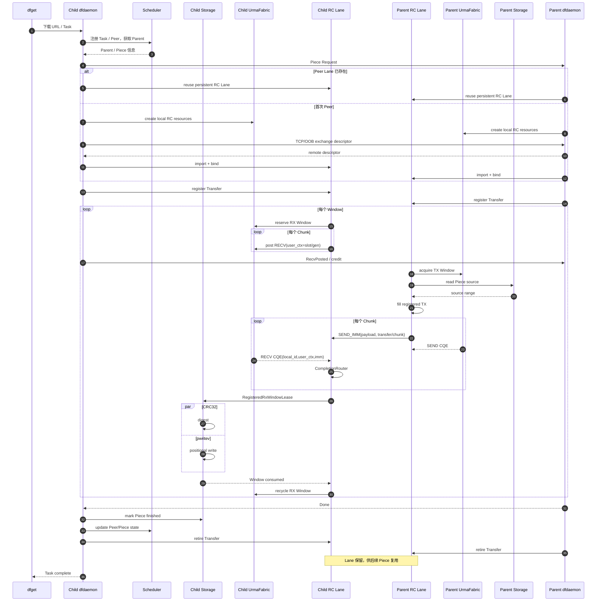

## 10. B7 测试方法与性能口径

[实验验证] B7 主口径是 Dragonfly dfget E2E，不是纯 wire transmission。单任务 throughput = measured bytes / dfget wall time；wall time 指 runner 从 dfget 进程启动到进程退出的真实 elapsed。

固定 1 GiB workload 下，可以由 throughput 直接反推平均 E2E 时间：time = 1024 MiB / throughput(MiB/s)。因此 TCP/URMA “同一文件时间对比”应描述为 dfget E2E 下载时间，而不是纯 NIC 传输时间。

并发 fan-out case 的 aggregate throughput = sum(batch bytes) / batch makespan；makespan = 最晚 task finish - 最早 task start。并发 task 的 wall time 不能相加。

warmup 会真实执行但不计入最终 aggregate。例如 warmups=1、repetitions=3，实际传 4 次，仅统计后 3 次。内部 tx_fill、send_wait、rx_wait、CRC、pwrite 等 timing 用于瓶颈归因，不能直接相加重建 wall time，因为大量阶段存在 overlap。

### 图 10-1 B7 单任务 throughput 口径

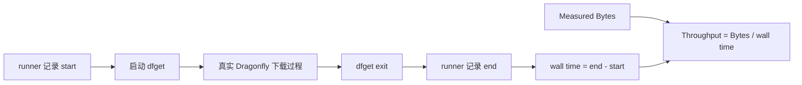

### 图 10-2 Task 时间拆分

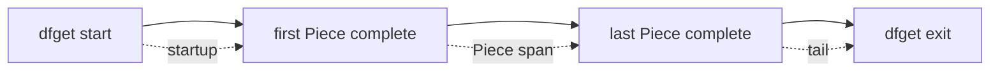

### 图 10-3 并发 batch makespan

```mermaid
flowchart TB
    T1["Task1<br/>start -------- finish"]
    T2["Task2<br/>  start -------- finish"]
    T3["Task3<br/> start ---------- finish"]
    M["batch makespan<br/>= earliest start → latest finish"]
    B["Aggregate throughput<br/>= sum(bytes) / makespan"]

    T1 --> M
    T2 --> M
    T3 --> M
    M --> B
```

## 11. 当前 RC 性能结果

[实验验证] 当前测试环境中 TCP 走 25 Gbps Ethernet，1 GiB workload 在 CC4 以后基本饱和，CC8/16 约 2550 MiB/s≈21.4 Gbps。

[实验验证] URMA 单任务通过 same-lane Piece concurrency、native RX window concurrency、registered-memory pipeline 等优化，代表高点 CC16≈7570.72 MiB/s≈63.51 Gbps。

[实验验证] 多 Peer/Lane fan-out 当前最好稳定点：L8、per-lane CC8、TX128，aggregate≈16003.86 MiB/s≈134.25 Gbps，Jain fairness≈0.999。134 Gbps 是 8 个并发 task 的 aggregate E2E，不是单 Lane、单 task 或单文件 134 Gbps。

[实验验证] 独立 URMA RC provider/perftest 已达到约 399~406 Gbps 级，SEND_IMM microbenchmark 还记录过约 539 Gbps。因此当前 134 Gbps 不能解释为“RC transport 上限”。

### 图 11-1 当前性能阶梯

```mermaid
flowchart LR
    TCP["TCP Dragonfly E2E<br/>≈21.4 Gbps"] --> U1["单任务 URMA<br/>CC16 ≈63.5 Gbps"]
    U1 --> U8["L8 × CC8 aggregate<br/>≈134.25 Gbps"]
    U8 --> P["URMA RC provider / perftest<br/>≈399~406 Gbps"]
    P --> SI["SEND_IMM microbenchmark<br/>记录过 ≈539 Gbps"]
```

### 图 11-2 不同数字代表不同层次

```mermaid
flowchart TB
    A["21.4G<br/>TCP 单 task E2E"] --> L1["应用 + TCP 25G 网络"]
    B["63.5G<br/>URMA 单 task E2E"] --> L2["应用 + URMA + 同 Lane 多 Piece"]
    C["134.25G<br/>L8 aggregate E2E"] --> L3["8 个并发 task 的总吞吐"]
    D["400G+<br/>perftest"] --> L4["provider / transport ceiling"]
```

## 12. 400G provider → 134G Dragonfly：当前瓶颈判断

[实验验证] 最强证据是 Parent source-fill。standalone fixed registered TX 可达约 400G+；改成 dynamic source → CPU copy → registered TX 后下降到约 59.6 Gbps，且当时 tx_fill 约占 95% wall time。这说明“喂 NIC”的 CPU/memory-copy 路径本身足以把 provider 400G 级能力压到几十 Gbps。

[架构分析 / 待 profile] 其他高优先级候选包括：process-wide owner/progress thread、CQ/completion handling、64 KiB message 带来的高 WR/CQE rate、TX allocator/slot bookkeeping、Child CRC32、Storage、CPU/NUMA/memory bandwidth。

[实验验证] TX160 比 TX128 更慢且 optional pressure/ring1 fallback 未明显改善，说明当前主要瓶颈不是简单“registered TX memory 不够”。allocator acquire 对更大 slot pool 的扫描/retain/bookkeeping 是候选原因，但尚未证明是根因。

下一步最有价值的分层实验：B7 full E2E baseline；Dragonfly transport-only（保留 Transfer/Window/SEND_IMM/CQE/control，但跳过 CRC/pwrite）；fixed-source Dragonfly；TX128/TX160 CPU profile；owner/CQ/allocator/per-thread/NUMA profile。

### 图 12-1 400G → 134G 的成本链

```mermaid
flowchart LR
    P["Provider fixed registered buffer<br/>≈400G+"] --> SF["source-fill / memory copy"]
    SF --> AL["TX allocator / lease bookkeeping"]
    AL --> OW["owner / progress thread"]
    OW --> CQ["WR / CQE processing<br/>64 KiB message rate"]
    CQ --> CR["Child routing / CRC32"]
    CR --> ST["pwritev / Storage / NUMA"]
    ST --> E["Dragonfly L8 aggregate E2E<br/>≈134G"]
```

### 图 12-2 已有最强证据：source-fill

```mermaid
flowchart TB
    F["fixed registered TX payload"] --> G1["≈400G+"]
    D["dynamic source<br/>source → CPU copy → registered TX"] --> G2["≈59.6G"]
    G2 --> T["tx_fill ≈95% wall time"]
    T --> C["[实验验证] source-fill 是重要软件瓶颈"]
```

### 图 12-3 下一步分层实验

```mermaid
flowchart LR
    A["perftest<br/>provider ceiling"] --> B["fixed-source Dragonfly<br/>测 control/CQ overhead"]
    B --> C["transport-only Dragonfly<br/>保留 source+URMA，跳过 CRC/pwrite"]
    C --> D["CRC-only / no-pwrite"]
    D --> E["full E2E"]

    X["每层差值"] --> Y["量化 source / CQ / CRC / Storage 各自成本"]
```

## 13. RM 的核心语义

[官方/源码确认 + 架构分析] RM 可理解为 Reliable Message 的可靠多目标/connectionless 消息模式。与 RC 的“一 Peer 一条 bound Lane”相比，RM 允许本地共享 messaging resource 面向多个 remote target。

RC：Process → Peer Lane → Transfer；
RM 目标：Process-wide Fabric → PeerTarget → Transfer。

RM 不是“没有远端状态”。Peer 仍需 descriptor/imported TargetHandle、generation、health、credit、outstanding 等逻辑状态；变化的是应用层不再为每个 Peer 独占一整套 local Jetty/JFR/bind/Lane。

### 图 13-1 RC 与 RM 的核心资源模型

```mermaid
flowchart TB
    subgraph RC["RC：per-peer bound connection"]
        RCF["Process-wide Fabric"]
        RCF --> LA["Lane A<br/>Jetty/JFR/bind"]
        RCF --> LB["Lane B<br/>Jetty/JFR/bind"]
        RCF --> LC["Lane C<br/>Jetty/JFR/bind"]
        LA --> TA["Transfers"]
        LB --> TB["Transfers"]
        LC --> TC["Transfers"]
    end

    subgraph RM["RM：shared messaging fabric + PeerTarget"]
        RMF["Process-wide RM Fabric<br/>shared JFS/JFR/JFC"]
        RMF --> PA["PeerTarget A"]
        RMF --> PB["PeerTarget B"]
        RMF --> PC["PeerTarget C"]
        PA --> RA["Transfers"]
        PB --> RB["Transfers"]
        PC --> RC2["Transfers"]
    end
```

### 图 13-2 RC → RM 的层次变化

```mermaid
flowchart LR
    A["RC<br/>Process → Peer Lane → Transfer"] --> B["RM<br/>Process-wide Fabric → PeerTarget → Transfer"]
```

## 14. RM 发送与接收模型

RM 发送侧可以理解为“共享发送资源 + 每条 WR 显式指定 target”。共享 JFS 不是自己猜目标，而是应用在 SEND 时指定 PeerTarget，provider/UB 再根据 target 把消息路由到对应远端。

RM 接收侧更复杂：shared JFR 可以预投 anonymous RX buffer，post 时不一定知道下一条消息来自哪个 Peer。CQE 到来后：
user_ctx → local slot/generation；
remote_id → 哪个远端 Peer/Target；
SEND_IMM → 该 Peer 的哪个 transfer/chunk；
CompletionRouter 再完成最终 demux。

因此 RC 的业务 key 更像 (lane_id, transfer_id, chunk_seq)，RM 则更像 (remote_id/peer identity, transfer_id, chunk_seq)。

### 图 14-1 RM 完整发送/接收时序

```mermaid
sequenceDiagram
    autonumber
    participant C as Child
    participant CR as Child shared RM Fabric/JFR
    participant P as Parent
    participant PR as Parent shared RM Fabric/JFS
    participant ST as Child Storage

    C->>P: RM control / capability / descriptor exchange
    C->>CR: import Parent descriptor → PeerTarget
    P->>PR: import Child descriptor → PeerTarget

    Note over C,P: RM 无 per-peer bind

    C->>CR: create Transfer
    P->>PR: create Transfer

    loop 每个 Window
        C->>CR: reserve shared RX Window
        loop 每个 Chunk
            CR->>CR: post anonymous RECV(user_ctx=slot/gen)
        end
        C->>P: RecvPosted / credit

        P->>PR: acquire/fill TX Window

        loop 每个 Chunk
            PR->>CR: SEND_IMM(target=Child PeerTarget,<br/>imm=transfer/chunk)
            Note over PR,CR: provider/UB 根据 target 路由
            CR-->>C: RECV CQE(user_ctx, remote_id, imm)
            C->>C: remote_id → Peer<br/>SEND_IMM → transfer/chunk<br/>user_ctx → slot/gen
        end

        C->>ST: RegisteredRxWindowLease
        par CRC32
            ST->>ST: digest
        and pwritev
            ST->>ST: positional write
        end
        ST-->>C: consume complete
        C->>CR: recycle shared RX Window
    end

    C->>CR: retire Transfer
    P->>PR: retire Transfer
    Note over CR,PR: Shared Fabric / PeerTarget 可继续复用
```

### 图 14-2 RM 发送侧：共享 JFS，但每条 WR 仍指定 target

```mermaid
flowchart LR
    J["Shared JFS"] --> A["SEND target=A"]
    J --> B["SEND target=B"]
    J --> C["SEND target=C"]

    A --> PA["Provider/UB → Peer A"]
    B --> PB["Provider/UB → Peer B"]
    C --> PC["Provider/UB → Peer C"]
```

## 15. RM 的 remote_id

[架构确认 / 具体字段待源码确认] remote_id 的作用是显式标识“这条 completion/消息来自哪个远端发送实体/Target”。RC 中 Peer identity 很大程度由 bound Lane 隐含；RM shared receive path 不再天然 per-peer，因此需要 remote_id 做 Peer demux。

可简化记忆：
user_ctx = 本地 buffer 身份；
remote_id = 哪个远端 Peer；
SEND_IMM = 这个 Peer 的哪个 Transfer/Chunk。

remote_id 在目标 UMDK/provider 中究竟对应 Jetty ID、TP/Target identity 还是 native CQE 中的具体字段，仍需以实际源码/CQE 定义确认。

### 图 15-1 RM 接收侧 identity

```mermaid
flowchart TB
    CQE["RM RECV CQE"]

    CQE --> U["user_ctx<br/>local slot / generation"]
    CQE --> R["remote_id<br/>哪个远端 Peer / Target"]
    CQE --> I["SEND_IMM<br/>哪个 transfer / chunk"]

    U --> D["RM Completion Demux"]
    R --> D
    I --> D

    D --> P["PeerTargetRegistry"]
    P --> T["TransferRegistry"]
    T --> W["Piece / Window / Chunk"]
```

### 图 15-2 RC 与 RM 的业务 Key

```mermaid
flowchart LR
    RC["RC"] --> RK["(lane_id, transfer_id, chunk_seq)"]
    RM["RM"] --> MK["(remote_id / peer identity,<br/>transfer_id, chunk_seq)"]
```

## 16. RM 相比 RC 省了哪些 native resource

[源码/架构确认] 当前 RC 每 Peer 通常维护 persistent Lane，其中包含 local Jetty、imported target、bind state、per-peer receive/connection lifecycle 等。Peer 数增加时，Lane 和相应 native connection state 随之增长。

RM 目标是把 local messaging layer 收敛成 process-wide shared RM Jetty/JFS/JFR/JFC，并让 Peer 主要变成 PeerTarget logical state。也就是说 RM 想删除的是 per-peer local Jetty/JFR/bind/Lane 这一层，不是删除 Peer 控制状态。

需要注意：registered Segment、TX/RX pool、shared JFC、owner/progress 在当前 RC 中已经是 process-wide 共享资源；RM 的新增价值主要是进一步共享 local messaging endpoint/JFS/JFR。

[尚待环境验证] 应用层不再 per-peer Lane，并不代表 provider 内部绝对没有 per-target TP/QP/native state。实际 device/kernel/provider object 数、内存和 setup/teardown 成本必须真机量化。

### 图 16-1 Peer 数增加时的资源增长

```mermaid
flowchart TB
    subgraph R["RC"]
        RP["Peer Count ↑"] --> RL["Persistent Lane Count ↑"]
        RL --> RJ["local Jetty / JFR / bind state ↑"]
    end

    subgraph M["RM"]
        MP["Peer Count ↑"] --> MT["PeerTarget logical state ↑"]
        MT --> MS["shared local JFS/JFR 基本保持 process-wide"]
    end
```

### 图 16-2 哪些资源当前 RC 已经共享，哪些是 RM 进一步共享

```mermaid
flowchart TB
    RC0["Current RC 已共享"] --> A["registered Segment"]
    RC0 --> B["TX/RX pool"]
    RC0 --> C["shared JFC"]
    RC0 --> D["owner/progress"]

    RM0["RM 进一步希望共享"] --> E["local messaging endpoint / Jetty"]
    RM0 --> F["JFS"]
    RM0 --> G["JFR"]

    H["仍随 Peer 增长"] --> I["PeerTarget / imported target / health / credit"]
```

## 17. RM 的资源池化、guaranteed / borrowed 与“借用”

RM shared JFS/JFR 让 queue depth、RX capacity、credit 更容易做 process-wide pool。为了避免某个 Peer 抢光资源，需要 global admission + per-peer guaranteed quota + borrowed quota。

示例：每个 Peer 有最小 guaranteed RX credit，空闲共享部分可以由热点 Peer borrow。这样既保留最低隔离，又提高资源利用率。这里“borrowed”明确指应用层 queue/buffer/credit capacity 借用，而不是直接等价于“借物理链路带宽”。

关于与 UB 人员交流中提到的“RM 可以借用带宽”：当前可以确认 RM 更适合共享 endpoint/queue/credit，UB 体系也强调资源池化、多路径/带宽聚合方向；但“RM 本身自动借用其他空闲链路/端口带宽”的具体 provider 机制仍需结合目标设备、RTP/CTP/TP 实现和真机实验确认，当前不能作为已验证事实。

### 图 17-1 guaranteed + borrowed 资源池化

```mermaid
flowchart TB
    G["Global shared RX / queue / credit pool"]

    G --> AG["Peer A guaranteed"]
    G --> BG["Peer B guaranteed"]
    G --> CG["Peer C guaranteed"]
    G --> SH["Shared borrow pool"]

    SH --> AB["A 很忙时 borrow"]
    SH --> BB["B 很忙时 borrow"]
    SH --> CB["C 很忙时 borrow"]

    AG --> SAFE["最低隔离得到保证"]
    BG --> SAFE
    CG --> SAFE

    AB --> UTIL["空闲 capacity 被热点 Peer 利用"]
    BB --> UTIL
    CB --> UTIL
```

### 图 17-2 “借用”目前可以确认和不能确认的边界

```mermaid
flowchart LR
    A["已能设计/确认<br/>queue / buffer / credit borrowing"] --> B["提高应用侧资源利用率"]
    C["UB 多路径 / 带宽聚合方向"] --> D["可能提高互联资源利用率"]
    E["RM 自动借其他端口物理带宽"] --> F["尚待 provider / RTP/CTP/TP 源码与真机确认"]
```

## 18. 为什么 RM 更适合 Dragonfly 多 Peer

[架构分析] Dragonfly 的典型模式是动态 Parent、多 Peer、高 fan-out、Peer churn、大量短生命周期 Piece Transfer。RC 将 Peer 映射为 persistent native Lane；RM 更接近把 Peer 映射为 logical Target，因此在大量低复用、频繁变化 Peer 场景下更匹配 Dragonfly 调度模型。

RM 的主要潜在收益优先级：
1) 减少 per-peer native Lane/Jetty/JFR/bind；
2) process-wide queue/resource pooling；
3) 降低 Peer create/retire 和 churn 成本；
4) 更自然地实现 guaranteed/borrowed fairness；
5) 更容易承接 UB 的多目标/池化互联语义；
6) 是否提升吞吐，最后由实验决定。

不能得出的结论：RM 已经证明比 RC 快；RM 一定能把 134G 提升到 400G；RM provider 内部完全没有 per-target state。当前 RM 方向的首要理由是资源模型和可扩展性，而不是已证明的吞吐优势。

### 图 18-1 为什么 RM 更贴合 Dragonfly 动态 Peer

```mermaid
flowchart TB
    S["Scheduler 动态选择 Parent"]
    S --> A["Piece1 ← Parent A"]
    S --> B["Piece2 ← Parent B"]
    S --> C["Piece3 ← Parent C"]
    S --> D["Piece4 ← Parent A"]

    A --> RC["RC：Peer → persistent native Lane"]
    B --> RC
    C --> RC

    A --> RM["RM：Peer → logical PeerTarget"]
    B --> RM
    C --> RM

    RC --> R1["Peer churn 会伴随 Lane create/bind/retire"]
    RM --> M1["Shared Fabric 复用，主要更新 Target state"]
```

### 图 18-2 RM 的价值优先级

```mermaid
flowchart LR
    A["减少 per-peer native Lane"] --> B["资源池化"]
    B --> C["降低 Peer churn 成本"]
    C --> D["guaranteed / borrowed fairness"]
    D --> E["更贴合 UB multi-target"]
    E --> F["吞吐是否提升：最后实验确认"]
```

## 19. RM 后续验证重点

RM 真正需要证明的不是单流带宽，而是多 Peer scalability。建议 Peer count 矩阵：1 / 8 / 32 / 64 / 128 / 256，对比 RC 与 RM 的 native object count、RSS/locked memory、Jetty/JFR/JFS/TP 对象数量、Peer setup/teardown latency、create/retire ops/s、steady-state throughput、fairness、fault isolation。

此外需要真实 RM provider 验证：import-only 是否成立；shared JFS/JFR SEND/RECV；CQE remote_id 语义；SEND_IMM 与 remote_id 联合 demux；anonymous RX correctness；guaranteed/borrowed credit；Peer-local failure 是否可以避免扩大到 shared Fabric。

### 图 19-1 RM 验证路线

```mermaid
flowchart TB
    P1["Phase 1<br/>真实 provider 最小闭环"]
    P2["Phase 2<br/>remote_id + SEND_IMM demux"]
    P3["Phase 3<br/>shared anonymous RX"]
    P4["Phase 4<br/>guaranteed / borrowed credit"]
    P5["Phase 5<br/>多 Peer scalability"]
    P6["Phase 6<br/>fault isolation / shutdown"]

    P1 --> P2 --> P3 --> P4 --> P5 --> P6
```

### 图 19-2 RC / RM 多 Peer 对比矩阵

```mermaid
flowchart LR
    N["Peer Count<br/>1 → 8 → 32 → 64 → 128 → 256"] --> O["native object count"]
    N --> M["RSS / locked memory"]
    N --> S["setup / teardown latency"]
    N --> C["create / retire ops/s"]
    N --> T["steady-state throughput"]
    N --> F["fairness"]
    N --> E["fault isolation"]
```

## 20. 当前阶段结论

RC：已经形成可工作的 process-wide Fabric + per-peer persistent Lane + same-lane concurrent Piece Transfer 的生产型数据路径，并在真实 provider 上验证了 SEND_IMM routing、native RX concurrency、aggregate admission 和多 Peer fan-out。provider 本身具有约 400G 级 transport 能力，当前 Dragonfly 134G 的主要优化空间仍在应用软件路径。

RM：当前最值得继续研究的价值不是“更快”，而是把 per-peer native connection model 转换成 shared Fabric + PeerTarget，从而更好支持 Dragonfly 大量动态 Peer、资源池化、queue/credit borrowing 与较低 churn 成本。具体性能、provider 内部资源节省和“带宽借用”机制仍需真实环境验证。

### 图 20-1 当前阶段总览

```mermaid
flowchart TB
    subgraph RC["RC：已真实 provider 验证的主线"]
        R1["per-peer persistent Lane"]
        R2["same-lane concurrent Transfer"]
        R3["registered TX/RX pipeline"]
        R4["SEND_IMM routing"]
        R5["L8 aggregate ≈134G"]
        R6["provider ≈400G+"]
        R1 --> R2 --> R3 --> R4 --> R5 --> R6
    end

    subgraph RM["RM：当前研究/原型主线"]
        M1["shared RM Fabric"]
        M2["PeerTarget"]
        M3["remote_id + SEND_IMM"]
        M4["anonymous shared RX"]
        M5["guaranteed + borrowed"]
        M6["真实 provider 尚待闭环"]
        M1 --> M2 --> M3 --> M4 --> M5 --> M6
    end
```

## 附录：主要参考材料

- `phase-a-minimal-piece-over-urma(5).md`
- `phase-b-performance-data-path(2).md`
- `b7-real-provider-performance-ledger(3).md`
- `b3.2-urma-performance-optimization-summary-2026-08-19(3).md`
- `b3.3-urma-two-day-optimization-summary-2026-08-21(3).md`
- `urma-perftest-analysis.md`
- `dragonfly-urma-mapping-analysis.md`
- `urma-buffer-lifecycle-analysis.md`
- `rdma-urma-upload-download-path-comparison.md`
- `urma-rm-for-dragonfly-p2p-evaluation.md`
- `dragonfly-urma-rm-research-summary-2026-09-04(3).md`
- `real-provider-validation-runbook(1).md`
