# Dragonfly URMA P2P：RC/RM 数据路径与演进方案

日期：2026-09-10  
范围：RC/RM 的控制流程、TX/RX 数据路径、资源与 completion 生命周期、当前瓶颈及待决策问题

## 1. 当前结论

当前 RC 和 RM 的关系不是两套完全不同的业务协议，而是同一套 Dragonfly Piece/Window/Chunk 传输模型下，两种不同的 URMA endpoint 与 Peer 资源组织方式。

- RC 已完成跨节点 Dragonfly 闭环和性能验证，是当前基线。
- RM 保留 RC 已验证的 registered-memory、Window pipeline、RecvPosted credit 和存储消费模型，主要替换 per-peer native Lane。
- RM 当前代码为 RM-only：进程级共享 RM endpoint，每个远端只保留 PeerTarget；RC 保留在独立分支，不在 RM 底层生命周期中混入兼容路径。
- RM 已完成编译、静态检查和离线单元测试，但目标 provider 的跨节点 RM 尚未通过，因此不能认为 RM 已完成端到端验证。
- RM 的第一目标是降低大量动态 Peer 下的 native resource 和连接 churn，不应把“直接提升带宽”作为切换理由。

## 2. 两种模式共用的传输抽象

Dragonfly 上层仍按 Piece 下载，URMA 层把一次 Piece 传输拆成以下层次：

```text
Piece Transfer
  ├── Window 0
  │   ├── Chunk 0 → 一个 SEND_IMM / RECV WR
  │   ├── Chunk 1 → 一个 SEND_IMM / RECV WR
  │   └── ...
  ├── Window 1
  └── ...
```

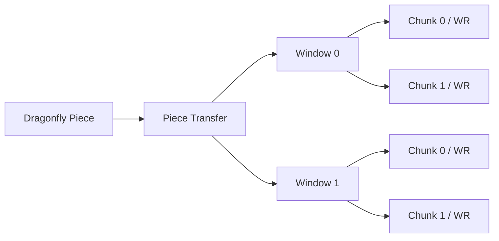

各层职责：

| 层次 | 作用 |
|---|---|
| Piece | Dragonfly 调度、校验和存储的基本业务单元 |
| Transfer | 一次 Piece 实际传输实例，负责协议状态和失败边界 |
| Window | registered memory 的租约单位和有界流水线单位 |
| Chunk | 一条 native SEND/RECV WR 对应的消息单位 |

共同原则：

1. dfdaemon 启动时预注册一块 Segment，再切分为 TX/RX slot；不按 Piece 反复 register/unregister。
2. TX/RX budget 是进程级 working set，不限制可传输文件的总大小。
3. `pipelineDepth` 控制同一 Transfer 同时持有的 Window 数量。
4. 接收端只有在 RECV 真正 post 成功后，才通过 TCP 控制帧发送 `RecvPosted`，允许发送端发送。
5. RX completion 只表示 NIC 已完成写入；CRC 和 pwrite/pwritev 消费完成后，RX slot 才能回收。
6. TX completion 到达前 provider/NIC 仍可能读取 TX slot，不能提前 refill 或回收。

### 2.1 TX/RX 注册内存如何划分和使用

RC 和 RM 共用同一种进程级 registered-memory 模型。配置中的两个核心参数是：

- `maxRegisteredBytes`：TX 与 RX 合计注册预算；
- `txRegisteredBytes`：其中划给 TX 的预算；
- RX 预算由 `maxRegisteredBytes - txRegisteredBytes` 得到。

当前 slot 固定为 64 KiB，运行时按完整 slot 向下取整：

```text
totalSlots = floor(maxRegisteredBytes / 64 KiB)
txSlots    = floor(txRegisteredBytes / 64 KiB)
rxSlots    = totalSlots - txSlots
```

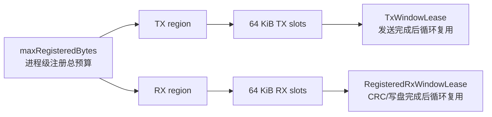

默认配置和性能测试配置要区分：

| 配置 | 总注册内存 | TX | RX | 64 KiB TX slot | 64 KiB RX slot |
|---|---:|---:|---:|---:|---:|
| 当前代码默认值 | 40 MiB | 8 MiB | 32 MiB | 128 | 512 |
| 已验证 L8 性能点 | 160 MiB | 128 MiB | 32 MiB | 2048 | 512 |

注册预算表示“当前可同时在途或被消费的工作集”，不是文件大小上限。例如 TX128/RX32 仍然可以传输 1 GiB、24 GiB 或更大的文件，因为 slot 会随 completion 和 Storage 消费持续回收。

典型 `chunk=64 KiB`、`maxInflightChunks=16` 时：

```text
1 Window = 16 chunks × 64 KiB = 1 MiB
pipelineDepth=2 → 单个活跃 Transfer 最多需要约 2 MiB TX working set
pipelineDepth=2 → 单个活跃 Transfer 最多需要约 2 MiB RX working set
```

若同时有 `N` 个活跃 Transfer，粗略需求为：

```text
方向 working set ≈ N × pipelineDepth × WindowSize
```

这只是上界估算，实际还会受 JFS/JFR depth、RecvPosted credit、全局 admission 和可选第二 Window 降级控制。例如 L8 × 每 Lane CC8 理论上有 64 个活跃 Transfer；每个 Transfer 都保持双 Window 时，单方向约需 128 MiB，因此 TX128 正好覆盖这一工作集。RX32 则只能同时承载约 32 个 1 MiB Window，会通过 RX pool 和 credit 形成背压，而不是为每个 Transfer 固定预留 2 MiB。

TX 和 RX 不要求对称：

- TX slot 主要等 SEND CQE，完成后即可回收或 refill；
- RX slot 在 RECV CQE 后仍被 CRC32 和 pwrite/pwritev 持有，生命周期通常更长；
- TX 侧并发 fan-out 较大时需要更大的发送工作集；RX 侧可以通过较小预算主动形成背压。

预算过小会增加 required Window 等待，或使可选的第二 TX Window 退化为单 Window；预算过大则增加 locked/registered memory，并可能恶化 allocator 扫描、cache locality 和 NUMA。已有测试中 TX160 比 TX128 更慢，因此不能把“加大注册内存”直接等同于“提高吞吐”。

### 2.2 TX Pool 与 A/B 双 Window 完整流水线

下面的图把 Task File、进程级 TX Pool、Window lease、64 KiB Chunk、SEND CQE 和 A/B 循环复用放在同一条链路中。这是 RC 与 RM 共用的数据准备和 Buffer 生命周期；两者的差异只发生在 SEND 使用 bound RC Lane，还是 shared RM JFS 加显式 TargetHandle。

```mermaid
flowchart LR
    S["Dragonfly Task File<br/>Piece，例如 16 MiB"] --> R["MappedPiece / RangeReader"]

    subgraph POOL["Process-wide Registered TX Buffer Pool"]
        P["64 KiB slots<br/>slot 0 / 1 / 2 / ... / N"]
    end

    R --> A["acquire TxWindowLease<br/>从 Pool 申请空闲 slots"]
    P -.->|lease slots| A

    A --> WA["Window A<br/>16 slots = 1 MiB<br/>required"]
    A --> WB["Window B<br/>16 slots = 1 MiB<br/>optional"]

    WA --> FA["fill A<br/>chunks 0～15"]
    WB --> FB["fill B<br/>chunks 16～31"]

    FA --> SA["按 64 KiB Chunk<br/>post SEND_IMM A"]
    SA --> PIPE["Double Window Pipeline<br/>NIC send A ∥ CPU fill B"]
    FB --> PIPE

    PIPE --> SB["post SEND_IMM B<br/>同时等待 A completion"]
    SB --> CQ["当前实现：每个已 post Chunk 一个 SEND CQE"]
    CQ --> RETIRE["Window 内全部 Chunk 完成<br/>retire Window，slots 才可复用"]
    RETIRE --> NEXT["A/B 交替 refill 和复用<br/>chunks 32～47 / 48～63 / ..."]
    NEXT --> DONE["Piece TX complete"]
```

图中的“双 Window”不是两块永久保留的独立注册内存，而是同一 TX Pool 上的两个临时 lease。Window B 申请失败时会安全退化为单 Window；Window A/B 只有在各自已 post 的全部 SEND CQE 收敛后才能 refill。当前 linked post-list 可以减少 native post/doorbell 次数，但仍是每个 Chunk 一个 CQE，具体见 8.5 节。

### 2.3 RX Pool 与 A/B 双 Window 完整流水线

RX 双 Window 使用同一个 process-wide registered RX Pool。它的目的不是隐藏 source fill，而是让
Window A 进入 CRC32/Storage 消费时，Window B 继续接收下一批网络数据：

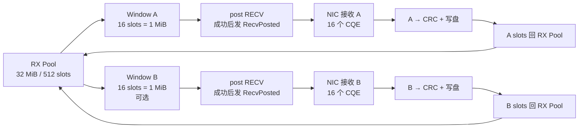
RX 双 Window 的目的，是让 Window A 被 Storage 消费时，Window B 仍可接收下一批数据：

因此双 Window 同时在两端隐藏不同的等待：TX 侧隐藏 source fill 与 SEND completion，RX 侧隐藏网络接收与 CRC/存储消费。

## 3. RC 方案

### 3.1 RC 资源模型

```text
dfdaemon Process
├── UrmaFabric（process-wide）
│   ├── native runtime/context
│   ├── owner/progress thread
│   ├── shared JFC
│   └── registered TX/RX pool
│
├── Peer A → persistent RC Lane
│            ├── local Jetty/JFR
│            ├── imported remote target
│            ├── bind state
│            └── active Piece Transfers
├── Peer B → persistent RC Lane
└── Peer C → persistent RC Lane
```

RC 中，一条 Lane 同时承担两个角色：

- native transport connection；
- completion 路由中的隐式 Peer 身份。

Lane 是 persistent 的，Piece Transfer 是短生命周期的。一条 Lane 可以并发承载多个 Transfer，Transfer 结束后 Lane 保留，供后续 Piece 复用。

### 3.2 RC 建连与控制流程

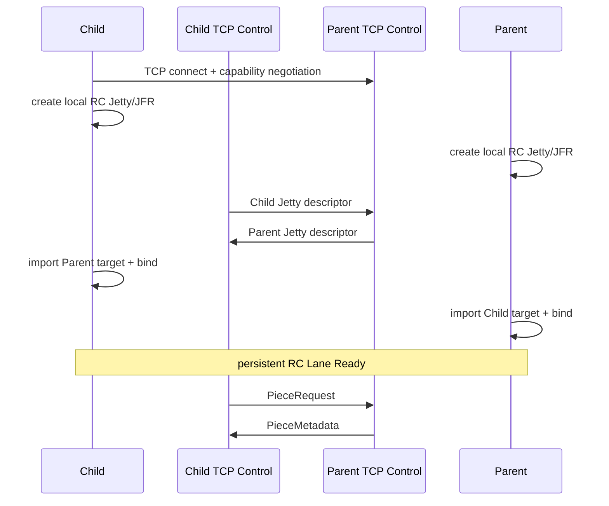

```text
Child                                              Parent
  |                                                   |
  |--- TCP connect / capability negotiation --------->|
  |                                                   |
  | create local RC Jetty/JFR     create local RC Jetty/JFR
  |                                                   |
  |--- local Jetty descriptor ----------------------->|
  |<-- remote Jetty descriptor -----------------------|
  |                                                   |
  | import remote target          import remote target|
  | bind local Jetty              bind local Jetty     |
  |                                                   |
  |<================ RC Lane Ready ==================>|
  |                                                   |
  |--- PieceRequest --------------------------------->|
  |<-- PieceMetadata ---------------------------------|
```

要点：

- Scheduler 只负责选择 Parent，不下发 Jetty descriptor。
- descriptor 由 Parent/Child 的 TCP rendezvous connection 交换。
- RC bind 完成后，SEND 的远端目标由 Lane 隐含，不需要每个 WR 再显式选择 target。
- TCP control connection 还承载 PieceRequest、PieceMetadata、RecvPosted、Done 和 Error 等控制帧。

### 3.3 RC TX 流程

Parent 发送一组 Window 时：

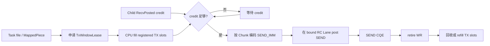

```text
task file / MappedPiece / RangeReader
  │
  ├─ 1. acquire TxWindowLease
  ├─ 2. source data → registered TX slots（CPU copy/fill）
  ├─ 3. 等待 Child 的 RecvPosted credit
  ├─ 4. 为每个 Chunk 生成 SEND_IMM routing token
  ├─ 5. post SEND_IMM 到该 Peer 的 bound RC Lane
  ├─ 6. poll SEND CQE
  ├─ 7. retire outstanding WR
  └─ 8. recycle/refill TX slots
```

典型配置下，`chunk=64 KiB`、`maxInflightChunks=16`，一个 Window 约 1 MiB。`pipelineDepth=2` 时形成 A/B 双 Window：

```text
fill A → send A ─────────→ CQE A → refill A
          fill B → send B ─────────→ CQE B → refill B
```

发送侧的重叠关系如下。A 已 post 后，CPU 可以填充 B；但 A 必须等自己的 SEND CQE，才能进入下一轮 refill：

若第二个 Window 只是性能型 optional lease，申请不到时会退化为 ring1：

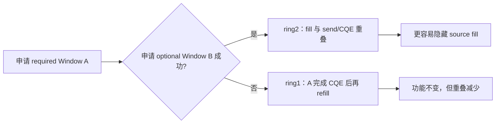

该流水线用于隐藏 source fill，但没有消除 source-to-registered-memory copy。

### 3.4 RC RX 流程

Child 接收一个 Window 时：

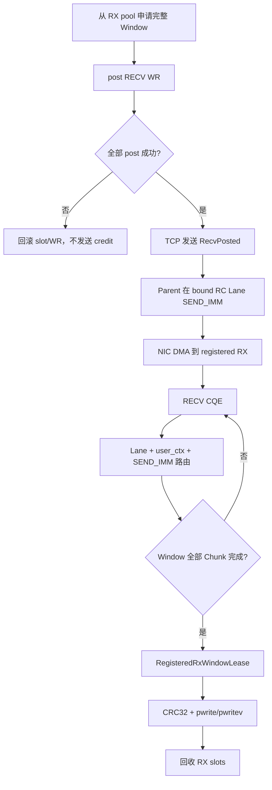

```text
1. 从进程级 RX pool 申请完整 Window 所需 slots
2. 将 slots 标记为 posted，并 post RECV WR
3. 所有 RECV 都 post 成功后发送 RecvPosted(count)
4. Parent 消费 credit，在 bound RC Lane 上发送 SEND_IMM
5. NIC DMA 写入 registered RX slot
6. poll RECV CQE
7. 结合 Lane + user_ctx + SEND_IMM 定位 Transfer/Chunk
8. Window 全部 Chunk 完成后生成 RegisteredRxWindowLease
9. Storage 对 lease 执行 CRC32 和 pwrite/pwritev
10. 所有 consumer 完成后回收 RX slots
```

正常数据路径没有额外的 userspace RX staging copy：

```text
NIC DMA → registered RX spans → CRC32 / pwritev → recycle
```

### 3.5 RC completion 身份

RC 路由可以概括为：

```text
Lane/local_id  → 哪个 Peer / transport connection
user_ctx       → 哪个本地 operation、slot、generation
SEND_IMM       → 哪个 Transfer、哪个 Chunk
```

当一条 Lane 同时承载多个 Piece 时，仅靠 Lane 已经不能唯一识别业务消息，因此必须保留显式 Transfer/Chunk identity。

### 3.6 RC 的并发与背压

RC 当前有三层并发：

1. 多 Peer/Lane 并发；
2. 同一 Lane 多 Piece Transfer 并发；
3. 单 Transfer 内 Window pipeline。

背压来自四层：

- `maxConcurrentTransfers`：限制活跃 Piece Transfer；
- registered TX/RX pool：限制同时占用的 Window；
- JFS/JFR depth：限制 outstanding native WR；
- `RecvPosted`：确保发送量不超过远端实际已 post 的 RECV。

## 4. RM 方案

### 4.1 RM 资源模型

```text
dfdaemon Process
├── UrmaFabric（process-wide）
│   ├── native runtime/context
│   ├── owner/progress thread
│   ├── shared RM Jetty/JFS/JFR/JFC
│   ├── registered TX/RX pool
│   └── global RX credit admission
│
├── PeerTarget A
│   ├── imported target handle
│   ├── remote_id
│   ├── id + generation
│   ├── send credits
│   └── lifecycle / active Transfers
├── PeerTarget B
└── PeerTarget C
```

RM 删除的是应用层 per-peer local Jetty/JFR/bind/Lane，不是删除远端身份和 Peer 状态。每个 PeerTarget 仍必须维护 imported target、remote identity、credit、generation、health 和 outstanding 状态。

当前代码中部分上层接口和日志仍使用 `lane_id` 名称，但在 RM 模式下它只是 session facade 的逻辑 PeerTarget ID，不代表每 Peer 存在独立 native Jetty。

### 4.2 RM endpoint 与 PeerTarget 建立流程

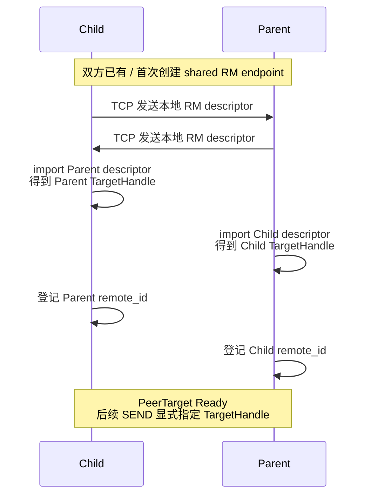

```text
dfdaemon 首个 RM Peer 到来
  │
  ├─ 创建 process-wide shared RM endpoint
  ├─ 创建 shared JFS/JFR/JFC
  ├─ 导出本地 shared Jetty descriptor
  └─ 后续 Peer 复用同一个本地 endpoint

每个 Peer session
  │
  ├─ 分配 PeerTarget id + generation
  ├─ TCP 交换 capability、TP type 和 shared descriptor
  ├─ 校验 transport type、RM mode、RTP/CTP 和消息上限
  ├─ import remote descriptor → TargetHandle
  ├─ 查询并登记 remote_id
  └─ PeerTarget Created → Ready
```

与 RC 的关键区别：

- 不对每个 Peer 创建新的本地 Jetty/JFR；
- 不执行 per-peer RC bind；
- SEND 时必须显式传入 TargetHandle；
- shared JFR 上的 RECV 在 post 时不绑定某个远端 Peer。

### 4.3 RM TX 流程

RM 发送侧保留 RC 的 source fill 和 Window pipeline，只改变 target 选择和 completion owner：

RM 的 A/B 双 Window 时序与 3.3 节一致；区别是多个 PeerTarget 的 Window 都从同一个进程级 TX pool 获取，并通过 shared JFS 发送。某个 PeerTarget 获取不到 optional Window B 时，只应让该 Transfer 退化为 ring1，不能占用其他 Peer 的 guarantee 或阻塞整个 shared endpoint。

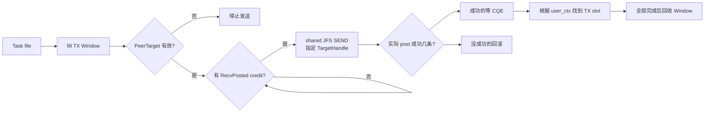

```text
task file
  │
  ├─ 1. acquire TxWindowLease
  ├─ 2. source data → registered TX slots
  ├─ 3. 等待该 PeerTarget 的远端 RecvPosted credit
  ├─ 4. 校验 PeerTarget 为 Ready，id/generation 未过期
  ├─ 5. 为每个 Chunk 编码 RoutingToken
  ├─ 6. 在 shared JFS 上 post SEND_IMM，并显式指定 TargetHandle
  ├─ 7. SEND CQE 通过 user_ctx 回到 PeerTarget/slot/generation
  ├─ 8. 只消费 provider 实际接受的 posted prefix 对应 credit
  └─ 9. 全部 SEND CQE 后回收 TX Window
```

`SEND_IMM` 中的 64 位 RoutingToken 当前布局为：

```text
[ transfer_id: 32 bits ][ chunk sequence: 32 bits ]
```

RM 的 `transfer_id` 是进程级、不复用的生命周期身份，不再是 RC 语义下的 lane-local sequence。

TX WR 的 `user_ctx` 使用 pointer-free 编码：

```text
[ PeerTarget id:16 ][ generation:8 ][ operation:8 ]
[ slot generation:16 ][ slot index:16 ]
```

当前实现会先在 CompletionRouter 中 reserve WR identity，再调用 native post；post 成功后 commit handle，失败或部分成功时按实际 posted prefix 回滚，避免 CQE 先于软件登记或 credit 多扣。

### 4.4 RM RX 流程

RM 接收是方案中变化最大、也最需要真机验证的部分。

RM 同样使用 RX 双 Window 隐藏网络接收与 Storage 消费，但多个 PeerTarget 共用 RX pool 和 shared JFR。第二个 Window 是否能够进入 pipeline，同时受注册内存、物理 RQE、global admission 和该 Peer guaranteed/borrowed credit 约束。

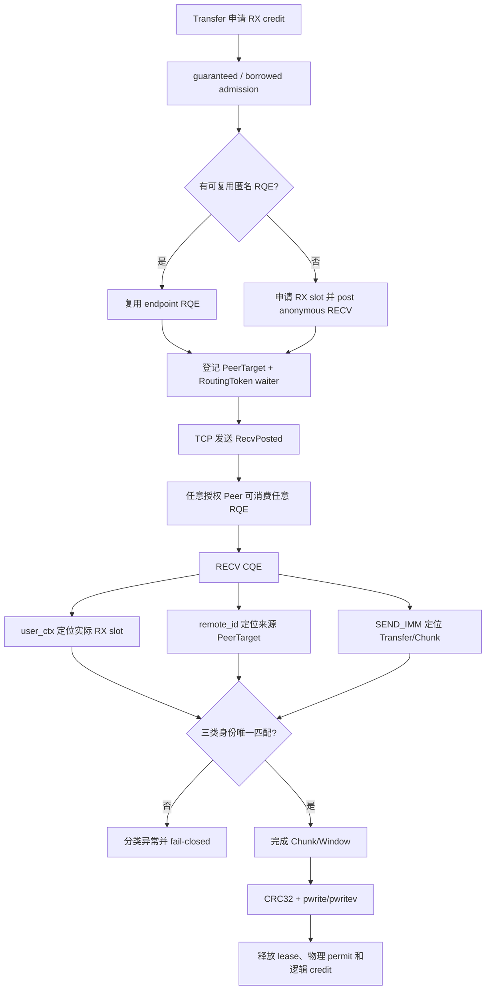

```text
1. Transfer 申请本 Peer 的逻辑 RX credit
2. credit admission 分配 guaranteed 或 borrowed 配额
3. 从 shared JFR 已存在的匿名 RQE 中复用；不足时申请 RX slots 并 post 新 RQE
4. 在 PeerTarget 的 TransferRegistry 中登记期望的 RoutingToken
5. RECV 全部准备完成后，通过 TCP 发送 RecvPosted(count)
6. 任意已授权 Peer 的 SEND 都可能消费任意一个 shared-JFR RQE
7. RECV CQE 返回：user_ctx + remote_id + SEND_IMM
8. user_ctx 定位实际收到数据的本地 RX slot/generation
9. remote_id 定位可能的 PeerTarget；SEND_IMM 解码 Transfer/Chunk
10. 两者联合匹配唯一逻辑 waiter，拒绝 unknown/stale/ambiguous/over-credit 消息
11. Window 完成后交付 RegisteredRxWindowLease
12. Storage 完成 CRC32 + pwrite/pwritev 后释放 lease 和逻辑 credit
```

RM RX 需要同时维护两类所有权：

```text
物理所有权：anonymous RQE ↔ registered RX slot
逻辑所有权：PeerTarget ↔ Transfer ↔ Chunk waiter
```

两者只有在 CQE 到来后才通过 `remote_id + SEND_IMM + user_ctx` 汇合。不能把“预投该 RQE 时的逻辑请求”当成消息来源，因为 shared JFR 上任何远端都可能消费该 RQE。

讲解时可以把 RM RX 简化为下面的“三把钥匙”：

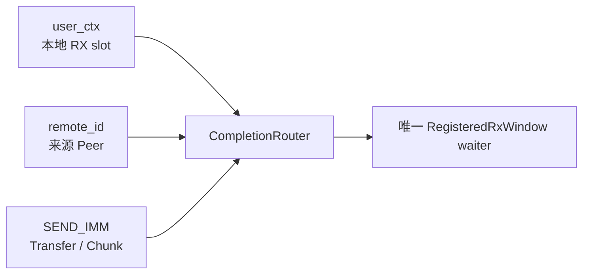

RECV 的 `user_ctx` 使用匿名 owner：

```text
PeerTarget id = 0
generation = 1
operation = RECV
slot id = slot generation + slot index
```

实际 Peer 身份必须来自 provider 在 CQE 中返回的完整 `remote_id`，不能从本地 RQE 猜测。

### 4.5 RM RX credit 模型

shared JFR 使所有 Peer 竞争同一个物理 receive capacity。当前方案引入：

- global capacity：物理 JFR/RX capacity 上限；
- per-peer guaranteed limit：给活跃 Peer 保留的最低逻辑额度；
- borrowed credit：热点 Peer 使用未被其他 Peer 占用、且不侵占其 guarantee 的剩余容量。

示例：总容量为 12，Peer A/B 各 guarantee 3。A 最多可以先拿到自身 3 个 guaranteed 加 6 个可借容量，但必须给 B 留出 3 个 guarantee。

这里的 borrowed 是应用层 queue/buffer/credit capacity 借用，不等于 provider 自动借用物理链路带宽。

credit 生命周期：

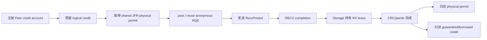

```text
register Peer account
  → reserve logical credit
  → acquire physical shared-JFR permit
  → post/reuse anonymous RQE
  → send RecvPosted
  → receive completion
  → Storage consumer release lease
  → return physical permit + logical credit
```

Peer 退出时，如果仍有 lease 持有 credit，则 PeerTarget 进入 retiring，延迟到 outstanding credit 清零后再注销，避免提前释放保证额度或形成悬挂 waiter。

### 4.6 RM completion 路由与异常分类

```text
user_ctx
  → 校验 operation、slot index、slot generation
  → 找到真实 DMA buffer

remote_id
  → 在 authorized PeerTarget registry 中查找来源

SEND_IMM / RoutingToken
  → transfer_id + chunk sequence
  → 在候选 PeerTarget 的 TransferRegistry 中查找唯一 waiter
```

需要明确区分：

| 异常 | 含义 | 期望处理范围 |
|---|---|---|
| missing source | CQE 没有 remote_id | provider/endpoint 级异常，待真机确认 |
| unknown source | remote_id 未授权 | 拒绝消息，评估 Peer 或 endpoint 级 |
| stale token | Transfer 已结束或 generation 已变化 | 丢弃并退休相关 Peer |
| over credit | 来源 Peer 发送了未授权 Chunk | 协议错误，Peer-local fail-closed |
| ambiguous token | 同一 remote_id/token 可匹配多个 PeerTarget | registry/invariant 错误，不能继续交付数据 |
| slot generation mismatch | CQE 对应旧一代 slot | stale CQE，禁止访问已复用 buffer |

### 4.7 RM Peer 与 endpoint 生命周期

PeerTarget 状态：

```text
Created → Ready → Draining → Closed
                  └──────→ Failed
```

单 Peer 退出时不能直接 `mark_error(shared Jetty)`，否则会影响其他 Peer。当前处理逻辑是：

1. 禁止该 Peer 新增 credit 和 SEND；
2. 从 completion routing 中进入 retirement；
3. 等待该 Peer 自己的 outstanding SEND 完成；
4. 清理逻辑 RX waiter；已经 post 的匿名 RQE 保留为 endpoint 资源，后续 Peer 可复用；
5. outstanding 清零后 unimport target，释放 PeerTarget ID；再次使用同一 ID 时 generation 递增。

仍需真机确认的关键问题是：单 Peer 如果永久 stranded WR，目标 provider 是否支持安全的 per-target flush/abort。当前 RM0 没有可证明的 per-target flush，必要时只能在 Runtime shutdown 上升级为 endpoint-level flush。

## 5. RC 与 RM 的关键差异

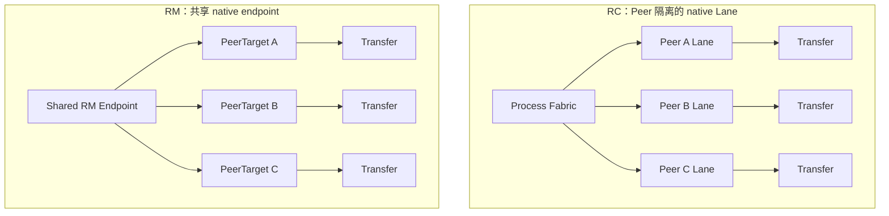

| 维度 | RC | RM |
|---|---|---|
| 本地 native endpoint | 每 Peer 一条 Jetty/JFR Lane | 进程级共享 Jetty/JFS/JFR/JFC |
| Peer 对象 | Lane + imported target + bind | 轻量 PeerTarget + imported target |
| SEND 选目标 | bound Lane 隐式决定 | 每条 WR 显式 TargetHandle |
| RECV 归属 | 由 Lane 隐含 | RQE 匿名，CQE 到来后解复用 |
| Peer 身份 | Lane/local_id | remote_id |
| 业务身份 | SEND_IMM Transfer/Chunk | SEND_IMM Transfer/Chunk |
| TX buffer 身份 | user_ctx slot/generation | user_ctx PeerTarget/generation/slot |
| RX buffer 身份 | user_ctx slot/generation | anonymous user_ctx slot/generation |
| RX credit | per Lane receive-ready | global admission + per-peer guarantee/borrow |
| Peer 失败隔离 | Lane 可独立 error/close | 不能轻易 error shared endpoint |
| 资源增长 | local Lane 随 Peer 线性增长 | 应用层 local endpoint 固定，PeerTarget 增长 |
| 当前证据 | 已跨节点验证 | 离线通过，跨节点 provider 未通过 |

## 6. B7 测试方法与统计口径

### 6.1 B7 测的是什么

B7 的被测对象是 Dragonfly 的 `dfdaemon + dfget` 完整 P2P 路径，不是单独调用 URMA API 的 microbenchmark。一次样本的主计时范围是 Child 启动 `dfget` 到 `dfget` 进程退出，因此覆盖：

```text
调度/选择 Parent
  + TCP rendezvous 与首次建连（若未复用）
  + Piece 请求和 URMA 数据传输
  + RX CRC32 与 Storage 写入
  + Piece/Task 完成处理
  + dfget output 物化和进程退出
```

所以 B7 报告的是 Dragonfly E2E throughput，不能解释成纯线速、纯 NIC DMA 或单独 URMA transport throughput。`urma_perftest` 和 transport-lab 用于回答 provider/transport 能力，B7 用于回答这些能力进入 Dragonfly 后的实际收益与瓶颈。

### 6.2 双节点测试拓扑

当前基线中，`90.91.177.158` 作为 Parent，`90.91.177.157` 作为 Child：

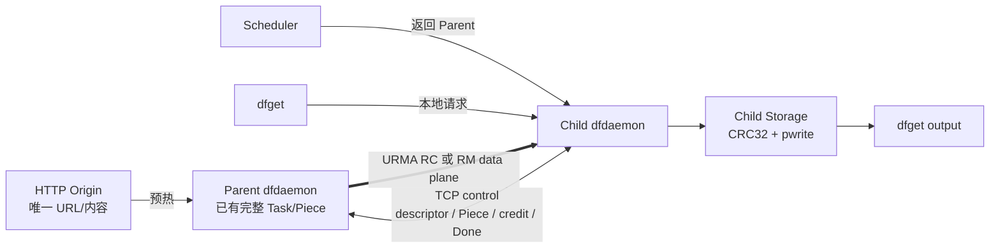

Parent 会在 Child 启动前完成本轮所有唯一 Task 的 preheat，再启动 Child，并使用 `--disable-back-to-source` 下载，避免 Child 回源或 Scheduler 把已经活跃的 Child 反向选为 Parent。

B7 的 `--profile rc` 和 `--profile rm` 分别选择两套独立的 Dragonfly checkout；工具统一，但 RC/RM 代码不混编。正式 A/B 必须固定 binary hash、配置、设备、EID、UMDK/provider 和基础系统状态。

### 6.3 一轮测试如何执行


典型命令：

```bash
cd /home/y30083740/dragonfly/dragonfly-urma-tools/urma-b7

# 环境和 provider 前置检查。
python3 b7.py discover --profile rc
python3 b7.py probe-provider --profile rc --mode dual \
  --server-address 90.91.177.158 --run-id rc-provider-001 --execute

# prepare/run/cleanup 不带 --execute 时只做 dry-run。
python3 b7.py prepare --profile rc --mode dual \
  --run-id rc-case-001 --case <case-name> --execute
python3 b7.py run \
  --manifest results/rc-case-001/manifest.json --execute
python3 b7.py cleanup \
  --manifest results/rc-case-001/manifest.json --execute
```

RM 只需使用 `--profile rm`，但跨节点 RM provider gate 尚未通过。使用 `--allow-unvalidated-urma` 越过门禁得到的结果只能标记为 diagnostic，不能登记为正式 PASS。

### 6.4 如何证明实际走了 URMA

内容 hash 一致只能证明结果正确，不能证明数据经 URMA 传输；如果 URMA 失败后回退 TCP，文件仍可能正确。因此 B7 同时检查：

- Origin、Parent 和 Child 文件长度及 SHA-256；
- Child 日志中存在属于 measured task ID 的 URMA Piece completion；
- Parent URMA upload 与 Child URMA download 的 Piece/Transfer 证据能够对应；
- session/PeerTarget identity 稳定，Transfer/Chunk 路由满足 case 要求；
- 没有 `falling back to tcp downloader`、BUSY/reject、previous-transfer failure 或异常 retirement；
- 没有 CQE、completion、protocol、digest、Jetty 或 panic 异常；
- shutdown 中只放行已定义的对端正常关闭事件。

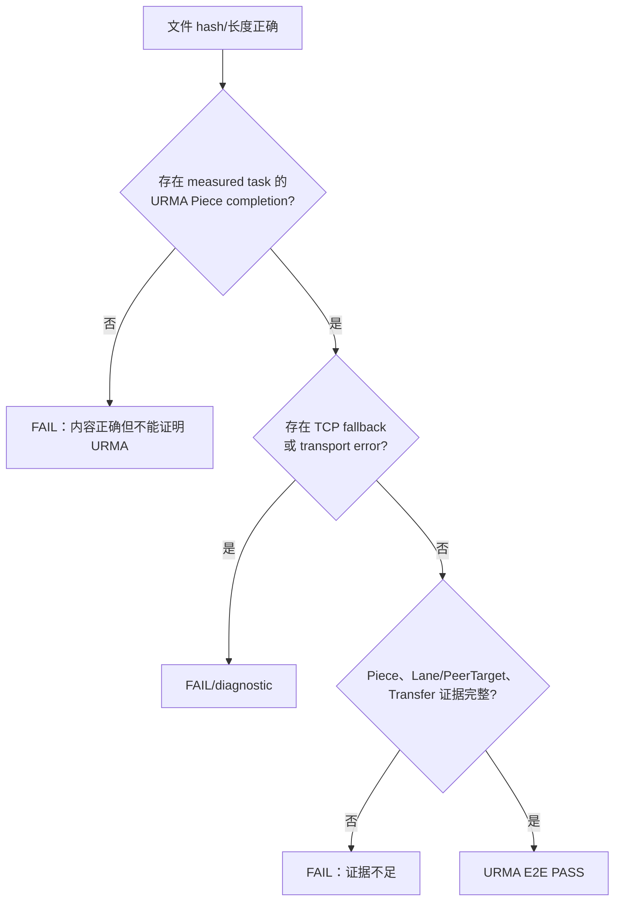

### 6.5 单任务吞吐如何计算

每个 Child `dfget` 在同一节点时钟记录启动、退出和 elapsed：

```text
elapsedNs = dfgetFinishedAtUnixNs - dfgetStartedAtUnixNs

throughputMiBps = bytes × 1,000,000,000
                  ─────────────────────
                  elapsedNs × 1,048,576
```

例如 1 GiB 文件的 `dfget` wall time 为 0.5 秒：

```text
throughput = 1024 MiB / 0.5 s = 2048 MiB/s
Gbps       = 2048 × 8 × 2^20 / 10^9 ≈ 17.18 Gbps
```

顺序 measured samples 的总体 aggregate 采用加权口径，而不是简单平均每轮速率：

```text
sequential aggregate MiB/s
    = Σ measured bytes / Σ measured dfget elapsed time
```

B7 同时输出各样本吞吐的 min、median、mean、p95 和 max；其中 aggregate 最适合表示整组样本的总数据/总时间效率。

### 6.6 并发聚合吞吐如何计算

并发 batch 中，多个 `dfget` 通过 run-scoped barrier 尽量同时释放。batch 时间使用 makespan：

```text
batchStart  = min(所有 task startedAt)
batchFinish = max(所有 task finishedAt)
makespan    = batchFinish - batchStart

aggregate MiB/s = Σ batch task bytes / batch makespan
```

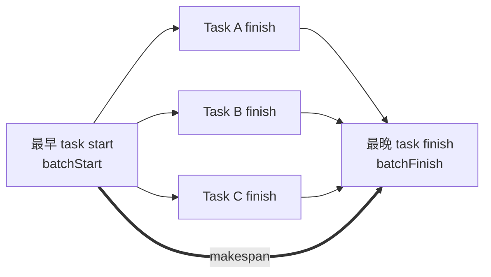

不能把并发 task 的 wall time 相加，也不能把每个 task 的吞吐简单相加作为严格聚合吞吐。多次 measured batch 的总口径为：

```text
multi-batch aggregate MiB/s
    = Σ measured batch bytes / Σ measured batch makespan
```

并发结果还记录：

```text
completionSkew = max(task finish) - min(task finish)

Jain fairness = (Σ r_i)^2 / (n × Σ r_i^2)
```

其中 `r_i` 是单个 task 吞吐。Jain 越接近 1，说明各并发任务越公平；completion skew 越小，说明各任务完成时间越集中。

### 6.7 warmup、repetition 与样本隔离

- `warmups` 会真实下载并保存证据，用于稳定建连、page cache、JIT/allocator 和系统状态，但不参与最终统计；
- `repetitions` 是正式 measured 次数；并发 case 中表示 measured batch 数，每个 batch 再包含 `concurrency` 个 task；
- 每轮使用唯一 URL/tag/task/output，避免复用已经完成的 Dragonfly Task 或覆盖输出；
- output 与 Dragonfly content storage 放在同一文件系统，正常完成态通过 hard link 物化，避免把跨文件系统 1 GiB copy 算进传输尾部；
- daemon evidence 按 measured task ID 过滤，warmup 日志不能混入 measured 的 TX/RX/Storage 分解。

例如 `1 warmup + 3 repetitions` 的单任务 case 会真正传输 4 个独立 Task，只统计后 3 个；若 `concurrency=8`，则每个 measured batch 同时运行 8 个独立 Task。

### 6.8 B7 中几个“并发”概念不能混用

| 名称 | 实际含义 | 不代表什么 |
|---|---|---|
| task concurrency | 同一 batch 中同时运行的 `dfget` 数 | 不等于单文件 Piece 并发 |
| Piece CC | 一个 Task 内 `download.concurrentPieceCount` | 不等于 Lane 数 |
| L8 fan-out | 同一物理 Child host 上 8 个隔离 child daemon/Peer，各自连一个 Parent | 不等于一个文件跨 8 Lane striping，也不等于 8 台物理机器 |
| per-lane CC8 | 每条 Lane 最多 8 个活跃 Piece Transfer | 不等于总并发只有 8；L8×CC8 理论最多 64 Transfer |
| pipelineDepth=2 | 每个 Transfer 的 A/B Window pipeline | 不等于两个 Piece |
| maxInflightChunks=16 | 一个 Window 最多 16 个在途 Chunk | 不等于 16 个 Transfer |
| postListSize=8 | 最多 8 条 WR 一次 linked post | 当前不等于 8 条 SEND 只有一个 CQE |

RM 下原来用于描述 transport identity 的 Lane 对应逻辑 PeerTarget；如果 B7 日志仍显示 `lane_id`，它不代表 RM 为每个 Peer 创建了独立 native Jetty/JFR。

### 6.9 时间分解如何解释

B7 使用真实 URMA Piece completion 时间戳，把 `dfget` wall time 拆成：

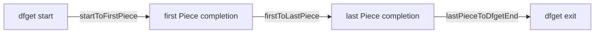

- `startToFirstPiece`：调度、首次建连、请求和首 Piece；
- `firstToLastPiece`：主要稳态 Piece 传输区间；
- `lastPieceToDfgetEnd`：任务收尾、成品落盘/链接和进程退出；
- 三段必须精确覆盖 `dfgetElapsedNs`，否则结果无效。

TX fill、send wait、RX wait、CRC、pwrite 和 allocator 等内部 timing 用于瓶颈归因，但这些阶段存在并行和重叠，不能直接相加重建 wall time。例如双 Window 中 `fill B` 与 `send A` 重叠，RX 的网络接收也可能与上一 Window 的 CRC/pwrite 重叠。

### 6.10 B7 结果的适用边界

- B7 是 Dragonfly E2E，不替代 `urma_perftest` 的 provider 峰值；
- 单节点成功只能证明 loopback/配置路径，不能代替跨节点 provider gate；
- 同一物理 Child 上启动多个隔离 daemon，可验证一个 Parent process 的多 Peer/Lane 扩展，但不能外推为多物理节点线性扩展；
- content match 但发生 TCP fallback 的结果不能登记为 URMA PASS；
- transport-only case 用于剥离 CRC/Storage，只是诊断结果，不能当成完整 Dragonfly correctness；
- RC/RM A/B 必须固定 Piece 大小、Piece CC、task/Peer 数、pipeline、post-list、TX/RX registered budget、warmup/repetitions、CPU/NUMA 和清理状态。

## 7. URMA READ/WRITE 可行性分析

### 7.1 能力结论与证据边界

URMA API 层面具备 one-sided READ/WRITE，官方 API 示例主要使用 `URMA_TM_RM`，`urma_perftest` 也提供 `read_bw`、`write_bw` 和 READ/WRITE latency 测试。因此从编程模型看，RC 和 RM 都具备研究基础。

但是，“API 支持”不等于当前 Dragonfly 可以直接切换：

- 当前 Dragonfly shim 注册 Segment 时使用 `URMA_ACCESS_LOCAL_ONLY`，远端不能 READ/WRITE；
- 当前 wire protocol 只交换 Jetty descriptor，没有交换 Segment descriptor、UBVA、权限和 token；
- 当前 FFI 只封装 SEND/RECV，没有 `import_seg`、READ/WRITE WR 和 remote-segment lifecycle；
- 当前 BufferPool、CompletionRouter、credit 和 shutdown 都按 SEND/RECV ownership 构建；
- 目标 `udmac` provider 的跨节点 RM SEND 尚未通过，READ/WRITE 更没有真机结论。

证据等级应区分为：

| 结论 | 当前证据 |
|---|---|
| URMA 定义 READ/WRITE opcode、Segment register/import 和 access token | UMDK API/源码确认 |
| 官方 RM 示例可以构造 READ/WRITE WR | UMDK 示例确认 |
| `urma_perftest` 支持 READ/WRITE bandwidth/latency | UMDK 工具源码确认 |
| 当前 Dragonfly 没有 READ/WRITE 路径，Segment 为 `LOCAL_ONLY` | Dragonfly 当前源码确认 |
| 目标设备跨节点 RC/RM READ/WRITE 可用 | 尚待真机验证 |
| READ/WRITE 能提高 Dragonfly E2E 吞吐 | 尚无实验数据 |

阶段结论：**技术上可做原型，但不能把 SEND/RECV 直接替换成 READ/WRITE；应作为独立数据路径实验。**

### 7.2 READ/WRITE 的前置资源

one-sided 访问需要在现有 Jetty/PeerTarget 之外增加 remote Segment 管理：

```mermaid
flowchart LR
    A[Target 分配或 mmap 内存] --> B[register_seg<br/>声明 remote access]
    B --> C[导出 Segment descriptor]
    C --> D[TCP/OOB 交换<br/>EID/UASID/UBVA/len/attr/token_id]
    D --> E[Initiator import_seg<br/>校验 token 和权限]
    E --> F[TargetSegment handle]
    F --> G[构造 READ/WRITE WR]
    G --> H[本地 completion]
    H --> I[drain]
    I --> J[unimport_seg / unregister_seg]
```

远端 Segment 描述至少涉及：

- `eid + uasid + va` 组成的 UBVA；
- Segment 长度和 access 属性；
- `token_id` 与访问使用的 token value；
- 当前 Transfer/Window 的 offset、length 和 generation；
- Segment/lease 何时允许撤销和复用。

UMDK 要求本地 buffer 和远端内存都先注册；访问远端前必须 `import_seg`。WRITE 权限还要求 Segment 同时声明 READ 权限。UB 协议下 READ 只支持一个远端 source SGE，WRITE 只支持一个远端 destination SGE，因此远端 Window 必须连续，或拆成多条 WR。

### 7.3 方案 A：Child 发起 READ，主动从 Parent 拉取

READ 与 Dragonfly 的下载语义较一致：Child 是数据消费方，也作为 READ initiator 控制本地 RX buffer 和请求节奏。

```mermaid
sequenceDiagram
    participant C as Child / READ Initiator
    participant P as Parent / Memory Target
    C->>P: PieceRequest
    P->>P: 准备可读 Piece/Window Segment
    P->>P: register remote-read permission
    P-->>C: SegmentOffer(UBVA,len,token,generation)
    C->>C: import_seg + acquire local RX Window
    C->>P: post READ(remote source → local RX)
    Note over P: 数据面不需要 Parent CPU post SEND/RECV
    C-->>C: READ CQE
    C->>C: CRC32 + pwrite/pwritev
    C->>P: ReadDone(window,generation)
    P->>P: 确认无 outstanding READ 后回收/撤销 Segment
```

可以分成两个递进原型。

#### 7.3.1 READ 当前 registered TX pool

Parent 仍把文件内容 copy/fill 到 registered TX Window，再将该 Window 以 remote-read 权限暴露给 Child。该方案可以先验证 Segment、READ CQE、Window 生命周期和跨节点 provider 可用性，但：

- source → registered TX copy 仍然存在；
- 无法直接解决当前最强的 TX source-fill 瓶颈；
- 主要收益是去掉 Parent SEND per-Chunk post/CQE、Child JFR/RQE 和 RecvPosted 数据 credit。

因此它适合作为 READ correctness 原型，不应作为最终性能方案。

#### 7.3.2 READ Parent 文件 mmap

Parent 直接把 task file/Piece mmap 区域注册为 remote-readable Segment，Child READ 到自己的 registered RX Window，理论上可绕过当前 `file → registered TX pool` 的 CPU copy：

```text
当前 SEND：file/page cache → CPU copy → registered TX → NIC

候选 READ：registered file mmap/page → NIC READ response
```

这是 READ 最有可能带来结构性收益的方向，但新增问题也最多：

- 文件 mmap 是否满足 provider 的 alignment、pin/non-pin 和 cache coherency 要求；
- 每 Piece 动态 register/unregister 的成本是否抵消收益；
- 是否需要按 Task 缓存 registered file Segment，以及如何与 Dragonfly GC 联动；
- 大文件长期 pin page 对内存回收、page cache 和系统稳定性的影响；
- 文件被删除、truncate、GC 或任务淘汰时，如何等待远端 READ 全部收敛；
- 一个宽范围 Segment 会不会让 Peer 读取未授权的其他 Piece。

因此更合理的长期结构是“read-only、最小授权范围、带 generation 的 Task/Piece Segment cache”，而不是把整个 Dragonfly storage 或整个进程 TX pool 使用一个共享 token 暴露出去。

### 7.4 方案 B：Parent 发起 WRITE，推送到 Child Window

WRITE 由 Child 先暴露 remote-writable RX Window，Parent import 后写入：

```mermaid
sequenceDiagram
    participant C as Child / Memory Target
    participant P as Parent / WRITE Initiator
    C->>C: acquire RX Window + register remote-write permission
    C-->>P: WindowOffer(UBVA,len,token,generation)
    P->>P: import_seg + fill local TX Window
    P->>C: post WRITE(local TX → remote RX)
    P-->>P: WRITE CQE / TAACK
    P-->>C: WriteDone 或 WRITE_IMM notification
    C->>C: 校验 window/generation
    C->>C: CRC32 + pwrite/pwritev
    C-->>P: WindowConsumed
    C->>C: revoke/recycle RX Window
```

与当前 SEND/RECV 相比，WRITE 的 bulk data 不消耗普通 RECV RQE，可以降低 shared JFR 压力；若 provider 支持大于 64 KiB 的连续 remote SGE，还可能用一次 Window WRITE 替代多条 64 KiB SEND。

但 WRITE 对当前首要瓶颈的改善有限：

- Parent 仍需把文件 fill 到本地 registered TX，source copy 没有消失；
- 当前 SEND 已经直接 DMA 到 registered RX，没有额外 RX staging copy 可供 WRITE 消除；
- Child 必须把 writable memory 和 token 交给远端，错误或恶意 Peer 可能直接破坏目标内存；
- 普通 WRITE 只在 initiator 产生本地完成，Target 如何获知“哪一个 Window 已完整可读”需要额外协议。

目标通知有三个候选：

1. Parent 收到本地 WRITE CQE 后，通过 TCP 发送 `WriteDone`；实现简单，但必须验证 WRITE 完成与 TCP 控制消息之间的远端可见性和 ordering。
2. 使用 `WRITE_IMM` 让 Target 收到带业务 identity 的 completion；UMDK 定义了 `WRITE_WITH_IMM` CR，但它在目标 provider 上是否消耗 RQE、`remote_id/imm_data` 是否稳定，必须真机确认。
3. WRITE bulk data 后，再 SEND 一个小的 commit/CDC 消息；这类似“WRITE data + SEND control”，ordering 清晰度更高，但仍保留小消息 RQE 和双边控制路径。

`WRITE_NOTIFY` 当前不能作为设计前提：API 文档描述了 notify memory 语义，但 UMDK opcode 定义同时标注该操作当前不支持，必须以目标 provider 的实际实现为准。

### 7.5 READ、WRITE 与 SEND/RECV 对比

| 维度 | 当前 SEND/RECV | READ pull | WRITE push |
|---|---|---|---|
| bulk initiator | Parent | Child | Parent |
| Target CPU 是否逐 Chunk post | RX 侧需预投 RQE | Parent 不需 post data WR | Child 不需普通 data RQE |
| JFR/RQE 压力 | 有 | bulk path 无 | plain WRITE bulk path 无 |
| 本地完成 | SEND 和 RECV 两侧 | Child READ CQE | Parent WRITE CQE |
| Target 完成通知 | RECV CQE 自带 | Parent 通常无 data CQE | plain WRITE 无 Target CQE，需额外通知 |
| remote Segment 暴露 | 无 | Parent 暴露 read-only | Child 暴露 writable |
| 当前 TX source fill | 有 | TX-pool READ 仍有；file-mmap READ可能消除 | 仍有，除非同时 direct-register file |
| 当前 RX staging copy | 已经没有 | 没有新增 | 没有新增 |
| 主要安全风险 | 只能写 receiver 已 post buffer | 越权读取其他内容 | 越界/迟到写破坏内存 |
| 与动态 P2P 的适配 | 已验证 | 授权和 Segment cache 较复杂 | writable lease/revocation 最复杂 |
| 当前建议 | RC/RM 基线 | 优先做独立原型 | 暂不作为主演进路径 |

### 7.6 安全模型是 READ/WRITE 的第一门禁

当前 two-sided SEND/RECV 的安全边界是：Peer 只能把数据写入本端已经 post 的 RQE；不需要把 remote memory key/token 暴露给 Peer。

READ/WRITE 则把 Segment capability 交给远端。仅有 `fabricTag` 或网络可达性不足以视为业务授权，至少需要：

- Segment 最小范围授权，禁止暴露整个 storage、整个 TX pool 或整个 RX pool；
- READ 只授予 `URMA_ACCESS_READ`，WRITE 使用文档要求的最小权限组合；
- token 不写入普通日志、指标或错误文本；
- descriptor 与 `peer_id + generation + task_id + transfer_id + window` 绑定；
- offset/length 在发送前和 completion 后双重校验；
- Peer 认证、Task/Piece 授权与 SegmentOffer 同步；
- timeout/cancel/Peer 断开后先阻止新 WR，再 drain，最后 revoke/unimport/unregister；
- 不能只靠软件 generation 阻止已拿到旧 token 的远端继续访问，必须证明旧 WR 已完成或硬件授权已撤销。

对 Dragonfly 这类动态 P2P，READ 的 read-only 泄露风险通常比 WRITE 的内存破坏风险更容易约束，但两者都明显扩大了攻击面。

### 7.7 Buffer、Window 与 completion 生命周期变化

#### READ

```text
Parent source Segment lease：
prepare/register → SegmentOffer → remote READ outstanding
→ Child READ CQE + ReadDone → drain → recycle/unregister

Child RX lease：
acquire local RX → post READ destination → READ CQE
→ CRC/pwrite → recycle
```

Parent 没有对应的远端 READ CQE，因此不能仅凭“发出 SegmentOffer”或 TCP 断开立即复用 source Window；需要 Child `ReadDone`、超时和 target/endpoint drain 共同构成回收门禁。

#### WRITE

```text
Parent TX lease：
fill → post WRITE → local WRITE CQE → recycle

Child remote-writable RX lease：
WindowOffer → remote WRITE outstanding → Target notification/WriteDone
→ CRC/pwrite → WindowConsumed → revoke/recycle
```

Child 如果在 Parent 的旧 WRITE 完全收敛前复用同一地址，迟到 WRITE 会覆盖新 generation 的数据。这个风险比迟到 CQE 更严重，因为软件可以拒绝 stale CQE，却无法撤销已经发生的错误 DMA。

### 7.8 RM 模式下的额外影响

READ/WRITE 不会推翻 RM shared endpoint，但会把资源压力从 shared JFR 转移到 Segment 和 outstanding one-sided WR：

- shared JFS 仍由 process-wide owner/progress thread提交和 poll；
- 每个 PeerTarget 新增 imported Segment registry 和访问权限生命周期；
- READ/WRITE completion moderation 仍需明确 shared-JFS 或 per-Target ordering；
- plain READ/WRITE 的 Target 侧缺少对称 CQE，Peer-local failure 和 shutdown 更依赖控制协议；
- per-peer Segment/import state 可能重新形成随 Peer/Transfer 增长的 native 对象，必须实测是否抵消 RM 节省的 Lane/JFR 资源。

因此，RM + READ/WRITE 不能只比较 JFR 数量，还要统计 imported target segment、token/table entry、pinned pages、JFS outstanding 和 setup/teardown latency。

### 7.9 推荐的验证顺序

READ/WRITE 不应直接进入 Dragonfly RM 主路径。建议分层：

#### RW0：provider 能力矩阵

先用同一版本 `urma_perftest` 覆盖：

```text
opcode       = READ / WRITE / WRITE_IMM
mode         = RC / RM
TP           = RTP / CTP
topology     = single-node / cross-node
message size = 4 KiB / 64 KiB / 1 MiB（按 device capability）
```

归档 throughput、CQE status、最大消息、remote completion、RQE 消耗、ordering 和 `urma_admin` 资源变化。SEND 跨节点门禁未通过时，READ/WRITE 结果必须独立记录，不能互相替代。

#### RW1：独立 Segment 原型

- register/export/import/unimport/unregister 完整闭环；
- read-only 与 writable token 隔离；
- bounds、错误权限、旧 token、重复 import、Peer crash；
- partial post、CQE error、timeout 和 shutdown；
- 验证 READ/WRITE completion 语义和远端内存可见性。

#### RW2：Window 原型

- 先用当前 registered pool 做 READ/WRITE，验证 Piece/Window/Chunk identity；
- 对比 64 KiB 多 WR 与 1 MiB contiguous Window WR；
- 验证双 Window、并发 Peer、completion moderation 和资源曲线；
- 使用 CRC32/SHA-256 证明没有 partial/stale DMA。

#### RW3：Dragonfly READ 实验

1. `registered TX pool + READ`：只验证协议与生命周期；
2. `file mmap register + READ`：验证能否真实消除 TX source fill；
3. 与 SEND/RECV 在相同 B7 workload 下比较 E2E、Parent CPU、memory bandwidth、page pin、registration latency 和 GC。

WRITE 只有在 RW0/RW2 证明“大 Window WRITE 显著减少 WR/CQE 且通知可靠”后，再考虑接入 Dragonfly。

### 7.10 建议决策

当前建议：

1. **不把 READ/WRITE 作为 RM 跨节点闭环的前置条件。** 先保持 SEND/RECV 完成 RM correctness。
2. **优先研究 READ pull，尤其是 read-only file-mmap Segment。** 它是唯一有机会直接绕过当前 TX source fill 的变体。
3. **WRITE push 暂不作为主方案。** 它没有自然消除 source fill，却引入 remote-write 权限、Target 通知和迟到 DMA 风险。
4. **READ 先做独立原型，不直接改当前 RM branch。** Segment ABI、安全和生命周期确认后，再决定是否做可选 backend。
5. **是否继续以数据为准。** 若 direct file READ 的注册/pin/GC 成本抵消 copy 收益，或者目标 provider 不稳定，则继续优化 SEND/RECV 的 copy、Chunk、CQ moderation 和 owner/CQ 路径。

## 8. 当前性能与瓶颈

### 8.1 已有性能基线

| 路径 | 结果 | 含义 |
|---|---:|---|
| TCP，25 GbE | 约 21.4 Gbps | TCP 基线接近网络上限 |
| Dragonfly URMA RC 单任务 | 约 63.5 Gbps | same-lane Piece 并发后的高点 |
| Dragonfly URMA RC L8 聚合 | 约 134.3 Gbps | 8 个独立 Peer/task 聚合，Jain 约 0.999 |
| standalone RC perftest | 约 399～406 Gbps | provider/transport 能力明显高于 Dragonfly E2E |
| SEND_IMM microbenchmark | 曾记录约 539 Gbps | 不能直接等同 Dragonfly workload |

### 8.2 第一瓶颈：TX source fill / memory copy

```mermaid
flowchart LR
    A[Task file / page cache] -->|CPU copy / fill<br/>当前最强瓶颈证据| B[Registered TX Window]
    B -->|SEND WR| C[URMA Provider / NIC]
    C -->|约 400G 级 transport 能力| D[Network]
    E[Dragonfly E2E<br/>当前聚合约 134G] -.软件路径存在明显差距.-> A
```

当前最强实验依据是：

- fixed registered TX source 可以达到约 400G 级；
- dynamic source → CPU copy → registered TX 下降到约 59.6 Gbps；
- 对应实验中 `tx_fill` 约占 wall time 的 95%。

当前 TX 即使使用 mmap，也仍要把 source 内容复制进 registered TX window。RM 沿用了该路径，因此切换 RM 不会消除这一瓶颈。

当前 Reader fallback 也不是真正的 file-direct-to-TX：`RangeReader` 先用 `read_at()` 填内部
`BytesMut`，随后 `read_exact(dst)` 再复制到 registered TX。文件可以直接读入 TX，限制不在 URMA，
而在现有异步接口和 lease ownership：安全实现需要把整个 `TxWindowLease` 移入 blocking task，使用
Window 级 `pread/preadv` 填充后再归还发送路径，并保证 outstanding SEND CQE 收敛前不能 refill。
该方案可消除 Reader 的 staging copy，但相对 mmap-copy 仍是一次 page-cache-to-TX 搬运，性能必须 A/B
验证；不建议机械地每 64 KiB 做一次 syscall。

需要继续验证的方向：

- source file 直接注册或更接近零拷贝的 TX 路径；
- `RangeReader`、mmap-copy 与 Window 级 direct `pread/preadv` 三路 source-fill 对照；
- 以第 7 章的 read-only file-mmap READ 为独立对照实验，验证其能否绕过 source fill；该方向尚未通过 provider、注册成本、GC 和安全门禁，不能预设为替代方案；
- larger chunk / gather list，降低每字节 WR/CQE 成本；
- fill 与 send 的 CPU/NUMA 亲和性；
- non-temporal copy、prefetch 或更适合 registered memory 的 copy 实现。

### 8.3 owner/progress thread 和 completion 处理

当前 Fabric 使用 process-wide owner/progress thread 串行执行 native resource mutation、post 和 CQ poll。这简化了所有权，但多 Peer 时可能形成单线程瓶颈：

- post command 排队；
- 高频 CQ poll 和 completion routing；
- slot/WR registry 的锁和 HashMap 操作；
- shared RM 下所有 Peer 的 native data-plane 操作汇聚到同一 owner。

RM 减少了 per-peer endpoint，却可能加重 shared owner 热点。因此 RM 测试必须同时采集 owner queue wait、post latency、poll batch、CQE/s 和 CPU 占用。

### 8.4 64 KiB Chunk 的 WR/CQE 频率

64 KiB 消息在 400 Gbps 下理论需要约 76 万条消息/秒，发送和接收两侧都要处理相应 WR/CQE、token 和 slot 状态。小 Chunk 有利于 pipeline 和尾部处理，但增加软件包率。

CTP 当前最小 probe 又受 4 KiB 消息能力约束；如果生产 RM 只能使用 4 KiB，其 WR/CQE 压力会进一步放大。需要先明确 RTP/CTP 对 64 KiB 的真实能力，再决定生产 TP 类型和 Chunk 策略。

### 8.5 linked post-list 已接入，但 TX CQ moderation 尚未接入

当前 `postListSize` 只减少 native post/doorbell 调用，没有减少 SEND CQE 数。linked list 内每条 SEND WR 都设置 `complete_enable=1`：

```mermaid
flowchart LR
    A[N 条 SEND WR] --> B[组成 linked post-list]
    B --> C[一次 native post 调用]
    C --> D[N 条 WR 均 complete_enable=1]
    D --> E[N 条 SEND CQE]
    E --> F[pending 逐条减一]
    F --> G[pending=0 后<br/>上层一次 Window completion]
```

以一个 16-Chunk Window 为例：

| `postListSize` | native post 调用 | native SEND CQE | 上层 Window completion |
|---:|---:|---:|---:|
| 1 | 16 | 16 | 1 |
| 4 | 4 | 16 | 1 |
| 16 | 1 | 16 | 1 |

因此，“上层每个 Window 收到一次完成”不等于“底层只产生一个 CQE”；一次 JFC poll 批量取回多条 CQE，也不等于 CQ moderation。

当前每条 SEND 的正确性处理为：

1. post 前为每条 WR reserve `user_ctx`、slot/generation 和 completion owner；
2. provider 返回后只 commit 实际接受的 posted prefix；
3. `RegisteredTxWindowState.pending` 记录已接受且尚未完成的 SEND；
4. 每条 CQE 分别恢复对应 slot 的状态并使 `pending -= 1`；
5. `posting_finished && pending == 0` 后，才归还整个 `TxWindowLease`；
6. partial post 的 suffix 回滚，只扣 posted prefix 对应的 RecvPosted credit。

之前 demo/perftest 使用的是 selective completion：中间 WR 不要求 CQE，只让每 N 条或批次尾 WR signaled；尾 CQE 作为 retirement frontier，一次退休此前 WR。

```mermaid
flowchart TB
    subgraph NOW[当前实现]
        N1[WR1 signaled] --> C1[CQE1]
        N2[WR2 signaled] --> C2[CQE2]
        N3[WR3 signaled] --> C3[CQE3]
        N4[WR4 signaled] --> C4[CQE4]
    end
    subgraph MOD[候选 moderation=4]
        M1[WR1 unsignaled] --> F[WR4 signaled / frontier]
        M2[WR2 unsignaled] --> F
        M3[WR3 unsignaled] --> F
        F --> CF[一个 CQE<br/>退休 WR1～WR4]
    end
```

这项优化在 RC 与 RM 中的难度不同：

- RC 可以按每条 Lane/JFS 维护单调 `post_seq` 和 retirement frontier；
- RM 多个 PeerTarget 共享 JFS，必须先确认 provider 是 shared-JFS 全局有序，还是只对同 Target/TP 保序；
- 若只保证同 Target 有序，需要 per-PeerTarget frontier，不能用 A 的 CQE 回收 B 的 TX slot；
- partial post、错误 CQE、Peer 退出、低流量尾部和 shutdown 前都必须产生可收敛的强制 CQE；
- RX CQE 还承担实际 slot、长度、`remote_id` 和 `SEND_IMM` 解复用，不能直接使用 TX 的 selective completion。

因此当前 RM 先保留 per-WR CQE 作为正确性基线；跨节点正确性通过后，再把 TX moderation 作为降低 CQE/s、owner CPU 和 completion bookkeeping 的高优先级性能实验。它目前是明确的能力缺口和候选瓶颈，但尚无数据证明是 134 Gbps 的唯一根因。

### 8.6 RX CRC 与 Storage

RX 已去除额外 staging copy，但仍有：

- CRC32 读取 registered spans；
- pwrite/pwritev 写 storage；
- lease 等待两个 consumer 后才能归还；
- 存储介质、页缓存和 NUMA 可能延长 RX slot 持有时间。

因此 `RX registered bytes`、Window size 和 pipelineDepth 需要根据 consumer latency 调优，不能简单与 TX budget 对称配置。

### 8.7 TX Window allocator 的全池扫描与 bookkeeping

当前 TX Window allocator 不是从空闲 extent 或连续区间索引中直接取得一个 Window。每次调用 `acquire_tx_window_chunks()`，都会在 process-wide owner thread 上执行以下工作：

```mermaid
flowchart LR
    A["申请 W 个 TX slots"] --> B["扫描全部 T 个 TX slots<br/>统计 Free 数量"]
    B --> C["复制全部 T 个 slot state<br/>生成临时 Vec"]
    C --> D["windows(W) 搜索<br/>第一段连续 Free slots"]
    D --> E["对选中的每个 slot<br/>执行 free_tx.retain()"]
    E --> F["生成 spans/layouts/LeaseBook 记录"]
```

其中：

- `available` 统计会线性扫描整个 TX slot 区，成本为 `O(T)`；
- 连续区搜索先复制全部 TX slot state，再通过 `windows(W)` 查找；最坏可接近 `O(T × W)`，并且每次申请产生临时 `Vec`；
- 选中 W 个 slot 后，每个 slot 都执行一次 `free_tx.retain()`；`retain()` 会扫描当前 free list，因此这一段约为 `O(W × F)`；
- 以上工作与 native resource mutation、post 和 CQ poll 共用一个 owner thread，allocator 变慢不仅延迟本 Transfer，还可能推迟其他 Peer 的 post/completion progress；
- RX 使用 `VecDeque` 逐个 `pop_front()`，没有同样的连续 TX Window 全池搜索路径，不能把该结论笼统扩展到 RX allocator。

典型 TX128 MiB、64 KiB slot 对应 `T=2048`，一个 1 MiB Window 对应 `W=16`；TX160 MiB 时 `T=2560`。已有测试中 TX160 比 TX128 慢 21.43%，扩大 registered pool 没有线性收益。当前 allocator 会随 T 增大而放大串行扫描和 `retain` bookkeeping，因此它是有源码依据的高优先级候选瓶颈。

但现有数据仍不能证明 allocator 是 TX160 下降或 134 Gbps 上限的唯一根因，cleanup、page cache/writeback、NUMA 和 source fill 仍可能共同影响结果。代码已经分别记录：

- `tx_required_acquire_ns`：required Window 的完整等待时间，包含重复尝试、retry sleep、owner command 排队和处理；
- `tx_optional_acquire_ns`：optional Window 单次非阻塞尝试的端到端时间，包含 owner command 排队和处理；
- `tx_required_pool_acquire_ns` / `tx_optional_pool_acquire_ns`：lease 内记录的 allocator 本体时间；
- required/optional acquire attempts：用于区分 allocator 成本和 pool pressure/retry。

因此 registered memory 优化应以“同时活跃的 Window working set”为依据，而不是越大越好。下一步应在严格 cleanup、交替 TX128/TX160 的相同 workload 下，对比 required/optional acquire 与 pool-acquire 的 p50/p95/p99；若确认 allocator 占比显著，再把 TX 空闲结构改为 free extent/区间索引，使正常分配接近 `O(W)` 或 `O(log E + W)`，而不是先扩大注册池。

### 8.8 RM 当前第一阻塞不是 Dragonfly 性能

目标环境目前表现为：

- RM perftest 单节点可运行；
- 跨节点 RM+CTP `send_bw` 首批 128 个 WR 返回 completion status 4；按当前 UMDK 枚举为 `URMA_CR_LOC_ACCESS_ERR`；
- Dragonfly 单节点曾在 Parent `import_jetty=-1` 后回退 TCP；代码已补充 RTP/CTP 配置和 wire 校验，但尚未复验。

在 provider 跨节点最小消息尚未闭环前，不应讨论 Dragonfly RM 的正式吞吐，也不能把错误直接归因于 shared JFR。

## 9. 重点讨论的问题

### 9.1 是否认可 RM 的主要目标

建议把 RM 的成功条件定义为：

> 在多 Peer、高 churn 场景下，显著降低 per-peer native object、locked memory 和 setup/teardown 成本，同时保证正确性、故障隔离、公平性及不低于 RC 的稳定吞吐。

而不是把“RM 单流快于 RC”作为必要条件。

### 9.2 endpoint 拆分粒度

当前是一进程一个 shared RM endpoint。需要讨论是否长期保持该模型，还是按 NUMA/device/traffic class 拆成少量 endpoint shard：

- 单 endpoint 资源最省，但 owner 和故障影响面最大；
- 多 shard 增加固定资源，但可改善 CPU/NUMA、CQ 扩展和故障隔离；
- 不建议退回 per-peer endpoint，否则失去 RM 主要价值。

### 9.3 Peer-local fault 的 provider 能力

需要从 UMDK/provider 明确：

- 是否支持 per-target flush、cancel 或 outstanding WR 查询；
- error CQE 的 `remote_id` 是否总是有效；
- target unimport 前需要满足哪些 native drain 条件；
- shared JFR 中坏 Peer 的消息是否可能消耗其他 Peer 的 RQE，以及推荐隔离方法。

### 9.4 RTP 与 CTP 的生产选择

代码已支持并校验 RTP/CTP，但生产选择必须基于真机矩阵：

- 跨节点 import/send/recv 是否稳定；
- 最大消息大小；
- remote_id 语义；
- target/TP 对象数量和资源成本；
- Peer churn、错误恢复和性能。

### 9.5 是否增加 Transfer-scoped Cancel

当前 DFUR 控制协议没有 Transfer 级 Cancel。consumer 提前关闭时，为避免 Parent 永久等待 RecvPosted，代码会 fail-closed 退休整个 Peer session。长期可考虑增加 Cancel：

- 优点：一个 Piece 取消不影响同 Peer 的其他 Transfer；
- 代价：需要定义已 post RECV、已发送 Chunk、迟到 CQE 和 credit 的收敛协议。

## 10. 真机验证顺序

建议按以下顺序，避免 provider 问题与 Dragonfly 问题混在一起：

1. **Provider Gate**：同 binary/config 下完成 RM RTP/CTP 单节点和跨节点 `urma_perftest`。
2. **单 Peer Smoke**：小 Piece、非整 Chunk、大 Piece，内容正确且日志证明没有 TCP fallback。
3. **RM RX 路由**：多 Peer 同时向 shared JFR 发送，验证 `remote_id + RoutingToken` 无串包。
4. **Credit**：guaranteed/borrowed、公平性、Peer retire 时 credit 收敛。
5. **Fault**：partial post、error CQE、Peer 断开、取消、迟到 CQE、shutdown。
6. **RC/RM A/B**：相同硬件、文件、并发、memory budget、warmup/repetitions 下比较吞吐、CPU、native object、locked memory 和 churn latency。

测试代码目录：

```text
/home/y30083740/dragonfly/
├── dragonfly-client-urma-private   # RC
├── dragonfly-client-urma-rm        # RM
├── dragonfly-urma-tools             # B7，同时支持 --profile rc/rm
└── config                            # 两节点基础配置
```

## 11. 阶段判断

RC：数据路径和性能基线已经成立，后续重点是软件路径性能优化。  
RM：资源模型和离线实现基本成立，当前首要任务是证明目标 provider 上的跨节点语义，然后验证 shared RX 路由和 Peer-local fault isolation。

当前不建议合并 RC/RM 底层实现。两套代码独立有利于保持 RC 基线稳定，也便于确认 RM 是否真正删除了 per-peer native Lane。若未来产品需要同时支持两种 backend，应在更高层按配置选择 RC 或 RM，而不是让 `Lane/PeerTarget`、completion 和 shutdown 生命周期彼此交叉。
