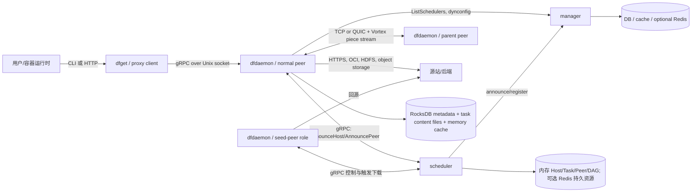
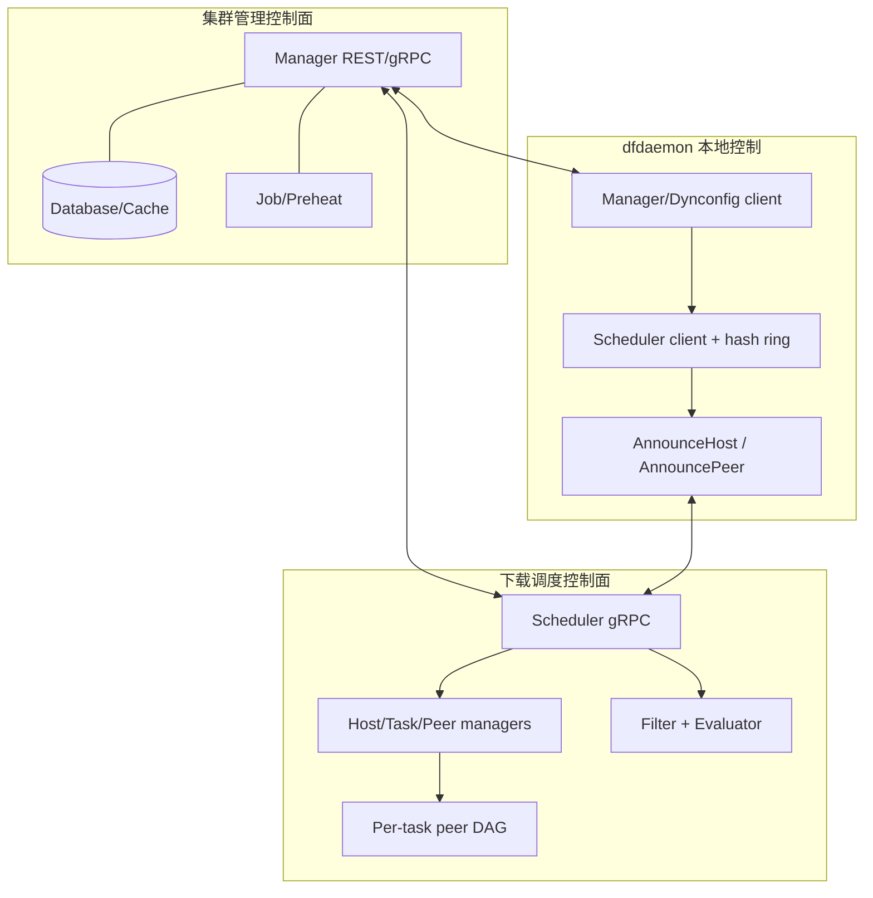
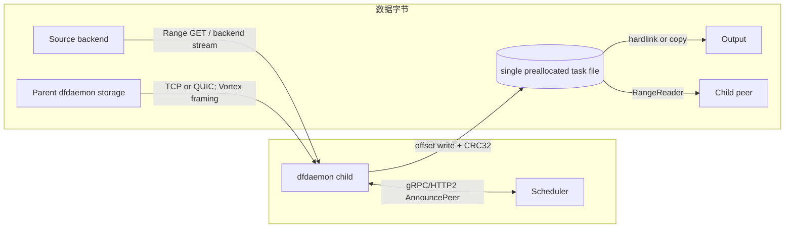
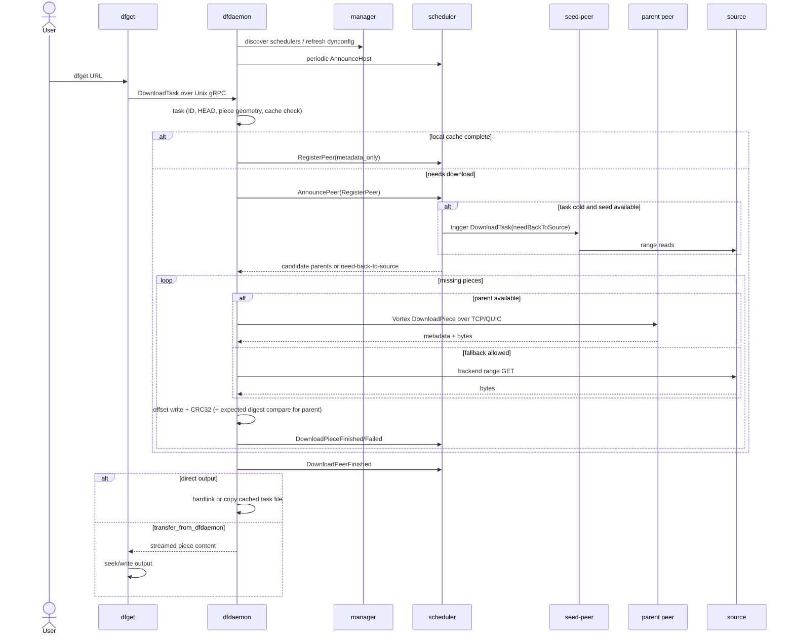
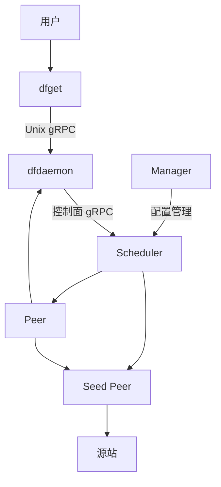
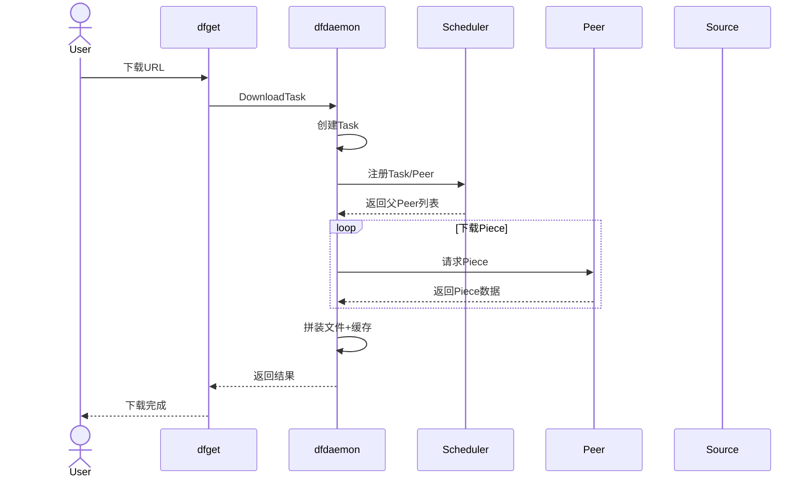
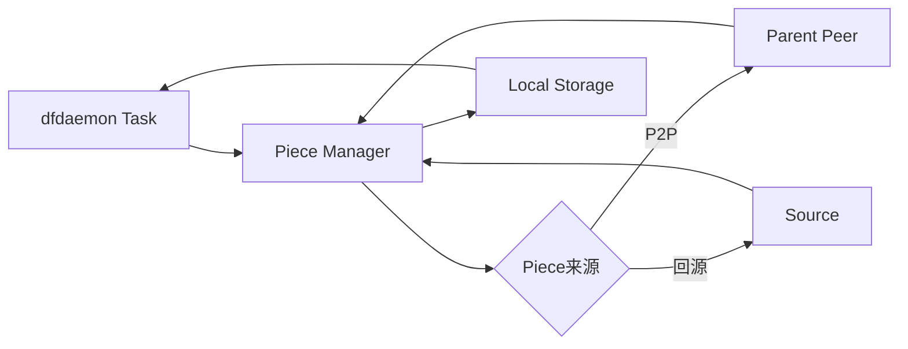

# Dragonfly 整体架构源码研究笔记

> 基线：仓库提交 `5523218a`；分析对象是当前仓库中的 Go manager/scheduler 与 `client/` Rust workspace。本文只记录现状，不提出 UB 接入方案。未进行运行实验，因此没有 `[实验验证]` 结论。

## 1. 组件职责

| 组件 | 当前职责与证据 | 关键源码位置 |
|---|---|---|
| manager | [源码确认] 集群管理控制面：维护 scheduler/seed peer 等管理数据，提供 REST、gRPC、Web portal，承载 job、RBAC、数据库、缓存及 GC。它不参与普通 piece 字节转发。 | 源码路径：`cmd/manager/cmd/root.go`，函数：`runManager()`；`manager/manager.go`，函数：`New()`、`Serve()` |
| scheduler | [源码确认] 接收 dfdaemon 的 host/peer/task 状态，维护标准任务内存资源与 peer DAG，选择候选 parent，必要时触发 seed peer 回源；v2 主通道是双向流 `AnnouncePeer`。 | 源码路径：`scheduler/service/service_v2.go`，函数：`AnnouncePeer()`、`handleRegisterPeerRequest()`；`scheduler/scheduling/scheduling.go`，函数：`ScheduleCandidateParents()` |
| seed-peer | [源码确认] 当前实现不是另一套二进制，而是以 `seedPeer.enable=true` 运行的 dfdaemon。host/peer ID 带 seed 标记，向 scheduler 宣告 seed/super-seed 类型，并可被 scheduler 通过 dfdaemon gRPC 触发下载。 | 源码路径：`client/dragonfly-client-config/src/dfdaemon.rs`，结构：`SeedPeer`；`client/dragonfly-client/src/announcer/mod.rs`，函数：`make_announce_host_request()`；`scheduler/resource/standard/seed_peer.go`，函数：`TriggerDownloadTask()` |
| peer | [源码确认] “peer”是一次任务下载参与者；其常驻进程是 dfdaemon。dfdaemon 同时是 downloader、piece uploader、缓存/元数据持有者。 | 源码路径：`client/dragonfly-client/src/bin/dfdaemon/main.rs`，函数：`main()`；`scheduler/resource/standard/peer.go`，结构：`Peer` |
| client workspace | [源码确认] Rust workspace，包含 CLI、daemon、backend、storage、request、config、util 等 crate；版本为 `1.4.2`。 | 源码路径：`client/Cargo.toml`，段：`[workspace]`、`[workspace.package]` |
| dfdaemon | [源码确认] 本机核心数据节点：Unix socket 下载 gRPC、网络 upload gRPC、HTTP proxy、TCP/QUIC storage server、scheduler/manager client、GC、metrics 等均在此进程装配。 | 源码路径：`client/dragonfly-client/src/bin/dfdaemon/main.rs`，函数：`main()` |
| dfget | [源码确认] 下载 CLI；通过 Unix domain socket 调用 dfdaemon 的 server-streaming `DownloadTask`。可让 dfdaemon 直接 hardlink/copy 输出，也可把 piece 内容经 gRPC 流回 dfget 写文件。 | 源码路径：`client/dragonfly-client/src/bin/dfget/main.rs`，函数：`main()`、`download()` |
| dfcache/dfstore/dfctl | [源码确认] 分别面向 P2P 缓存导入导出、带对象存储持久化的 storage 导入导出，以及标准/持久/持久缓存任务管理。 | 源码路径：`client/dragonfly-client/src/bin/dfcache/main.rs`、`dfstore/main.rs`、`dfctl/main.rs`，函数：`main()` |

[源码确认] 当前仓库里 client/peer/dfdaemon 不是三个独立数据面服务：`dfget` 等是调用方；`dfdaemon` 是常驻客户端进程；scheduler 中的 `Peer` 是 dfdaemon 针对某个 task 创建的逻辑下载实例。seed-peer 是 dfdaemon 的运行角色。

## 2. 组件关系图

## 3. 控制面架构

[源码确认] manager 提供 scheduler 发现与动态配置来源；dfdaemon `Dynconfig` 从 manager 获得可用 schedulers，`SchedulerClient::client()` 通过 task ID 前 5 字符在一致性哈希环上选 scheduler。

- 源码路径：`client/dragonfly-client/src/dynconfig/mod.rs`，函数：scheduler 刷新逻辑。
- 源码路径：`client/dragonfly-client/src/grpc/scheduler.rs`，函数：`update_available_scheduler_addrs()`、`client()`。
- 源码路径：`scheduler/scheduler.go`，函数：`New()`、`Serve()`。

[源码确认] scheduler 标准任务主要在内存中维护 `Host`、`Task`、`Peer`；`Task` 内含 peer DAG、piece map、FSM。持久任务/持久缓存资源在启用 Redis 时构造。

- 源码路径：`scheduler/resource/standard/task.go`，结构：`Task`，函数：`NewTask()`。
- 源码路径：`scheduler/scheduler.go`，函数：`New()`。

## 4. 数据面架构

[源码确认] scheduler 返回 parent 的地址/端口，但不转发 piece 字节。peer-to-peer 内容通过 TCP/QUIC storage server；回源通过 backend；内容写入单个预分配 task 文件的指定 offset。

- 源码路径：`client/dragonfly-client/src/resource/piece.rs`，函数：`download_from_parent()`、`download_from_source()`。
- 源码路径：`client/dragonfly-client-storage/src/server/tcp.rs`、`server/quic.rs`，函数：请求处理与 `handle_piece()`。
- 源码路径：`client/dragonfly-client-storage/src/content_linux.rs`，函数：`create_task()`、`write_piece_from_stream()`、`read_piece()`。

## 5. 组件通信关系

| 链路 | 协议/载体 | 信息类型 | 结论 |
|---|---|---|---|
| dfget → dfdaemon | gRPC over Unix domain socket | 下载请求、进度；可选 piece bytes | [源码确认] `DfdaemonDownloadClient::new_unix()` 与 `download_task()` |
| dfdaemon → manager | gRPC（可 TLS） | scheduler 列表、动态配置等 | [源码确认] `ManagerClient::new()`、`Dynconfig::new()` |
| scheduler → manager | gRPC（可 TLS） | scheduler announce、动态配置 | [源码确认] `scheduler.New()` 中 manager client/announcer |
| dfdaemon ↔ scheduler | gRPC/HTTP2（可 TLS） | host announce；peer 注册、父节点响应、piece/peer 状态 | [源码确认] `SchedulerClient`；`V2.AnnouncePeer()` |
| scheduler → seed-peer | dfdaemon upload gRPC | 触发 seed 下载 | [源码确认] `standard.SeedPeer.TriggerDownloadTask()` |
| peer ↔ peer | TCP 或 QUIC；Vortex TLV framing | piece metadata + piece byte stream | [源码确认] storage client/server 与 `vortex-protocol` |
| peer → source | backend-specific；常见 HTTP(S) Range GET | 原始资源 bytes | [源码确认] `BackendFactory`、`Piece::download_from_source()` |
| dfdaemon HTTP proxy → caller | HTTP | 代理响应 bytes | [源码确认] `client/dragonfly-client/src/proxy/mod.rs` |

## 6. 整体运行流程

### 总调用链

`dfget::main()`  
↓ `dfget::run()` / `dfget::download()`  
↓ `DfdaemonDownloadClient::download_task()`  
↓ `DfdaemonDownloadServerHandler::download_task()`  
↓ `Task::download_started()`  
↓ `Task::download()`  
↓ `Task::download_partial_with_scheduler()`  
↓ `SchedulerClient::announce_peer()` ↔ Go `V2.AnnouncePeer()`  
↓ `Task::download_partial_with_scheduler_from_parent()`  
↓ `Piece::download_from_parent()`  
↓ TCP/QUIC downloader `download_piece()`  
↓ parent storage server `handle_piece()`  
↓ child `Storage::download_piece_from_parent_finished()`  
↓ `Content::write_piece_from_stream()`  
↓ `Task::download_finished()` / hardlink or copy

源码位置分别位于：`client/dragonfly-client/src/bin/dfget/main.rs`、`client/dragonfly-client/src/grpc/dfdaemon_download.rs`、`client/dragonfly-client/src/resource/task.rs`、`client/dragonfly-client/src/resource/piece.rs`、`client/dragonfly-client-storage/src/{client,server,content_linux}.rs`、`scheduler/service/service_v2.go`。

## 7. 当前结论与边界

- [源码确认] manager 是集群管理/发现层，scheduler 是下载编排层，dfdaemon 是实际数据节点。
- [源码确认] 控制面与大文件数据面明确分离；唯一例外是 dfget 设置 `need_piece_content=true` 时，dfdaemon 会把 piece content 放进本机 Unix gRPC 响应。
- [源码确认] seed-peer 是 dfdaemon 角色，不是本仓库中的独立 seed 二进制。
- [架构推断] 性能研究应把 scheduler 的调度延迟与 peer storage 网络/磁盘吞吐分开观测，因为二者不在同一数据通路。
- [待确认] 本文未启动集群验证实际部署配置、端口选择、TLS 开销与 production 中 TCP/QUIC 的启用比例。

## 补充

### 图1：组件架构

### 图2：一次下载主流程

### 图3：Piece数据路径

