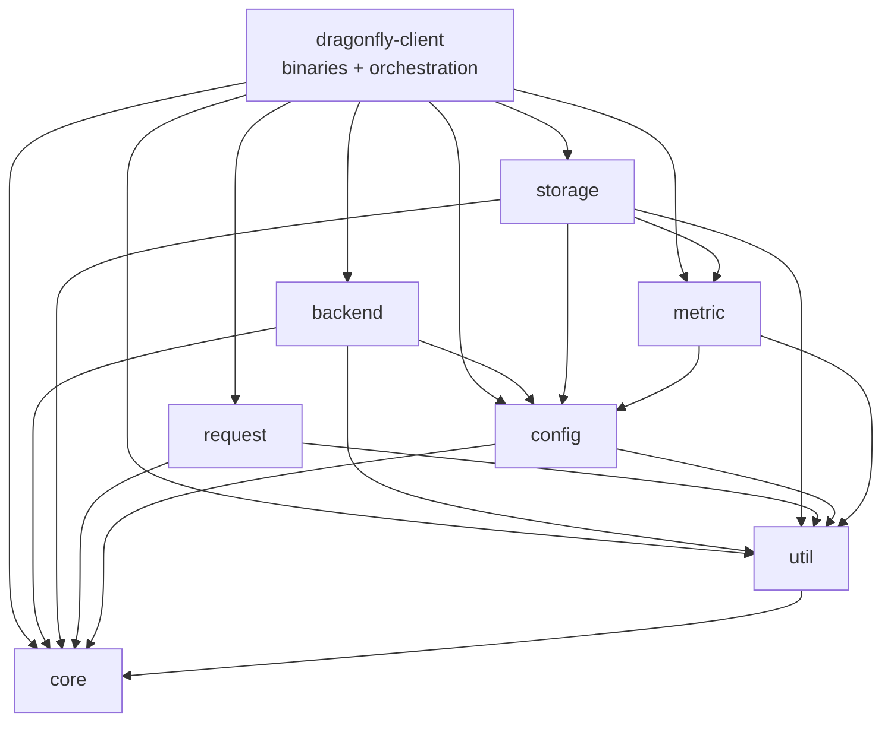
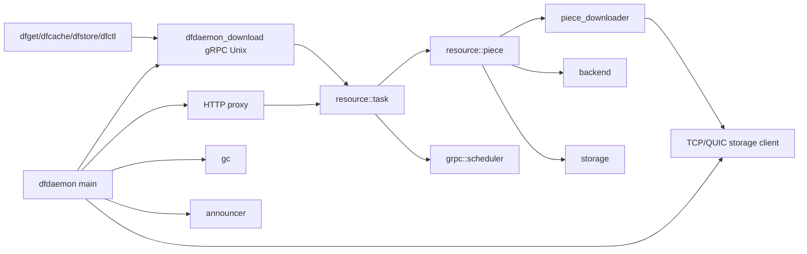

# Rust Client 模块地图源码研究笔记

> 基线：提交 `5523218a`，workspace 版本 `1.4.2`。依赖关系通过 `client/Cargo.toml` 和 `cargo metadata --no-deps` 核对。

## 1. Workspace 结构

[源码确认] 根 manifest：源码路径 `client/Cargo.toml`，段 `[workspace]`，resolver 为 2。核心成员：

| crate | 职责 | 源码入口 |
|---|---|---|
| `dragonfly-client` | daemon/CLI、gRPC、resource/task/piece、proxy、GC 的业务组装 | `client/dragonfly-client/src/lib.rs`；各 `src/bin/*/main.rs` |
| `dragonfly-client-core` | 统一 `DFError` 和 `Result` | `client/dragonfly-client-core/src/lib.rs`，类型 `Error`、`Result` |
| `dragonfly-client-request` | GET/preheat 请求库、seed peer 选择、客户端池 | `client/dragonfly-client-request/src/lib.rs`，trait `Request` |
| `dragonfly-client-storage` | RocksDB 元数据、磁盘内容、内存 LRU、TCP/QUIC piece client/server | `client/dragonfly-client-storage/src/lib.rs`，结构 `Storage` |
| `dragonfly-client-backend` | HTTP、OCI、对象存储、HDFS、Hugging Face、ModelScope 后端抽象 | `client/dragonfly-client-backend/src/lib.rs`，trait `Backend`、结构 `BackendFactory` |
| `dragonfly-client-config` | binary/daemon 配置、默认值、加载与校验 | `client/dragonfly-client-config/src/lib.rs` 与 `src/dfdaemon.rs` |
| `dragonfly-client-util` | ID、digest、buffer/fd pool、hashring、网络、TLS、限速、系统信息 | `client/dragonfly-client-util/src/lib.rs` |
| `dragonfly-client-metric` | client metrics | `client/dragonfly-client-metric/src/lib.rs` |
| `dragonfly-client-init` | `dfinit` binary | `client/dragonfly-client-init/src/bin/main.rs`，函数 `main()` |

## 2. Crate 依赖关系



[源码确认] `dragonfly-client-request` 不依赖顶层 `dragonfly-client`，直接使用 `dragonfly-api` 生成的 gRPC client。[源码确认] 名称中的 `dragonfly-client-core` 当前主要承载错误/Result，不是 standard 下载算法主体；下载主链在顶层 crate 的 `resource::{task,piece}`。

## 3. 顶层 crate 内部关系



| 模块 | 关键函数 | 源码路径 |
|---|---|---|
| `grpc::dfdaemon_download` | `DfdaemonDownloadServerHandler::download_task()` | `client/dragonfly-client/src/grpc/dfdaemon_download.rs` |
| `grpc::scheduler` | `announce_peer()`、`announce_host()`、`client()` | `client/dragonfly-client/src/grpc/scheduler.rs` |
| `resource::task` | `download_started()`、`download()`、`download_partial_with_scheduler()` | `client/dragonfly-client/src/resource/task.rs` |
| `resource::piece` | `calculate_interested()`、`download_from_parent()`、`download_from_source()` | `client/dragonfly-client/src/resource/piece.rs` |
| `resource::piece_collector` | `run()` | `client/dragonfly-client/src/resource/piece_collector.rs` |
| `resource::parent_selector` | parent 选择 | `client/dragonfly-client/src/resource/parent_selector.rs` |
| `resource::piece_downloader` | trait `Downloader`、TCP/QUIC implementations | `client/dragonfly-client/src/resource/piece_downloader.rs` |
| `gc` | `GC::run()`、各 `evict_*()` | `client/dragonfly-client/src/gc/mod.rs` |

## 4. Binary 用途

### dfdaemon

[源码确认] 常驻 P2P daemon，装配 storage、ID generator、manager/dynconfig/scheduler client、task managers、TCP/QUIC storage server、upload/download gRPC、HTTP proxy、GC 与 observability。

- 源码路径：`client/dragonfly-client/src/bin/dfdaemon/main.rs`
- 函数：`main()`

### dfget

[源码确认] URL 下载 CLI。连接 dfdaemon Unix socket；支持单文件/递归目录、输出 hardlink/copy 或 piece 流式回传。

- 源码路径：`client/dragonfly-client/src/bin/dfget/main.rs`
- 函数：`main()`、`run()`、`download()`、`get_dfdaemon_download_client()`

### dfcache

[源码确认] P2P cache CLI：import 本地文件并建立多副本，export 通过 task ID 导出，stat 查询缓存任务。

- 源码路径：`client/dragonfly-client/src/bin/dfcache/main.rs`
- 函数：`main()`；枚举：`Command::{Import,Export,Stat}`

### dfstore

[源码确认] P2P storage CLI：import 建立多副本并复制到对象存储以持久化；export 导出。

- 源码路径：`client/dragonfly-client/src/bin/dfstore/main.rs`
- 函数：`main()`；枚举：`Command::{Import,Export}`

### dfctl

[源码确认] 管理 CLI，操作 standard task、persistent task、persistent cache task。

- 源码路径：`client/dragonfly-client/src/bin/dfctl/main.rs`
- 函数：`main()`；枚举：`Command::{Task,PersistentTask,PersistentCacheTask}`

## 5. 主层级调用链

```text
dfget
  ↓ Unix gRPC
dfdaemon::grpc::dfdaemon_download
  ↓
dragonfly-client::resource::task
  ├─→ grpc::scheduler（注册/调度/状态）
  └─→ resource::piece
       ├─→ piece_downloader → dragonfly-client-storage TCP/QUIC client
       ├─→ dragonfly-client-backend（回源）
       └─→ dragonfly-client-storage（metadata/content/cache）

dfcache / dfstore / dfctl
  ↓ gRPC
dfdaemon upload/download/task management APIs
  ↓
persistent_task / persistent_cache_task / storage
```

## 6. 当前结论

- [源码确认] `dragonfly-client` 是 orchestration crate；可独立研究的主要边界是 backend、storage、request、config、util。
- [源码确认] standard 下载核心不在 `client-core`，而在 `dragonfly-client/src/resource/`。
- [架构推断] 性能分析可按 orchestration、network storage、disk storage、backend 四条边界分别 profile。
- [待确认] examples/plugin 与 `dfinit` 的 production 使用频率未通过发行包或部署实验确认。
