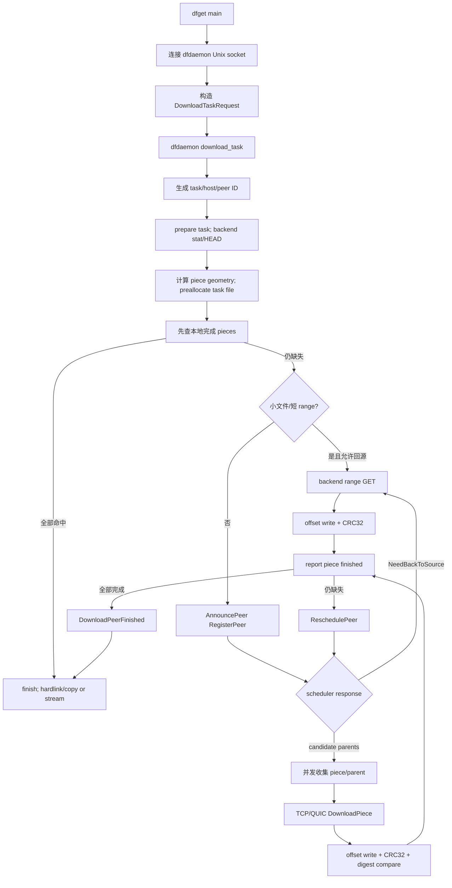
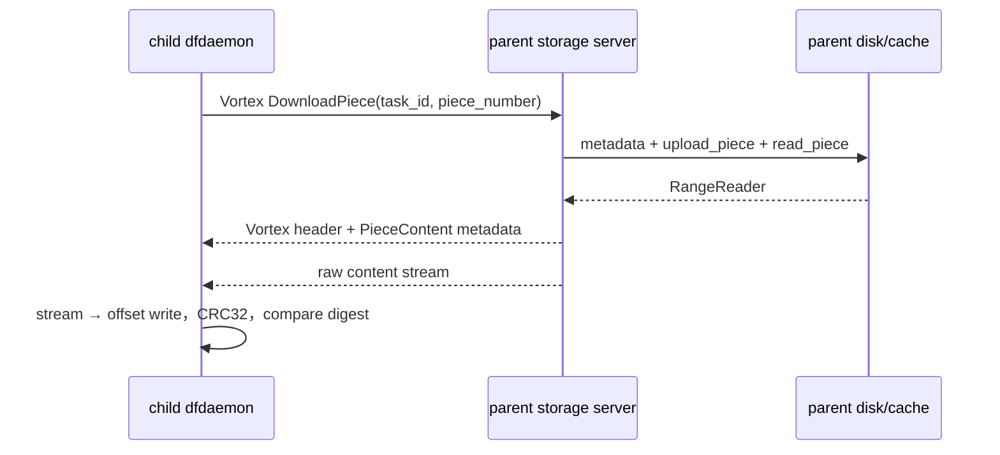
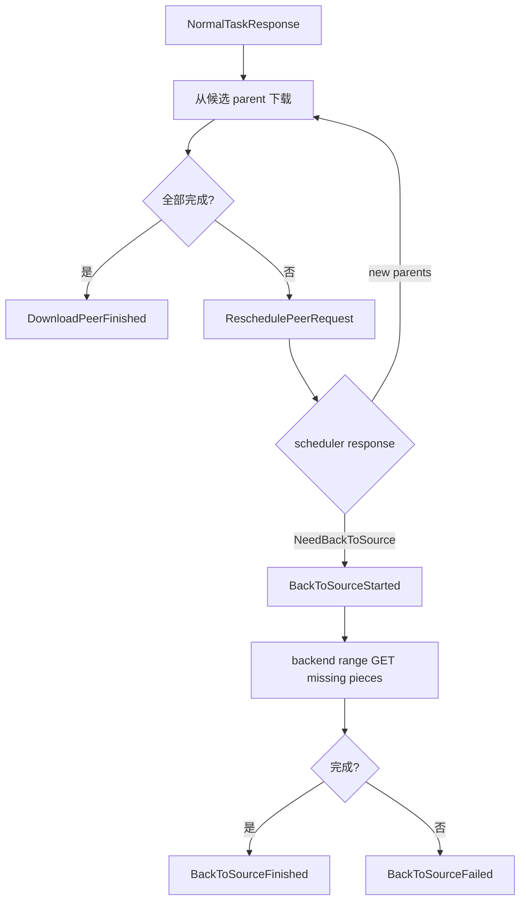

# 一次 `dfget URL` 完整下载流程源码研究笔记

> 基线：提交 `5523218a`。描述 standard task、单文件、Rust client v2 scheduler 主路径；缓存命中、小文件直回源和失败回源作为分支。

## 1. 总流程图

## 2. 入口、Unix gRPC 与请求

### 调用链

`dfget::main()` (`client/dragonfly-client/src/bin/dfget/main.rs:433`)  
↓ `get_dfdaemon_download_client()` (`.../dfget/main.rs:1359`)  
↓ `DfdaemonDownloadClient::new_unix()` (`client/dragonfly-client/src/grpc/dfdaemon_download.rs`)  
↓ `run()` / `download()` (`.../dfget/main.rs:1008`)  
↓ `DfdaemonDownloadClient::download_task()` (`.../grpc/dfdaemon_download.rs:2404`)  
↓ `DfdaemonDownloadServerHandler::download_task()` (`.../grpc/dfdaemon_download.rs:301`)

[源码确认] dfget 默认通过 Unix domain socket 连接本机 dfdaemon，不直接访问 scheduler 或 parent。

[源码确认] `download()` 构造 `DownloadTaskRequest`。standard task 设置 `TaskType::Standard`，dfget 不支持 range；`transfer_from_dfdaemon=true` 时 `need_piece_content=true` 且 output path 为空，否则把 output path 交给 dfdaemon。

- 源码路径：`client/dragonfly-client/src/bin/dfget/main.rs`
- 函数：`download()`，位置 1063–1114。

## 3. Task ID、Task 创建与 Piece 切分

### 调用链

`DfdaemonDownloadServerHandler::download_task()`  
↓ `IDGenerator::task_id(TaskIDParameter::...)`  
↓ `Task::download_started(task_id, Download)`  
↓ `Storage::prepare_download_task()`  
↓（未复用）`BackendFactory::build()` → `Backend::stat()`  
↓ `Piece::calculate_piece_length()`  
↓ `Storage::download_task_started()`  
↓ `Content::create_task()` + `Metadata::download_task_started()`

源码位置：

- `client/dragonfly-client/src/grpc/dfdaemon_download.rs`，函数 `download_task()`，345–396。
- `client/dragonfly-client-util/src/id_generator/mod.rs`，函数 `task_id()`，113–189。
- `client/dragonfly-client/src/resource/task.rs`，函数 `download_started()`，153–301。
- `client/dragonfly-client-storage/src/lib.rs`，函数 `download_task_started()`，149–160。
- `client/dragonfly-client-storage/src/content_linux.rs`，函数 `create_task()`，160–185。

[源码确认] URL-based standard task ID 是 SHA-256：过滤指定 query 参数后，依次纳入规范化 URL、可选 tag/application/revision/piece length、`TaskType::Standard`。另有 content-based 与 OCI blob digest-based 分支。

[源码确认] 首次任务先执行 backend `stat()` 取得 content length。piece length 固定值优先；否则按文件长度优化到约不超过 500 pieces，取 2 的幂并 clamp 到 4 MiB～64 MiB。最后 piece 缩短到实际尾部。

[源码确认] Linux 下创建单个 task 文件 `${storage.dir}/content/tasks/${task_id[0..3]}/${task_id}` 并 `fallocate(content_length)`。piece 不是独立文件，是此文件的 offset/length 区间。

## 4. 本地缓存优先

### 调用链

`Task::download()` (`resource/task.rs:341`)  
↓ `Piece::calculate_interested()` (`resource/piece.rs:134`)  
↓ `Task::download_partial_from_local()` (`resource/task.rs:1906`)  
↓ `Piece::get()` / `Storage::get_piece()`  
↓（命中）`Piece::download_from_local_into_range_reader()`  
↓ `Storage::upload_piece()` → `Content::read_piece()`

[源码确认] task 先计算 interested pieces 并检查本地 metadata；完全命中无需下载。若 task 正被 prefetch，普通请求会等待 in-flight piece，避免重复下载。

[源码确认] 完全本地命中需要报告时使用 `metadata_only=true`，scheduler 返回 `MetadataOnlyResponse`，不调度 parent 或触发 seed 回源。

## 5. Scheduler 注册与 Parent 选择

### Client 调用链

`Task::download_partial_with_scheduler()` (`resource/task.rs:667`)  
↓ 构造 `RegisterPeerRequest { download }`  
↓ `SchedulerClient::announce_peer()` (`grpc/scheduler.rs`)  
↓ gRPC 双向流 `AnnouncePeer`

### Scheduler 调用链

`V2.AnnouncePeer()` (`scheduler/service/service_v2.go:121`)  
↓ `handleRegisterPeerRequest()` (`service_v2.go:1300`)  
↓ `handleResource()` (`service_v2.go:1844`) 创建/复用 Host、Task、Peer  
↓ `ScheduleCandidateParents()` (`scheduler/scheduling/scheduling.go:113`)  
↓ `FindCandidateParents()` (`scheduling.go:411`)  
↓ `filterCandidateParents()` (`scheduling.go:500`)  
↓ `EvaluateParents()` (`scheduler/scheduling/evaluator/evaluator_default.go:115`)  
↓ `NormalTaskResponse(candidate_parents)`

[源码确认] scheduler 维护 task/peer FSM 与 per-task DAG。冷任务且 normal host 时，若 seed peer 可用，可先调用 `downloadTaskBySeedPeer()`；若当前 peer 是 seed/super-seed 或明确要求回源，则标记回源。

[源码确认] parent 过滤包含 blocklist、禁止共享、同 host、DAG 可加边、状态与 bad-parent；排序结合负载、IDC、location、host type。详见 `04-scheduler-flow.md`。

## 6. Piece 收集和 P2P 数据传输

### 调用链

`Task::download_partial_with_scheduler_from_parent()` (`resource/task.rs:1225`)  
↓ `PieceCollector::new()` / `run()` (`resource/piece_collector.rs`)  
↓ 内部 `download_from_parent()` (`resource/task.rs:1296`)  
↓ `Piece::download_from_parent()` (`resource/piece.rs:343`)  
↓ `Downloader::download_piece()` (`resource/piece_downloader.rs`)  
↓ storage `client::{tcp|quic}::download_piece()`  
↓ parent `server::{tcp|quic}` request handler  
↓ parent `Storage::upload_piece()` → `Content::read_piece()`  
↓ child `Storage::download_piece_from_parent_finished()`  
↓ `Content::write_piece_from_stream()`

[源码确认] 并发度由 `concurrent_piece_count` 控制。PieceCollector 为缺失 piece 收集拥有它的 candidate parents，task 再受 semaphore 限制并发执行。

[源码确认] `config.download.protocol` 选择 `tcp` 或 `quic`。源码中“fall back to grpc downloader”日志分支实际仍调用 TCP downloader、使用 legacy host `ip:port`，不能据日志文字认定 piece 用 gRPC 传输。

源码路径：`client/dragonfly-client-storage/src/client/tcp.rs`、`client/quic.rs`、`server/tcp.rs`、`server/quic.rs`；函数 `download_piece()`、请求 handler、`handle_piece()`。

## 7. Piece 校验与 metadata

### 调用链

`Storage::download_piece_from_parent_finished()` (`storage/src/lib.rs:835`)  
↓ `handle_downloaded_piece_from_parent_finished()`  
↓ `Content::write_piece_from_stream()`  
↓ `io::write_range_from_stream()`  
↓ `{length, crc32 hash}`  
↓ expected digest compare  
↓ `Metadata::download_piece_finished()`

[源码确认] parent piece 边写边算 CRC32；expected digest 非空时必须匹配，否则 `DigestMismatch`。回源 piece 同样计算并保存 CRC32，但没有远端 expected piece digest 可比。

[源码确认] piece ID 是 `${task_id}-${number}`；metadata 记录 number、offset、length、digest、parent ID、时间。RocksDB column families 为 `task`、`piece`、`persistent_task`、`persistent_cache_task`、`cache_task`。

## 8. 重调度与回源

[源码确认] client 未下载完时把上一批 parents 随 `ReschedulePeerRequest` 发回；scheduler 将其加入 `BlockParents` 后重选。client 还有 schedule count/timeout 限制；失败且允许回源时走 source。

### 回源调用链

`Task::download_partial_with_scheduler_from_source()` (`resource/task.rs:1582`)  
↓ `Piece::download_from_source()` (`resource/piece.rs:466`)  
↓ `BackendFactory::build()` → `Backend::get(GetRequest { range })`  
↓ `Storage::download_piece_from_source_finished()`  
↓ `Content::write_piece_from_stream()`

## 9. 文件组装、输出和缓存

[源码确认] “文件组装”不是结束后拼接 piece 文件；piece 到达时已按 offset 写入同一预分配 task 文件。所有 pieces 完成即缓存文件完整。

### 默认 direct-output 调用链

`DfdaemonDownloadServerHandler::download_task()` spawned task  
↓ `Task::download()`  
↓ `Task::download_finished()`（写 `finished_at`）  
↓ 若 output path：hardlink 已存在则同 inode，否则 `Task::copy_task()`  
↓ 可选 whole-file digest 校验

源码路径：`client/dragonfly-client/src/grpc/dfdaemon_download.rs`，函数 `download_task()`；`client/dragonfly-client-storage/src/content_linux.rs`，函数 `hard_link_task()`、`copy_task()`。

### `transfer_from_dfdaemon=true` 调用链

task 读取本地 piece  
↓ `DownloadPieceFinishedResponse.piece.content`  
↓ dfget `out_stream.message()`  
↓ `seek(piece.offset)` + `write_all(content)` + `flush()`

源码路径：`client/dragonfly-client/src/resource/task.rs`，parent/source/local 下载函数；`client/dragonfly-client/src/bin/dfget/main.rs`，函数 `download()`，1160–1279。

[源码确认] task content 与 RocksDB metadata 会保留供共享/复用，之后由 TTL/磁盘水位 GC 清理。

## 10. 当前结论

- [源码确认] Task ID 在 dfdaemon 收到请求后、访问 scheduler 前生成。
- [源码确认] piece 切分由 client 在 backend stat 后完成；scheduler 不切字节。
- [源码确认] scheduler 选候选 parent；具体 piece→parent 还经 client PieceCollector/parent selector。
- [源码确认] scheduler 只见 metadata/状态；piece bytes 走 parent storage server→child storage。
- [源码确认] piece 主校验是 CRC32；用户指定 whole-file digest 在输出阶段另验。
- [架构推断] `transfer_from_dfdaemon=true` 比 hardlink 多出缓存读、gRPC message materialization 与 dfget 写盘。
- [待确认] 未抓包/trace；chunk 大小、内核 copy 次数、tonic 序列化峰值需实验验证。
