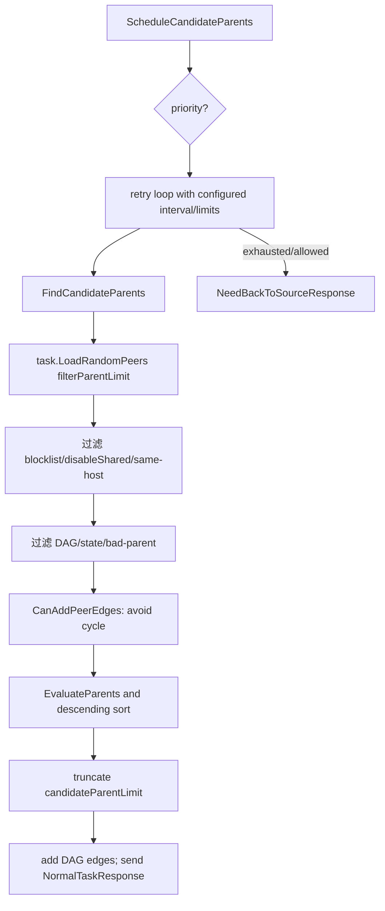
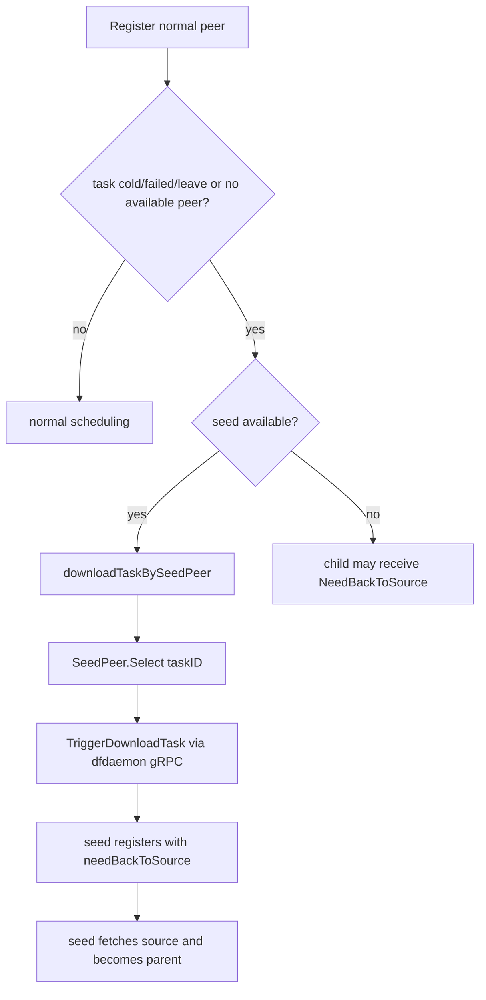

# Scheduler 调度流程源码研究笔记

> 基线：提交 `5523218a`；重点为 v2 standard task。v1 与 persistent/persistent-cache 只指出边界。

## 1. 入口与资源模型

[源码确认] scheduler 启动时构造 standard resource、可选 Redis-backed persistent resources、dynconfig、scheduling/evaluator、gRPC server、GC/announcer/job。

`cmd/scheduler/main.go::main()`  
↓ `cmd/scheduler/cmd/root.go::runScheduler()`  
↓ `scheduler.New()` (`scheduler/scheduler.go`)  
↓ `standard.New()` + `scheduling.New()` + `rpcserver.New()`  
↓ `Server.Serve()`

[源码确认] standard 资源为 `HostManager`、`TaskManager`、`PeerManager`；task 内持有 peer DAG 和 Pieces，peer/host/task 都有状态或原子指标。

- 源码路径：`scheduler/resource/standard/resource.go`，函数：`New()`。
- 源码路径：`scheduler/resource/standard/task.go`，结构：`Task`、函数：`NewTask()`。
- 源码路径：`scheduler/resource/standard/peer.go`，结构：`Peer`、函数：`NewPeer()`。
- 源码路径：`scheduler/resource/standard/host.go`，结构：`Host`、函数：`NewHost()`。

## 2. Peer/Task 注册与状态维护

```mermaid
sequenceDiagram
    participant D as dfdaemon
    participant V as V2.AnnouncePeer
    participant R as Resource managers
    participant S as Scheduling
    D->>V: RegisterPeer(host,task,peer,download)
    V->>R: handleResource: load/create Host,Task,Peer
    R->>R: store stream; add peer vertex to task DAG
    alt metadata_only
      V-->>D: MetadataOnlyResponse
    else empty
      V-->>D: EmptyTaskResponse
    else normal
      V->>S: ScheduleCandidateParents
      S-->>D: NormalTaskResponse / NeedBackToSource
    end
    loop during download
      D->>V: Started / PieceFinished|Failed / Reschedule
      V->>R: update FSM, piece map, DAG/blocklist/metrics
    end
    D->>V: PeerFinished|Failed
    V->>R: terminal FSM transition
```

### 注册调用链

`V2.AnnouncePeer()` (`scheduler/service/service_v2.go:121`)  
↓ `handleRegisterPeerRequest()` (`:1300`)  
↓ `handleResource()` (`:1844`)  
↓ manager `LoadOrStore()` / `Task.StorePeer()`  
↓ `ScheduleCandidateParents()` (`scheduler/scheduling/scheduling.go:113`)

[源码确认] `AnnouncePeer` 是长生命周期双向流，按 oneof request 分派注册、开始、回源开始、重调度、完成、失败、piece 完成/失败。流断开时清除 peer 保存的 stream。

[源码确认] Task FSM：`Pending → Running → Succeeded/Failed/Leave`；Peer FSM 定义于 `peer.go`，事件驱动 register/download/back-to-source/success/failure/leave。piece 完成后 scheduler 存储 `standard.Piece`，并将 cost/parent/digest 等纳入状态与指标。

- 源码路径：`scheduler/service/service_v2.go`，函数：`handleDownloadPeer*()`、`handleDownloadPiece*()`。
- 源码路径：`scheduler/resource/standard/task.go`，函数：`NewTask()`。
- 源码路径：`scheduler/resource/standard/peer.go`，函数：`NewPeer()`。

## 3. Parent Peer 选择



### 调用链

`ScheduleCandidateParents()` (`scheduling.go:113`)  
↓ `FindCandidateParents()` (`:411`)  
↓ `filterCandidateParents()` (`:500`)  
↓ `Task.LoadRandomPeers()` (`resource/standard/task.go:242`)  
↓ `Task.CanAddPeerEdges()`（DAG cycle guard）  
↓ `evaluatorDefault.EvaluateParents()` (`evaluator_default.go:115`)  
↓ `Task.AddPeerEdges()`  
↓ `constructSuccessNormalTaskResponse()` / stream `Send()`

[源码确认] 过滤条件包括：peer 状态必须可调度；candidate 不在 blocklist；host 未 disable shared；不是同 host；candidate 在 DAG；normal host candidate 必须有可用状态/拓扑；evaluator 不认为是 bad parent；新边不会破坏 DAG。

[源码确认] 先随机抽样 `filterParentLimit`，再评分并截断至 `candidateParentLimit`；两个 limit 优先取 dynconfig，有效值缺失时用默认配置。

## 4. 默认调度算法

[源码确认] standard parent 总分：

```text
Total = 0.6 * LoadQuality + 0.2 * IDC Affinity
      + 0.1 * Location Affinity + 0.1 * HostType

LoadQuality = 0.5 * PeakBandwidthUsage
            + 0.3 * BandwidthDuration
            + 0.2 * Concurrency
```

源码路径：`scheduler/scheduling/evaluator/evaluator_default.go`：

- `EvaluateParents()` / `evaluateParents()`
- `calculateLoadQualityScore()`
- `calculatePeakBandwidthUsageScore()`
- `calculateBandwidthDurationScore()`
- `calculateConcurrencyScore()`
- `calculateIDCAffinityScore()` / `calculateLocationAffinityScore()` / `calculateHostTypeScore()`

[源码确认] 峰值带宽分数依据 host `TxBandwidth / MaxTxBandwidth`；持续负载用 60 秒窗口内 `UploadContentLength`；并发分数使用经验 piece length 16 MiB 估计带宽可承载 piece 数。IDC/location 是字符串层级亲和；host type 分数区分 normal 与 seed。

[源码确认] evaluator 可由配置选择默认实现或加载 Go plugin。源码路径：`scheduler/scheduling/evaluator/evaluator.go`，函数 `New()`；`plugin.go`，函数 `LoadPlugin()`。

## 5. Seed Peer 逻辑



[源码确认] seed peer 选择/触发位于 `scheduler/resource/standard/seed_peer.go`；注册路径位于 `service_v2.go::handleRegisterPeerRequest()` 和 `downloadTaskBySeedPeer()`。正常 peer 的冷任务优先尝试 seed；seed/super-seed 自己则直接承担回源角色。

[源码确认] dfdaemon 通过 `AnnounceHost` 报告 host type；`seed_peer.enable` 决定 seed 角色，`kind` 可为 normal/super 等枚举。

## 6. 调度失败处理

[源码确认] 失败层次：

1. 注册并发高时，除 super seed 外执行指数 delay+jitter，抑制同 host 回源惊群。源码：`handleRegisterPeerRequest()` 1362–1379。
2. `ScheduleCandidateParents()` 内按 scheduler retry interval/limit 重试寻找 parents，并考虑 peer priority、back-to-source limit。[源码路径：`scheduler/scheduling/scheduling.go`，函数同名。]
3. child 下载不完整发送 `ReschedulePeerRequest`；scheduler 将旧 candidates 加入 `BlockParents` 再调度。源码：`service_v2.go::handleReschedulePeerRequest()`。
4. parent piece 失败时 scheduler 记录/更新 block/状态；client 可换 parent；最终在允许时回源。
5. terminal 失败通过 peer/task FSM 与 failure metrics 记录。

## 7. 当前结论

- [源码确认] scheduler 输出的是 candidate parent 集合，不搬运 piece 内容。
- [源码确认] 拓扑核心是每 task 一个 DAG；加边时同时更新 parent host 的 upload count、估计 TxBandwidth、并发 piece 数、upload content length。
- [源码确认] 默认算法不是单纯最邻近或最空闲，而是负载占主权重的多因子评分。
- [源码确认] persistent/persistent-cache 有独立资源与调度函数，不能把 standard 的所有状态语义无条件套用。
- [架构推断] 调度评分使用的多项负载值是边建立时的估计/累计量，未来性能实验应核对它与真实 NIC 吞吐的偏差。
- [待确认] 未运行故障注入；retry/back-to-source 在具体配置下的时间上界需要结合实际 dynconfig 验证。
