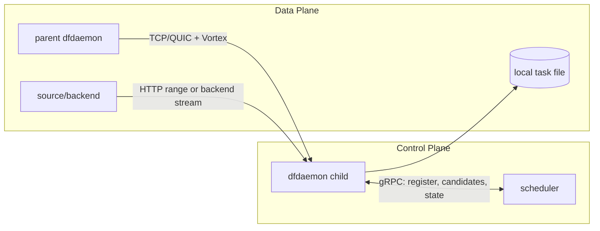

# Peer 数据传输路径源码研究笔记

> 基线：提交 `5523218a`。copy 次数只能由静态源码给出逻辑数据移动，不能等同于 perf/eBPF 实测，相关结论按 `[架构推断]`/`[待确认]` 标记。

## 1. 协议分工

| 协议 | 当前作用 | 证据 |
|---|---|---|
| gRPC/HTTP2 | [源码确认] manager/scheduler/dfdaemon 控制 API；dfget↔dfdaemon Unix RPC；scheduler↔seed 触发下载；legacy upload API。正常大 piece 的新 storage path 不经 scheduler gRPC。 | `client/dragonfly-client/src/grpc/*.rs`；`scheduler/service/service_v2.go::AnnouncePeer()` |
| TCP | [源码确认] peer storage 数据面之一，使用 Vortex header/TLV 后接 piece byte stream；支持连接池和 TCP fast open 配置。 | `client/dragonfly-client-storage/src/client/tcp.rs::download_piece()`；`server/tcp.rs` request handler |
| QUIC | [源码确认] peer storage 数据面之一；quinn、双向 stream、self-signed TLS、BBR congestion control。 | `client/dragonfly-client-storage/src/client/quic.rs::download_piece()`；`server/quic.rs::run()/handle_stream()` |
| HTTP/HTTPS | [源码确认] HTTP proxy、HTTP backend 回源；Go v1 tiny-file legacy path仍有 HTTP range 下载。 | `client/dragonfly-client-backend/src/http.rs`；`client/dragonfly-client/src/proxy/mod.rs`；`scheduler/resource/standard/peer.go::DownloadTinyFile()` |
| Vortex | [源码确认] TCP/QUIC 上的应用 framing：`DownloadPiece`、`PieceContent`、persistent variants、Error 等 header/TLV。 | storage client/server 对 `vortex_protocol::{Header,Vortex,Tag}` 的使用 |

## 2. 控制与数据是否分离



[源码确认] 分离。scheduler response 携带 parent 地址、端口、piece metadata；child 随后直接连接 parent。例外：`dfget --transfer-from-dfdaemon` 会在本机 Unix gRPC 响应中携带 piece bytes，这属于 daemon→CLI 输出路径，不是 peer→peer path。

## 3. Piece 请求与发送流程

```mermaid
sequenceDiagram
    participant CT as child Task
    participant CC as TCP/QUIC client
    participant PS as parent server
    participant ST as parent Storage
    participant FS as task file/cache
    CT->>CC: download_piece(number, host_id, task_id)
    CC->>PS: Vortex DownloadPiece
    PS->>ST: piece_id; upload_piece
    ST->>FS: wait metadata; read_piece(offset,length)
    FS-->>ST: RangeReader/AsyncBufRead
    ST-->>PS: piece metadata + reader
    PS-->>CC: PieceContent TLV
    PS-->>CC: streamed bytes
    CC-->>CT: stream, offset, digest
```

### 请求调用链

`Task::download_partial_with_scheduler_from_parent()`  
↓ `Piece::download_from_parent()`  
↓ `TCPDownloader|QUICDownloader::download_piece()`  
↓ storage `TCPClient|QUICClient::download_piece()`  
↓ encode `Vortex::DownloadPiece`

源码路径：`client/dragonfly-client/src/resource/task.rs`、`resource/piece.rs`、`resource/piece_downloader.rs`、`client/dragonfly-client-storage/src/client/{tcp,quic}.rs`。

### 发送调用链

storage server request handler  
↓ `handle_piece(piece_id, task_id)`  
↓ `Storage::upload_piece()`  
↓ `wait_for_piece_finished()`  
↓ `Content::read_piece()`  
↓ `RangeReader`  
↓ write Vortex metadata  
↓ `copy_buf`/stream write to socket

源码路径：`client/dragonfly-client-storage/src/server/{tcp,quic}.rs`、`src/lib.rs::upload_piece()`、`src/content_linux.rs::read_piece()`、`src/io.rs::RangeReader`。

## 4. 接收、校验和磁盘写入

`TCPClient|QUICClient::content_stream()`  
↓ `Piece::download_from_parent()`  
↓ `Storage::download_piece_from_parent_finished()`  
↓ `handle_downloaded_piece_from_parent_finished()`  
↓ `Content::write_piece_from_stream()`  
↓ `io::write_range_from_stream()`  
↓ CRC32 + expected digest compare  
↓ RocksDB `Metadata::download_piece_finished()`

[源码确认] 网络 stream 被直接消费并写到预分配文件的 piece offset，同时计算 CRC32；没有“先完整收进 Vec 再写盘”的 standard parent 主路径。

## 5. 文件读取与网络发送路径

[源码确认] Linux `Content::read_piece()`：由 task ID 求路径→从 `FDCache` 打开/复用 fd→计算 range→构造带 `read_buffer_size` 和 `BufferPool` 的 `RangeReader`。server 再用 Tokio buffered copy 写 TCP/QUIC stream。

- 源码路径：`client/dragonfly-client-storage/src/content_linux.rs`，函数：`read_piece()`、`get_task_path()`。
- 源码路径：`client/dragonfly-client-util/src/fs/fd.rs`，结构/函数：`FDCache`。
- 源码路径：`client/dragonfly-client-util/src/buffer_pool/mod.rs`，结构：`BufferPool`。
- 源码路径：`client/dragonfly-client-storage/src/io.rs`，结构：`RangeReader`、函数：`write_range_from_stream()`。

## 6. 逻辑 copy 分析

### Parent → child 标准落盘

[架构推断] 用户态可见的最小逻辑移动为：

1. parent 文件 → `RangeReader` 的 pooled buffer；
2. buffer → TCP/QUIC socket（QUIC 还需用户态协议/加密处理）；
3. child socket → `Bytes` chunks；
4. chunks → child write buffer/目标文件，同时 hash。

[源码确认] metadata header 会额外构造 `Bytes/BytesMut`，但 piece body 通过 reader stream，不与整个 piece metadata 一起聚合。

[待确认] 精确 copy 次数不能仅由 Rust API 得出：Tokio、quinn、rustls、socket buffer、内核 page cache、`write_range_from_stream()` 内部 buffering 都会改变实际 memcpy/syscall 数。应后续用 `perf`, eBPF, flamegraph、syscall/alloc profile 验证。

### dfdaemon → dfget transfer 模式

[架构推断] 比 direct hardlink 至少多：缓存文件读入 piece content、prost/tonic message buffer、dfget `write_all` 到输出。是否发生更多 clone 取决于 `Bytes`/prost 生成类型与 tonic encoding，需实验。

## 7. 可能的性能瓶颈（仅定位，不是改造建议）

| 位置 | 证据等级 | 关注原因 | 源码位置 |
|---|---|---|---|
| CRC32 + disk write 串行热段 | [架构推断] | 每个接收 chunk 既写盘又参与 hash | `storage/src/io.rs::write_range_from_stream()` |
| buffer size / syscall 密度 | [架构推断] | 当前默认函数返回读写 512 KiB；注释存在 4MiB/1MiB 不一致 | `client-config/src/dfdaemon.rs::default_storage_*_buffer_size()` |
| QUIC userspace/TLS | [架构推断] | quinn、rustls、BBR 带来 CPU 与内存处理，换取多流/拥塞控制 | `storage/src/{client,server}/quic.rs` |
| TCP connection lifecycle | [源码确认]/[架构推断] | downloader 复用的是按地址缓存的 `TCPClient` 对象，但 `TCPClient::handle_download_piece()` 每次调用 `connect_and_write_request()` 新建 TCP 连接；握手与每-piece framing 可能影响延迟 | `resource/piece_downloader.rs`、`storage/src/client/tcp.rs` |
| PieceCollector/parent retry | [架构推断] | parent pieces 不齐或失败会造成等待、重调度 | `resource/piece_collector.rs`、`task.rs` |
| disk preallocation/random offsets | [架构推断] | 并发 pieces 对同一文件不同 offset 写，介质类型影响大 | `content_linux.rs::create_task()/write_piece_from_stream()` |
| RocksDB metadata | [架构推断] | 每 piece completion 有异步非 sync put；高 piece 数有写放大/锁竞争可能 | `metadata.rs`、`storage_engine/rocksdb.rs::put()` |
| dfget transfer mode | [架构推断] | 多一次本地传输和落盘，且 message 内带 content | `dfget/main.rs::download()` |

## 8. 当前结论

- [源码确认] 当前新数据面支持 TCP 与 QUIC，应用 framing 是 Vortex，不是裸文件协议。
- [源码确认] gRPC 主责控制；normal P2P piece bytes 不经过 scheduler。
- [源码确认] parent 读取和 child 写入均使用 stream/buffer pool，未在主链聚合完整文件。
- [待确认] 所有“瓶颈”均需指标/压测验证，本文不能给出实际占比与 copy 精确值。
