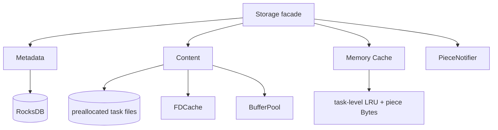
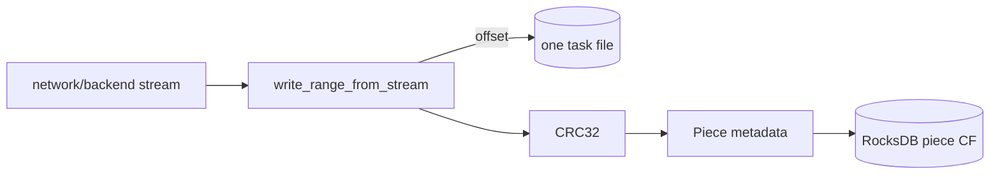
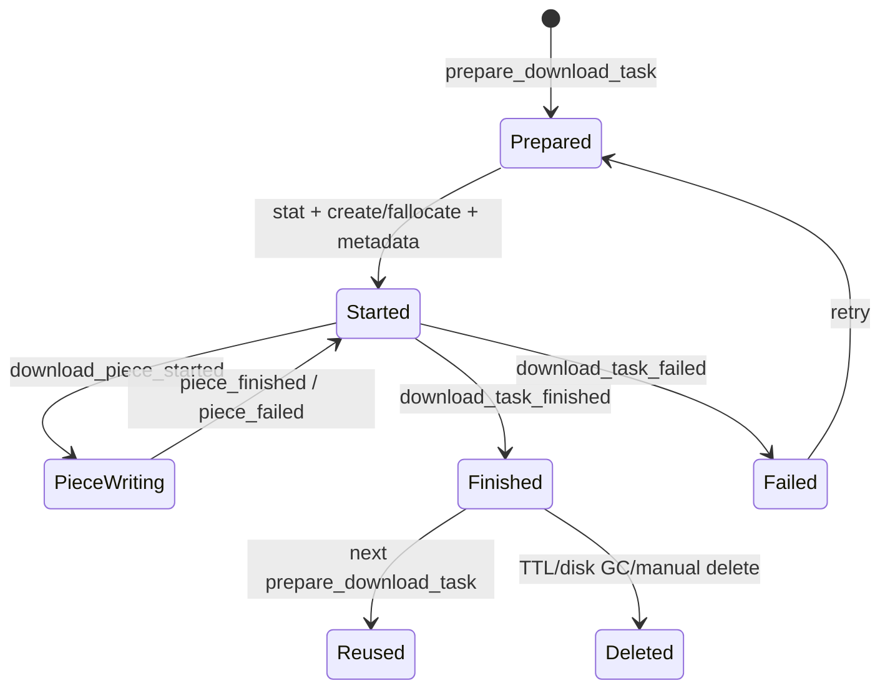
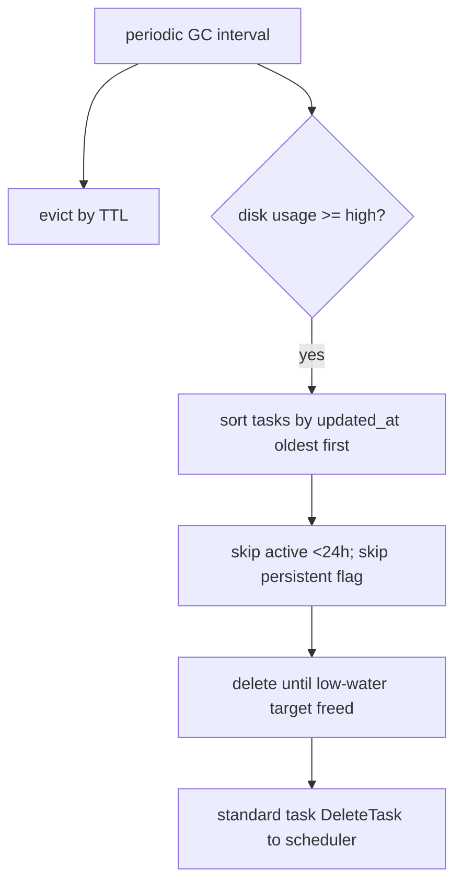

# dragonfly-client-storage 与缓存源码研究笔记

> 基线：提交 `5523218a`；Linux 路径为重点，macOS 有平行实现。

## 1. Storage 分层



[源码确认] `Storage` 是 facade，组合 metadata、content、memory cache 和 in-flight piece notifier。

- 源码路径：`client/dragonfly-client-storage/src/lib.rs`
- 结构：`Storage`
- 函数：`Storage::new()`

## 2. 目录结构

[源码确认] Linux 默认 `storage.dir=/var/lib/dragonfly/`。实际结构：

```text
/var/lib/dragonfly/
├── metadata/                         # RocksDB
├── content/
│   ├── tasks/<task-id前三字符>/<task-id>
│   ├── persistent-tasks/<前三字符>/<task-id>
│   └── persistent-cache-tasks/<前三字符>/<task-id>
└── tmp/                              # output 操作临时目录
```

源码位置：

- `client/dragonfly-client-config/src/lib.rs::default_storage_dir()`。
- `client/dragonfly-client-storage/src/content.rs` 常量 `DEFAULT_*_DIR`。
- `client/dragonfly-client-storage/src/content_linux.rs::get_task_path()`、persistent variants。
- `client/dragonfly-client-storage/src/storage_engine/rocksdb.rs::RocksdbStorageEngine::open()`。

[源码确认] standard task 按 task ID 前 3 字符分目录避免单目录文件过多。`server.cache_dir`（默认 `/var/cache/dragonfly/dfdaemon`）是 server cache 配置，不等于上述 task content 主存储目录，阅读配置时应区分。

## 3. Piece 存储方式



[源码确认] piece content 不单独落文件。`Content::create_task()` 先创建并 fallocate 整个文件，`write_piece_from_stream()` 在 piece offset 写入。Piece metadata 独立记录 offset/length/digest/parent/timestamps。

- 源码路径：`client/dragonfly-client-storage/src/content_linux.rs`
- 函数：`create_task()`、`write_piece_from_stream()`、`read_piece()`。
- 源码路径：`client/dragonfly-client-storage/src/metadata.rs`
- 结构：`Piece`；函数：`calculate_digest()`。

[源码确认] `PieceNotifier::claim()` 确保同进程并发请求同一 piece 时只有一个 owner 下载，其他 waiter 等通知并重查 metadata。

- 源码路径：`client/dragonfly-client-storage/src/piece_notifier.rs`
- 源码路径：`client/dragonfly-client-storage/src/lib.rs`
- 函数：`download_piece_started()`、`wait_for_piece_finished()`。

## 4. 元数据管理

[源码确认] RocksDB column families：`task`、`piece`、`persistent_task`、`persistent_cache_task`、`cache_task`。对象以 serde 序列化，piece 前缀查询使用固定 64-byte task ID prefix。put/delete/batch delete 的 `WriteOptions.sync=false`；RocksDB `use_fsync=false`、`bytes_per_sync=2MiB`。

- 源码路径：`client/dragonfly-client-storage/src/metadata.rs`
- 结构：`Task`、`Piece`、`PersistentTask`、`PersistentCacheTask`、`CacheTask`；函数：`Metadata::new()`。
- 源码路径：`client/dragonfly-client-storage/src/storage_engine/rocksdb.rs`
- 函数：`open()`、`put()`、`delete()`、`batch_delete()`。

[源码确认] upload counters 是 `DashMap` 中的内存统计，读取 task metadata 时合并，避免每次 upload 都写 RocksDB。

## 5. 内存缓存

[源码确认] `cache::Cache` 是 task-level LRU：task 内为 `HashMap<piece_id, Bytes>`；容量按 task content length 预留/核算，超限时 `pop_lru()` 整 task 淘汰。默认 capacity 代码值为 64 MiB。

- 源码路径：`client/dragonfly-client-storage/src/cache/mod.rs`
- 结构：`Cache`、内部 `Task`
- 函数：`put_task()`、`read_piece()`、`write_piece()`、`delete_task()`。

[源码确认] 内存 cache 用于 `CacheTask`/预热路径，不代表所有 standard disk task 自动获得内存副本。

## 6. 文件生命周期



### 调用链

`Metadata::prepare_download_task()`  
↓ `Content::create_task()`  
↓ `Metadata::download_task_started()`  
↓ repeated `download_piece_started()` / `download_piece_finished()`  
↓ `Metadata::download_task_finished()`  
↓ reuse or `Storage::delete_task()`

[源码确认] `storage.keep=false` 时启动会销毁 content 目录和 RocksDB；`keep=true` 则跨重启保留。删除 task 的次序为 metadata task、piece metadata、content file、memory cache entry（错误多为记录后继续）。

## 7. GC 机制



[源码确认] 默认 GC interval 900s；standard task TTL 30d；persistent 与 persistent-cache 默认 TTL 1d；高/低水位默认 80%/60%。磁盘阈值也可按配置的逻辑容量计算。

[源码确认] 磁盘 GC 按 `updated_at` 旧优先。未完成、未失败且创建不足 24h 的任务跳过；persistent flag 为 true 的 persistent/persistent-cache task 在磁盘 GC 中跳过。standard task 删除后通知 scheduler `DeleteTask`。

- 源码路径：`client/dragonfly-client/src/gc/mod.rs`
- 函数：`GC::run()`、`evict_task_by_ttl()`、`evict_task_by_disk_usage()`、`evict_task_space()` 及 persistent variants。
- 源码路径：`client/dragonfly-client-config/src/dfdaemon.rs`
- 函数：`default_gc_*()`；结构：`Policy`、`GC`。

## 8. 磁盘 I/O 路径

### 写

network/backend stream  
↓ `Storage::download_piece_from_{parent|source}_finished()`  
↓ `Content::write_piece_from_stream()`  
↓ `FDCache::open_write()`  
↓ `io::write_range_from_stream()`  
↓ task file offset + CRC32  
↓ RocksDB piece metadata put

### 读/上传

`Storage::upload_piece()`  
↓ wait piece metadata finished  
↓ `Content::read_piece()`  
↓ `FDCache::open()`  
↓ `RangeReader(buffer_pool)`  
↓ TCP/QUIC server socket

[源码确认] 默认读写 buffer 函数当前均返回 512 KiB，但配置字段注释声称默认 4 MiB/1 MiB，存在注释与代码不一致；本笔记以函数实际值为准并标记后续核对。

## 9. 当前结论

- [源码确认] standard piece 的内容粒度是“同一 task file 内 range”，metadata 粒度才是 piece。
- [源码确认] RocksDB 与 content file 不是事务性原子提交；piece notifier + metadata 状态负责进程内并发协调。
- [架构推断] 崩溃一致性窗口受异步 RocksDB write、page cache 与非 fsync 设置影响。
- [待确认] 掉电/kill -9 后 metadata/content 的实际恢复行为需要故障实验。
- [待确认] 配置默认 buffer 注释与函数不一致是否为文档欠更新，需要维护者确认。
