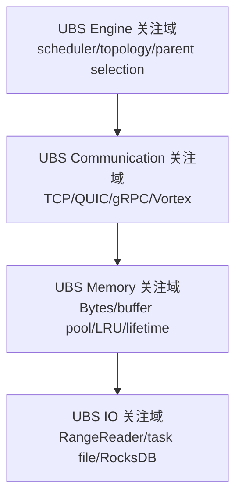
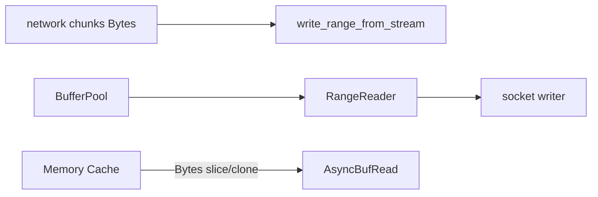
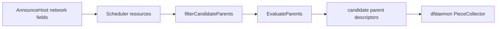

# 灵衢 UnifiedBus（UB Service Core）后续分析关注点

> 本文只从当前源码标出未来研究边界，不设计接入方案、不评价可行性、不建议修改点。基线：提交 `5523218a`。

## 1. 总体定位图

[架构推断] 四个域在当前主链中的交界依次是：scheduler parent descriptor → `Piece::download_from_parent()` → storage client stream → `write_range_from_stream()`。这只是阅读切面，不是 UB 架构映射结论。

## 2. UBS Communication 关注点

### 关键调用链

`SchedulerClient::announce_peer()`  
↓ candidate parent address/ports  
↓ `Piece::download_from_parent()`  
↓ `DownloaderFactory::{tcp|quic}` / `Downloader::download_piece()`  
↓ storage `client/{tcp,quic}.rs`  
↓ Vortex framing  
↓ storage `server/{tcp,quic}.rs`

| 关注位置 | 源码证据 | 当前结论 |
|---|---|---|
| transport factory | `client/dragonfly-client/src/resource/piece_downloader.rs`，`DownloaderFactory::new()/build()` | [源码确认] 当前上层通过 trait 隔离 TCP/QUIC downloader |
| protocol selection | `client/dragonfly-client/src/resource/piece.rs::download_from_parent()` | [源码确认] 根据配置和 parent 暴露端口选择 TCP/QUIC |
| wire framing | `client/dragonfly-client-storage/src/client/*.rs`、`server/*.rs` | [源码确认] Vortex header/TLV + body stream |
| endpoint advertisement | `client/dragonfly-client/src/announcer/mod.rs::make_announce_host_request()` | [源码确认] dfdaemon 把 storage TCP/QUIC ports 报给 scheduler |
| control RPC | `client/dragonfly-client/src/grpc/scheduler.rs`、`scheduler/service/service_v2.go::AnnouncePeer()` | [源码确认] gRPC 控制面与 peer bytes 分开 |

后续需回答但当前 `[待确认]`：UB transport 的连接/stream 模型与 Vortex framing 是否兼容；地址/拓扑标识如何表达；安全、MTU、可靠性、流控和错误语义如何对应；是否保留现有 TCP/QUIC fallback。这些均不能由 Dragonfly 单方源码得出。

## 3. UBS Memory 关注点

| 关注位置 | 源码路径/函数 | 当前结论 |
|---|---|---|
| 网络 chunk 生命周期 | `storage/src/client/{tcp,quic}.rs::content_stream()`；`storage/src/io.rs::write_range_from_stream()` | [源码确认] 接收侧使用 `Bytes` stream |
| read/write buffer | `client-util/src/buffer_pool/mod.rs::BufferPool`；`storage/src/io.rs::RangeReader` | [源码确认] 磁盘读有 pooled staging buffers |
| memory piece cache | `storage/src/cache/mod.rs::{Cache,Task}` | [源码确认] task-level LRU，piece 内容为 `Bytes` |
| in-flight ownership | `storage/src/piece_notifier.rs`；`Storage::download_piece_started()` | [源码确认] 同一 piece 单 owner、其他 waiter |
| dfget transfer | `resource/task.rs` response content；`dfget/main.rs::download()` | [架构推断] 是内存峰值与额外 copy 的重点观测路径 |

后续 `[待确认]`：chunk/buffer pinning、注册内存、zero-copy 能力、跨运行时 ownership、UB completion 与 `Bytes` 生命周期、并发 piece 数×buffer 大小的峰值；需结合 UB SDK/API 和 profiler。

## 4. UBS IO 关注点

### 关键调用链

receive stream  
↓ `Storage::download_piece_from_parent_finished()`  
↓ `Content::write_piece_from_stream()`  
↓ `io::write_range_from_stream()`  
↓ single task file offset  
↓ RocksDB metadata

upload: `Storage::upload_piece()` → `Content::read_piece()` → `RangeReader` → transport。

| 关注位置 | 源码路径 | 当前结论 |
|---|---|---|
| content layout | `storage/src/content_linux.rs::create_task()/get_task_path()` | [源码确认] 预分配单文件、piece offset 写 |
| range I/O | `content_linux.rs::read_piece()/write_piece_from_stream()` | [源码确认] piece 是 range，不是独立 object |
| fd/buffer reuse | `client-util/src/fs/fd.rs`、`buffer_pool/mod.rs` | [源码确认] 已有 FDCache 与 BufferPool |
| metadata commit | `storage/src/metadata.rs`、`storage_engine/rocksdb.rs` | [源码确认] content 与 metadata 分层；RocksDB async non-sync writes |
| GC interaction | `dragonfly-client/src/gc/mod.rs` | [源码确认] 文件可被 TTL/水位删除并通知 scheduler |

后续 `[待确认]`：UB IO 是否直接作用于文件/range、alignment 与 registration 要求、与 fallocate/page cache/direct IO 的关系、GC/close 时资源注销顺序、错误后的 partial write 恢复。

## 5. UBS Engine 关注点

| 关注位置 | 源码路径/函数 | 当前结论 |
|---|---|---|
| host topology/capacity | `scheduler/resource/standard/host.go::Host`；client `announcer` | [源码确认] IDC/location/max bandwidth 等进入 host 模型 |
| DAG topology | `scheduler/resource/standard/task.go`，`AddPeerEdges()/CanAddPeerEdges()` | [源码确认] 每 task DAG 防环并维护 parent-child |
| filter | `scheduler/scheduling/scheduling.go::filterCandidateParents()` | [源码确认] blocklist、host、状态、DAG、bad-node 过滤 |
| evaluator | `scheduler/scheduling/evaluator/evaluator_default.go` | [源码确认] load/IDC/location/host type 加权 |
| client piece→parent | `resource/piece_collector.rs`、`parent_selector.rs` | [源码确认] scheduler 选 candidates 后，client 仍做 piece 粒度选择 |

后续 `[待确认]`：UB fabric topology/拥塞/NUMA 信息能否映射到现有 host fields；动态变化刷新频率；评分是在 scheduler 还是 client 侧消费；指标口径与现有 `TxBandwidth` 估计是否一致。当前阶段不选择落点。

## 6. 建议的后续取证清单（不是方案）

1. [待确认] 固定 workload 分别采集 TCP/QUIC 的吞吐、CPU、alloc、syscall、磁盘等待、scheduler delay。
2. [待确认] 用 trace 对齐 `task_id/peer_id/piece_id`，分解 schedule、connect、first-byte、write、hash、metadata 时间。
3. [待确认] 获取 UB Service Core 的正式 API/ABI、memory registration、completion/error、拓扑接口文档。
4. [待确认] 建立语义对照表后再进入设计阶段；本文不预设替换 TCP、QUIC、storage 或 scheduler 中任何一层。

## 7. 当前结论

- [源码确认] Communication 最清晰的源码边界是 `piece_downloader::Downloader` 与 storage TCP/QUIC client/server。
- [源码确认] Memory/IO 不能只看网络层，因为接收完成、CRC32、文件 offset 写、metadata 状态是一个连续 correctness 链。
- [源码确认] Engine 存在 scheduler candidate 选择与 client piece-parent 选择两级决策。
- [架构推断] 未来研究必须同时维护 transport semantics、piece integrity、scheduler observability 三类等价性；这不是接入设计结论。
