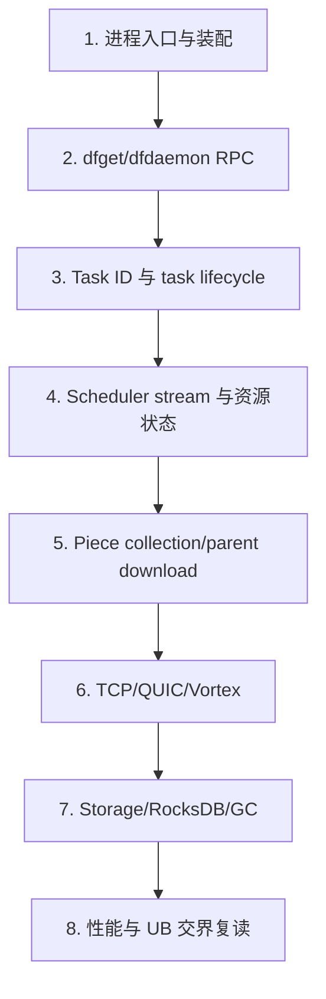

# Dragonfly 源码推荐阅读路线

> 面向后续人工深入阅读、性能分析和 UB 接入前研究。顺序按“可运行入口→控制 API→任务状态→piece 数据→存储→调度”建立上下文，避免只看包名猜职责。

## 路线总图



## 阶段 1：先看入口与装配

阅读：

1. `client/dragonfly-client/src/bin/dfget/main.rs`：`main()`、`run()`、`download()`。
2. `client/dragonfly-client/src/bin/dfdaemon/main.rs`：`main()`。
3. `cmd/scheduler/main.go`、`cmd/scheduler/cmd/root.go`：`main()`、`runScheduler()`。
4. `scheduler/scheduler.go`：`New()`、`Serve()`。
5. `cmd/manager/cmd/root.go`、`manager/manager.go`：`runManager()`、`New()`、`Serve()`。

为什么：先确认每个进程实际启动了哪些 server/client/background task，建立“manager 管理、scheduler 编排、dfdaemon 搬数据”的整体边界。

当前检查点：[源码确认] 能回答 seed-peer 是否独立 binary、dfdaemon 同时监听哪些协议、manager 是否在 piece path 上。

## 阶段 2：RPC 与请求模型

阅读：

1. `client/dragonfly-client/src/grpc/dfdaemon_download.rs`：`DfdaemonDownloadServerHandler::download_task()`、client `download_task()`。
2. `client/dragonfly-client/src/grpc/scheduler.rs`：`announce_peer()`、`announce_host()`、`client()`、`channel()`。
3. `scheduler/service/service_v2.go`：`AnnouncePeer()`。
4. `scheduler/rpcserver/scheduler_server_v2.go`：adapter 到 service V2。

为什么：先理解 gRPC stream 中发送的是 request/metadata/state 还是 bytes，后面才不会混淆控制面和数据面。

调用链：`dfget download()` → `DfdaemonDownloadClient::download_task()` → server `download_task()` → `Task::download()` → `SchedulerClient::announce_peer()` → `V2.AnnouncePeer()`。

## 阶段 3：任务、ID 与本地缓存优先

阅读：

1. `client/dragonfly-client-util/src/id_generator/mod.rs`：`task_id()`、`host_id()`、`peer_id()`。
2. `client/dragonfly-client/src/resource/task.rs`：按 `download_started()` → `download()` → `download_partial_with_scheduler()` 顺序。
3. `client/dragonfly-client/src/resource/piece.rs`：先看 `calculate_piece_length()`、`calculate_interested()`。
4. `client/dragonfly-client-storage/src/metadata.rs`：`Task`、`Piece`、`prepare_download_task()`。

为什么：task identity、piece geometry 与 cache reuse 决定之后 scheduler 看见的 task 是否相同，也是读所有状态机前的必要上下文。

## 阶段 4：Scheduler 资源与算法

阅读：

1. `scheduler/service/service_v2.go`：`handleRegisterPeerRequest()`、`handleResource()`、`handleReschedulePeerRequest()`、piece/peer handlers。
2. `scheduler/resource/standard/task.go`：`Task`、DAG 操作、FSM。
3. `scheduler/resource/standard/peer.go`、`host.go`：状态与负载字段。
4. `scheduler/scheduling/scheduling.go`：`ScheduleCandidateParents()` → `FindCandidateParents()` → `filterCandidateParents()`。
5. `scheduler/scheduling/evaluator/evaluator_default.go`：`EvaluateParents()` 及各 score。
6. `scheduler/resource/standard/seed_peer.go`：选择与触发 seed。

为什么：按“RPC handler→资源→过滤→评分”读，可以区分状态变更、副作用、候选过滤与排序算法。

## 阶段 5：Piece 到 Parent 的 client-side 决策

阅读：

1. `client/dragonfly-client/src/resource/piece_collector.rs`：结构与 `run()`。
2. `client/dragonfly-client/src/resource/parent_selector.rs`：piece parent selection。
3. `client/dragonfly-client/src/resource/task.rs`：`download_partial_with_scheduler_from_parent()` 内部并发函数。
4. `client/dragonfly-client/src/resource/piece.rs`：`download_from_parent()`、`download_from_source()`。

为什么：[源码确认] scheduler 只返回 candidate parents；piece 最终从哪个 parent 下载还在 client 侧决定。跳过此层会错误地把 scheduler 候选当作唯一 parent。

## 阶段 6：Peer 网络数据面

阅读：

1. `client/dragonfly-client/src/resource/piece_downloader.rs`：trait、factory、TCP/QUIC pool。
2. `client/dragonfly-client-storage/src/client/tcp.rs` 与 `server/tcp.rs`。
3. `client/dragonfly-client-storage/src/client/quic.rs` 与 `server/quic.rs`。
4. `client/dragonfly-client-storage/src/server/mod.rs`、`client/mod.rs`：buffer/timeouts/types。
5. `vortex-protocol` 依赖的使用点；依赖源码若需继续研究应按 `Cargo.lock` 版本获取。[待确认]

为什么：从上层 downloader interface 进入 framing，再对照 server，能完整闭合 request→metadata→body stream。

## 阶段 7：Storage、校验与 GC

阅读：

1. `client/dragonfly-client-storage/src/lib.rs`：`Storage::new()`、task lifecycle、piece finish/upload。
2. `content.rs`、`content_linux.rs`：目录、preallocate、range read/write。
3. `io.rs`：`RangeReader`、`write_range_from_stream()`。
4. `metadata.rs`：对象模型与状态更新。
5. `storage_engine/rocksdb.rs`：options、CF、write sync 语义。
6. `cache/mod.rs`：内存 task LRU。
7. `client/dragonfly-client/src/gc/mod.rs`：TTL/水位清理。

为什么：该顺序沿 bytes 落盘后再读 metadata 与清理策略，可把 correctness path 和生命周期连起来。

## 阶段 8：其他 binary 与扩展路径

阅读：

- `dfcache/{main,import,export,stat}.rs`：persistent cache 工作流。
- `dfstore/{main,import,export}.rs`：persistent task/object storage。
- `dfctl/{main,task,persistent_task,persistent_cache_task}.rs`：管理 API。
- `dragonfly-client-backend/src/lib.rs` 及各 backend：回源差异。
- `dragonfly-client-request/src/lib.rs`、`selector.rs`：seed request/preheat 路径。
- `dragonfly-client/src/proxy/`：HTTP proxy 不经本机 dfget 的路径。

为什么：standard `dfget` 主链读通后，再看 persistent/cache/proxy，能识别复用与差异，不会混合三类 task 语义。

## 性能阅读时的记录模板

每遇到关键函数记录：

```text
源码路径：
函数：
输入/输出：
是否跨 async task：
是否分配/clone：
是否网络 I/O：
是否磁盘 I/O：
是否 hash/序列化：
并发/限速/timeout：
证据等级：
待实验指标：
```

## 最短闭环调用链

`dfget::download()`  
↓ `DfdaemonDownloadServerHandler::download_task()`  
↓ `Task::download_started()`  
↓ `Task::download()`  
↓ `Task::download_partial_with_scheduler()`  
↓ scheduler `V2.AnnouncePeer()` / `handleRegisterPeerRequest()`  
↓ `ScheduleCandidateParents()`  
↓ client `download_partial_with_scheduler_from_parent()`  
↓ `Piece::download_from_parent()`  
↓ TCP/QUIC storage client/server  
↓ `Storage::download_piece_from_parent_finished()`  
↓ `Content::write_piece_from_stream()`

## 当前结论

- [源码确认] 推荐路线以一次 standard 下载闭环为主轴，再扩展 persistent/cache/proxy。
- [源码确认] 必须同时读 Rust client 和 Go scheduler，单边无法解释完整调用链。
- [架构推断] UB 前期阅读应在阶段 6、7 后回到阶段 4，重新检查 transport/IO 新信息是否改变 scheduler topology/metrics 语义。
- [待确认] `dragonfly-api` 与 `vortex-protocol` 是外部依赖；更深 wire-format 研究需固定当前 lockfile 版本读取依赖源码。
