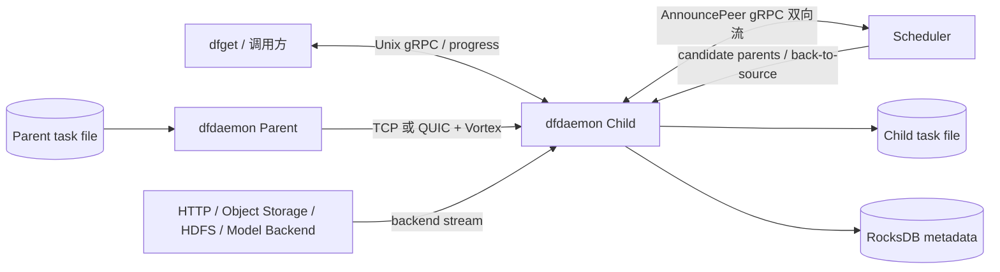
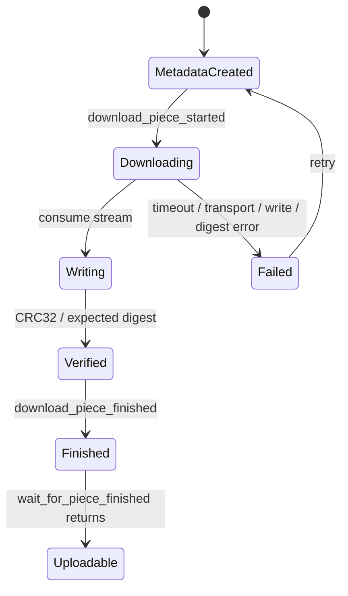
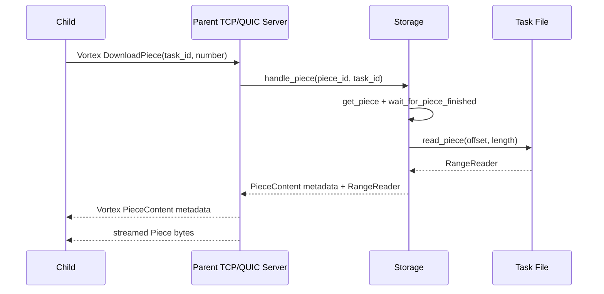

# Dragonfly 数据面源码分析与 UB 接入点分析

> 本文是 `03-download-flow.md`、`04-scheduler-flow.md`、`05-data-path.md`、`06-storage.md` 和 `07-ub-analysis-points.md` 的综合入口。
>
> 研究原则：先确认调用链与数据路径，再做性能测量，最后比较接入方案。本文不预设应将 TCP、QUIC、gRPC 或本地文件直接替换为灵衢总线 UnifiedBus（UB）。
>
> 证据标记：`[源码确认]`、`[架构推断]`、`[待实验验证]`、`[待 UB 源码/环境确认]`。

## 1. 研究范围与当前结论

本文覆盖 standard task 的主要数据路径，并补充 persistent task、persistent cache task 的存储差异：

- Scheduler 如何生成 candidate parents；
- Child Peer 如何从 Parent Peer 或源站下载 Piece；
- TCP、QUIC 与 Vortex 协议的边界；
- Piece 数据如何流式落盘、校验并更新 metadata；
- Parent Peer 如何从本地 task 文件读取 Piece 并上传；
- 普通、persistent、persistent-cache 三类内容的本地存储关系；
- UBS Engine、UBS Communication、UBS Memory、UBS IO 的潜在研究边界；
- TCP/QUIC/UB 性能实验应如何分层。

当前可确认的主结论：

1. `[源码确认]` Scheduler gRPC 双向流属于控制面，normal Piece 数据不经过 Scheduler。
2. `[源码确认]` Peer 间数据面当前支持 TCP 和 QUIC，二者上层均使用 Vortex 自定义二进制 framing。
3. `[源码确认]` Parent 返回 metadata 后继续流式发送 Piece bytes；Child 以 `PieceContentStream` 消费并写入本地 task 文件，没有在标准主链中先聚合完整 Piece。
4. `[源码确认]` standard、persistent、persistent-cache 三类内容最终都可落到本地文件，并复用 `FDCache + RangeReader + BufferPool`；主要区别是目录、metadata、生命周期和 GC 语义。
5. `[源码确认]` 当前 TCP 和 QUIC 的单 Piece 请求都会在 `connect_and_write_request()` 中建立新的传输连接；client pool 缓存的是 client wrapper，不等同于跨 Piece 复用一个已建立连接。
6. `[架构推断]` 因 QUIC 当前没有跨 Piece 复用同一 connection 的多 stream，不能仅依据 QUIC 理论特性预判其一定优于 TCP，必须实测连接、CPU、加密和用户态协议栈成本。

## 2. 数据面总体架构



### 2.1 控制面

`[源码确认]` Scheduler 负责：

- Host、Task、Peer 注册与状态机；
- 每个 Task 的 Peer DAG；
- candidate parent 过滤、评分、加边；
- Piece 完成/失败、重调度和回源状态；
- Seed Peer 触发。

关键入口：

```text
V2.AnnouncePeer()
  -> handleRegisterPeerRequest()
  -> handleResource()
  -> ScheduleCandidateParents()
  -> FindCandidateParents()
  -> filterCandidateParents()
  -> EvaluateParents()
  -> NormalTaskResponse(candidate_parents)
```

### 2.2 数据面

`[源码确认]` Child 获得 candidate parents 后直接连接 Parent：

```text
download_partial_with_scheduler_from_parent()
  -> PieceCollector
  -> ParentSelector::select()
  -> Piece::download_from_parent()
  -> TCPDownloader / QUICDownloader
  -> TCPClient / QUICClient
  -> Vortex DownloadPiece
  -> PieceContentStream
  -> Storage::download_piece_from_parent_finished()
  -> Content::write_piece_from_stream()
  -> io::write_range_from_stream()
```

回源路径在网络输入层不同，但写入路径汇合：

```text
backend_factory.build(url)
  -> backend.get(GetRequest { range })
  -> response stream
  -> write_piece_from_stream()
  -> write_range_from_stream()
```

## 3. Scheduler Parent 选择

### 3.1 候选生成与过滤

`filterCandidateParents()` 的主要步骤：

1. 从 Task 的 Peer 集合随机采样不超过 `filterParentLimit` 的 Peer；
2. 过滤 blocklist；
3. 过滤 `DisableShared` Host；
4. 过滤与 Child 相同 Host 的 Peer；
5. 检查 candidate 是否存在于 Task DAG；
6. 检查 candidate 状态是否具备上传条件；
7. 过滤 evaluator 认定的 bad parent；
8. 通过 `CanAddPeerEdges()` 防止形成环。

`[源码确认]` Scheduler 不是全量扫描后选唯一 Parent，而是先采样、过滤、评分并返回 candidate 集合；Child 侧仍通过 `PieceCollector + ParentSelector` 做 Piece 粒度选择。

### 3.2 默认评分

```text
TotalScore = 0.6 * LoadQuality
           + 0.2 * IDCAffinity
           + 0.1 * LocationAffinity
           + 0.1 * HostType

LoadQuality = 0.5 * PeakBandwidthUsage
            + 0.3 * BandwidthDuration
            + 0.2 * Concurrency
```

其中：

- PeakBandwidthUsage：`1 - TxBandwidth / MaxTxBandwidth`；
- BandwidthDuration：按 60 秒窗口衡量累计上传量对带宽的持续占用；
- Concurrency：以经验 Piece 长度 16 MiB 估算当前并发上传是否过载；
- IDC/Location：传统网络位置亲和；
- HostType：区分 normal 与 seed 等 Host 类型。

`[架构推断]` UB 拓扑、链路负载或资源池信息未来可能作为 evaluator 新特征，但必须先确认 UBS Engine 能提供什么数据、更新频率和指标口径，不能直接用“UB 节点”标签替换现有评分。

## 4. Piece 生命周期与并发去重



`[源码确认]` `download_piece_started()` 不只是记录日志，它与 `PieceNotifier` 一起实现同进程内的 Piece 下载去重：

- 一个请求成为 owner 并执行下载；
- 其他并发请求通过 `wait_for_piece_finished()` 等待；
- owner 完成写入、digest 校验和 metadata 更新后调用 `remove_and_notify(piece_id)`；
- waiter 被唤醒后重新读取 metadata；
- 失败 guard 会清理未完成 metadata，避免 Piece 永远停留在 downloading 状态。

完成条件不是“网络接收结束”单一事件，而是：

```text
指定长度写入成功
+ CRC32 校验完成
+ Piece metadata 更新成功
+ waiter 被通知
```

这组语义在任何 UB 原型中都必须保留。

## 5. Peer 间协议与数据流

### 5.1 Downloader 抽象

```rust
pub trait Downloader: Send + Sync {
    async fn download_piece(...) -> Result<(PieceContentStream, u64, String)>;
}
```

返回值分别是：

- `PieceContentStream`：Piece bytes 的异步 chunk stream；
- `u64`：Piece 在 Task 文件中的 offset；
- `String`：预期 digest。

`[源码确认]` `Downloader` 是通信层最清晰的扩展边界，但完整接入还必须有对应 server 端、endpoint 上报和错误语义，不能只新增一个 client。

### 5.2 Vortex framing

TCP 与 QUIC 使用相同应用层协议：

```text
Request:
  Vortex Header(tag=DownloadPiece)
  DownloadPiece(task_id, piece_number)

Response:
  Vortex Header(tag=PieceContent or Error)
  metadata length
  Piece metadata(offset, length, digest, ...)
  raw Piece bytes stream
```

Client 先读取 response header 和 variable-length metadata，再把剩余 reader 包装为：

```rust
pub type PieceContentStream = BoxStream<'static, std::io::Result<Bytes>>;
```

TCP 使用：

```text
OwnedReadHalf
  -> ReaderStream::with_capacity(...)
  -> BoxStream<Result<Bytes>>
```

QUIC 使用相同的 Vortex request/response 解析，再把 `RecvStream` 转为统一的 `PieceContentStream`。

`[源码确认]` “without copying the chunks”指 Rust 业务层不再把每个 chunk 复制到另一份完整 Piece buffer，不代表 kernel-to-user、QUIC 加密或文件写入实现了端到端硬件零拷贝。

## 6. TCP 与 QUIC 源码差异

### 6.1 TCP

`connect_and_write_request()`：

- `tokio::net::TcpStream::connect()`；
- 设置 `TCP_NODELAY`、nonblocking、send/recv buffer、keepalive；
- Linux 可选 TCP Fast Open；
- `into_split()` 后写入 Vortex request；
- response reader 经 `ReaderStream` 转为 `PieceContentStream`。

### 6.2 QUIC

`connect_and_write_request()`：

- 通过 quinn/rustls 创建 client config；
- 配置 keepalive、idle timeout、ACK frequency 和 connection/stream window；
- 创建 `Endpoint`；
- 建立 QUIC connection；
- `open_bi()` 创建一条双向 stream；
- 写入同样的 Vortex request；
- `RecvStream` 转为统一 `PieceContentStream`。

### 6.3 当前实现中的关键观察

`[源码确认]` 当前每个 Piece 请求都会进入各自的 `connect_and_write_request()`：

- TCP：新建 `TcpStream`；
- QUIC：新建 `Endpoint`、新建 connection，再打开一条 bi stream。

因此：

- `client_pool` 主要复用 `TCPClient/QUICClient` wrapper；
- 当前主链没有展示一个长期 QUIC connection 上承载多个 Piece stream；
- QUIC 的理论多路复用优势不能直接等同于当前实现收益；
- TCP/QUIC 对比必须把握手、Endpoint/connection 创建、TLS/加密、用户态协议处理和 CPU 一并计入。

另外，`download_from_parent()` 的 fallback 日志仍出现 “grpc downloader”，但实际调用 TCP downloader。`[源码确认]` 这是需要单独核对的命名/历史遗留点，不能据该日志认定 normal Piece bytes 走 gRPC。

## 7. Parent 端上传链路



关键路径：

```text
server.handle()
  -> read_header()
  -> read_download_piece()
  -> handle_piece()
  -> Storage::upload_piece()
  -> Content::read_piece()
  -> FDCache::open()
  -> RangeReader
  -> server.write_stream()
```

`RangeReader`：

- 共享 `Arc<File>`；
- 使用 positional `read_at()`，不共享文件游标；
- 通过 `spawn_blocking()` 执行阻塞文件读取；
- 以 `Idle/Reading` 状态机管理正在进行的读取；
- 使用 `BufferPool` 复用 `BytesMut`；
- 通过 `AsyncBufRead + AsyncRead` 暴露给网络发送层。

## 8. Child 端写入与校验

```text
PieceContentStream
  -> write_piece_from_stream()
  -> FDCache::open_write()
  -> write_range_from_stream()
  -> batch Vec<Bytes>
  -> write_all_vectored_at(offset)
  -> CRC32
  -> metadata.download_piece_finished()
  -> PieceNotifier::remove_and_notify()
```

`[源码确认]` `write_range_from_stream()`：

- 按 `write_buffer_size` 聚合多个 `Bytes` chunk；
- 在 Tokio 任务中继续读取网络 stream；
- 在 blocking pool 中执行 positional vectored write；
- 写入期间同步累计 CRC32；
- 限制实际消费不超过 `expected_length`；
- 最终校验实际长度与期望长度。

`[源码确认]` 接收侧 content file 与 RocksDB Piece metadata 分层，二者不是一个事务性原子提交。崩溃恢复、partial write 和 metadata/content 不一致需要故障实验验证。

### 8.1 `need_piece_content` 特殊路径

`[源码确认]` 当调用方要求 `need_piece_content=true` 时，Piece 已经先写入本地文件，dfdaemon 随后重新通过 `RangeReader` 读取完整 Piece 到 `Vec<u8>`，再放入 `DownloadPieceFinishedResponse` 发送给 dfget。

该路径相较“仅缓存并提供 P2P”的主路径多出：

- 本地 task 文件再次读取；
- Piece 大小的连续 `Vec<u8>` 分配；
- dfdaemon 到 dfget 的消息传输与最终写入。

它应在性能实验中单独标记，避免把 dfget 输出成本误认为 TCP/QUIC Peer 网络成本。

## 9. 普通、Persistent 与 Persistent Cache

三类读取函数的核心逻辑一致：

```text
get_*_task_path(task_id)
  -> FDCache::open(path)
  -> calculate_piece_range(offset, length, range)
  -> RangeReader
```

本地目录：

```text
<storage.dir>/content/
  tasks/<prefix>/<task_id>
  persistent-tasks/<prefix>/<task_id>
  persistent-cache-tasks/<prefix>/<task_id>
```

共同点：

- `[源码确认]` 都可由 `std::fs::File` 打开；
- `[源码确认]` 都使用 offset/length 读取同一 Task 文件中的 Piece range；
- `[源码确认]` 都可通过 TCP/QUIC + Vortex 返回相同的 Piece byte stream 抽象。

差异：

- standard task：普通下载缓存和 standard Scheduler 资源语义；
- persistent task：独立 metadata、目录、调度和生命周期；
- persistent cache task：独立 persistent-cache metadata、目录和 GC/TTL 语义；
- 内存 `cache::Cache` 是另一条 task-level LRU 路径，不能把三类磁盘内容自动等同于内存缓存。

因此可以说“三者当前主 content 实现都在本地文件系统”，但不能说“三者只有目录名不同”；其状态模型、持久性和 GC 规则也不同。

## 10. 当前逻辑数据移动路径

### 10.1 Parent 上传

```text
Parent task file / page cache
  -> RangeReader pooled userspace buffer
  -> TCP socket 或 QUIC userspace stack
  -> NIC
```

### 10.2 Child 接收

```text
NIC
  -> TCP/UDP socket
  -> Bytes chunks
  -> CRC32
  -> vectored positional write
  -> Child task file / page cache
```

`[架构推断]` 可能的热点：

- 每 Piece 新连接/握手；
- Parent 文件 range read；
- TCP kernel stack 或 QUIC 用户态协议栈/TLS；
- socket 到 userspace chunk；
- Child CRC32 与文件 offset write；
- 多 Piece 对同一 Task 文件并发随机 offset I/O；
- `need_piece_content` 的二次读取和完整 Vec 分配。

`[待实验验证]` 精确 copy 次数、CPU 占比和瓶颈位置不能仅由 Rust API 得出，必须用 profiler、syscall 和 I/O 指标验证。

## 11. UB 接入研究边界

### 11.1 UBS Communication

最清晰的抽象边界：

```text
Downloader trait
  -> TCPClient / QUICClient
  -> PieceContentStream
```

最小兼容原型应同时包含：

- `UBDownloader`：把 UB 接收能力适配为 `PieceContentStream`；
- UB server handler：把 `RangeReader` 或等价数据源发送给 Child；
- endpoint 上报：Scheduler candidate parent descriptor 能表达 UB 地址与能力；
- Vortex 复用或等价 framing；
- timeout、流控、错误、digest 和 fallback 语义。

可能收益：降低传统 socket 协议栈开销、降低延迟、提高吞吐或减少 copy。

必须验证：UB 的连接、可靠传输、stream/message、completion、buffer registration、认证与错误模型是否能等价承载当前语义。

### 11.2 UBS Engine

候选位置：

```text
Host announce fields
  -> Scheduler Host model
  -> filterCandidateParents()
  -> evaluatorDefault
  -> candidate parent response
```

可研究特征：

- UB fabric 拓扑距离；
- endpoint 可达性；
- 链路带宽和拥塞；
- 资源池容量；
- 与 Child 的 NUMA/超节点亲和。

但应先比较新增特征与现有 IDC、Location、TxBandwidth 的信息增益，再决定是在 Scheduler evaluator 还是 Child ParentSelector 使用。

### 11.3 UBS Memory

不应简单把 `BufferPool` 等同于 Piece Cache：

- `BufferPool` 是短生命周期的本地 staging buffer；
- Piece content 当前主要在 task file；
- 内存 `cache::Cache` 是独立 task-level LRU。

更有价值的研究问题：

- Piece range 是否可驻留在注册/池化内存中；
- Parent 能否直接从共享/远端内存提供 Piece；
- Child 接收数据是否可避免先落本地文件再二次读取；
- `Bytes` ownership、UB completion 与 buffer 生命周期如何衔接；
- GC、失败、重试和 waiter 看到的数据何时有效。

### 11.4 UBS IO

候选边界：

```text
Content::read_piece()/write_piece_from_stream()
  -> FDCache / File
  -> positional range I/O
```

必须满足的现有语义：

- 按 task_id 寻址；
- 按 offset/length 乱序并发读写；
- expected length 与 digest 校验；
- partial write 错误处理；
- metadata/content 生命周期；
- TTL、磁盘水位和删除；
- persistent/persistent-cache 隔离。

Persistent Cache 是较自然的 UBS IO/Memory 研究对象，但这只是架构分析，不代表它一定应作为首个原型。

### 11.5 UBS Virt

UBS Virt 对当前代码的直接接入点较少，主要影响：

- 容器化 dfdaemon 是否可见 UB 设备和用户态库；
- endpoint、内存注册和权限是否能穿透容器/虚拟机；
- 热迁移、恢复和资源回收时 Piece 状态是否仍有效。

## 12. 候选原型对比

| 原型 | 主要改动边界 | 可验证收益 | 关键风险 | 当前状态 |
|---|---|---|---|---|
| A. UB Transport Adapter | Downloader + client/server + endpoint announce | 网络吞吐、延迟、CPU、copy | UB stream/error 与 Vortex/Bytes 适配 | 待 UB API 确认 |
| B. UB-aware Scheduling | Host fields + evaluator/ParentSelector | parent 命中率、完成时间、链路均衡 | 指标时效和评分失真 | 待拓扑 API 确认 |
| C. UB Piece Memory Cache | Content/cache + buffer 生命周期 | 减少磁盘 read/write、降低首字节延迟 | 一致性、容量、GC、故障恢复 | 待 memory API 确认 |
| D. UBS IO Content Backend | Content range I/O backend | 减少本地盘占用、共享持久缓存 | range/partial write/GC 语义复杂 | 待 IO API 确认 |

当前不排序。排序依据应来自后续 TCP/QUIC 基线与 UB 环境测量。

## 13. TCP 与 QUIC 性能实验设计

### 13.1 控制变量

- 同一 Parent、Child、NIC、磁盘和 CPU 绑定；
- 同一 Task、Piece 内容和 Piece 数；
- 固定 Scheduler candidate 与实际 selected parent；
- 分别配置单一 `tcp` 和 `quic`；
- 区分 warm page cache 与 cold storage；
- 区分 `need_piece_content=false/true`；
- 避免回源混入 Peer 测试。

### 13.2 建议矩阵

- Piece 长度：4 MiB、16 MiB、64 MiB；
- Child 并发 Piece：1、4、16、32；
- Child 数量：1、4、16；
- 场景：内存热、磁盘冷、Parent 上行限速、网络丢包/抖动；
- 协议：TCP、QUIC，后续增加 UB 原型。

### 13.3 指标

端到端：

- Piece completion latency（P50/P95/P99）；
- 首字节时间；
- 有效吞吐；
- Task 完成时间；
- 重调度与回源次数。

Parent/Child：

- user/system CPU；
- context switch、syscall；
- RSS、alloc 和 buffer 峰值；
- TCP retransmit / QUIC loss 与拥塞窗口；
- 磁盘 read/write bandwidth、IOPS、await；
- CRC32 与 write 热点；
- 连接/握手次数。

Scheduler：

- schedule latency；
- candidate/selected parent；
- evaluator 输入与实际 NIC 指标偏差。

### 13.4 结果解释原则

- QUIC 高 CPU但吞吐相近：可能是用户态协议栈/TLS成本；
- 小 Piece 差异显著：可能是每 Piece 建连和 framing 成本；
- warm cache 快、cold storage 慢：瓶颈更偏 Parent 文件读取；
- `need_piece_content=true` 显著变慢：应归因于本地二次读取和 dfdaemon→dfget 路径；
- 多 Child 下 Parent 磁盘/CPU先饱和：单纯换 transport 的 UB 收益可能受限；
- TCP/QUIC 都被 disk write 或 CRC32 限制：应优先研究 UBS Memory/IO，而不是直接替换协议。

## 14. 后续步骤

1. 固化当前源码 commit、配置和测试拓扑；
2. 完成 TCP/QUIC 基线，定位网络、CPU、磁盘和二次读取占比；
3. 获取 UB Service Core 的正式接口与可运行环境；
4. 建立语义映射：endpoint、连接、消息/stream、内存、completion、错误、权限；
5. 根据基线选择一个最小原型，不同时改 Scheduler、Transport 和 Storage；
6. 对最小原型做 correctness、故障和性能验证；
7. 通过实验结果决定是否进入正式代码改造。

## 15. 源码导航

Scheduler：

- `scheduler/service/service_v2.go`
- `scheduler/scheduling/scheduling.go`
- `scheduler/scheduling/evaluator/evaluator_default.go`
- `scheduler/resource/standard/{host,task,peer}.go`

Client 调度与下载：

- `client/dragonfly-client/src/resource/task.rs`
- `client/dragonfly-client/src/resource/piece.rs`
- `client/dragonfly-client/src/resource/piece_downloader.rs`
- `client/dragonfly-client/src/resource/piece_collector.rs`
- `client/dragonfly-client/src/resource/parent_selector.rs`

Peer transport：

- `client/dragonfly-client-storage/src/client/tcp.rs`
- `client/dragonfly-client-storage/src/client/quic.rs`
- `client/dragonfly-client-storage/src/server/tcp.rs`
- `client/dragonfly-client-storage/src/server/quic.rs`
- Vortex protocol types used by the above client/server implementations

Storage：

- `client/dragonfly-client-storage/src/lib.rs`
- `client/dragonfly-client-storage/src/content_linux.rs`
- `client/dragonfly-client-storage/src/io.rs`
- `client/dragonfly-client-storage/src/metadata.rs`
- `client/dragonfly-client-storage/src/piece_notifier.rs`
- `client/dragonfly-client-storage/src/cache/mod.rs`
- `client/dragonfly-client-storage/src/storage_engine/rocksdb.rs`

相关专题文档：

- `03-download-flow.md`
- `04-scheduler-flow.md`
- `05-data-path.md`
- `06-storage.md`
- `07-ub-analysis-points.md`
