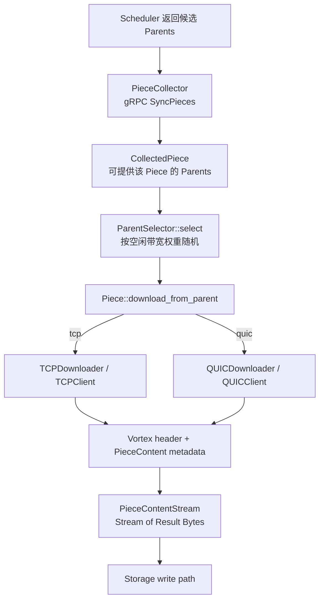
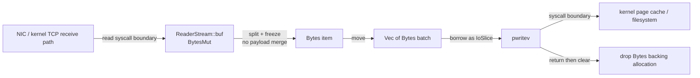
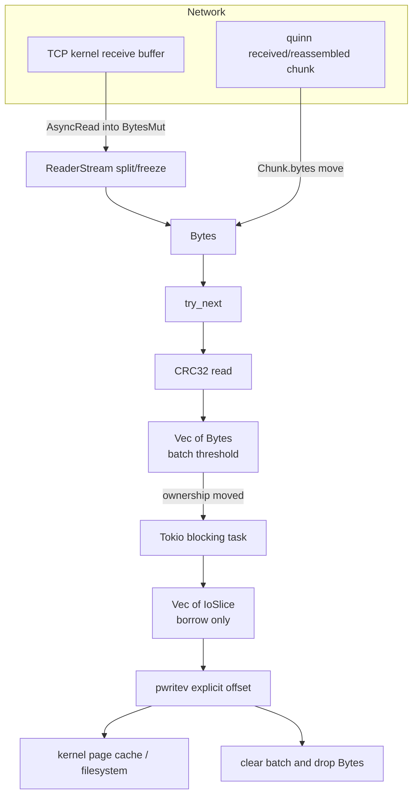
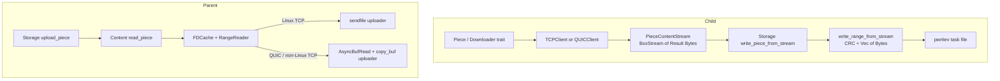

# Dragonfly Piece Stream 与 Storage 路径源码分析

> 研究范围：Child 从 Parent 下载普通 Piece 的网络接收、校验与落盘；Parent 上传普通 Piece 的本地读取与网络发送；基于现有接口确认 UB 接入边界。本文不形成 UB 最终设计。
>
> 源码基线（2026-07-31 工作区）：Dragonfly 根仓库 `2acbb8b6414939919cfc8474bf0ba4c38ae2c8ba`；实际检出的 `client` 子模块 `c2f7edbfd4df573192beca60ca18790a730740e4`。根仓库当前将 `client` 记录为已有修改，因此本文以磁盘上的实际 `client` 提交为准，未修改源码。

## 0. 结论摘要

- [源码确认] `PieceContentStream` 的真实类型是 `futures::stream::BoxStream<'static, std::io::Result<bytes::Bytes>>`，即一个被装箱、`Send`、`'static` 的异步 chunk stream，不是 `AsyncRead`。源码：`client/dragonfly-client-storage/src/client/mod.rs`；类型：`PieceContentStream`。
- [源码确认] TCP 用 `tokio_util::io::ReaderStream::with_capacity(OwnedReadHalf, storage.write_buffer_size)` 将 `AsyncRead` 转为 `Stream<Result<Bytes>>`；QUIC 用 `RecvStream::read_chunk(usize::MAX, true)` 直接取得 quinn 的 `Chunk.bytes`。源码：`client/dragonfly-client-storage/src/client/tcp.rs`、`quic.rs`；函数：`TCPClient::content_stream()`、`QUICClient::content_stream()`。
- [源码确认] Child 落盘不是逐 chunk `write()`/`write_all()`，而是 `try_next()` 拉取 `Bytes`，按 `storage.write_buffer_size` 聚成 `Vec<Bytes>`，在 Tokio blocking pool 中调用 `rustix::io::pwritev()`。源码：`client/dragonfly-client-storage/src/io.rs`；函数：`write_range_from_stream()`、`write_all_vectored_at()`。
- [源码确认] Child 主路径未将网络 `Bytes` 合并进另一个业务 `BytesMut`；`Bytes` 被移动进批次，`IoSlice` 仅借用其 payload。应用层可明确排除一次“为落盘而合并 buffer”的 memcpy，但内核 socket→用户 buffer 和用户 buffer→页缓存仍是数据复制边界。
- [源码确认] Parent 的 Piece 数据来自同一个 task content 文件中的 `(piece.offset, piece.length)` 范围，经 `FDCache` 获得共享只读 FD。源码：`client/dragonfly-client-storage/src/lib.rs`、`content_linux.rs`、`dragonfly-client-util/src/fs/fd.rs`；函数：`Storage::upload_piece()`、`Content::read_piece()`、`FDCache::open()`。
- [源码确认] Linux TCP Parent 当前使用 `sendfile`：`RangeReader::into_parts()` 后直接把 FD、显式 offset、remaining 交给 `rustix::fs::sendfile()`；QUIC 仍使用 `RangeReader::poll_fill_buf()` + `tokio::io::copy_buf()`。两条上传路径不能按同一 memcpy 模型概括。源码：`client/dragonfly-client-storage/src/server/tcp.rs`、`server/quic.rs`、`io.rs`；函数：`write_stream()`、`sendfile_range()`、`RangeReader::poll_fill_buf()`。
- [源码确认] 所读路径均未使用用户态 mmap；普通 content 文件打开未设置 `O_DIRECT`；未发现 io_uring API。[架构推断] Linux 的普通 `pread/pwritev/sendfile` 路径通常由内核页缓存参与。
- [待实验验证] “复制次数”受内核、NIC offload、quinn 内部实现与命中页缓存情况影响。本文只确认源码中可见的数据所有权转换和 syscall 边界，不把它写成固定次数。

## 1. Child 下载接收链路

### 1.1 完整调用链

```text
Task::download_partial_with_scheduler_from_parent()
  client/dragonfly-client/src/resource/task.rs
  ↓ PieceCollector::new() / run()
PieceCollector::collect_from_parents()
  client/dragonfly-client/src/resource/piece_collector.rs
  ↓ DfdaemonUploadClient::sync_pieces()（gRPC，收集 availability 与下载地址）
Task 内部 download_from_parent()
  client/dragonfly-client/src/resource/task.rs
  ↓ ParentSelector::select()
Piece::download_from_parent()
  client/dragonfly-client/src/resource/piece.rs
  ↓ Downloader::download_piece()
TCPDownloader::download_piece() 或 QUICDownloader::download_piece()
  client/dragonfly-client/src/resource/piece_downloader.rs
  ↓ TCPClient/QUICClient::download_piece()
TCPClient/QUICClient::handle_download_piece()
  client/dragonfly-client-storage/src/client/{tcp,quic}.rs
  ↓ Vortex::DownloadPiece + Vortex PieceContent 元数据
TCPClient/QUICClient::content_stream()
  ↓
PieceContentStream = BoxStream<'static, io::Result<Bytes>>
  ↓
Storage::download_piece_from_parent_finished()
  client/dragonfly-client-storage/src/lib.rs
```



#### PieceCollector 与 ParentSelector 在链路中的真实职责

- [源码确认] `Task::download_partial_with_scheduler_from_parent()` 先注册 Parent，再创建 `PieceCollector`；collector 对每个 Parent 调用 gRPC `sync_pieces()`，将响应中的 `ip/tcp_port/quic_port` 写回 `CollectedParent`，把同一 Piece 的可用 Parent 列表送到下载循环。源码：`client/dragonfly-client/src/resource/task.rs`；函数：`download_partial_with_scheduler_from_parent()`；`client/dragonfly-client/src/resource/piece_collector.rs`；函数：`PieceCollector::run()`、`collect_from_parents()`。
- [源码确认] 每个 Piece 下载任务受 `download.concurrent_piece_count` semaphore 限制；内部 `download_from_parent()` 调用 `ParentSelector::select()`，再调用 `Piece::download_from_parent()`。源码：`client/dragonfly-client/src/resource/task.rs`；函数：`download_partial_with_scheduler_from_parent()` 及其内部函数 `download_from_parent()`。
- [源码确认] `ParentSelector::select()` 使用 Parent Host 的权重进行 `WeightedIndex` 随机选择；构造权重失败时退化为均匀随机。权重由 gRPC `sync_host()` 返回的网络状态持续更新。源码：`client/dragonfly-client/src/resource/parent_selector.rs`；函数：`select()`、`register()`、`sync_host()`、`calculate_weight_by_network()`。
- [源码确认] Piece body 不是通过上述 gRPC stream 下载。gRPC 在这里负责 Piece availability/下载端点和 Host 状态；body 进入 TCP/QUIC Vortex 数据路径。源码：`piece_collector.rs` 的 `sync_pieces()` 与 `piece.rs` 的 `download_from_parent()`。

### 1.2 PieceContentStream 的真实类型

```rust
pub type PieceContentStream =
    BoxStream<'static, std::io::Result<Bytes>>;
```

- [源码确认] item 是 `io::Result<bytes::Bytes>`；失败可以作为 stream item 向 Storage 传播。源码：`client/dragonfly-client-storage/src/client/mod.rs`；类型：`PieceContentStream`。
- [源码确认] `BoxStream<'static, T>` 是装箱后的异步 `Stream`；Storage 对它要求 `Stream<Item = io::Result<Bytes>> + Unpin`，没有要求 `AsyncRead`。源码：`client/dragonfly-client-storage/src/lib.rs`；函数：`download_piece_from_parent_finished()`、`handle_downloaded_piece_from_parent_finished()`；`client/dragonfly-client-storage/src/io.rs`；函数：`write_range_from_stream()`。
- [架构推断] 这个别名是网络接收实现与 Storage 写入实现之间最窄的 payload 抽象边界：上层 Piece 逻辑不依赖 TCP 的 `OwnedReadHalf` 或 QUIC 的 `RecvStream`。

### 1.3 TCP 如何转换为 PieceContentStream

调用链：

```text
TCPClient::download_piece()
  ↓ timeout(piece_timeout)
TCPClient::handle_download_piece()
  ↓ Vortex::DownloadPiece(...).into()
TCPClient::connect_and_write_request()
  ↓ TcpStream::connect() / into_split() / write_all(request)
TCPClient::read_header()
  ↓
TCPClient::read_piece_content()  // 只消费 PieceContent 元数据
  ↓
TCPClient::content_stream(OwnedReadHalf)
  ↓ ReaderStream::with_capacity(...).boxed()
PieceContentStream
```

- [源码确认] Vortex response 的 Header 和 `PieceContent` 元数据先通过 `read_exact()` 被消费，随后仍指向 body 起点的 `OwnedReadHalf` 才交给 `content_stream()`。源码：`client/dragonfly-client-storage/src/client/tcp.rs`；函数：`handle_download_piece()`、`read_header()`、`read_piece_content()`、`content_stream()`。
- [源码确认] TCP socket send/receive buffer 均请求设置为 16 MiB；这是 socket buffer 配置，不是业务 chunk 大小。源码：`client/dragonfly-client-storage/src/client/mod.rs`；常量：`DEFAULT_SEND_BUFFER_SIZE`、`DEFAULT_RECV_BUFFER_SIZE`；`tcp.rs`；函数：`connect_and_write_request()`。
- [源码确认] TCP 业务 read buffer 的初始容量由 `config.storage.write_buffer_size` 控制，当前默认函数返回 512 KiB。源码：`client/dragonfly-client-storage/src/client/tcp.rs`；函数：`content_stream()`；`client/dragonfly-client-config/src/dfdaemon.rs`；函数：`default_storage_write_buffer_size()`、类型/字段：`Storage::write_buffer_size`。
- [源码确认] 当前依赖 `tokio-util 0.7.18` 的 `ReaderStream::poll_next()` 对内部 `BytesMut` 调用 `poll_read_buf()`，成功后执行 `buf.split().freeze()` 产生 `Bytes`。`split/freeze` 是 backing allocation 的所有权/视图转换，不是 payload 合并复制。依赖源码：Cargo registry `tokio-util-0.7.18/src/io/reader_stream.rs`；函数：`ReaderStream::with_capacity()`、`Stream::poll_next()`；版本来源：`client/Cargo.lock`。
- [源码确认] 实际 TCP chunk 是一次 `poll_read_buf()` 当时读到的数据，通常不超过该 working buffer 可写容量；它不等于 TCP packet、segment 或 Parent 的 write 边界。依赖源码：`tokio-util-0.7.18/src/io/reader_stream.rs`；函数：`poll_next()`。

### 1.4 QUIC 如何转换为 PieceContentStream

调用链：

```text
QUICClient::download_piece()
  ↓ timeout(piece_timeout)
QUICClient::handle_download_piece()
  ↓ Vortex::DownloadPiece(...).into()
QUICClient::connect_and_write_request()
  ↓ Endpoint::client / connect / Connection::open_bi / write_all(request)
QUICClient::read_header()
  ↓
QUICClient::read_piece_content()  // 只消费元数据
  ↓
QUICClient::content_stream(RecvStream)
  ↓ unfold + RecvStream::read_chunk(usize::MAX, true)
  ↓ chunk.bytes
PieceContentStream
```

- [源码确认] QUIC adapter 用 `futures::stream::unfold()` 保持 `RecvStream` 状态，每次 `read_chunk(usize::MAX, true)`，将 `quinn::Chunk.bytes` 移入 stream item。源码：`client/dragonfly-client-storage/src/client/quic.rs`；函数：`content_stream()`。
- [源码确认] `ordered=true` 保证返回 offset 紧接此前已读数据；调用点不使用 `Chunk.offset` 自行重排。源码：同上；函数：`content_stream()`。
- [源码确认] QUIC chunk 大小不受 `storage.write_buffer_size` 控制；调用传入的上限是 `usize::MAX`。实际边界由 quinn 接收/重组层决定。quinn 0.11.11 自身说明 `read_chunk()` 不复制 payload，且 chunk 边界不对应对端 write 边界。依赖源码：Cargo registry `quinn-0.11.11/src/recv_stream.rs`；函数：`RecvStream::read_chunk()`、`poll_read_chunk()`；版本来源：`client/Cargo.lock`。
- [源码确认] QUIC transport 的 connection/stream receive window 配置为 16 MiB；window 是流控窗口，也不是 `PieceContentStream` item 大小。源码：`client/dragonfly-client-storage/src/client/quic.rs`；函数：`connect_and_write_request()`。

### 1.5 Bytes 生命周期与网络到业务 buffer 的转换

#### TCP



- [源码确认] 网络 buffer 到业务 buffer 的显式转换发生在 `ReaderStream::poll_next()`：Tokio 对 `OwnedReadHalf` 执行 AsyncRead，将数据读入 `BytesMut`，再 `split().freeze()` 为 `Bytes`。Dragonfly 调用点是 `TCPClient::content_stream()`。源码：`client/dragonfly-client-storage/src/client/tcp.rs`；函数：`content_stream()`；依赖源码：`tokio-util-0.7.18/src/io/reader_stream.rs`；函数：`poll_next()`。
- [源码确认] 此后 Dragonfly 不把 chunk `extend_from_slice()` 到另一个 body buffer；`write_range_from_stream()` 只对 payload 做 CRC32 读取，并将 `Bytes` move 进 `Vec<Bytes>`。源码：`client/dragonfly-client-storage/src/io.rs`；函数：`write_range_from_stream()`。
- [源码确认] `write_all_vectored_at()` 创建的是 `Vec<IoSlice>` 描述符；`IoSlice` 借用各 `Bytes` 的 slice，不合并 payload。源码：`client/dragonfly-client-storage/src/io.rs`；函数：`write_all_vectored_at()`。
- [源码确认] `Bytes` 至少存活到 blocking task 中对应 `pwritev()` 完成；随后 `chunks.clear()` 释放每个 `Bytes`，空的 `Vec` 返回异步任务复用。源码：同上；函数：`write_range_from_stream()`。

#### QUIC


- [源码确认] Dragonfly 的 QUIC adapter 没有创建 body `BytesMut`；它将 `chunk.bytes` 直接返回。源码：`client/dragonfly-client-storage/src/client/quic.rs`；函数：`content_stream()`。
- [源码确认] Vortex header/metadata 路径另有小块 `BytesMut` 和 `extend_from_slice()`，但这些只构造协议元数据对象，不承载 Piece body。源码：`client/dragonfly-client-storage/src/client/tcp.rs`、`quic.rs`；函数：`read_header()`、`read_piece_content()`。
- [待实验验证] quinn 更下层从 UDP receive buffer 到其 reassembly storage 的精确分配、合并和复制次数不由 Dragonfly 源码决定；需要结合 quinn/内核版本、抓取 allocation profile 或 eBPF/perf 验证。

### 1.6 “是否存在额外 memcpy”的严格回答

| 区段 | 源码结论 | 证据 |
|---|---|---|
| TCP kernel socket → `ReaderStream::BytesMut` | [源码确认] 存在 read syscall 的内核/用户数据边界；Dragonfly 使用 Tokio AsyncRead。 | `client/.../client/tcp.rs` `content_stream()`；tokio-util `ReaderStream::poll_next()` |
| TCP `BytesMut` → `Bytes` | [源码确认] `split().freeze()`，未见 payload memcpy。 | tokio-util `reader_stream.rs` `poll_next()` |
| QUIC `Chunk.bytes` → stream item | [源码确认] move `Bytes`，未见 Dragonfly payload memcpy。 | `client/.../client/quic.rs` `content_stream()` |
| `Bytes` → CRC | [源码确认] hasher 读取 payload，不生成一份完整 payload。 | `client/.../io.rs` `write_range_from_stream()` |
| `Bytes` → write batch | [源码确认] move handle 到 `Vec<Bytes>`，不拼接 payload。 | 同上 |
| batch → `IoSlice` | [源码确认] 借用 slice，只创建 descriptor vector。 | `client/.../io.rs` `write_all_vectored_at()` |
| user buffers → file | [源码确认] `pwritev` syscall 边界；普通 buffered file FD。 | `io.rs` `write_all_vectored_at()`；`util/.../fd.rs` `open_write()` |
| 固定总 memcpy 次数 | [待实验验证] 不能仅凭该层源码给出；需纳入内核、文件系统、quinn 和 NIC。 | 需要实验 |

## 2. `write_range_from_stream` 源码分析

### 2.1 调用链与消费模型

```text
Piece::download_from_parent()
  ↓
Storage::download_piece_from_parent_finished()
  ↓ timeout select
Storage::handle_downloaded_piece_from_parent_finished()
  ↓
Content::write_piece_from_stream()
  ↓ FDCache::open_write(task_path)
write_range_from_stream()
  ↓ stream.try_next().await
  ↓ crc32fast::Hasher::update(&chunk)
  ↓ Vec<Bytes> batching
tokio::task::spawn_blocking()
  ↓
write_all_vectored_at()
  ↓
rustix::io::pwritev()
  ↓
Storage metadata::download_piece_finished()
```

- [源码确认] 消费模型是异步 Stream 的“next chunk”：具体调用为 `stream.try_next().await?`，不是把 stream 包装为 `AsyncRead` 后 `read()`。源码：`client/dragonfly-client-storage/src/io.rs`；函数：`write_range_from_stream()`。
- [源码确认] Storage 使用期望 Piece 长度作为终止边界；超长的最后一个 `Bytes` 通过 `chunk.truncate(remaining)` 截断视图，之后不再消费剩余 stream；不足则返回 length mismatch。源码：同上；函数：`write_range_from_stream()`。
- [源码确认] CRC32 在 Tokio runtime 上、chunk 仍热时同步更新；写磁盘的 blocking task 可以与下一批的接收/CRC 重叠，但代码只允许一个 `in_flight` write。源码：同上；函数：`write_range_from_stream()`。
- [源码确认] `Storage::handle_downloaded_piece_from_parent_finished()` 在写完后将实际 CRC32 与 Parent 元数据中的 digest 比较，通过后才调用 `metadata.download_piece_finished()`。源码：`client/dragonfly-client-storage/src/lib.rs`；函数：`handle_downloaded_piece_from_parent_finished()`。

### 2.2 写入模型

| 问题 | 当前普通 Piece stream 路径 |
|---|---|
| `write()` | [源码确认] 不使用。 |
| `write_all()` | [源码确认] Piece body 落盘不使用；Vortex request/metadata 网络发送使用 `write_all()`，不能混为落盘。 |
| `write_vectored()` | [源码确认] 不通过 Tokio/Std 的该方法。 |
| positional write / `pwrite` | [源码确认] 使用 vectored positional write：`rustix::io::pwritev(fd, &buffers, offset)`。 |
| partial write | [源码确认] 循环推进 `index/written/offset`，处理 `EINTR` 与 partial write；单次最多 1024 个 iovec。 |
| Tokio blocking pool | [源码确认] 使用 `tokio::task::spawn_blocking()` 包裹同步 `pwritev()`；`FDCache::open_write()` 也在 blocking pool 打开文件。 |
| io_uring | [源码确认] 本路径未使用；storage/util 目录检索不到 io_uring API。 |
| Direct I/O | [源码确认] `OpenOptions` 仅 `.truncate(false).write(true)`，未设置 `O_DIRECT`。 |
| mmap | [源码确认] 本路径未使用 mmap API。 |

证据位置：

- `client/dragonfly-client-storage/src/io.rs`；函数：`write_range_from_stream()`、`write_all_vectored_at()`。
- `client/dragonfly-client-util/src/fs/fd.rs`；函数：`FDCache::open_write()`。

### 2.3 两个“buffer size”语义

- [源码确认] TCP `content_stream()` 用 `storage.write_buffer_size` 作为 `ReaderStream` 初始 read buffer capacity。源码：`client/dragonfly-client-storage/src/client/tcp.rs`；函数：`content_stream()`。
- [源码确认] `write_range_from_stream()` 又用同一配置作为 batch flush threshold：累计 `batch_size >= buffer_size` 后提交一次 blocking write。源码：`client/dragonfly-client-storage/src/content_linux.rs`；函数：`write_piece_from_stream()`；`io.rs`；函数：`write_range_from_stream()`。
- [源码确认] batch 是 `Vec<Bytes>`，不限制单个 chunk；因此 QUIC 若返回一个大于 threshold 的 chunk，该批次可以超过 threshold，完整 chunk 会一起提交。源码：`io.rs`；函数：`write_range_from_stream()`。
- [源码确认] 当前两个默认函数均返回 512 KiB。配置字段注释仍写“Default is 4MiB/1MiB”，与默认函数不一致；本文以实际默认函数为当前源码事实。源码：`client/dragonfly-client-config/src/dfdaemon.rs`；函数：`default_storage_write_buffer_size()`、`default_storage_read_buffer_size()`；类型/字段：`Storage::write_buffer_size`、`Storage::read_buffer_size`。

### 2.4 Child 真实数据流



- [架构推断] 因为未设置 `O_DIRECT`，普通 Linux buffered write 通常先进入页缓存，再按内核回写策略落到块设备；“最终物理介质已持久化”不能由 `pwritev()` 返回直接推出，因为此链路未调用 `fsync/fdatasync`。
- [待实验验证] 需要用 `strace/perf/eBPF` 确认目标运行环境中的 `pwritev` 大小、次数、page fault、writeback 与吞吐瓶颈；源码只给出 batching 规则。

## 3. Parent 上传 Piece 链路

### 3.1 Storage 取数公共链路

```text
TCPServerHandler::handle() / QUICServerHandler::handle_stream()
  ↓ Vortex DownloadPiece
handle_piece()
  ↓ Storage::get_piece(piece_id)  // metadata
  ↓ upload bandwidth limiter
Storage::upload_piece(piece_id, task_id, None)
  ↓ wait_for_piece_finished()
Content::read_piece(task_id, piece.offset, piece.length, range)
  ↓ calculate_piece_range()
  ↓ FDCache::open(task_path)
RangeReader::new(Arc<File>, target_offset, target_length, read_buffer_size, pool)
```

- [源码确认] Parent 先从 Storage metadata 取得 Piece 的 number/offset/length/digest，再等待 Piece 已完成，然后读取 task content 文件中该 range；不是从独立的“每 Piece 文件”读取。源码：`client/dragonfly-client-storage/src/server/tcp.rs`、`server/quic.rs`；函数：`handle_piece()`；`client/dragonfly-client-storage/src/lib.rs`；函数：`upload_piece()`；`content_linux.rs`；函数：`read_piece()`。
- [源码确认] 普通 task 文件路径是 `<storage-content-dir>/tasks/<task_id 前三字符>/<task_id>`。源码：`client/dragonfly-client-storage/src/content.rs`；常量：`DEFAULT_TASK_DIR`；`content_linux.rs`；函数：`get_task_path()`。
- [源码确认] `FDCache` 按 path 分别维护 read-only 与 write-only LRU，容量默认 1024；read path 返回共享的 `Arc<File>`。源码：`client/dragonfly-client-util/src/fs/fd.rs`；类型：`FDCache`；函数：`open()`；常量：`DEFAULT_FD_CACHE_CAPACITY`。
- [源码确认] `Content::read_piece()` 本身不读取 payload；它只计算 range、取得 FD、构造惰性的 `RangeReader`。真正读文件发生在 QUIC/非 Linux TCP 的 `RangeReader::poll_fill_buf()`，Linux TCP 则不触发用户态 read，而是拆出 FD 交给 sendfile。源码：`content_linux.rs`；函数：`read_piece()`；`io.rs`；函数：`RangeReader::new()`、`into_parts()`、`poll_fill_buf()`。

### 3.2 Linux TCP Parent：sendfile 路径

```text
TCPServerHandler::handle()
  ↓ handle_piece()
Storage::upload_piece()
  ↓ Content::read_piece()
RangeReader
  ↓ TCPServerHandler::write_stream()
RangeReader::into_parts()
  ↓ (Arc<File>, explicit offset, remaining)
sendfile_range()
  ↓ stream.writable() / try_io()
rustix::fs::sendfile(socket, file, Some(&mut offset), count)
```

- [源码确认] Linux 条件编译下，TCP `write_stream()` 消费 `RangeReader` 后调用 `into_parts()`，没有调用其 `poll_fill_buf()` 或 `read_chunk()`。源码：`client/dragonfly-client-storage/src/server/tcp.rs`；函数：`write_stream()`；`client/dragonfly-client-storage/src/io.rs`；函数：`RangeReader::into_parts()`。
- [源码确认] `sendfile_range()` 每轮等待 socket writable，以显式 offset 调用 `rustix::fs::sendfile()`；处理 `WouldBlock`/`Interrupted`，单次上限 `0x7ffff000`。源码：`server/tcp.rs`；函数：`sendfile_range()`。
- [源码确认] Parent 不做用户态 mmap，也不为 Piece body 分配 `BytesMut`/`Bytes`；Vortex header 和 PieceContent metadata 仍在用户态单独序列化并 `write_all()`。源码：`server/tcp.rs`；函数：`handle()`、`write_response()`、`write_stream()`。
- [架构推断] Linux sendfile 使文件页到 socket 的传递留在内核，绕过 Parent 用户态 Piece body buffer；是否发生页缓存填充、DMA 以及内核内部复制取决于内核/文件系统/NIC，不能简化成绝对“零复制”。

### 3.3 QUIC Parent：RangeReader + copy_buf 路径

```text
QUICServerHandler::handle()
  ↓ per connection accept_bi + spawn handle_stream()
QUICServerHandler::handle_stream()
  ↓ handle_piece()
Storage::upload_piece()
  ↓ Content::read_piece()
RangeReader::poll_fill_buf()
  ↓ spawn_blocking
FileExt::read_at(&mut pooled BytesMut, explicit offset)
  ↓ AsyncBufRead returns &[u8]
tokio::io::copy_buf()
  ↓ quinn::SendStream AsyncWrite
QUIC transport / UDP socket
```

- [源码确认] QUIC `write_stream()` 对 `impl AsyncBufRead` 调用 `tokio::io::copy_buf()`；具体返回值是 `RangeReader`。源码：`client/dragonfly-client-storage/src/server/quic.rs`；函数：`handle_piece()`、`write_stream()`。
- [源码确认] `RangeReader::poll_fill_buf()` 在 blocking pool 中用 `FileExt::read_at()` 把指定 range 读进池化 `BytesMut`；buffer capacity 是 `min(storage.read_buffer_size, range length)`，当前默认 512 KiB。源码：`client/dragonfly-client-storage/src/io.rs`；函数：`RangeReader::new()`、`poll_fill_buf()`；`client/dragonfly-client-config/src/dfdaemon.rs`；函数：`default_storage_read_buffer_size()`。
- [源码确认] `copy_buf()` 使用 `AsyncBufRead` 暴露的 slice，避免在 Dragonfly 内再创建一个中间 copy buffer；但写入 quinn `SendStream` 后 quinn 是否复制/如何分片属于依赖内部边界。源码：`server/quic.rs`；函数：`write_stream()`；`io.rs`；trait 实现：`AsyncBufRead for RangeReader`。
- [待实验验证] QUIC Parent 的用户 buffer→quinn buffer→UDP send path 的精确复制次数，需要对当前 quinn 0.11.11 与运行内核做 profiling；不能从 `copy_buf()` 调用点得出零复制结论。

### 3.4 非 Linux TCP 路径

- [源码确认] `#[cfg(not(target_os = "linux"))]` 的 TCP `write_stream()` 与 QUIC 类似，使用 `RangeReader + tokio::io::copy_buf()`；Linux 构建不编译该实现。源码：`client/dragonfly-client-storage/src/server/tcp.rs`；函数：两个条件编译版本的 `write_stream()`。

### 3.5 mmap、page cache、游标与并发

#### 是否 mmap？是否 page cache？

- [源码确认] Storage/utility 当前路径未调用 mmap，文件也未以 `O_DIRECT` 打开。源码：`client/dragonfly-client-storage/src/content_linux.rs`；函数：`read_piece()`、`write_piece_from_stream()`；`client/dragonfly-client-util/src/fs/fd.rs`；函数：`open()`、`open_write()`。
- [架构推断] 因此 `read_at/pwritev/sendfile` 走普通 buffered file I/O，通常由 Linux 页缓存服务或填充页缓存；代码没有提供绕过 page cache 的开关。
- [待实验验证] 热/冷页、readahead、writeback 和实际磁盘访问比例需在目标机器测量。

#### RangeReader 如何避免文件游标竞争？

- [源码确认] 每个 `RangeReader` 保存独立的 `offset/remaining/pos/filled`；读取调用 `FileExt::read_at(buffer, offset)`，不调用 `seek`，因此共享 `Arc<File>` 的全局 file cursor 不移动。源码：`client/dragonfly-client-storage/src/io.rs`；类型：`RangeReader`；函数：`poll_fill_buf()`、`read_chunk()`。
- [源码确认] Linux TCP sendfile 也传 `Some(&mut off)` 的显式 offset，并由每个请求自己的局部 `offset/remaining` 推进，不修改共享 FD cursor。源码：`client/dragonfly-client-storage/src/server/tcp.rs`；函数：`sendfile_range()`。

#### 多 Peer 并发读取如何处理？

- [源码确认] TCP listener 对每个 accepted connection `tokio::spawn(handler.handle(...))`；QUIC server 对每个 connection spawn handler，handler 又对每个 bidirectional stream spawn `handle_stream()`。源码：`client/dragonfly-client-storage/src/server/tcp.rs`；函数：`TCPServer::run()`；`server/quic.rs`；函数：`QUICServer::run()`、`QUICServerHandler::handle()`。
- [源码确认] 并发请求可以共享 FDCache 中同一 `Arc<File>`，但各自拥有 `RangeReader` range 状态；positional I/O 避免游标锁/seek 竞争。`FDCache` 的 Mutex 只覆盖 LRU lookup/insert，不包围实际 Piece 读取。源码：`client/dragonfly-client-util/src/fs/fd.rs`；函数：`open()`；`io.rs`；类型：`RangeReader`。
- [源码确认] 所有上传在读取前按整个 Piece 长度调用共享 upload bandwidth limiter。源码：`client/dragonfly-client-storage/src/server/tcp.rs`、`server/quic.rs`；函数：`handle_piece()`。
- [架构推断] 并发性能竞争仍可能发生在 blocking pool、页缓存、磁盘、sendfile/socket、QUIC 加密与共享 upload limiter；源码没有为单 task 文件串行化读取。

## 4. Storage 层 UB 接入边界分析

本节只回答“现有接口在哪、替换某层会触及哪些模块、哪些事实尚缺”，不选择方案。

### 4.1 A：替代 TCP/QUIC transport

目标边界：

```text
Parent Storage / metadata
        |
   UB transport
        |
Child Downloader
```

可能触及的现有模块：

| 位置 | 当前职责 | 接入边界结论 |
|---|---|---|
| `client/dragonfly-client/src/resource/piece_downloader.rs`，trait `Downloader`、`DownloaderFactory::new()` | 协议选择与 `(PieceContentStream, offset, digest)` 返回契约 | [源码确认] Child 侧 transport 的上层抽象点；新增 transport 至少需要一个 `Downloader` 实现及 factory/config 选择。 |
| `client/dragonfly-client/src/resource/piece.rs`，`Piece::download_from_parent()` | 根据配置和 Parent 暴露的 IP/port 选择 TCP/QUIC | [源码确认] 当前选择逻辑硬编码 `tcp/quic` 和相应 endpoint 字段；替换 transport 需要改变 endpoint 选择/寻址。 |
| `client/dragonfly-client/src/resource/piece_collector.rs`，`collect_from_parents()` | 通过 `SyncPiecesResponse` 得到 `ip/tcp_port/quic_port` | [源码确认] 若 UB 寻址信息不同，控制面响应/API 或本地映射必须能提供它；当前结构没有 UB endpoint 字段。 |
| `client/dragonfly-client-storage/src/client/{tcp,quic}.rs` | Vortex request、连接、响应 metadata、body stream adapter | [源码确认] 纯 transport 替换的 Child 数据面主要落点。Vortex framing 是否复用是另一独立边界。 |
| `client/dragonfly-client-storage/src/server/{tcp,quic}.rs` | listener、Vortex dispatch、Storage upload、发送实现 | [源码确认] Parent 侧需要对应 UB server/handler，或在 UB runtime 中复用 `Storage::upload_piece()`。 |
| `client/dragonfly-client-config/src/dfdaemon.rs` | protocol、server address/port、buffer/window 配置 | [源码确认] 新 transport 的开关、地址与资源参数需要配置承载；具体字段尚不能由 Dragonfly 单侧确定。 |

- [架构推断] 如果 UB adapter 仍返回现有 `(PieceContentStream, offset, digest)` 并且 Parent 仍以 `Storage::upload_piece()` 提供 range，则 Task、Piece 完成校验、metadata 状态机和 Child write path可以保持在 transport 边界之外。
- [待 UB 源码/环境确认] UB 的连接模型、地址标识、服务发现、完成语义、错误码、背压、加密与 buffer ownership 未知，无法确认能否一一映射到 `Downloader` trait。
- [待 UB 源码/环境确认] 若 UB 不使用 Vortex，需定义等价的 Piece metadata（至少 offset、length/digest/error）承载方式；本文不设计该协议。

### 4.2 B：以 UB stream 适配 PieceContentStream

目标边界：

```text
UB receive API
      |
adapter: Stream<Item = io::Result<Bytes>>
      |
PieceContentStream
      |
Storage::download_piece_from_parent_finished()
```

- [源码确认] 最小 payload 契约是 `Stream<Item=io::Result<Bytes>> + Unpin`；`PieceContentStream` 只是该契约的 boxed `'static` 形式。源码：`client/dragonfly-client-storage/src/client/mod.rs`；类型：`PieceContentStream`；`lib.rs`、`io.rs`；函数：`download_piece_from_parent_finished()`、`write_range_from_stream()`。
- [源码确认] adapter 还必须与 body 一起返回 `offset` 和 expected digest；expected length 当前来自 scheduler/metadata 层传入 `Piece::download_from_parent()`，不是 stream 自描述。源码：`client/dragonfly-client/src/resource/piece_downloader.rs`；trait：`Downloader::download_piece()`；`resource/piece.rs`；函数：`download_from_parent()`。
- [源码确认] Storage 依赖顺序字节流：它按到达顺序推进 file offset，不接受带 offset 的乱序 chunk。QUIC 因此显式使用 `read_chunk(..., true)`。源码：`client/dragonfly-client-storage/src/client/quic.rs`；函数：`content_stream()`；`storage/src/io.rs`；函数：`write_range_from_stream()`。
- [架构推断] 如果 UB buffer 能以 `bytes::Bytes` 的 owner 形式暴露且生命周期覆盖 `pwritev()` 返回，adapter 可保持当前无 payload 合并的业务路径；否则在 UB buffer→`Bytes` 处会新增一次复制或需要改变 Storage buffer 抽象。
- [待 UB 源码/环境确认] UB buffer 是否支持外部 owner、引用计数、slice/truncate、跨 Tokio blocking thread `Send + 'static`，以及何时归还内存，是判断该适配层是否零复制的必要条件。
- [待 UB 源码/环境确认] UB 的背压是否与 `Stream::poll_next` 匹配。当前 Storage 最多保留“正在填充的一批 + 一个 in-flight write 批次”的 `Bytes`；UB 必须容忍这些 buffer 在 pwritev 完成前不释放。

### 4.3 C：替代 RangeReader / Storage 为 UB memory 或 shared memory

目标边界：

```text
Current Parent: task file -> FDCache -> RangeReader -> TCP/QUIC uploader
Candidate scope: UB memory/shared memory -> reader/descriptor -> uploader
```

需要先确认的现有耦合：

- [源码确认] `Storage::upload_piece()` 的公开返回类型是具体 `io::RangeReader`，TCP Linux 又依赖其 `into_parts() -> (Arc<File>, offset, remaining)`；它不是通用的 byte-source trait。源码：`client/dragonfly-client-storage/src/lib.rs`；函数：`upload_piece()`；`io.rs`；函数：`RangeReader::into_parts()`；`server/tcp.rs`；函数：`write_stream()`。
- [源码确认] QUIC handler 的 `handle_piece()` 对外可写成 `impl AsyncBufRead`，但内部仍由 `Storage::upload_piece()` 固定产生 `RangeReader`。源码：`client/dragonfly-client-storage/src/server/quic.rs`；函数：`handle_piece()`、`write_stream()`。
- [源码确认] metadata 将 Piece 定位为 task 文件中的 offset/length，完成状态也在 Storage metadata 中维护；只替换 reader 不等于替换数据所有权与生命周期。源码：`client/dragonfly-client-storage/src/metadata.rs`；函数：`download_piece_finished()`；`lib.rs`；函数：`upload_piece()`；`content_linux.rs`；函数：`read_piece()`。

关于绕过复制层的当前可确认范围：

| 目标 | 当前源码事实 | 能否由现有源码确认 UB 可绕过 |
|---|---|---|
| socket buffer | TCP/QUIC 目前均经 socket；Linux Parent TCP 用 sendfile 但仍进入 TCP socket。 | [待 UB 源码/环境确认] 取决于 UB transport 是否完全替代 socket 及其 NIC/设备通道。 |
| kernel copy | Child TCP 至少要从 kernel socket 读入用户 buffer，再 `pwritev`；Parent Linux TCP 已通过 sendfile 避免用户态 body staging。 | [待 UB 源码/环境确认] shared memory/RDMA/设备 DMA 语义未知，不能承诺绕过。 |
| page cache | 文件未以 `O_DIRECT` 打开；pread/pwritev/sendfile 使用普通 file FD。 | [源码确认] 当前源码没有 direct-I/O 绕过路径；[待 UB 源码/环境确认] UB memory 是否成为权威存储、是否仍需落盘、持久化语义未知。 |
| 用户态 body copy | Child QUIC adapter 与 Storage batch 已使用 `Bytes` ownership；TCP ReaderStream `split/freeze` 后也不再合并。 | [源码确认] Dragonfly 当前已避免一部分应用层重复 copy；UB 的增益不能仅按“消除 Bytes→write buffer copy”计算，因为该 copy 本来就不存在。 |

- [架构推断] 若只把 `RangeReader` 的 backing 从 file 改为 shared memory，至少需要抽象 Parent read source，并为 Linux TCP 的 sendfile 特化提供替代发送能力；否则会失去当前 FD→socket sendfile 快路径。
- [架构推断] 若 UB memory 同时承担 Child 接收、Piece cache 和 Parent 上传，改动会跨越 `Storage::download_piece_*_finished()`、metadata 完成语义、GC/生命周期、`upload_piece()` 返回类型以及 server sender，已超出 transport adapter 范围。
- [待 UB 源码/环境确认] UB memory 的一致性、容量管理、跨进程映射、故障恢复、校验位置、持久化及回收通知是判断是否能替代 task file/page cache 的前置事实。

## 5. UB 接入边界分级

### 5.1 当前源码结构



等价的线性边界：

```text
Downloader
  |
PieceContentStream
  |
Storage write path: CRC -> pwritev -> task file

Storage read path: task file -> FDCache -> RangeReader
  |
Uploader: Linux TCP sendfile / QUIC copy_buf
```

### 5.2 最小改动点

- [架构推断] **Child transport adapter 边界**：新增/替换一个 `Downloader`，把 UB ordered receive buffers 适配为 `(PieceContentStream, offset, digest)`；保持 `Piece::download_from_parent()` 后半段、CRC、metadata 和 `pwritev` 不变。
- [源码确认] 对应稳定接口位于 `client/dragonfly-client/src/resource/piece_downloader.rs` 的 `Downloader` trait，以及 `client/dragonfly-client-storage/src/client/mod.rs` 的 `PieceContentStream`。
- [待 UB 源码/环境确认] 只有 UB buffer 可以安全形成跨 blocking task 生命周期的 `Bytes`，且 UB 能提供 backpressure/error/metadata 语义时，才可称为最小改动；目前不能确认。

### 5.3 中等改动点

- [架构推断] **成对替换 Parent/Child transport**：除 Child Downloader 外，增加 Parent UB handler/uploader、UB endpoint 发布/解析以及配置；复用 `Storage::upload_piece()`/`RangeReader` 或为其增加通用发送适配。
- [源码确认] 涉及 `resource/piece.rs`、`piece_collector.rs`、`piece_downloader.rs`、`storage/src/server/*`、`storage/src/client/*` 和 `client-config/src/dfdaemon.rs`；Scheduler/SyncPieces API 是否改动取决于 UB endpoint 能否装入现有字段。
- [架构推断] **仅替换 Parent RangeReader 消费接口**也属于中等改动，因为需同时保留/替代 Linux TCP `into_parts()+sendfile` 特化和 QUIC `AsyncBufRead` 路径。

### 5.4 大规模重构点

- [架构推断] **以 UB memory/shared memory 替代 task file、FDCache、页缓存并成为 Piece 权威数据层**：会改变 Child 完成写入、CRC、metadata 完成时机、Parent upload source、GC、故障恢复和持久化边界。
- [源码确认] 受影响核心接口包括 `Storage::download_piece_from_parent_finished()`、`Content::write_piece_from_stream()`、`write_range_from_stream()`、`Storage::upload_piece()`、`Content::read_piece()`、`RangeReader`、server `write_stream()`，并非只替换一个 socket API。
- [待 UB 源码/环境确认] 在 UB 的内存一致性、持久化和故障语义未确认前，无法判断该重构是否能保留 Dragonfly 的 Piece 状态机与缓存语义。

## 6. 后续实验与 UB 事实清单（不含设计）

### Dragonfly 侧待实验

- [待实验验证] 用 `strace -f -e pwritev,sendfile,pread64` 验证当前构建的实际 syscall、batch 大小和并发行为。
- [待实验验证] 用 perf/eBPF 记录 TCP Child read、`pwritev`、QUIC Parent `read_at/copy_buf` 的 CPU、allocation、copy 和 blocking pool 排队。
- [待实验验证] 分别做冷页/热页测试，区分 page cache 命中与真实磁盘 I/O；监控 dirty/writeback。
- [待实验验证] 校验配置注释与运行配置的最终值，尤其 `storage.write_buffer_size/read_buffer_size`，本文确认的是默认函数 512 KiB。

### UB 侧必须补齐的事实

- [待 UB 源码/环境确认] UB Service Core 的 send/receive API、buffer owner 与释放回调、scatter-gather 能力、最大 segment、ordered delivery 与 backpressure。
- [待 UB 源码/环境确认] UB endpoint/寻址和服务发现是否能映射现有 Parent Host + port；是否需要修改 `SyncPiecesResponse`。
- [待 UB 源码/环境确认] buffer 是否可跨 Tokio task/blocking thread 持有，是否实现或可包装为 `Send + Sync + 'static` 的 `Bytes` owner。
- [待 UB 源码/环境确认] shared memory 是否只是 transport staging，还是 cache/权威存储；持久化、恢复、回收和多进程一致性语义。
- [待 UB 源码/环境确认] 是否提供等价于 sendfile/RDMA/scatter-gather 的 file/shared-memory 发送能力，以及对 checksum/offload 的支持。

## 7. 源码位置索引

| 主题 | 源码路径 | 函数/类型 |
|---|---|---|
| 下载调度到 Piece | `client/dragonfly-client/src/resource/task.rs` | `Task::download_partial_with_scheduler_from_parent()`、内部 `download_from_parent()` |
| Piece availability 收集 | `client/dragonfly-client/src/resource/piece_collector.rs` | `PieceCollector::run()`、`collect_from_parents()` |
| Parent 选择 | `client/dragonfly-client/src/resource/parent_selector.rs` | `ParentSelector::select()`、`sync_host()` |
| 单 Piece 下载 | `client/dragonfly-client/src/resource/piece.rs` | `Piece::download_from_parent()` |
| Downloader 抽象 | `client/dragonfly-client/src/resource/piece_downloader.rs` | `Downloader`、`TCPDownloader::download_piece()`、`QUICDownloader::download_piece()` |
| Stream 类型 | `client/dragonfly-client-storage/src/client/mod.rs` | `PieceContentStream` |
| TCP 接收 adapter | `client/dragonfly-client-storage/src/client/tcp.rs` | `handle_download_piece()`、`content_stream()` |
| QUIC 接收 adapter | `client/dragonfly-client-storage/src/client/quic.rs` | `handle_download_piece()`、`content_stream()` |
| Storage 写完成 | `client/dragonfly-client-storage/src/lib.rs` | `download_piece_from_parent_finished()`、`handle_downloaded_piece_from_parent_finished()` |
| Content 写 | `client/dragonfly-client-storage/src/content_linux.rs` | `write_piece_from_stream()` |
| Stream 落盘 | `client/dragonfly-client-storage/src/io.rs` | `write_range_from_stream()`、`write_all_vectored_at()` |
| Storage 上传 | `client/dragonfly-client-storage/src/lib.rs` | `upload_piece()` |
| Content 读 | `client/dragonfly-client-storage/src/content_linux.rs` | `read_piece()`、`get_task_path()` |
| FD cache | `client/dragonfly-client-util/src/fs/fd.rs` | `FDCache::open()`、`open_write()` |
| Range reader | `client/dragonfly-client-storage/src/io.rs` | `RangeReader::new()`、`into_parts()`、`read_chunk()`、`poll_fill_buf()` |
| TCP Parent 上传 | `client/dragonfly-client-storage/src/server/tcp.rs` | `TCPServer::run()`、`handle()`、`handle_piece()`、`write_stream()`、`sendfile_range()` |
| QUIC Parent 上传 | `client/dragonfly-client-storage/src/server/quic.rs` | `QUICServer::run()`、`handle()`、`handle_stream()`、`handle_piece()`、`write_stream()` |
| buffer pool | `client/dragonfly-client-util/src/buffer_pool/mod.rs` | `BufferPool::checkout_for_read()`、`freeze()`、`PooledChunk::drop()` |
| 默认 buffer | `client/dragonfly-client-config/src/dfdaemon.rs` | `default_storage_write_buffer_size()`、`default_storage_read_buffer_size()` |
| TCP stream dependency | Cargo registry `tokio-util-0.7.18/src/io/reader_stream.rs` | `ReaderStream::with_capacity()`、`poll_next()` |
| QUIC chunk dependency | Cargo registry `quinn-0.11.11/src/recv_stream.rs` | `RecvStream::read_chunk()`、`poll_read_chunk()` |
