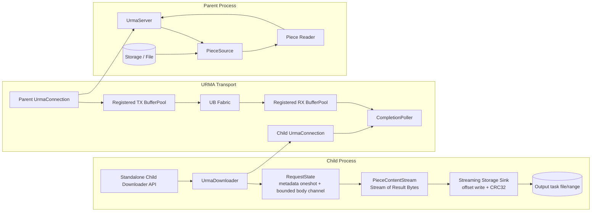
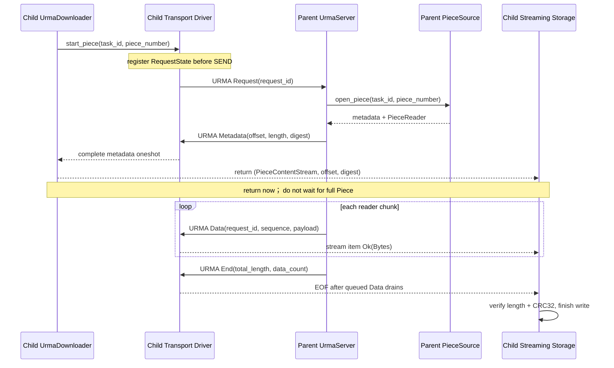
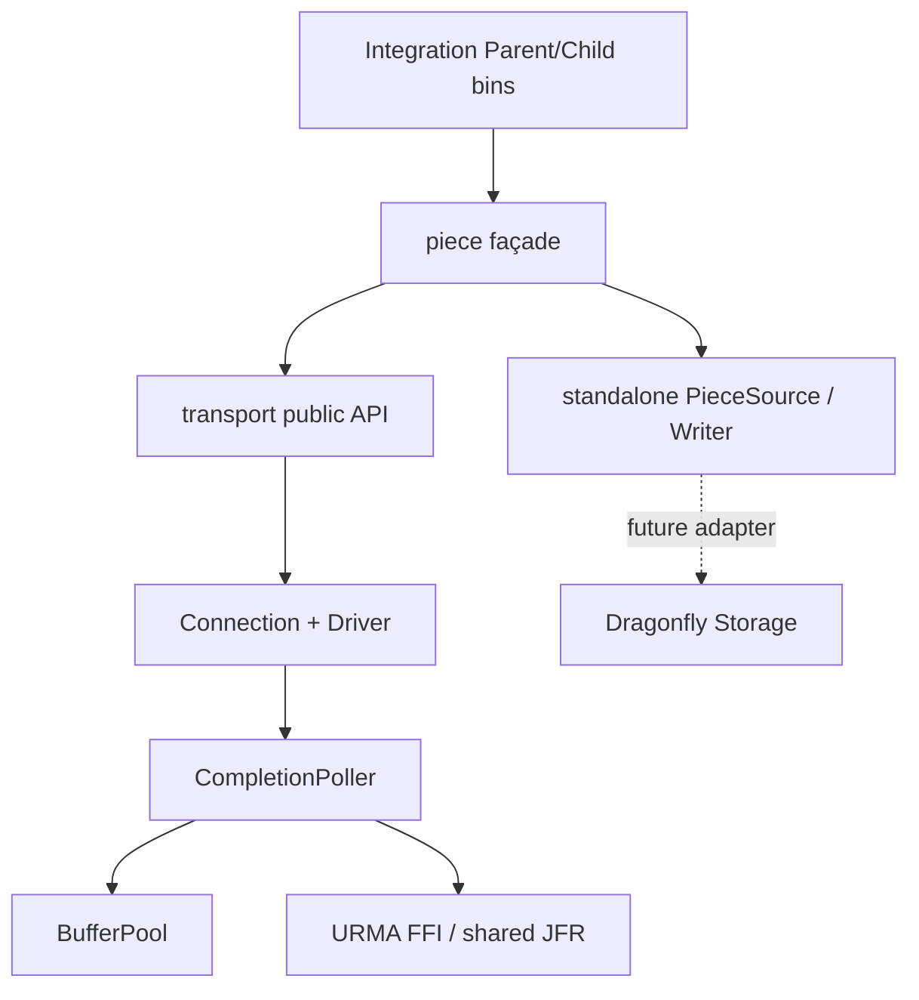
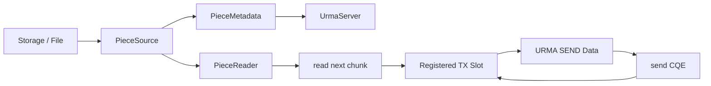

# Dragonfly + URMA Standalone Integration Demo 设计

> 设计日期：2026-08-13  
> Dragonfly 根仓库基线：`2acbb8b6414939919cfc8474bf0ba4c38ae2c8ba`  
> Dragonfly `client` 子仓库基线：`017575a58d0abad6b3b274142fa470d47d8db327`  
> URMA lab 基线：M0-M4，M3 已在真实 UDMA/UB 环境验证，M4 已完成代码与非 provider 测试，真实 16 MiB/连续 10 次仍待目标环境验证。

## 0. 证据标记与设计结论

本文严格使用以下标记：

- `[源码确认]`：已由当前 Dragonfly2、urma-transport-lab 或 UMDK 源码确认。
- `[文档确认]`：已由指定工程文档或 M4 build status 确认，但不提升为当前源码事实。
- `[架构设计建议]`：本文为下一阶段提出的设计选择，尚未实现。
- `[待验证]`：需要 standalone 测试、真实 UB provider、故障注入或后续 Dragonfly 集成才能确认。

核心结论：

1. `[源码确认]` Dragonfly 当前 Child transport 的稳定上层契约是 `Downloader::download_piece() -> (PieceContentStream, offset, digest)`，其中 `PieceContentStream = BoxStream<'static, io::Result<Bytes>>`。
2. `[源码确认]` Dragonfly Storage 按 stream 顺序消费 `Bytes`，在 `write_range_from_stream()` 中流式写 task file range 并计算 CRC32；它不要求 transport 是 TCP/QUIC，也不要求 chunk 边界等于 Piece 边界。
3. `[文档确认]` M4 已证明 Request、Metadata、多 Data、End、sequence/length/digest 状态机可以建立在 URMA SEND/RECV message completion 上，并采用 owned `Vec<u8>` 接收模型。
4. `[架构设计建议]` 下一步不进入 Dragonfly 源码，而是在 `urma-transport-lab` 内构造与 Dragonfly 接口同形的 `PieceContentStream`、`UrmaDownloader`、`UrmaServer` 和 streaming storage sink，验证三层语义能否闭合。
5. `[架构设计建议]` Metadata 到达并通过校验后，`download_piece()` 必须立即返回 stream；不得等 Data 全部到齐，更不得先聚合整个 Piece。
6. `[源码确认]` Dragonfly 当前 standard Piece digest 是交给 Storage 比较的字符串，Storage 实际计算 CRC32；M4 wire Metadata 当前固定为 SHA-256 `[u8; 32]`。两者不能不经转换就宣称兼容。
7. `[架构设计建议]` standalone integration protocol 应版本化演进 Metadata，使 digest 明确携带 algorithm 和 encoded value；本 demo 使用 Dragonfly-compatible CRC32。M4 v2 codec 测试继续保留，不能静默改变其 wire 含义。
8. `[文档确认]` 真实 UDMA 环境要求 shared JFR。早期 foundation 文档中的 non-shared JFR 设想已被 M3/M4 实证覆盖；integration demo 必须复用当前 shared JFR，不得回退。
9. `[架构设计建议]` 第一版继续 copy mode：`registered RX slot -> owned Bytes -> stream -> storage`。这不是性能终态，而是隔离 DMA/slot 生命周期与 Dragonfly blocking file write 生命周期的正确性基线。

## 1. 目标与范围

### 1.1 目标

- `[架构设计建议]` 验证 `task_id + piece_number` 的 Piece Request 能通过 URMA 到达静态 Parent。
- `[架构设计建议]` 验证 Parent 能从独立 Piece source 取得 offset、length、digest 和 reader，发送 Metadata、多条 Data 与 End。
- `[架构设计建议]` 验证 Child 在 Metadata 到达后立即获得 `(PieceContentStream, offset, digest)`，Data 随后按需流入 stream。
- `[架构设计建议]` 验证 stream 可被与 Dragonfly Storage 同形的 writer 流式消费，不把完整 Piece 聚合到内存。
- `[架构设计建议]` 验证 End 只形成合法 EOF；Error、CQE failure、sequence/length 错误形成明确 error，而不是伪装成 EOF。
- `[架构设计建议]` 验证 transport completion 与 Piece/Storage success 是不同完成边界。
- `[待验证]` 用至少 16 MiB Piece、多 Data message、连续运行与故障注入证明该映射在真实 UB provider 上成立。

### 1.2 本阶段做什么

- `[架构设计建议]` Piece Request：`task_id + piece_number`。
- `[架构设计建议]` Metadata：`offset + total_length + digest algorithm/value`。
- `[架构设计建议]` Data streaming：严格 sequence、有界通道、非整 Piece聚合。
- `[架构设计建议]` End：total length、Data count、合法 EOF。
- `[架构设计建议]` Error：Metadata 前返回 downloader error；Metadata 后返回 stream item error。
- `[架构设计建议]` `PieceContentStream` adapter：类型和消费语义与当前 Dragonfly 对齐。
- `[架构设计建议]` streaming storage write：按 offset 写文件、流式 CRC32、length/digest 校验。
- `[架构设计建议]` 单 Parent/Child、单 connection、单 outstanding standard Piece。
- `[架构设计建议]` 复用 M0-M4 Runtime、RC duplex Jetty、shared JFR、SEND/RECV、CompletionPoller、BufferPool、CQE route、shutdown。

### 1.3 本阶段明确不做什么

- `[架构设计建议]` 不修改 Dragonfly 源码。
- `[架构设计建议]` 不修改 Scheduler、Manager、Peer discovery 或 endpoint protobuf。
- `[架构设计建议]` 不做多 Peer 选择、评分、调度或连接池。
- `[架构设计建议]` 不做 multi-request / multi-piece concurrency 或 TX pipeline。
- `[架构设计建议]` 不做 registered RX zero-copy lease。
- `[架构设计建议]` 不做 UBS Memory、remote Segment、URMA READ/WRITE。
- `[架构设计建议]` 不做 persistent Piece、persistent-cache Piece。
- `[架构设计建议]` 不做生产认证、授权、重连、断点续传和完整恢复策略。
- `[架构设计建议]` 不用 standalone demo 的静态 endpoint 反推 Dragonfly 已支持 URMA。

## 2. 已确认的接口事实

### 2.1 Dragonfly Child 接口

`[源码确认]` 当前 trait 位于 `client/dragonfly-client/src/resource/piece_downloader.rs`：

```text
download_piece(addr, number, host_id, task_id)
  -> Result<(PieceContentStream, u64, String)>
```

- `[源码确认]` tuple 分别是 body stream、Piece offset 和 expected digest。
- `[源码确认]` `PieceContentStream` 是 `BoxStream<'static, io::Result<Bytes>>`，不是 `AsyncRead`。
- `[源码确认]` `host_id` 在当前 TCP/QUIC downloader 的 standard Piece 方法中未参与低层请求编码。
- `[源码确认]` TCP/QUIC downloader 先读取 response metadata，再返回剩余 body 对应的 stream；因此“Metadata 后返回 stream”与现有行为一致。

### 2.2 Dragonfly Storage 接口

- `[源码确认]` `Storage::download_piece_from_parent_finished()` 接收 `Stream<Item = io::Result<Bytes>> + Unpin`、offset、expected length 和 expected digest。
- `[源码确认]` `write_range_from_stream()` 按到达顺序推进 offset，忽略空 chunk，对超出 expected length 的最后一个 chunk 截断视图，并在长度不足时失败。
- `[源码确认]` Storage 对 chunk 计算 CRC32，按批次把 `Vec<Bytes>` 移入 blocking `pwritev` task；`Bytes` 可能在 async future 取消后仍被 blocking task 持有。
- `[源码确认]` Piece 写入、CRC32/digest 校验和 metadata commit 完成后，Dragonfly 才认为 Piece 成功；send CQE、recv CQE 或 End 均不是该成功边界。

### 2.3 Dragonfly Parent 接口

- `[源码确认]` Parent 先取得 Piece metadata，再通过 `Storage::upload_piece(piece_id, task_id, range)` 获得惰性 `RangeReader`。
- `[源码确认]` Piece content 位于 task file 的 `(piece.offset, piece.length)` range，不是独立 Piece 文件。
- `[源码确认]` `RangeReader` 使用显式 offset，不依赖共享 FD cursor。
- `[架构设计建议]` standalone demo 不复制完整 Storage 实现，而以 `PieceSource` 抽象模拟上述两步；File-backed 实现作为测试 source，后续 Dragonfly adapter 才调用真实 `get_piece/upload_piece()`。

### 2.4 当前 URMA lab 能力

- `[文档确认]` M4 每条 URMA SEND 携带一条完整 message，固定 slot 64 KiB，Data 最大 payload 65,512 bytes。
- `[文档确认]` M4 Parent 每次仅一条 SEND in-flight，send CQE 前不复用 TX slot。
- `[文档确认]` M4 CompletionPoller 已完成 CQE status/opcode/length 校验、`user_ctx` route、TX recycle、RX payload copy 和统计；业务状态在 poller 外。
- `[文档确认]` M4 Child 当前是 `CQE -> Vec<u8> -> BufWriter`，尚无 `Bytes`、async stream、bounded channel 或 Dragonfly-compatible CRC32 metadata。
- `[待验证]` M4 真实 provider 的 16 MiB 和连续 10 次验收尚需补跑；integration demo 不应掩盖这一前置硬件证据缺口。

## 3. 整体数据路径

### 3.1 端到端组件图



- `[架构设计建议]` 图中 Downloader、PieceSource 和 streaming sink 是 Piece 层；Connection、CompletionPoller 和 registered pool 是 transport 层。
- `[架构设计建议]` Transport 只传递有边界的 message 和 transport error，不调用文件 API、不计算 Piece digest、不知道 Dragonfly metadata commit。
- `[架构设计建议]` Parent server 依赖 `PieceSource`，不依赖具体文件路径；Child downloader 产出 stream，不依赖具体 Storage 实现。

### 3.2 消息时序与返回时机



- `[架构设计建议]` RequestState 必须先注册再发送 Request，避免快速 Metadata 到达时无路由目标。
- `[架构设计建议]` Metadata oneshot 和 body channel 必须分离；Metadata 决定 downloader future 的返回时机，body channel 决定 stream 的后续 poll。
- `[架构设计建议]` Data 可在调用者首次 poll stream 前进入有界 channel，但不得进入无界 Vec 或整 Piece缓存。
- `[架构设计建议]` End 先完成 request state 的 length/data-count 校验，再关闭 body sender；stream 只有在已排队 Data 消费完后返回 `None`。

### 3.3 M4 Message/Data 到 PieceContentStream 的映射

| M4/Integration message | Piece 层动作 | `PieceContentStream` 可见结果 |
|---|---|---|
| Request | `[架构设计建议]` 建立一个非零 request ID 的 `RequestState`。 | 不可见。 |
| Metadata | `[架构设计建议]` 校验 request、offset、length、digest；完成 metadata oneshot。 | downloader 返回 stream，但 Metadata 本身不是 stream item。 |
| Data | `[架构设计建议]` 校验 request ID、strict sequence、累计长度；payload 转 owned `Bytes`。 | `Some(Ok(Bytes))`。 |
| End | `[架构设计建议]` 校验 total length 和 Data count，按序关闭 body channel。 | 已排队 Data 后返回 `None`。 |
| Error | `[架构设计建议]` Metadata 前失败 oneshot；Metadata 后投递一个 `io::Error` 并关闭 stream。 | `Err(io::Error)`，不得伪装 EOF。 |
| CQE/connection error | `[架构设计建议]` 失败 request 或 connection generation。 | downloader error 或 stream error。 |

- `[源码确认]` Dragonfly Storage 不关心 transport Data message 边界；每个 Data 映射为一个 `Bytes` 是允许的，但不是业务承诺。
- `[架构设计建议]` adapter 不向 Storage暴露 request ID、sequence、slot ID 或 CQE；这些字段在 stream 前已经消费和验证。

## 4. Standalone 模块划分

### 4.1 Transport layer：复用与最小调整边界

| 组件 | 决策 | 职责 |
|---|---|---|
| `UrmaRuntime` | `[架构设计建议]` 复用 M0-M4。 | 设备、Context、JFC、registered memory 和显式 shutdown owner。 |
| `UrmaConnection` | `[架构设计建议]` 复用现有建链/post/poll 基础，在外部加单 owner driver。 | 有边界 message 的 send/receive，不理解 Piece。 |
| `CompletionPoller` | `[架构设计建议]` 复用 CQE validation、slot route/recycle；不加入 Storage/digest。 | CQE 到 owned frame，保留 connection/generation/operation/slot 路由。 |
| `BufferPool` | `[架构设计建议]` 复用 64 KiB fixed slots 和已验证状态机。 | TX 仅 send CQE 后回收；RX completion 后 copy。 |
| `Message` | `[架构设计建议]` 复用 M4 envelope、message boundaries、request ID/sequence/length 规则；Piece Metadata payload版本化。 | encode/decode typed Piece messages。 |
| `TransportDriver` | `[架构设计建议]` standalone 新增。 | 单线程/单 task 独占 connection，处理 command、poll、RequestState route、pending delivery 和 shutdown。 |

- `[架构设计建议]` 不为 integration demo 大规模重写已验证 native foundation；`TransportDriver` 是同步 M4 connection 与异步 stream 之间的薄执行边界。
- `[架构设计建议]` Driver 只处理 transport command 和 bounded delivery，不打开文件、不调用 PieceSource、不计算 digest。
- `[待验证]` 当前 synchronous `UrmaConnection` 能否在一个专用 OS thread 上平滑封装，还是需最小拆分 `poll_once/send/recv_ready` 的 ownership API，应以实现 spike 验证，但不得把 raw handle暴露给 Tokio worker。

### 4.2 Piece layer：新增模块

| 模块/类型 | 职责 | 非职责 |
|---|---|---|
| `PieceRequest` | `[架构设计建议]` task ID、piece number、request ID 的业务 DTO 与校验。 | 不携带 endpoint、Jetty descriptor 或 slot。 |
| `PieceMetadata` | `[架构设计建议]` offset、length、digest algorithm/value；提供 Dragonfly tuple 所需值。 | 不代表 Storage 已写入成功。 |
| `RequestState` | `[架构设计建议]` WaitingMetadata/Streaming/Ended/Failed/Draining，sequence/length 统计。 | 不 poll CQ、不写文件。 |
| `UrmaPieceStream` | `[架构设计建议]` 包装 bounded receiver，实现 `Stream<Item=io::Result<Bytes>>`。 | 不解析 wire frame、不持有 registered slot。 |
| `PieceContentStream` | `[架构设计建议]` standalone 中定义与 Dragonfly 完全同形的 alias。 | 不从 Dragonfly crate import，避免提前耦合。 |
| `UrmaDownloader` | `[架构设计建议]` 发 Request、等待 Metadata、立即返回 stream/offset/digest。 | 不创建 Runtime/Jetty，不消费整个 stream。 |
| `PieceSource` | `[架构设计建议]` Parent storage/source 抽象，返回 metadata + reader。 | 不发送 URMA message。 |
| `FilePieceSource` | `[架构设计建议]` standalone 文件实现，模拟 task file range 与 CRC32 metadata。 | 不迁移到 Dragonfly production。 |
| `UrmaServer` | `[架构设计建议]` 消费 inbound Request，调用 PieceSource，发送 Metadata/Data/End/Error。 | 不知道 Child sink，不 poll raw CQ。 |
| `StreamingPieceWriter` | `[架构设计建议]` standalone sink，按 offset 流式写文件并计算 CRC32/length。 | 不假装等同完整 Dragonfly Storage metadata/GC。 |

### 4.3 依赖方向



- `[架构设计建议]` `transport` 不依赖 `piece`；`piece` 可以依赖 transport 的 frame/send/receive API。
- `[架构设计建议]` `StreamingPieceWriter` 和 `FilePieceSource` 是 standalone harness，不进入未来 Dragonfly transport crate。
- `[架构设计建议]` 将来真正接入时，Dragonfly Storage adapter 依赖 transport/piece public API，而 transport 不反向依赖 Dragonfly resource layer。

## 5. Downloader 接口映射

### 5.1 Standalone 接口形状

`[架构设计建议]` demo 定义一个不依赖 Dragonfly crate、但语义同形的接口：

```text
download_piece(task_id, piece_number)
  -> (PieceContentStream, offset, digest_string)
```

- `[架构设计建议]` 静态 Parent endpoint 在构造 `UrmaDownloader` 时注入，不由每次 request 的 `addr` 动态决定。
- `[架构设计建议]` future 只覆盖 Request post、Metadata/Error 和 metadata timeout。
- `[架构设计建议]` body timeout由 stream consumer / standalone writer负责，模拟 Dragonfly Storage 的 write timeout边界。

### 5.2 精确执行步骤

1. `[架构设计建议]` 获取单 outstanding request permit。
2. `[架构设计建议]` 分配非零、同 connection generation 内不复用的 request ID。
3. `[架构设计建议]` 创建 metadata oneshot、bounded body channel 和 RequestState。
4. `[架构设计建议]` 先把 RequestState 注册到 connection registry。
5. `[架构设计建议]` 发送 Request；同步 post 失败则移除 registry并完成两个错误通道。
6. `[架构设计建议]` 等待 Metadata 或 Error，施加独立 metadata timeout。
7. `[架构设计建议]` Metadata 到达时校验 request ID、phase、offset/length/digest encoding，然后立即返回 stream、offset、digest。
8. `[架构设计建议]` 后续 Data 由 driver 路由至 body channel；Downloader future 已结束，不参与 body循环。
9. `[架构设计建议]` End 合法时产生 EOF；Error/CQE/timeout 产生 stream error。

### 5.3 为什么 Metadata 后必须立即返回

- `[源码确认]` 当前 TCP/QUIC downloader 就是在解析 metadata 后返回 body stream，调用方随后把 stream 交给 Storage。
- `[源码确认]` Storage 的价值在于边接收边 CRC32、边按 batch 写盘；等待整个 Piece 会破坏其 streaming contract。
- `[架构设计建议]` Metadata 后立即返回可使网络接收与 Storage 写入重叠，并保持内存上限由 body channel/RX credit决定。
- `[架构设计建议]` 即使第一版 Parent 无 TX pipeline，也不能用“传输较慢”作为整 Piece缓存的理由；接口语义必须从第一版正确。

### 5.4 Metadata 与 digest 兼容决策

- `[源码确认]` Dragonfly `download_piece()` 返回 `String` digest，Storage 对实际 bytes 计算 CRC32并比较字符串。
- `[源码确认]` M4 Metadata 是固定 SHA-256 `[u8;32]`，其成功 JSON 中的 digest_ok 是 M4 自己的 SHA-256闭环，不等价于 Dragonfly Storage digest contract。
- `[架构设计建议]` integration Piece Metadata 使用 `DigestDescriptor { algorithm, value }`；wire 至少编码 bounded algorithm ID、value length 和 bytes。
- `[源码确认]` 当前 Dragonfly `crc32fast::Hasher::finalize()` 的 `u32` 结果以十进制字符串编码，`Digest::to_string()` 输出 `crc32:<decimal>`；例如源码测试向量使用 encoded value `1475635037`。
- `[架构设计建议]` standalone Dragonfly-mode 固定 `algorithm=CRC32`，wire value保存十进制 encoded部分，Downloader返回值组装为`crc32:<decimal>`；SHA-256可保留为独立M4 compatibility mode。
- `[架构设计建议]` wire protocol必须增加版本号或新 metadata type，旧 M4 v2 decoder 遇到新 payload应明确拒绝，禁止同版本双重解释。
- `[待验证]` 若目标Dragonfly合入commit变化，实施前仍须重新核对digest模块，不能假设未来版本继续使用同一文本编码。

## 6. Child 数据流与背压

### 6.1 Copy-mode 路径


- `[架构设计建议]` 实现可由 copied `Vec<u8>` 转 `Bytes`，或直接复制进 `BytesMut` 后 freeze；关键不变式是 `Bytes` 不引用 registered slot。
- `[架构设计建议]` stream item只包含 Data payload，不包含 wire header。
- `[架构设计建议]` sequence和累计长度在 delivery 前校验；错误 bytes不得进入 Storage。

### 6.2 为什么第一版继续 copy mode

- `[源码确认]` Dragonfly Storage 可能把 `Bytes` 移入 blocking `pwritev` task，buffer 生命周期可超过 async stream poll和外层 future。
- `[架构设计建议]` owned `Bytes` 使 RX slot 可以按 transport backpressure规则独立回收，Storage 不持有 Segment、slot ID 或 repost权限。
- `[架构设计建议]` copy mode 把潜在错误范围限制在已验证的 M4 slot state、owned channel item和普通 Rust buffer之间，便于故障注入和 shutdown审计。
- `[待验证]` 额外 memcpy 的 CPU/memory bandwidth成本需要后续 benchmark；当前阶段不以理论性能替代生命周期正确性。

### 6.3 bounded delivery 与 receive credit

- `[架构设计建议]` body channel capacity应不大于可用于该 request 的 RX slot count；第一版可从 2-4 开始，即使 M4 Parent仍为单 TX in-flight。
- `[架构设计建议]` driver不得在 poll loop 中 `await` 或 blocking send到满 channel，也不得把 Data复制进无界 pending queue。
- `[架构设计建议]` channel满时最多保留受 RX slot数约束的 `PendingDelivery<Bytes>`，并暂不为对应 receive credit调用 `recv_ready/repost`。
- `[架构设计建议]` Storage消费 channel后，driver重试投递并补回 RX；这把 stream消费速度反馈为有限 receive credit。
- `[待验证]` 目标 UDMA provider在 receive credit耗尽时的 RNR retry、send CQE状态和timeout必须实测；若它不能形成稳定背压，后续需要显式 Credit/Window message，但不在第一版预设实现。

### 6.4 End、Error、Drop

- `[架构设计建议]` End必须在所有前序 Data成功入队之后处理，不能越过 pending Data关闭 stream。
- `[架构设计建议]` Error在 Metadata前完成 metadata oneshot错误；Metadata后向 body channel投递一个 `io::Error`，再关闭 sender。
- `[架构设计建议]` stream提前 Drop时 RequestState进入 Draining；因协议暂无 Cancel，driver继续接收并丢弃该 request的 Data，回收RX，直到 End/Error或connection timeout。
- `[架构设计建议]` 单 outstanding permit在合法 End/Error或有界 connection drain后释放，防止旧 request消息污染新 Piece。
- `[待验证]` peer在 stream Drop后永不发送 End/Error时的 drain timeout、Jetty ERROR和重建策略需要故障测试确定。

## 7. Parent 数据流与 Storage 解耦

### 7.1 目标路径



- `[架构设计建议]` `UrmaServer` 只依赖 `PieceSource::open_piece()` 的结果，不知道 task文件布局、RocksDB、FDCache或notifier。
- `[架构设计建议]` FilePieceSource 负责 standalone 输入文件、offset/length和CRC32；transport不接受裸路径作为长期 API。
- `[架构设计建议]` server顺序为 Metadata -> 多 Data -> End；PieceSource失败或读取中途失败发送 Error（transport仍可用时）。
- `[架构设计建议]` Parent每次从 reader读取不超过 negotiated Data payload的 bytes，写入 registered TX slot；send CQE前不得再访问或复用该 slot。
- `[架构设计建议]` 第一版继续单 Data SEND in-flight；后续 pipeline与reader预取属于性能阶段。

### 7.2 未来 Dragonfly Storage adapter

- `[源码确认]` Dragonfly Parent要先从 `Storage::get_piece(piece_id)` 取得 metadata，再通过 `Storage::upload_piece()`取得 `RangeReader`。
- `[架构设计建议]` 未来 `DragonflyPieceSource` 适配器负责 `task_id + piece_number -> piece_id`、metadata读取、finished等待和RangeReader构造。
- `[架构设计建议]` `UrmaServer` 仍只消费通用 reader；它不直接依赖Dragonfly metadata schema。
- `[源码确认]` 与 Linux TCP sendfile相比，URMA SEND第一版必须把文件range读入registered staging buffer，因此会失去当前TCP Parent的sendfile用户态绕行优势。
- `[待验证]` URMA网络收益能否抵消Parent staging read/copy、Child RX copy、CQ polling和CRC32成本，必须由Phase 4端到端benchmark回答。

## 8. Protocol 设计与 M4 兼容策略

### 8.1 保留的不变式

- `[架构设计建议]` 一次SEND恰好一条完整message，不做跨CQE byte-stream reassembly。
- `[架构设计建议]` header继续包含magic、version、type、request_id、sequence、payload_len，整数big-endian。
- `[架构设计建议]` request_id是双端业务路由；`user_ctx`仍只编码本地connection/generation/operation/slot。
- `[架构设计建议]` Data从sequence 0严格连续；End sequence/data_count等于Data数量。
- `[架构设计建议]` payload_len必须与recv CQE completion length和实际frame长度一致。

### 8.2 建议的 Piece Metadata

```text
offset:          u64
total_length:    u64
digest_algorithm:u16   // CRC32 for Dragonfly-mode demo
digest_len:      u16
digest_value:    u8[digest_len]  // bounded canonical text or bytes
```

- `[架构设计建议]` Request仍为piece_number + bounded UTF-8 task_id。
- `[架构设计建议]` Data仍为header sequence +非空payload；空Piece无Data。
- `[架构设计建议]` End仍携带total_length + data_count。
- `[架构设计建议]` Error携带bounded code/message，不能泄漏descriptor、token、VA/IOVA或raw provider对象。
- `[架构设计建议]` integration protocol使用新version；M4 v2 SHA-256 round-trip测试保留为compatibility suite。
- `[待验证]` 是否保留SHA-256作为额外端到端诊断字段需权衡message复杂度；它不能替代Dragonfly-required CRC32。

## 9. 建议代码目录（仅设计）

`[架构设计建议]` standalone 首先在 `urma-transport-lab` 内组织，不进入 Dragonfly2：

```text
urma-transport-lab/
  src/
    transport/
      mod.rs
      runtime.rs          # current Runtime façade
      connection.rs       # connection lifecycle + bounded message API
      driver.rs           # single owner command/poll/delivery loop
      completion.rs       # CQE validation/routing/stats
      buffer.rs           # registered pool and slot state
      jetty.rs
      jfc.rs
      wr.rs
      oob.rs
      ffi/
        mod.rs
        shim.c
        shim.h
        wrapper.h
    piece/
      mod.rs
      protocol.rs         # Piece Request/Metadata/Data/End/Error payloads
      metadata.rs         # PieceMetadata + DigestDescriptor
      request.rs          # RequestState and registry
      stream.rs           # UrmaPieceStream + PieceContentStream alias
      downloader.rs       # standalone UrmaDownloader-shaped adapter
      server.rs           # UrmaServer request loop
      source.rs           # PieceSource + FilePieceSource
      writer.rs           # standalone streaming sink
    bin/
      integration-parent.rs
      integration-child.rs
      parent.rs            # existing M4 compatibility binary
      child.rs             # existing M4 compatibility binary
  tests/
    integration_protocol.rs
    integration_stream.rs
    integration_storage.rs
    integration_real_provider.rs
```

- `[架构设计建议]` 实现时不要求一次性移动所有M0-M4文件；可先以re-export/薄module逐步形成目录，避免大规模foundation重构。
- `[架构设计建议]` M4 `message.rs` 的通用header codec最终可迁到 `transport` 或 `piece/protocol`；业务payload不应留在CompletionPoller。

### 9.1 未来可迁移到 Dragonfly 的部分

| standalone 部分 | 未来落点建议 | 是否原样迁移 |
|---|---|---|
| transport FFI/runtime/connection/completion/buffer/oob | `[架构设计建议]` `dragonfly-client-storage/src/urma/` | 需适配async runtime、config、feature和shutdown；逻辑可复用。 |
| Piece protocol/metadata/request/stream | `[架构设计建议]` storage crate URMA模块 | 高复用；digest encoding需锁定当前Dragonfly版本。 |
| `UrmaServer` | `[架构设计建议]` storage crate URMA server | 核心状态机可复用；PieceSource替换为Dragonfly Storage adapter。 |
| standalone `UrmaDownloader` | `[架构设计建议]` 先作为storage公开client API，再由`dragonfly-client`薄adapter实现trait | 不直接搬trait实现，避免crate依赖环。 |
| FilePieceSource | `[架构设计建议]` 仅测试/示例 | 不迁production。 |
| StreamingPieceWriter | `[架构设计建议]` 仅测试oracle | production直接复用现有Storage写路径。 |
| integration binaries | `[架构设计建议]` 独立验收工具 | 不进入dfdaemon主路径。 |

## 10. 生命周期与失败模型

### 10.1 正常生命周期

```text
Runtime start
  -> shared JFR / JFC / registered pool
  -> duplex Jetty + OOB descriptor exchange/import/bind
  -> RX prepost + READY
  -> one Piece RequestState
  -> Metadata returned + stream consumed
  -> End + writer length/digest success
  -> request registry empty
  -> stop new post
  -> drain send/recv CQE
  -> existing M3/M4 ordered connection/runtime shutdown
```

- `[架构设计建议]` Runtime/Connection寿命覆盖stream和writer；stream尚未结束时不得关闭registered Segment。
- `[架构设计建议]` 正常End后不应留下无业务用途的posted RX；driver需知道request和connection关闭计划，按M4 drain规则收敛。

### 10.2 错误边界

| 错误 | 建议处理 |
|---|---|
| invalid Request / piece missing | `[架构设计建议]` Parent发送Error；Child metadata future失败。 |
| Metadata malformed / unsupported digest | `[架构设计建议]` Child protocol failure，connection进入Draining。 |
| sequence gap/duplicate/out-of-order | `[架构设计建议]` stream error + connection failure；不把payload交给writer。 |
| Data超过Metadata length | `[架构设计建议]` stream error + drain。 |
| End length/count不匹配 | `[架构设计建议]` stream error，不形成EOF。 |
| Parent reader中途失败 | `[架构设计建议]` 若transport可用则Error，否则connection failure。 |
| CQE status/post failure | `[架构设计建议]` transport error，失败当前request并进入既有drain路径。 |
| writer length/digest mismatch | `[架构设计建议]` Storage-level failure；transport可能已正常End。 |
| stream early Drop | `[架构设计建议]` RequestState Draining并丢弃至End/Error；超时后connection ERROR/drain。 |

- `[架构设计建议]` Error message是Parent业务错误；CQE error是transport错误；digest mismatch是Storage/内容错误。日志与JSON不得混为一个`success=false`而丢失层次。

## 11. 验证计划与验收标准

### 11.1 无真实 UB 的测试

- `[架构设计建议]` protocol：Request/Metadata/Data/End/Error、大小端、未知version/type、截断、payload mismatch、digest algorithm/value非法。
- `[架构设计建议]` downloader：RequestState先注册、Metadata后立即返回、Metadata前Error/timeout。
- `[架构设计建议]` stream：多个Data按序、Data可在首次poll前缓存、合法End后EOF。
- `[架构设计建议]` stream error：gap、duplicate、out-of-order、超长、End mismatch、Metadata后Error。
- `[架构设计建议]` backpressure：channel满时无无界增长、RX credit被扣留、consumer恢复后继续。
- `[架构设计建议]` writer：空Piece、小于slot、多slot、offset写、CRC32匹配/不匹配、length mismatch。
- `[架构设计建议]` lifecycle：stream early Drop、Parent mid-read failure、driver shutdown、stale generation、无double recycle/repost。

### 11.2 真实 UB provider

- `[待验证]` 使用`udmac0d1e2`和shared JFR完成至少16 MiB单Piece，确保多Data。
- `[待验证]` Parent/Child输出分层JSON：request、bytes、data_messages、send/recv post/CQE、stream items、writer length/digest、drain结果。
- `[待验证]` 用独立文件工具比较input/output length与内容；同时验证Dragonfly-compatible CRC32 metadata。
- `[待验证]` 连续至少10次，不重启或按测试目标分别覆盖connection复用与完整start/stop，无slot/handle/Segment释放异常。
- `[待验证]` 证明OOB仅承载握手，Piece Request/Metadata/Data/End/Error均走URMA SEND/RECV。
- `[待验证]` 注入piece missing、Parent中途读错误、sequence错误、Child提前Drop、peer退出和shutdown during transfer。

### 11.3 映射成立的判定

只有同时满足以下条件，才可说“standalone demo证明映射可行”：

1. `[待验证]` `download_piece()`在Metadata后、End前返回。
2. `[待验证]` 至少一个Data在Downloader future返回后由Storage writer消费。
3. `[待验证]` 内存占用不随Piece长度线性增长，body channel/pending delivery有明确上限。
4. `[待验证]` Storage writer以stream顺序得到完整bytes并通过length/CRC32。
5. `[待验证]` 合法End才形成EOF，所有错误路径均形成error。
6. `[待验证]` registered RX slot不被任何交给Storage的Bytes引用。
7. `[待验证]` 正常与异常路径都能按现有M3/M4顺序drain/shutdown。

## 12. 后续实施阶段

### Phase 1：Standalone integration demo

- `[架构设计建议]` 在`urma-transport-lab`增加Piece layer、TransportDriver、同形PieceContentStream、FilePieceSource和StreamingPieceWriter。
- `[架构设计建议]` 完成Metadata后立即返回stream、有界背压、CRC32-compatible metadata和真实UB验收。
- `[待验证]` 此阶段结束时仍不修改Dragonfly2。

### Phase 2：UrmaDownloader / UrmaServer adapter readiness

- `[架构设计建议]` 把standalone public API收敛到未来Dragonfly可消费的边界：`start_piece -> PendingPiece`、metadata oneshot、body stream、PieceSource。
- `[架构设计建议]` 做一个compile-only或独立adapter contract test，验证tuple和stream trait bounds与当前Dragonfly源码一致，但不写入Dragonfly仓库。
- `[待验证]` 重新核对目标合入commit的Downloader签名、digest encoding、Storage timeout和crate依赖图。

### Phase 3：Dragonfly client integration

- `[架构设计建议]` 经单独批准后，才在Dragonfly storage crate放入URMA transport/server，在dragonfly-client放入薄`Downloader` trait adapter。
- `[架构设计建议]` 直接把URMA stream交给现有`Storage::download_piece_from_parent_finished()`，不复制standalone writer进入production。
- `[架构设计建议]` 使用静态Parent endpoint和显式实验开关；Scheduler/Manager/peer discovery保持不变。
- `[待验证]` standard Piece端到端、metadata commit、timeout、digest mismatch、shutdown和TCP/QUIC不回归。

### Phase 4：Performance benchmark

- `[架构设计建议]` 以copy mode为基线比较slot size、RX/TX count、poll batch、channel capacity、Piece size、冷/热页。
- `[架构设计建议]` 报告吞吐、P50/P99、CPU、memory bandwidth、CQE rate、RNR、blocking write和drain时延。
- `[架构设计建议]` 只有在正确性和资源回收不变式保持后，才单独评估pipeline、multi-request、zero-copy或UBS Memory。

## 13. 风险与待决问题

1. `[待验证]` M4真实16 MiB/连续10次基线需先补齐，否则integration失败时难以区分基础transport与stream adapter问题。
2. `[待验证]` 当前基线已确认`crc32:<decimal>`；目标合入commit仍须重新核对并用共享测试向量锁定。
3. `[待验证]` shared JFR上扣留receive credit能否形成可恢复RNR背压，而不是永久connection error。
4. `[待验证]` 单connection owner driver与Tokio channel之间的wake/backoff策略是否造成高CPU或高尾延迟。
5. `[待验证]` stream early Drop后无Cancel协议的drain成本和timeout上限。
6. `[待验证]` Parent FilePieceSource的读粒度与64 KiB slot对页缓存/CPU的影响；不要从Dragonfly默认512 KiB buffer直接推导最优slot。
7. `[待验证]` integration protocol version升级与M4兼容测试如何同时维护，避免同magic/version多义。
8. `[待验证]` 真实Dragonfly集成前必须重新核对上游源码，因为当前仓库并未支持URMA，trait/config/Storage都可能变化。

## 14. 进入 Dragonfly 源码集成的门槛

- `[架构设计建议]` standalone API已稳定为Metadata后立即返回的`PieceContentStream`。
- `[架构设计建议]` digest已按Dragonfly CRC32语义验证，而不只是M4 SHA-256自闭环。
- `[架构设计建议]` transport与PieceSource/Storage writer完全解耦。
- `[架构设计建议]` copy-mode Bytes不引用registered slot，有界背压和early Drop路径有测试。
- `[待验证]` 真实UB 16 MiB与连续10次、错误注入、drain/shutdown全部通过。
- `[待验证]` feature-off、不含UMDK的普通构建策略已设计并在迁移前验证。
- `[待验证]` Dragonfly目标commit接口重新核对完成，并取得修改Dragonfly源码的明确授权。

满足这些门槛只表示具备开始实现Dragonfly adapter的条件，不表示Dragonfly已经支持URMA，也不表示Scheduler、生产安全或性能优化已经完成。

## 15. 参考事实索引

- `[源码确认]` Downloader trait：`Dragonfly2/client/dragonfly-client/src/resource/piece_downloader.rs`。
- `[源码确认]` PieceContentStream：`Dragonfly2/client/dragonfly-client-storage/src/client/mod.rs`。
- `[源码确认]` Storage stream写入与CRC32：`Dragonfly2/client/dragonfly-client-storage/src/lib.rs`、`src/content_linux.rs`、`src/io.rs`。
- `[源码确认]` Parent Storage/RangeReader：`Dragonfly2/client/dragonfly-client-storage/src/lib.rs`、`src/content_linux.rs`、`src/io.rs`、`src/server/{tcp,quic}.rs`。
- `[文档确认]` M4实现状态：`urma-transport-lab/docs/m4-build-status.md`。
- `[文档确认]` transport foundation：`urma-transport-foundation-design-v1.1.md`；其中JFR模式以M3/M4真实环境结论为准。
- `[文档确认]` downloader设计：`urma-downloader-module-design-v2.md`、`urma-downloader-design-analysis-v2.md`。
- `[文档确认]` 数据路径与Storage分析：`dragonfly-urma-data-path-analysis.md`、`10-piece-stream-and-storage-path-analysis.md`、`06-storage.md`。
