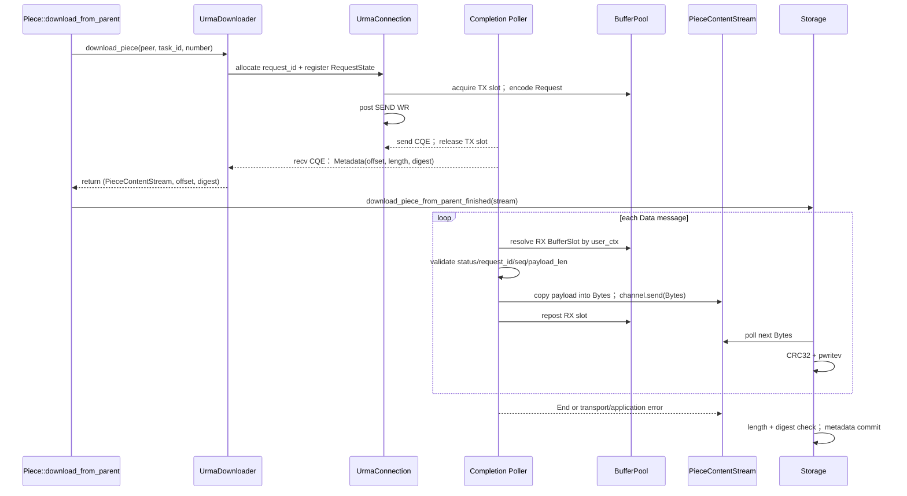
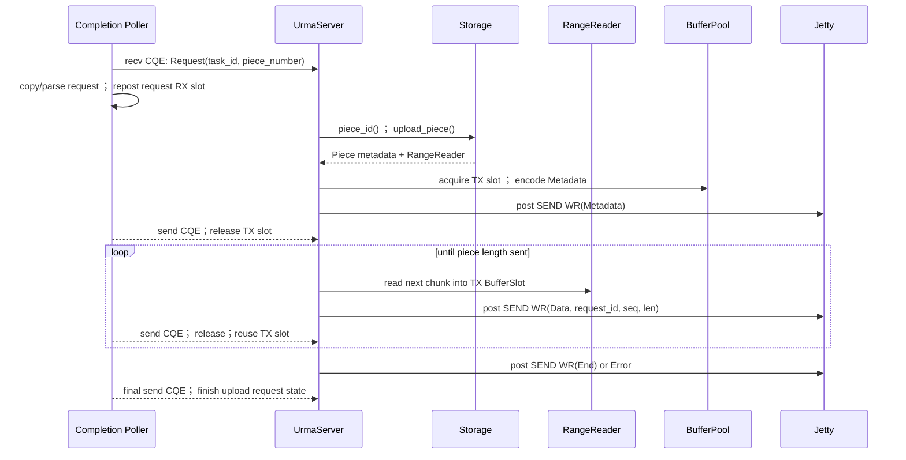

# Dragonfly UrmaDownloader 最小架构设计分析

> [源码确认] Dragonfly 根仓库核对基线为 `2acbb8b6414939919cfc8474bf0ba4c38ae2c8ba`，`client` 子仓库为 `c2f7edbfd4df573192beca60ca18790a730740e4`。
>
> [URMA源码确认] UMDK 核对基线为 `3bfff198329a497ed49e53bd5585c34bcb7c9d88`，主要目录为 `src/urma/tools/urma_perftest`。
>
> [架构推断] 本文只设计第一阶段的 standard Piece Peer-to-Peer URMA 数据传输验证；TCP/QUIC 保留，不在本阶段实现 persistent Piece、persistent-cache Piece、zero-copy 或生产级调度集成。

## 1. 结论摘要

1. [源码确认] `Downloader` trait 定义在 `client/dragonfly-client/src/resource/piece_downloader.rs:37`，TCPDownloader 和 QUICDownloader 也都在该文件中实现，分别位于约 `259–413` 行和 `108–257` 行。
2. [源码确认] `download_piece()` 的统一返回契约是 `(PieceContentStream, offset, digest)`；`PieceContentStream` 定义为 `BoxStream<'static, io::Result<Bytes>>`，Storage 已经只依赖这个 stream 契约，不依赖 TCP/QUIC reader 的具体类型。
3. [架构推断] 因此 `UrmaDownloader` 可以与 TCPDownloader、QUICDownloader 平行接入，并且可以原样复用 Storage 写入、CRC32、digest 比对、Piece metadata 提交和 notifier 逻辑。
4. [源码确认] 但完整接入不是“只实现 trait”：`Piece::download_from_parent()` 显式匹配 `tcp/quic` 和对应端口，`CollectedParent` 也只有 TCP/QUIC endpoint 字段，Parent 侧还需要 URMA request handler 和 Piece sender。
5. [URMA源码确认] `urma_perftest` 中 `urma_context`、JFC、Jetty、注册 Segment 都先于测试 WR 创建，并在整个测试结束后逆序清理；SEND 接收端必须先 post receive WR，再通过 recv CQE 的 `user_ctx` 和 `completion_len` 找回 buffer 与有效长度。
6. [架构推断] 最小正确边界是“进程级 Runtime + Peer 级 Connection/Jetty + 长期注册 BufferPool + Piece 级 RequestState/Stream”，而不是每个 Piece 创建一整套 URMA 资源。
7. [架构推断] 第一版应使用 duplex Jetty + SEND/RECV，允许把 recv BufferSlot 复制成普通 `Bytes`后立即 repost，用专用 poller 线程把 CQE 结果通过 Tokio channel/oneshot 送给 async 任务。
8. [待实验验证] 第一阶段的核心不是性能优势，而是验证：真实 provider/设备上能否稳定完成 request、metadata、多 chunk Piece body、CQE 路由、超时清理与连续重试。

## 2. 现有 Downloader 抽象与调用链

### 2.1 定义与实现位置

| 对象 | 源码位置 | 分析结论 |
|---|---|---|
| `Downloader` trait | `client/dragonfly-client/src/resource/piece_downloader.rs:37–66` | [源码确认] trait 要求 `Send + Sync`，定义 standard、persistent、persistent-cache 三个下载方法。 |
| `DownloaderFactory` | 同文件 `69–104` | [源码确认] 工厂当前只识别 `"tcp"` 和 `"quic"`，内部保存 `Arc<dyn Downloader>`。 |
| `QUICDownloader` | 同文件 `108–257` | [源码确认] 按 address + 随机 slot key 从 pool 获取 `QUICClient` wrapper，再调 client 的同名方法。 |
| `TCPDownloader` | 同文件 `259–413` | [源码确认] 结构与 QUICDownloader 对称，pool 中也是 client wrapper。 |
| `TCPClient` | `client/dragonfly-client-storage/src/client/tcp.rs` | [源码确认] 每次 standard Piece 调用都新建 `TcpStream`，发 Vortex request，读 response metadata，把剩余 `OwnedReadHalf` 包装为 stream。 |
| `QUICClient` | `client/dragonfly-client-storage/src/client/quic.rs` | [源码确认] 每次 Piece 新建 Endpoint/Connection/bi-stream，发相同 Vortex request，再把 `RecvStream` 包装为 stream。 |
| `PieceContentStream` | `client/dragonfly-client-storage/src/client/mod.rs:26` | [源码确认] 类型为 `BoxStream<'static, std::io::Result<Bytes>>`。 |

### 2.2 standard Piece 的 `download_piece` 调用链

```text
Task::download_partial_with_scheduler_from_parent()
  -> PieceCollector 产生 CollectedPiece + candidate parents
  -> JoinSet 启动 Piece 下载任务
  -> Piece::download_from_parent()
       -> Storage::download_piece_started()
       -> 下载/预取 bandwidth limiter
       -> 按 protocol + parent endpoint 选择 downloader
       -> TCPDownloader::download_piece()
          或 QUICDownloader::download_piece()
       -> TCPClient/QUICClient::download_piece()
       -> 读完 response header + Piece metadata
       -> 返回 (PieceContentStream, offset, digest)
       -> Storage::download_piece_from_parent_finished()
       -> Content::write_piece_from_stream()
       -> write_range_from_stream()
       -> CRC32 + positional vectored write
       -> metadata.download_piece_finished()
       -> PieceNotifier::remove_and_notify()
```

- [源码确认] Task 主链在 `resource/task.rs:1225–1515`，用 `JoinSet` 运行多个 Piece future，并用 `Semaphore(config.download.concurrent_piece_count)` 限制并发数。
- [源码确认] `Piece::download_from_parent()` 在 `resource/piece.rs:343–462`，下载器选择发生在 `388–434` 行，stream 在 `438` 行起交给 Storage。
- [源码确认] Storage 在 `dragonfly-client-storage/src/lib.rs:835–908` 消费 stream；真正的 chunk poll 和落盘循环在 `storage/src/io.rs:388–480`。
- [源码确认] 当前默认 Piece 并发数是 8，定义在 `dragonfly-client-config/src/dfdaemon.rs:169–172`；这个数字是当前默认值，不是 URMA queue depth 的直接配置。

### 2.3 `PieceContentStream` 如何返回

- [源码确认] TCPClient 先在 `handle_download_piece()` 中读完 Vortex response header 和 `PieceContent` metadata，然后将仍停在 body 起点的 `OwnedReadHalf` 交给 `ReaderStream::with_capacity(...).boxed()`。
- [源码确认] QUICClient 同样先读 metadata，再用 `futures::stream::unfold` 反复调用 `RecvStream::read_chunk(..., ordered=true)`，将 `chunk.bytes` 移入 stream item。
- [源码确认] downloader future 返回时 Piece body 并未全部接收；Storage 后续 poll `PieceContentStream` 才驱动 body 读取。
- [架构推断] UrmaDownloader 必须保持同样的两阶段语义：收到 response metadata 后即可返回 stream，body CQE 可在 Storage poll stream 期间持续到达。

### 2.4 能否平行接入 UrmaDownloader

- [架构推断] **可以平行接入**，因为 Child 侧稳定的上边界是 `Downloader`，下边界是 `PieceContentStream`，Storage 无需知道 chunk 来自 socket 还是 CQE。
- [源码确认] 当前尚无覆盖 client/server/endpoint 的通用 `Transport` trait，TCP 和 QUIC 各自有 client 与 server 模块。
- [架构推断] 第一版不应为了 URMA 先重构统一 Transport；直接新增 URMA client/server adapter，只复用 `Downloader + PieceContentStream + Storage` 边界，能更直接地验证 Piece body 传输。
- [源码确认] 正式纳入当前调度结果还需扩展 `CollectedParent`；其当前只包含 `download_ip`、`download_tcp_port`、`download_quic_port`，见 `resource/piece_collector.rs:38–54`。
- [架构推断] 第一阶段可用静态配置或 OOB 映射获得单 Parent 的 URMA endpoint，暂不修改 Scheduler/protobuf；这是原型约束，不是最终接入方案。

## 3. UrmaDownloader 模块边界

### 3.1 建议目录与依赖方向

```text
urma/
  ffi
  runtime
  connection
  buffer_pool
  completion
  protocol
  downloader
  server
```

```text
downloader ----> connection ----> runtime ----> ffi
     |               |              |
     |               +----------> completion
     |                              |
     +----------> protocol <--------+
                    |                |
server ------------+----------> buffer_pool
```

- [架构推断] 依赖应保持单向：Downloader 和 Server 是 Dragonfly adapter；Runtime、Connection、Completion、BufferPool 不应反向依赖 PieceManager 或 Storage 内部状态。

### 3.2 模块职责

| 模块 | 职责 | 非职责 |
|---|---|---|
| `ffi` | [架构推断] 收敛 URMA C API、raw pointer、WR/SGE 结构和错误码转换；给上层提供有明确 Drop/关闭顺序的窄封装。 | [架构推断] 不理解 task_id、piece number 或 Storage。 |
| `runtime` | [架构推断] 管理进程级 `urma_init`、device 选择、`urma_context`、JFC/JFCE、poller 启停和全局 shutdown/drain。 | [架构推断] 不按 Piece 创建/删除 Context。 |
| `connection` | [架构推断] 管理 Peer endpoint、Jetty 创建、remote Jetty descriptor 导入/bind、OOB 建链、connection generation、重连和 outstanding request registry。 | [架构推断] 不直接写 Storage。 |
| `buffer_pool` | [架构推断] 一次分配并注册长期 Segment，切分 RX/TX BufferSlot，管理 `Free -> Posted/InFlight -> Completed/Leased -> Free` 状态与 generation。 | [架构推断] 不将“CQE 到达”自动解释为“Piece 完成”。 |
| `completion` | [架构推断] poll send/recv JFC，检查 CQE status，用 `user_ctx` 解析 slot/request/generation，把 recv payload 路由到 Piece channel，回收 TX slot，并在安全时机 repost RX slot。 | [架构推断] 不在 poll 循环内执行文件 I/O 或长时间 async 业务。 |
| `protocol` | [架构推断] 定义 URMA message envelope：版本、message type、request_id、sequence、payload_len、Piece total_len，以及 Request/Metadata/Data/End/Error/Cancel 消息。 | [架构推断] 不直接暴露 C WR 布局为 Dragonfly 业务协议。 |
| `downloader` | [架构推断] 实现 `Downloader::download_piece()`；获取 Peer connection，注册 Piece RequestState，发 Request，等 Metadata，返回 `(PieceContentStream, offset, digest)`。 | [架构推断] 不提交 Piece metadata，该职责继续属于 Storage。 |
| `server` | [架构推断] 接收 Request，调用现有 Storage `upload_piece()` 获得 metadata + RangeReader，将文件 range 分块读入 TX slot，发 Metadata/Data/End 或 Error。 | [架构推断] 不替代 Storage 的 Piece 存在性、读取和上传限速逻辑。 |

### 3.3 为什么需要独立 `protocol` 和 `server`

- [URMA源码确认] SEND WR 只表达一段 local SGE 发往 remote Jetty/JFR，perftest 并没有 Dragonfly 的 task_id、piece number、offset、digest 或 EOF 语义。
- [架构推断] URMA 传输必须自己建立 message framing 和 request demux；否则多个 CQE 无法组成一个有边界的 Piece stream。
- [源码确认] 当前 TCP/QUIC Parent server 都先调 `Storage::upload_piece()` 获得 Piece RangeReader，再发 metadata 与 body；URMA 验证若没有 Parent server，就没有 Peer-to-Peer Piece 数据源。

## 4. 一次 Piece 下载流程

### 4.1 建链前置条件

- [URMA源码确认] `urma_perftest` 的 duplex 路径在传输前已创建 JFC/Jetty、注册 local Segment、交换 remote descriptor，并 import/bind remote Jetty。
- [URMA源码确认] SEND 接收端需要先用 `urma_post_jetty_recv_wr()` 投递 receive WR；perftest 在 SEND latency 测试中还在双方 post receive 后做 barrier，避免 RNR。
- [架构推断] 因此 Child 发 Piece Request 前，Child 与 Parent 都必须已经为对端 SEND 准备可用 RX slots；这是 Connection Ready 的一部分，不应每次由 `download_piece()` 临时完成。

### 4.2 Child 流程



- [架构推断] `download_piece()` 只需等待 Metadata message，不需等待整个 body；RequestState 中的 bounded channel receiver 被包装为 `PieceContentStream`。
- [架构推断] 第一版允许 copy：poller 从已完成 RX slot 复制有效 payload 为独立 `Bytes`，再 repost slot；Storage 后续持有的是普通 Bytes，不再引用注册 Segment。
- [架构推断] bounded channel 提供应用层背压；当 channel 满时，poller 不应阻塞所有 Peer 的 CQ 处理，而应将拷贝后的 chunk 交给非 poller 的 async dispatcher，或以 credit 限制 Parent 发送。
- [待实验验证] 原型在单 Piece 下可先用小的固定 RX depth 与“一个 chunk 确认/一个 credit”限制 outstanding body 数；是否需要专门 credit message 取决于目标 Jetty/transport 的 RNR 行为和 queue depth。

### 4.3 Parent 流程



- [源码确认] Parent 的可复用数据源是 `Storage::upload_piece()` 返回的 RangeReader；URMA SEND/RECV 无法直接复用 Linux TCP server 的 `sendfile` 快路径。
- [架构推断] Parent 必须把 RangeReader 分块读入已注册 TX slot，并在对应 send CQE 成功后才能重写或回收该 slot。
- [URMA源码确认] post API 的同步返值只反映 WR 是否成功入队；数据面异步结果必须检查 send CQE/`urma_cr_t.status`。
- [架构推断] Parent send CQE 不等于 Child 已经落盘、digest 正确或 Piece metadata 已提交；Dragonfly 的最终成功条件仍由 Child Storage 决定。

## 5. URMA 资源生命周期

### 5.1 perftest 确认的创建与销毁关系

- [URMA源码确认] `perftest_resources.c:153–286` 中 `init_device()` 执行 `urma_init -> get/query device -> urma_create_context`，`uninit_device()` 执行 `urma_delete_context -> urma_uninit`。
- [URMA源码确认] `perftest_resources.c:345–409` 创建 send/recv JFC；多 Jetty BW 配置可以共享 `jfc_s[0]` 和 `jfc_r[0]`。
- [URMA源码确认] `perftest_resources.c:625–698` 创建 duplex Jetty，将 send/recv JFC 放入 Jetty 配置；也支持 shared JFR/JFS 组合。
- [URMA源码确认] `perftest_resources.c:851–975` 分配对齐 buffer/token，将整个 buffer 注册为 local Segment；这些 buffer 不是每个 WR 分配。
- [URMA源码确认] `destroy_simplex_ctx()`/`destroy_duplex_ctx()` 先转 ERROR、drain outstanding WR，再 disconnect/unimport，然后删除 Jetty/JFC、unregister/free memory，最后关 OOB management 并删 Context/uninit。

### 5.2 Dragonfly 中建议的层级

| 资源/状态 | 建议生命周期 | 理由 |
|---|---|---|
| `urma_init` / provider | [架构推断] dfdaemon 进程级，引用计数或单一 Runtime owner。 | [URMA源码确认] perftest 注释指出 `urma_uninit()` 非引用计数且会卸载 provider，不适合由 Piece 任意调用。 |
| `urma_context` | [架构推断] 每设备/EID 每进程一个，由 Runtime 长期持有。 | [URMA源码确认] Context 是 JFC、Jetty、Segment 的创建上下文，销毁位于所有子资源之后。 |
| send/recv JFC | [架构推断] Runtime/poller shard 级复用，第一版一对 JFC。 | [URMA源码确认] perftest 允许多 Jetty 共享 JFC；CQE 可用 `user_ctx` 解析归属。 |
| Jetty + imported remote Jetty + bind state | [架构推断] Peer connection 级，跨 Task/Piece 复用；连接故障时整代重建。 | [架构推断] 建链和 descriptor 交换成本较高，而 Piece 是高频工作单元。 |
| registered Segment | [架构推断] BufferPool/Runtime 级长期注册，不随 Piece 注销。 | [URMA源码确认] perftest 在测试运行前注册大 buffer，WR 只引用 Segment 中的 SGE 范围。 |
| RX/TX `BufferSlot` | [架构推断] 每 message/chunk 租用，完成后回池；slot 本体属于长期 pool。 | [架构推断] 这样既保留 URMA 的注册内存要求，又不把整个 Segment 绑定到 Piece。 |
| receive WR/RQE | [架构推断] slot 级循环；Ready 时预投，recv CQE 后处理 payload，然后 repost。 | [URMA源码确认] perftest 就是以 recv completion 消费并 repost RQE 来维持 receive window。 |
| Piece RequestState | [架构推断] 每 Piece 创建，包含 request_id、expected seq/len、metadata oneshot、body channel、timeout/cancel/error 状态。 | [源码确认] Dragonfly 上层的真实并发单元是 Piece future，且每个 Piece 独立返回 stream。 |
| message WR/SGE 描述符 | [架构推断] 每 post 准备或从对象池复用，存活至 post 契约允许释放的时机。 | [待实验验证] 目标 provider 对 WR/SGE descriptor 在 post 返回后的精确持有要求需与 API 规范和压力测再确认。 |

### 5.3 第一版 copy 模式的 slot 状态

```text
RX: Free -> Posted -> Completed -> Copying -> Posted
TX: Free -> Filling -> Posted -> SendCompleted -> Free
```

- [架构推断] RX slot 在 recv CQE 前可被设备写入，CQE 后由 poller 读取；复制到独立 Bytes 后即可 repost，无需等 Storage `pwritev` 完成。
- [架构推断] TX slot 从 post SEND 开始到 send CQE 到达之前不得重写；post 失败时应按 `bad_wr` 与返回值回滚 slot 状态。
- [架构推断] shutdown/reconnect 时必须先停止新 post，再将 Jetty 转 ERROR 并 drain CQ，确认没有设备访问后才能 unregister Segment。

## 6. 并发模型：Task、Piece、Chunk、Jetty、BufferSlot

### 6.1 Dragonfly 现有并发语义

- [源码确认] 一个 Task 的多个 Piece 会作为多个 Tokio task 并发下载，并发度由 `download.concurrent_piece_count` 的 semaphore 限制。
- [源码确认] 一个 Piece 对应一个 `download_from_parent()` future 和一个 `PieceContentStream`；body 由多个 `Bytes` chunk 构成，Storage 按到达顺序推进写 offset。
- [源码确认] 多 Piece 可以选中同一 Parent，当前 TCP/QUIC 客户端还会对同 address 使用最多 32 个 pool key，但 pool 中不是长期传输连接。

### 6.2 建议映射

| Dragonfly/URMA 单元 | 建议映射 | 标记 |
|---|---|---|
| Task | 不创建专属 URMA 资源；只作为 request 协议的 task_id 和上层管理边界。 | [架构推断] |
| Piece | 一个 request_id + RequestState + metadata oneshot + bounded body channel + `PieceContentStream`。 | [架构推断] |
| Chunk | 一条 Data message，包含 request_id、seq、payload_len；发送时占一个 TX slot，接收时消费一个 RX slot。 | [架构推断] |
| Jetty | 第一版一个 Peer connection 一个 duplex Jetty；后续多 Piece 在该 Jetty 上复用并以 request_id 解复用。 | [架构推断] |
| BufferSlot | 与 Task/Piece 无静态绑定，按每条 message 从 Peer/Runtime pool 租用。 | [架构推断] |
| JFC/CQE | 一对 JFC 可服务多 Piece；CQE `user_ctx` 指向/编码 Connection generation + direction + slot id，slot metadata 再找 request_id。 | [架构推断] |

### 6.3 Jetty 粒度选择

| 方案 | 判断 | 原因 |
|---|---|---|
| 一个 Piece 一个 Jetty | [架构推断] 不推荐。 | [架构推断] Piece 高频且短命，会重复付出 Jetty 创建、descriptor 交换、import/bind、drain 和销毁成本。 |
| 一个 Task 一个 Jetty | [架构推断] 不作为默认方案。 | [架构推断] 同一 Peer 上 Task 可多且寿命不一，会把 transport 连接生命周期与内容任务耦合。 |
| 一个 Peer 一个 Jetty | [架构推断] 最小原型首选。 | [架构推断] 连接身份、remote descriptor、故障域和复用键都天然与 Peer 对应。 |
| 一个 Peer 多 Jetty | [架构推断] 可作为后续扩展。 | [待实验验证] 当单 Jetty queue depth、顺序头阻塞或 poller 竞争成为瓶颈时，再按 hash(request_id) 分片。 |

### 6.4 顺序与解复用

- [架构推断] 即使目标 RC Jetty 可提供传输顺序，应用协议仍应携带 `request_id + seq + payload_len + total_len`，用于防止错路由、重连后旧 CQE 和长度混淆。
- [架构推断] 第一版可限制单 Piece，但 protocol 中仍保留 request_id/seq；这样第二阶段增加多 Piece 时无需改变 on-wire framing。
- [待实验验证] 目标 UB provider 的 RC/RM 模式、单 Jetty 的 SEND 顺序保证、RNR retry 和最大 queue depth 需用设备查询与专门测试确认，不能从 perftest 能跑通直接推导生产语义。

## 7. Tokio 与 CQE 的并发边界

### 7.1 第一版建议

```text
URMA poller OS thread
  -> urma_poll_jfc(send/recv)
  -> validate CQE
  -> update slot/connection state
  -> nonblocking enqueue CompletionEvent

Tokio runtime
  -> connection dispatcher
  -> metadata oneshot / per-Piece bounded channel
  -> PieceContentStream
  -> Storage async + spawn_blocking file write
```

- [URMA源码确认] perftest 主要通过循环调用 `urma_poll_jfc()` 获得 completion，这是同步 polling API，不是 Rust Future。
- [架构推断] 第一版使用专用 OS 线程是最小风险方案：它不阻塞 Tokio worker，不占用 Tokio blocking pool 执行无限 poll，也能集中处理 drain/shutdown。
- [架构推断] poller 线程只做有上界的状态处理和拷贝，不能等待 bounded async channel，否则一个慢 Piece 会阻塞其他 send/recv completion。
- [待实验验证] 若 JFCE 能在目标 provider 上稳定提供可集成 fd/事件通知，后续可测试事件驱动 + batch poll；perftest 存在 JFCE 路径不等于已证明 Tokio reactor 可直接接入。

### 7.2 `user_ctx` 路由建议

- [URMA源码确认] perftest 在 WR 中写 `user_ctx`，poll JFC 后从 `urma_cr_t.user_ctx` 找回 Jetty/request 索引；recv CR 还提供 `completion_len`。
- [架构推断] 不建议把 Rust 对象裸指针直接暴露给 `user_ctx`；最小安全方案是编码或索引 `(connection_generation, direction, slot_id)`，再从 Runtime 表中校验并取得状态。
- [架构推断] request_id 应放在 message envelope 中，不只放在 `user_ctx`；`user_ctx` 属于本地 WR 完成路由，request_id 属于两端共享协议。

## 8. 第一版最小可实现原型

### 8.1 固定约束

| 维度 | 约束 |
|---|---|
| Peer | [架构推断] 只配置一个 Parent 和一个 Child，不做 Scheduler 动态 endpoint 下发。 |
| Task | [架构推断] 一次运行只允许一个 standard Task。 |
| Piece | [架构推断] 一次只有一个 outstanding Piece，但 wire format 保留 request_id 和 seq。 |
| transport | [架构推断] duplex Jetty，SEND/RECV，request、metadata、body、end/error 都用 URMA message。 |
| buffer | [架构推断] 固定大小注册 Segment，切分固定 RX/TX slots；recv 后拷贝到普通 Bytes。 |
| Storage | [架构推断] 复用现有 `download_piece_from_parent_finished()`，不做 zero-copy/直接 I/O。 |
| fallback | [架构推断] TCP 保留为独立选择；原型不在同一 Piece 中透明中途切回 TCP。 |
| persistent variants | [架构推断] 不路由到 URMA；trait 形式上的对应方法明确返回 unsupported，或由上层保证不调用。 |

### 8.2 必需组件

1. [架构推断] **URMA FFI/Runtime**：完成 init、device/context、JFC、duplex Jetty、Segment 注册、poller 和严格逆序 shutdown。
2. [架构推断] **OOB bootstrap**：交换 EID/Jetty descriptor/必需 token 与协议版本，导入并 bind remote Jetty；OOB 可用 TCP，但 Piece request/body 必须走 URMA 才能完成本阶段验证。
3. [架构推断] **Registered BufferPool**：分配 RX/TX slots，预 post RX，管理 TX 至 send CQE 的不可重用周期。
4. [架构推断] **Completion engine**：专用 poller 线程、send/recv CQE 状态校验、slot 回收/repost、Tokio 事件投递和 drain。
5. [架构推断] **最小 Piece protocol**：Request、Metadata、Data、End、Error；公共 header 包含 version/type/request_id/seq/payload_len，Metadata 包含 offset/total_len/digest。
6. [架构推断] **UrmaDownloader**：将 metadata wait + body receiver 适配成现有 tuple 契约，将传输错误转成 stream `io::Error` 或 downloader error。
7. [架构推断] **UrmaServer**：解析 Request，复用 Storage `upload_piece()`/RangeReader，发 Metadata 和分块 body。
8. [架构推断] **最小选择与配置**：静态 Parent URMA endpoint、device/EID index、slot size/count、queue depth、timeout，以及显式 `urma` 测试开关。
9. [架构推断] **可观测性**：至少记录 request_id、Piece number、post/CQE 计数、CQE status、bytes、slot 占用、RNR/超时、Storage digest 结果和 shutdown drain 结果。

### 8.3 原型验收条件

- [待实验验证] 单 Piece 长度大于一个 BufferSlot，确保真正走多 Data message 而不是只验证单包。
- [待实验验证] Child 落盘后的 length 和 digest 与 Parent metadata 一致，Piece metadata 进入 finished，后续可由现有 Storage 读回。
- [待实验验证] 连续下载多次单 Piece 时 Context/Jetty/JFC/Segment 不重建，BufferSlot 可重复回收，没有卡死或 slot 泄漏。
- [待实验验证] 分别注入 request 不存在、Parent 中途失败、CQE error、Child Storage 超时和 Child 取消，所有路径都能结束 stream 并最终 drain 资源。
- [待实验验证] 通过抓取 URMA post/CQE 计数或 provider 指标证明 Piece body 未经 TCP/QUIC；OOB TCP 只用于 bootstrap。

## 9. 风险分析

### 9.1 URMA 是否适合当前 Piece 模型

- [源码确认] Dragonfly Piece 是有已知总长度的有序 byte stream，但上层 stream chunk 边界不是业务边界，Storage 只关心顺序 bytes 、期望长度和 digest。
- [URMA源码确认] SEND/RECV 是 message/WR 模型，接收端需要预先准备 buffer，每个 recv completion 给出一次有效长度。
- [架构推断] 两者可以通过“一 Piece = 多个带 seq 的 Data message = 一个 PieceContentStream”适配，语义上不冲突。
- [架构推断] 主要代价是 Parent 必须放弃 TCP `sendfile` 快路径，将文件读入注册 staging buffer；第一版 Child 还会额外 copy RX slot -> Bytes。
- [待实验验证] URMA 带来的网络栈收益能否抵消 staging copy、文件 I/O、CRC32、CQ polling 与协议成本，必须在真实 Piece 尺寸和并发下测量。

### 9.2 Tokio async 与 CQE

- [架构推断] 无限 busy poll 若直接放在 Tokio worker 上会破坏 cooperative scheduling；若放在 `spawn_blocking` 中长期运行，则与 Storage 的 blocking file writes 共享池并且难以取消。
- [架构推断] 专用 poller 线程 + channel 是第一版更可控的边界，但需要明确 CPU affinity、poll batch、idle backoff 和 shutdown wakeup。
- [待实验验证] busy poll 的 CPU 占用、JFCE 事件模式延迟和 hybrid poll 策略的性能差异需要基准数据。

### 9.3 Connection 复用

- [架构推断] 不复用 Jetty 会把 URMA 初始化/建链成本放大到每 Piece，失去原型代表性；复用 Jetty 则要求 request_id demux、queue backpressure 和连接故障广播。
- [架构推断] Connection 必须有 generation；重连时先失败旧代 outstanding requests，丢弃迟到的旧代 completion，再建立新 Jetty/remote handle。
- [待实验验证] 单 Peer 单 Jetty 能支持的实际 Piece 并发数、队列深度和公平性，会决定后续是否需要 Peer 内多 Jetty 分片。

### 9.4 Buffer 生命周期

- [URMA源码确认] recv buffer 由 receive WR SGE 指定，在 CQE 前属于设备可写范围；send buffer 的安全重用需依据 send completion。
- [源码确认] Dragonfly Storage 会把 `Bytes` 移入 blocking `pwritev` task；超时取消 async future 时，已启动 blocking write 仍可能继续持有 Bytes。
- [架构推断] 这正是第一版允许 RX copy 的主要原因：它把注册 slot 回收与 Storage 的 blocking I/O 寿命解耦。
- [架构推断] 未来 zero-copy 版本必须让 `Bytes` 持有 BufferSlot lease，直到最后一个 Bytes clone/drop 后才把 slot id 送回 completion/runtime 线程 repost；不能在 recv CQE 到达后立即 repost。
- [待实验验证] 设备 DMA 可见性、CPU cache 一致性、memory ordering 和 unregister 前的精确 fencing 要求，需要结合目标 provider 规范与 litmus test。

### 9.5 Error handling

| 错误层 | 处理边界 |
|---|---|
| WR post 同步失败 | [URMA源码确认] 检查 API 返回值和 `bad_wr`；[架构推断] 未入队 slot 回滚，已入队 WR 按 completion/drain 处理。 |
| CQE status 失败 | [URMA源码确认] perftest 检查 `urma_cr_t.status`；[架构推断] 映射到具体 request 或 connection，结束 body stream 并阻止异常 slot 直接复用。 |
| Parent 业务错误 | [架构推断] 用 Error message 传递 Piece not found、Storage read 失败等，与 transport CQE error 分类。 |
| sequence/length 错误 | [架构推断] 立即失败 Piece，发 Cancel/关闭 request state，不将乱序或超长数据交给 Storage。 |
| downloader metadata 超时 | [架构推断] 取消 RequestState，释放未 post 资源，已 post WR 等 CQE/drain，并防止迟到 metadata 命中新 request。 |
| Storage body 超时/取消 | [源码确认] Storage 外层有 `write_piece_timeout`；[架构推断] stream Drop 需通知 connection 停止给该 request 投递，关闭 channel，必要时发 Cancel。 |
| digest mismatch | [源码确认] 继续由 Storage 在完整写入后判定；[架构推断] 不应由 send CQE/recv CQE 替代该校验。 |
| Connection 故障 | [架构推断] 原子切换为 Failed/Draining，广播错误给全部 outstanding requests，排空后按新 generation 重建。 |

## 10. 明确不在第一阶段处理的事项

- [架构推断] 不替换 TCP/QUIC，不删除原有 server、downloader 或 endpoint。
- [架构推断] 不实现 registered BufferSlot -> Storage 的 zero-copy，不优化文件页注册或设备直接 I/O。
- [架构推断] 不实现 multi-Peer、multi-Task、multi-Piece 生产并发，但内部 ID 和模块边界不应阻止后续扩展。
- [架构推断] 不在原型期扩展 Scheduler protobuf/Parent 评分，不把 URMA capability 纳入动态选 Parent。
- [架构推断] 不使用 perftest 固定 token 作为生产安全方案；身份认证、token 分发/撤销和多租户隔离留到独立设计。

## 11. 最小实施顺序建议

1. [架构推断] 先用独立的 Runtime + OOB bootstrap 完成双端 duplex Jetty 建链、RX 预投和小消息双向 SEND/RECV。
2. [架构推断] 再加 Request/Metadata/Error，让 Parent 能调 Storage 获取指定 Piece，Child downloader 能拿到 offset/digest。
3. [架构推断] 再加多 chunk Data/End 和 RX copy -> bounded channel -> `PieceContentStream`，接上现有 Storage 写路径。
4. [架构推断] 补齐 timeout、Cancel/Drop、CQE error、drain 和连续重复下载，然后才做性能比较。
5. [待实验验证] 只有在单 Piece 功能、故障和资源回收都稳定后，才进入 multi-Piece shared-Jetty、credit 调优和 zero-copy 设计。

## 12. 源码核对索引

| 主题 | 主要源码 |
|---|---|
| Downloader 抽象与 TCP/QUIC 实现 | [源码确认] `client/dragonfly-client/src/resource/piece_downloader.rs:37–413` |
| Piece 选择 downloader 与交给 Storage | [源码确认] `client/dragonfly-client/src/resource/piece.rs:343–462` |
| Task 多 Piece 并发 | [源码确认] `client/dragonfly-client/src/resource/task.rs:1225–1515` |
| Parent endpoint 形式 | [源码确认] `client/dragonfly-client/src/resource/piece_collector.rs:38–54, 199–254` |
| PieceContentStream | [源码确认] `client/dragonfly-client-storage/src/client/mod.rs:26` |
| TCP client | [源码确认] `client/dragonfly-client-storage/src/client/tcp.rs:57–124, 255–359` |
| QUIC client | [源码确认] `client/dragonfly-client-storage/src/client/quic.rs:61–134, 260–369` |
| TCP/QUIC Parent handler | [源码确认] `client/dragonfly-client-storage/src/server/tcp.rs:180–263`; `server/quic.rs:190–281` |
| Storage stream 消费 | [源码确认] `client/dragonfly-client-storage/src/lib.rs:835–908`; `src/io.rs:388–480` |
| URMA init/context | [URMA源码确认] `src/urma/tools/urma_perftest/perftest_resources.c:153–286` |
| JFC/Jetty 创建 | [URMA源码确认] `perftest_resources.c:345–409, 625–745` |
| buffer 分配与 Segment 注册 | [URMA源码确认] `perftest_resources.c:851–984` |
| SEND/RECV WR 和 `user_ctx` | [URMA源码确认] `perftest_run_test.c:790–834, 1210–1340` |
| CQ polling | [URMA源码确认] `perftest_run_test.c:239–265, 1987–2017, 2136–2189` |
| 逆序 drain/销毁 | [URMA源码确认] `perftest_resources.c:2926–3008` |
