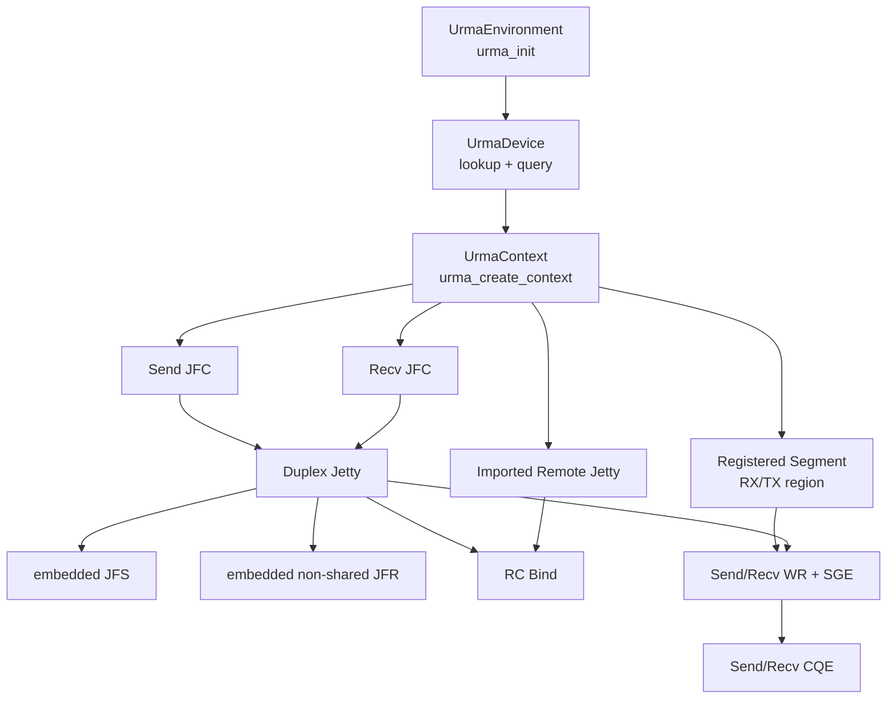
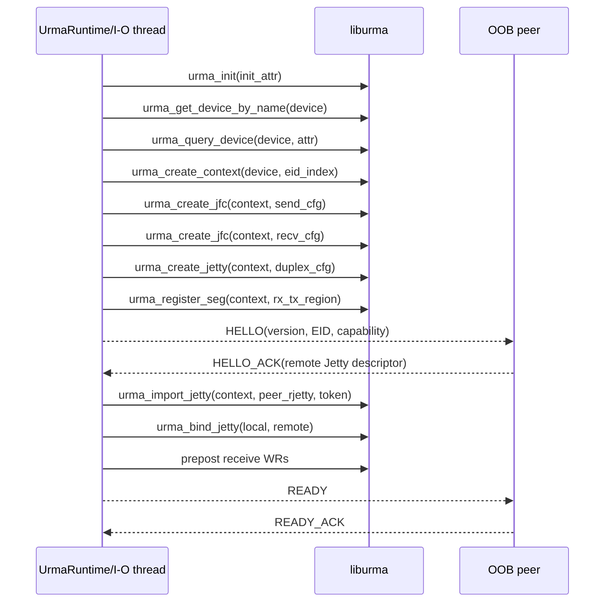
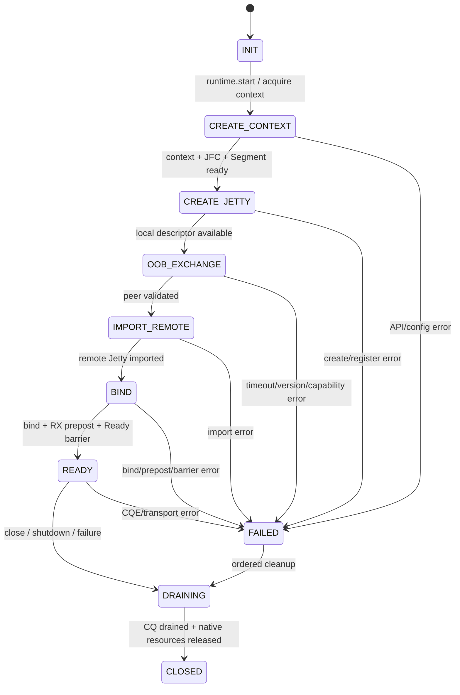
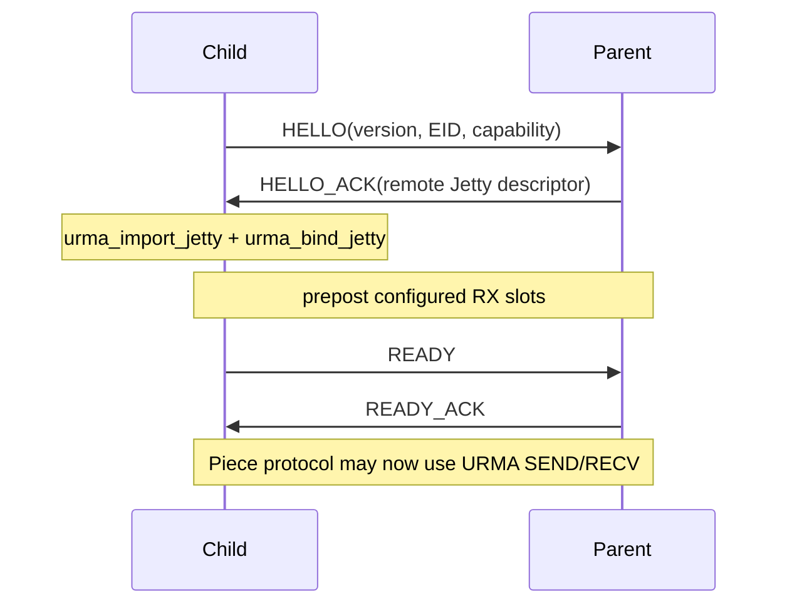
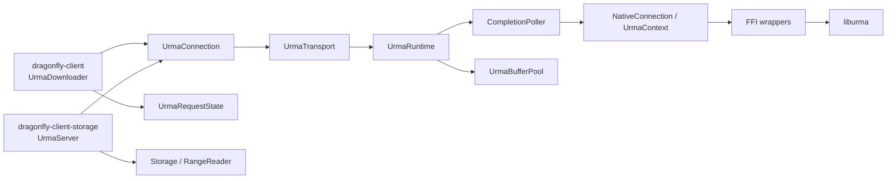

# Dragonfly URMA Transport Foundation Design v1.1

> [源码确认] 本文核对的 UMDK 基线为 `aef4007db28ec7e6311343f58b203858156737f7`；Dragonfly 根仓库基线为 `2acbb8b6414939919cfc8474bf0ba4c38ae2c8ba`，`client` 子仓库基线为 `017575a58d0abad6b3b274142fa470d47d8db327`。
>
> [架构设计] 本文承接 `urma-downloader-design-analysis-v2.md` 与 `urma-downloader-module-design-v2.md`，只设计 Phase 0/Phase 1 所需的底层 transport foundation：Linux、单进程 Runtime、单 Parent/Child、RC duplex Jetty、SEND/RECV、静态 OOB 配置和 copy mode。
>
> [架构设计] 本文不修改 Dragonfly/UMDK 源码，不设计 Scheduler endpoint 下发，不把 perftest 的 benchmark management protocol 直接作为生产协议，也不在第一阶段启用 one-sided READ/WRITE、zero-copy、UBS Memory 或远端 Segment 访问。

## v1.1 changes

- [架构设计] remove Segment from v1 handshake：Phase 0/Phase 1 只交换 EID、Jetty descriptor 和 capability，Segment descriptor 延后到 UBS Memory / RDMA READ/WRITE 阶段。
- [架构设计] simplify OOB：握手收敛为 `HELLO -> HELLO_ACK -> Child import/bind -> READY barrier`，OOB TCP 只承担控制面。
- [架构设计] add ReceivedData evolution：Phase 1 使用 `ReceivedData::Owned(Bytes)`，未来预留 `ReceivedData::Lease(BufferSlot)`。
- [架构设计] clarify buffer sizing：512 KiB `slot_size` 只是 prototype 起始参数，最终值由 benchmark 决定。
- [架构设计] 本次 review 不改变 Runtime/Connection/Completion 分层、不改变 I/O thread native ownership、不引入 Scheduler，也不实现 zero-copy 或 UBS Memory。

## 1. 结论摘要

1. [源码确认] `liburma` 的公共入口头文件是 `src/urma/lib/urma/core/include/urma_api.h`；它包含 `urma_types.h`，后者再包含 opcode 等定义。安装后头文件位于 `/usr/include/ub/umdk/urma`，共享库安装为 `/usr/lib64/liburma.so`。
2. [源码确认] API 实现分为三类：`urma_main.c` 负责 init/device/context，`urma_cp_api.c` 负责 JFC/JFS/JFR/Jetty/Segment 等控制面资源，`urma_dp_api.c` 负责 post/poll 数据面调用。
3. [架构设计] Rust FFI 分成 `sys` raw bindings、窄 RAII handle、I/O-thread-owned `UrmaContext` 三层。除 `ffi`/`native` 模块外，Dragonfly 代码不得看到 `*mut urma_*`、C union/bitfield 或直接调用 `urma_*`。
4. [架构设计] 第一阶段推荐 `wrapper.h + bindgen allowlist + 少量 C shim`：bindgen 处理函数签名、常量和普通 POD，C shim 处理 C bitfield 初始化、opaque descriptor 提取以及必要 ABI probe，避免 Rust 业务层依赖 UMDK 私有字段布局。
5. [源码确认] UMDK perftest 的 duplex 主路径是 init/device/context -> JFC -> Jetty -> Segment registration -> descriptor exchange/import -> bind -> WR；销毁前先将 Jetty 转 ERROR、drain outstanding WR，再 unbind/unimport 并逆序释放资源。
6. [架构设计] 第一阶段不单独创建 JFS/JFR：`urma_create_jetty()` 的 `urma_jetty_cfg_t` 内含 JFS 配置和非 shared JFR 配置；send/recv JFC 由 Runtime 创建并被 Jetty 引用。独立 `urma_create_jfs()`/`urma_create_jfr()` 留给未来 shared/simplex 模式。
7. [架构设计] Connection 应用状态机为 `INIT -> CREATE_CONTEXT -> CREATE_JETTY -> OOB_EXCHANGE -> IMPORT_REMOTE -> BIND -> READY`。其中 Context/JFC 实际由进程级 Runtime 复用；状态机中的 CREATE_CONTEXT 表示连接取得并验证 Runtime context，而不是每个连接重新创建 context。
8. [架构设计] OOB 使用静态配置的 TCP 地址，Phase 0/Phase 1 只交换 EID、opaque Jetty descriptor 与 capability。token/authorization material 由双端静态配置提供，不经明文 OOB 发送。
9. [架构设计] 第一阶段使用 RC SEND/RECV，不使用 one-sided READ/WRITE，也不需要 remote Segment import；Segment descriptor exchange 延后到未来 UBS Memory / RDMA READ/WRITE 阶段。
10. [架构设计] `UrmaTransport` 是 transport façade，`UrmaRuntime` 是进程级执行器，`UrmaContext` 只存在于 I/O 线程，`UrmaEndpoint` 是可序列化配置/身份，`UrmaConnection` 是 async 业务侧逻辑句柄；native handles 全部留在 poller 线程。
11. [架构设计] Completion 的上层 payload 统一为 `ReceivedData`：Phase 1 只实现 `Owned(Bytes)` copy path，未来才可能增加持有 registered `BufferSlot` 的 `Lease` path。

## 2. 范围与设计不变式

### 2.1 第一阶段范围

| 维度 | 决策 |
|---|---|
| 平台 | [架构设计] 仅 Linux + `feature = "urma"`；feature-off 不运行 bindgen、不搜索 UMDK、不链接 `liburma`。 |
| transport mode | [架构设计] `URMA_TM_RC`，一个 Peer 一个 duplex Jetty。 |
| data operation | [架构设计] `urma_post_jetty_send_wr()` / `urma_post_jetty_recv_wr()`，由 `urma_poll_jfc()` 获取 completion。 |
| resource owner | [架构设计] 一个 I/O OS thread 独占 native Context/JFC/Jetty/Segment handle。 |
| OOB | [架构设计] 静态 Parent listen address / Child parent address；TCP 只用于 handshake 和 Ready barrier。 |
| memory | [架构设计] Runtime 长期注册本地 RX/TX region；接收后 copy 到 `Bytes`。 |
| concurrency | [架构设计] 单 active connection、单 outstanding Piece；wire format 保留 connection generation/request ID。 |

### 2.2 必须始终成立的不变式

- [架构设计] `urma_init()` 与 `urma_uninit()` 只有进程级 owner；Piece、Connection 和独立 helper 不得各自调用 init/uninit。
- [源码确认] perftest 注释明确指出 `urma_uninit()` 非引用计数并会 `dlclose()` provider `.so`；任何仍通过 `ctx->ops` 使用 provider 的对象都必须先销毁。
- [架构设计] Context 活得比 JFC、Jetty、local/imported Segment 久；JFC 活得比引用它的 Jetty/JFS/JFR 久；registered memory 活得比引用其 SGE 的 WR 久。
- [架构设计] 未进入 READY 不得 post application Request；READY 必须晚于双方 bind 成功、RX 预投完成和 OOB Ready/ReadyAck barrier。
- [架构设计] 正常关闭不依赖 Rust struct 字段的隐式 Drop 顺序；必须由 I/O thread 执行显式 drain 和逆序销毁。
- [架构设计] OOB 收到的长度、版本、capability、descriptor 和 EID 都先验证再交给 FFI；不得把网络输入直接 cast 为任意 Rust/C struct 引用。
- [架构设计] native handle 第一阶段不实现无条件 `Send`/`Sync`；逻辑 API 通过 command channel 跨线程。

### 2.3 Message Size 与 `slot_size`

- [架构设计] `slot_size` 是 Phase 0/Phase 1 prototype 的内存切片与单条 message 上限参数，不是最终性能参数，也不应固化为 wire protocol 常量。
- [架构设计] prototype 可从 512 KiB `slot_size` 起步。它与当前 `PieceContentStream` 的 chunked `Bytes` 模型兼容，能够把常见 Piece 拆成数量可控的 Data messages，并验证跨多条 CQE 的 sequence/length/End 语义。
- [架构设计] 512 KiB 不表示一条底层链路 packet/MTU，也不意味着 provider 一次在物理网络上发送 512 KiB；URMA/provider 仍可在更低层分段，应用只把它视为一个 SEND/RECV message buffer 上限。
- [待验证] 最终 `slot_size`、RX/TX slot count 和 Data payload 应联合 benchmark，而不是单独调大 buffer。至少覆盖以下变量：

  - URMA MTU、provider 最大 message/SGE/inline 能力及其分段行为；
  - CQ/JFC depth、JFR/JFS depth、poll batch 与可用 receive credit；
  - Dragonfly Piece size 分布及 `PieceContentStream`/Storage 写入粒度；
  - `RX Buffer -> memcpy -> Bytes` 的 copy 成本，包括 CPU、memory bandwidth 和 cache pressure。

- [待验证] benchmark 应至少比较 64 KiB、128 KiB、256 KiB、512 KiB 和 1 MiB 候选值，并报告吞吐、P50/P99 latency、CQE rate、CPU、copy bandwidth、slot memory footprint 与 RNR/queue saturation；候选范围最终受设备 query 结果约束。

## 3. Rust FFI Layer

### 3.1 `liburma` C API 入口与头文件

| 类别 | 公共 API | UMDK 源码位置 | foundation 用途 |
|---|---|---|---|
| environment | `urma_init`, `urma_uninit` | [源码确认] `core/include/urma_api.h:22–33`；实现位于 `core/urma_main.c`。 | [架构设计] 进程级环境启停。 |
| device | `urma_get_device_list`, `urma_get_device_by_name`, `urma_get_eid_list`, `urma_query_device` | [源码确认] `urma_api.h:35–89`。 | [架构设计] 选择静态 device/EID，查询 queue/SGE/inline 等能力。 |
| context | `urma_create_context`, `urma_delete_context` | [源码确认] `urma_api.h:91–104`。 | [架构设计] 创建所有 JFC/Jetty/Segment 的父 context。 |
| completion | `urma_create_jfc`, `urma_delete_jfc`, `urma_poll_jfc` | [源码确认] `urma_api.h:115–135, 954–962`。 | [架构设计] 第一阶段各一个 send/recv JFC，poller batch poll。 |
| JFS/JFR | `urma_create_jfs/jfr`, `urma_delete_jfs/jfr`, `urma_modify_jfs/jfr` | [源码确认] `urma_api.h:200–348`。 | [架构设计] v1 不直接调用 create；理解为 Jetty 内部 send/recv resource，关闭时由 Jetty 路径处理。 |
| Jetty | `urma_create_jetty`, `urma_get_rjetty`, `urma_import_jetty`, `urma_bind_jetty`, 对应反操作 | [源码确认] `urma_api.h:462–612`。 | [架构设计] 创建本地 duplex endpoint、提取/交换 descriptor、导入并 bind remote。 |
| Segment | `urma_register_seg`, `urma_unregister_seg`；未来可能使用 `urma_get_seg_ctx/import_seg` | [源码确认] `urma_api.h:809–857`。 | [架构设计] Phase 0/Phase 1 只注册本地 RX/TX region，不导出、交换或 import remote Segment descriptor。 |
| data path | `urma_post_jetty_send_wr`, `urma_post_jetty_recv_wr`, `urma_poll_jfc` | [源码确认] `urma_api.h:877–893, 954–962`；实现位于 `core/urma_dp_api.c`。 | [架构设计] message SEND/RECV 与 CQE polling。 |

- [源码确认] 源码树公共 headers 为 `urma_api.h`、`urma_types.h`、`urma_opcode.h`、`urma_cmd.h`、`urma_provider.h`、`urma_types_str.h`、`urma_perf.h`，位于 `src/urma/lib/urma/core/include/`。
- [源码确认] `core/CMakeLists.txt` 构建 shared target `urma` 和 static target `urma_static`；shared library 版本为 `0.0.3`、SOVERSION 为 `0`，并链接 `urma_common`、`dl`、`rt`。
- [源码确认] 安装规则把 headers 放入 `/usr/include/ub/umdk/urma`，把 shared target 放入 `/usr/lib64`；provider library 由对应 provider target 安装到 library directory 下的 `urma/` 子目录。
- [待验证] 目标 Dragonfly 构建镜像与运行节点是否都采用上述默认安装路径，还是由 rpm/sysroot/容器提供其他 include、lib、provider 和 `urma.conf` 路径。

### 3.2 bindings 生成方案比较

| 方案 | 优点 | 风险 | 结论 |
|---|---|---|---|
| 对整个 `urma_api.h` 直接 bindgen | [架构设计] 原型最快，可覆盖全部函数和类型。 | [源码确认] public types 内含 anonymous union、bitfield、flexible array、`pthread_mutex_t`、C atomic/private pointer；生成结果受 clang/target ABI 影响。 | [架构设计] 只作为最初 API 探索，不让生成类型穿透到业务模块。 |
| `wrapper.h` + allowlist | [架构设计] 只生成 v1 用到的函数、常量、POD 和 opaque handles，编译面较小。 | [待验证] allowlist 的递归依赖仍可能拉入 libc/pthread 类型；不同 bindgen 版本的 bitfield accessor 需验证。 | [架构设计] Phase 0 推荐起点。 |
| 窄 C shim + bindgen shim header | [架构设计] Rust 只见稳定 DTO/opaque pointer；bitfield、flexible descriptor 和 UMDK header 变化收敛在 C 边界。 | [架构设计] 多一层 C 构建与错误映射，需要维护 ABI probe。 | [架构设计] Phase 1 推荐落点。 |
| 提交预生成 bindings | [架构设计] 构建机不需要 libclang，产物可 review。 | [架构设计] 易与目标 UMDK headers/架构漂移，必须绑定版本与 ABI 测试。 | [待验证] CI/交付环境无法提供 libclang 时再采用。 |

推荐布局：

```text
dragonfly-client-storage/
  build.rs
  src/urma/
    ffi/
      mod.rs              # 仅 crate 内可见的 raw re-export
      wrapper.h           # include <urma_api.h> 或 <ub/umdk/urma/urma_api.h>
      shim.h              # Dragonfly-owned C ABI
      shim.c              # bitfield/config/descriptor helpers
      bindings.rs         # include!(concat!(env!("OUT_DIR"), ...))
      error.rs            # status/null/errno context -> UrmaError
      handle.rs           # !Send/!Sync RAII handles
    native.rs             # I/O thread owner，调用 safe-ish wrapper
```

- [架构设计] `sys` bindings 使用 `pub(crate)`；`urma::mod.rs` 不 re-export raw C 类型。
- [架构设计] Phase 0/Phase 1 allowlist 至少覆盖 `urma_(init|uninit|get_device_by_name|get_eid_list|free_eid_list|query_device|create_context|delete_context|create_jfc|delete_jfc|create_jetty|modify_jetty|delete_jetty|get_rjetty|put_rjetty|import_jetty|unimport_jetty|bind_jetty|unbind_jetty|register_seg|unregister_seg|post_jetty_send_wr|post_jetty_recv_wr|poll_jfc)`；`get_seg_ctx/put_seg_ctx/import_seg/unimport_seg` 不属于第一阶段 binding 必需面。
- [架构设计] 只 allowlist v1 使用的 `URMA_SUCCESS`、`URMA_EEXIST`、`URMA_TM_RC`、`URMA_JETTY_STATE_ERROR`、SEND opcode/WR flags/access flags 和对应配置/WR/CR 类型。
- [架构设计] 对 `urma_context_t`、`urma_jfc_t`、`urma_jetty_t`、`urma_target_jetty_t`、`urma_target_seg_t` 在 Rust 层按 opaque handle 使用；Phase 0/Phase 1 需要 EID、Jetty ID/descriptor 时通过 shim 或 `urma_get_rjetty()` 复制出来，不读取 private fields。
- [架构设计] 对 `urma_jfc_cfg_t`、`urma_jetty_cfg_t`、`urma_seg_cfg_t`、WR/SGE 等含 bitfield/union 的输入，优先由 shim 接收无 bitfield 的 Dragonfly DTO 并在 C 中逐字段初始化；不得在 Rust 中 `transmute` packed bytes 为这些类型。

### 3.3 `build.rs` 设计

```text
if CARGO_FEATURE_URMA is absent:
    return without bindgen/cc/link directives

validate target_os == linux
resolve include dir:
    UMDK_INCLUDE_DIR
    or /usr/include/ub/umdk/urma
resolve lib dir:
    UMDK_LIB_DIR
    or /usr/lib64

compile shim.c with the same include dir
run bindgen on wrapper.h/shim.h into OUT_DIR
emit rustc-link-search=native=<lib dir>
emit rustc-link-lib=dylib=urma
emit rerun-if-changed / rerun-if-env-changed directives
```

- [架构设计] `build.rs` 读取 `CARGO_CFG_TARGET_OS/ARCH`，不是 host OS；非 Linux 且 feature-on 时给出明确 compile error，feature-off 则完全不触碰 UMDK。
- [架构设计] 支持 `UMDK_INCLUDE_DIR`、`UMDK_LIB_DIR`、`UMDK_PROVIDER_DIR` 和 `BINDGEN_EXTRA_CLANG_ARGS`。前两个用于编译/链接，provider path 只写入诊断或运行配置，不通过不安全的 build-time rpath 默默注入。
- [架构设计] 使用 `cargo:rerun-if-env-changed` 覆盖上述变量，使用 `cargo:rerun-if-changed` 覆盖 wrapper/shim；生成物只写 `OUT_DIR`。
- [架构设计] bindgen 固定版本，并关闭不必要 derive；对实际使用的 POD 开启 layout tests，另由 shim 暴露 `sizeof/alignof/offsetof` probe 与 Rust 侧启动测试互相核对。
- [架构设计] `liburma.so` 的 provider/config 是运行时依赖；build.rs 链接成功不代表 provider 可加载、device 可枚举或 EID 可用。
- [待验证] 目标 linker 是否仅需 `-lurma` 即可通过 ELF `DT_NEEDED` 解析 `urma_common/dl/rt`，还是静态/特殊工具链需要显式补充依赖。
- [待验证] cross compile 时 clang target/sysroot、目标 libc headers 和 UMDK target headers 必须一致；不能使用 host headers 生成 target bindings。
- [待验证] 仓库当前没有 `dragonfly-client-storage/build.rs`；最终是否把 shim 放在 storage crate 或拆出独立 `dragonfly-urma-sys` crate，需结合 feature 传播和 CI 缓存决定。

### 3.4 unsafe wrapper 边界

```text
Dragonfly async code
  -> UrmaTransport / UrmaConnection (safe API)
  -> bounded IoCommand / CompletionEvent
  -> native I/O thread
  -> ffi safe-ish wrappers
  -> ffi::sys + shim (unsafe)
  -> liburma / provider
```

| unsafe 操作 | wrapper 必须建立的前置条件 | safe 层得到的后置条件 |
|---|---|---|
| pointer-returning create/import/register | [架构设计] 参数已初始化、parent handle 有效、能力和长度已校验。 | [架构设计] null 转 `UrmaError`，非 null 放入唯一 RAII handle。 |
| status-returning delete/unbind/unregister | [架构设计] 没有 outstanding 引用/WR，状态允许销毁。 | [架构设计] 成功后 handle 标记 consumed，Drop 不重复调用。 |
| WR/SGE 构造与 post | [架构设计] SGE 落在 registered region 内，长度不溢出，slot owner 唯一，WR 链和 descriptor 至少活到 API 契约允许释放。 | [架构设计] post 成功转 InFlight；失败根据返回值与 `bad_wr` 精确回滚未入队 WR。 |
| CQ poll | [架构设计] CR array 有足够初始化空间，`cr_cnt` 不超过 capacity/provider limit。 | [架构设计] 只把实际返回的前 N 条转为 owned `CompletionRecord`。 |
| descriptor extraction | [架构设计] local Jetty 仍有效。 | [架构设计] Jetty descriptor 复制为 owned `Vec<u8>`，立即调用 `urma_put_rjetty()`；Segment descriptor extraction 留到未来阶段。 |
| descriptor import | [架构设计] network length/version/capability 已验证，buffer 对齐与生命周期满足 C API。 | [架构设计] 返回唯一 imported handle，失败不进入 BIND。 |

- [架构设计] RAII handle 采用 `NonNull<T>` + `PhantomData<Rc<()>>` 明确 `!Send + !Sync`；它们只在 native I/O thread 创建、使用和销毁。
- [架构设计] 正常 shutdown 使用显式 `close(self)`/owner state machine；Drop 只对“从未 post WR、尚未发布给其他对象”的初始化半成品做 best-effort 回滚。
- [架构设计] `UrmaError` 至少包含 operation、status/null、resource kind、connection generation 和可选 OS errno；日志不打印 token、完整 descriptor 或内存地址。
- [待验证] pointer-returning API 失败时是否稳定设置 `errno`，以及 post 返回后 C 是否仍持有 WR/SGE descriptor；在确认前 TX payload 与 WR metadata 都保留至 CQE/drain。

### 3.5 Runtime 如何调用 FFI

```rust
enum IoCommand {
    CreateConnection { id: ConnectionId, endpoint: UrmaEndpoint, reply: OneshotReply },
    PostSend { id: ConnectionId, generation: ConnectionGeneration, slot: TxSlotId, len: u32 },
    RepostRecv { id: ConnectionId, generation: ConnectionGeneration, slot: RxSlotId },
    CloseConnection { id: ConnectionId, generation: ConnectionGeneration, reply: OneshotReply },
    Shutdown { reply: OneshotReply },
}
```

- [架构设计] `UrmaRuntime::start()` 创建 command/completion channels 和 I/O thread；thread 内依次调用 `urma_init`、device lookup/query、`urma_create_context`、`urma_create_jfc`、memory allocation/`urma_register_seg`。
- [架构设计] Ready oneshot 只在所有进程级资源成功后完成；任一步失败都在同一 thread 按已创建资源栈回滚，再把结构化错误返回 async caller。
- [架构设计] `UrmaConnection::connect()` 不直接调 FFI，而是完成 TCP OOB orchestration并向 I/O thread 发送 create/import/bind/prepost commands；native connection entry 只存在于 poller 的 map 中。
- [架构设计] poller 每轮执行有上限的 commands、send JFC batch、recv JFC batch、pending delivery，然后 idle backoff；任何慢 OOB socket I/O 不在 busy-poll loop 中执行。
- [架构设计] OOB TCP codec/timeout 可运行在 Tokio；涉及 `urma_get_rjetty/import_jetty/bind_jetty` 的步骤通过 request/reply command 在 I/O thread 执行。Phase 0/Phase 1 不为 handshake 调用 `urma_get_seg_ctx()` 或 `urma_import_seg()`。
- [待验证] `urma_poll_jfc()` 与 post API 的 provider 线程安全保证；在结论前保持单 native thread 调用全部 Context/JFC/Jetty/Segment API。

## 4. URMA Resource Lifecycle

### 4.1 资源所有权树



- [源码确认] `urma_jetty_cfg_t` 直接包含 `jfs_cfg`，并通过 union 接收 shared JFR 或 `jfr_cfg`；perftest 在 `share_jfr == false` 时把 send/recv JFC 分别填进配置后调用 `urma_create_jetty()`。
- [架构设计] 图中的 embedded JFS/JFR 是所有权概念，不是 v1 单独持有的 `urma_jfs_t*`/`urma_jfr_t*`。v1 只保存 Jetty handle；未来 shared JFR/JFS 才增加独立 RAII handle。
- [源码确认] `urma_seg_cfg_t` 包含 VA、length、token/token_id、access/cache flag、user_ctx 和可选 IOVA；`urma_register_seg()` 返回 local `urma_target_seg_t*`，WR 的 local SGE 引用它。

### 4.2 创建生命周期



| 资源 | 创建 API | v1 生命周期 | 失败回滚 |
|---|---|---|---|
| environment | `urma_init` | [架构设计] dfdaemon process / `UrmaRuntime`。 | [架构设计] 仅在所有 Context/provider object 已销毁后 `urma_uninit`。 |
| device | `urma_get_device_by_name`, `urma_query_device` | [架构设计] Context 创建前选择；保存 owned capability snapshot，不把 device public fields传出 FFI。 | [架构设计] 无 Context 时直接结束 environment。 |
| Context | `urma_create_context` | [架构设计] 每 device/EID 每 Runtime 一个。 | [架构设计] 删除所有子资源后 `urma_delete_context`。 |
| send/recv JFC | `urma_create_jfc` | [架构设计] Runtime/poller 级，v1 各一个。 | [架构设计] 先删除所有引用 JFC 的 Jetty，再 `urma_delete_jfc`。 |
| JFS/JFR | embedded by `urma_create_jetty` | [架构设计] 与本地 duplex Jetty 同寿命。 | [架构设计] 由 `urma_delete_jetty` 路径释放。 |
| local Jetty | `urma_create_jetty` | [架构设计] Peer connection 级；v1 单 connection。 | [架构设计] 若已 bind/import，先 unbind/unimport。 |
| local Segment | `urma_register_seg` | [架构设计] Runtime 级，覆盖固定 RX/TX slots。 | [架构设计] 确认无 device access 后 `urma_unregister_seg`。 |
| remote Jetty | `urma_import_jetty` | [架构设计] Connection generation 级。 | [架构设计] 已 bind 先 unbind，再 `urma_unimport_jetty`。 |
| remote Segment | `urma_import_seg` | [架构设计] Phase 0/Phase 1 不创建，也不交换其 descriptor。 | [架构设计] 未来 UBS Memory / RDMA READ/WRITE 阶段若创建，先停止 one-sided WR/drain，再 `urma_unimport_seg`。 |

- [源码确认] perftest `create_duplex_ctx()` 的通用 benchmark 路径为 device/context -> duplex Jetty/JFC -> registered memory -> connection info exchange -> remote Segment import -> remote Jetty connect；其中 remote Segment 服务其 READ/WRITE 等测试场景。
- [架构设计] foundation v1.1 只采用与 RC SEND/RECV 有关的资源依赖：保留 local Segment 供本地 SGE 使用，但从 OOB 和 connection creation 中同时删除 remote Segment descriptor exchange/import。
- [待验证] `urma_create_jfc()` 配置中 header 注释把 `jfce` 标为 required，但 perftest polling path 可传 `NULL`；v1 是否允许无 JFCE 必须在目标 provider 验证。

### 4.3 正常关闭生命周期

```text
stop new connect/request/post
  -> connection state = DRAINING
  -> fail or wait logical requests
  -> urma_modify_jetty(JETTY_STATE_ERROR)
  -> poll/flush outstanding send and recv completions
  -> urma_unbind_jetty(local)
  -> urma_unimport_jetty(remote)
  -> urma_delete_jetty(local)
  -> urma_delete_jfc(send/recv)
  -> urma_unregister_seg(local)
  -> free registered backing memory
  -> urma_delete_context
  -> urma_uninit
  -> join I/O thread
```

- [源码确认] perftest `destroy_duplex_ctx()` 先 `modify_jetty_to_error()`、`drain_inflight_wr()`、`disconnect_jetty()`，再删除 connection info/Jetty/JFC、unregister memory、关闭 management channel，最后 delete Context/uninit。
- [架构设计] `unregister_seg` 与 `delete_jfc` 都必须晚于 WR drain；为保持与当前 perftest 的实证顺序一致，v1 使用 delete Jetty/JFC 后再 unregister Segment，而不是依赖“二者看似无引用”的推断自行换序。
- [架构设计] 初始化失败使用 creation stack 回滚；连接失败只回滚 remote import/bind/local Jetty connection state，不销毁进程级 Context/JFC/Segment，除非 Runtime 整体启动失败。
- [待验证] Jetty ERROR 后 recv WR 的 flush completion 数、`urma_flush_jetty()` 与普通 `urma_poll_jfc()` 的组合以及 drain timeout 上限，需用故障注入确认。

### 4.4 `ReceivedData` ownership evolution

Phase 1 的实际数据路径：

```text
CQE
  -> RX BufferSlot in registered memory
  -> memcpy
  -> ReceivedData::Owned(Bytes)
  -> PieceContentStream
  -> Storage
```

未来可能的数据路径：

```text
CQE
  -> ReceivedData::Lease(BufferSlot)
  -> PieceContentStream / Storage owner
  -> last owner drop
  -> return BufferSlot to CompletionPoller
  -> repost receive WR
```

```rust
enum ReceivedData {
    Owned(Bytes),
    // Reserved for a future phase; not implemented in Phase 0/Phase 1.
    Lease(BufferSlot),
}
```

- [架构设计] Phase 1 只实现 `ReceivedData::Owned(Bytes)`：CompletionPoller 在 recv CQE 后校验有效范围，复制为独立 `Bytes`，再按 backpressure 规则 repost RX slot。Storage 不持有 registered memory。
- [架构设计] Completion/RequestState 之间使用 `ReceivedData` 作为稳定所有权抽象，而不是把 poller 接口永久固定为裸 `Bytes`；stream adapter 在 Phase 1 只匹配 `Owned` variant。
- [架构设计] `ReceivedData::Lease(BufferSlot)` 只表示未来扩展点，可用于让 registered memory、zero-copy 或 UBS Memory 的 buffer owner 穿过 stream 生命周期；它在本版本没有构造路径、没有 Drop/repost 实现，也不改变当前 slot state machine。
- [架构设计] 即使未来实现 Lease，native repost 仍只能由 I/O thread/CompletionPoller 执行；Storage 或任意 Tokio worker 不获得 raw pointer、Segment handle 或直接调用 FFI 的权限。
- [待验证] Lease 方案需要独立验证 Bytes custom owner、跨线程 Drop、blocking Storage write、connection generation、shutdown fencing、DMA/cache consistency 和 UBS Memory API，不能由 Phase 1 copy path 推导正确性。

## 5. Jetty Connection State Machine

### 5.1 主状态机



### 5.2 每一步与 API 对应关系

| 状态 | 入口动作/API | 成功条件 | 失败与回滚 |
|---|---|---|---|
| `INIT` | [架构设计] 分配 `ConnectionId + generation`，校验静态 `UrmaEndpoint` 和 Runtime state。 | [架构设计] Runtime 未 Draining，当前无 active v1 connection。 | [架构设计] 无 native 资源，直接返回配置错误。 |
| `CREATE_CONTEXT` | [源码确认] 首次 Runtime 启动调用 `urma_init`、`urma_get_device_by_name`、`urma_query_device`、`urma_create_context`、`urma_create_jfc`、`urma_register_seg`。 | [架构设计] capability 接受 slot/JFC/SGE 参数，Context/JFC/Segment Ready。 | [架构设计] 进程级启动失败时逆序销毁；后续 connection 只 acquire 现有 context。 |
| `CREATE_JETTY` | [源码确认] `urma_create_jetty(context, jetty_cfg)`；随后 `urma_get_rjetty()` 导出 descriptor。 | [架构设计] local Jetty 非 null，descriptor 长度在上限内，local EID/ID 与 context 一致。 | [架构设计] `urma_put_rjetty` 后 delete local Jetty。 |
| `OOB_EXCHANGE` | [源码确认] local Jetty descriptor 由 `urma_get_rjetty()` 取得、用完由 `urma_put_rjetty()` 释放。 | [架构设计] HELLO/HELLO_ACK 的 magic/version/role/EID/capability/Jetty descriptor length 全部合法，协商为 RC + SEND/RECV。 | [架构设计] 关闭 OOB socket，delete local Jetty；不调用 import/bind。 |
| `IMPORT_REMOTE` | [源码确认] `urma_import_jetty(context, rjetty, token)`；perftest 根据 transport mode/type填 `rjetty` 后 import。 | [架构设计] 返回非 null target Jetty，descriptor transport mode/type 与协商一致。 | [架构设计] import 失败只释放 local descriptor/Jetty；成功后失败则 unimport。 |
| `BIND` | [源码确认] RC 模式调用 `urma_bind_jetty(local, target)`；API 说明 RC local Jetty 只能 bind 一个 remote Jetty。 | [架构设计] 返回 `URMA_SUCCESS`；同一调用上下文下可将预期的 `URMA_EEXIST` 作为幂等结果处理，然后预投全部 RX slots。 | [架构设计] post receive 部分成功时先 ERROR/drain，随后 unbind/unimport/delete。 |
| `READY` | [架构设计] 本地 bind + RX prepost 成功后发 OOB Ready；只有收到 peer Ready/ReadyAck 才发布 connection。 | [架构设计] 双方均有 receive credit，generation 已注册到 poller，OOB 协商结果冻结。 | [架构设计] 任何 CQE/protocol/timeout failure 原子切 Failed，拒绝新 post并广播 outstanding request error。 |

- [架构设计] 上述状态是 Dragonfly transport application state，不等同于 `urma_jetty_state_t` 的 `RESET/READY/SUSPENDED/ERROR`。两者必须分别记录，避免把“本地 native Jetty created”误判为“双端业务 Ready”。
- [源码确认] `urma_modify_jetty()` 可用 `JETTY_STATE` mask 把 native Jetty 改为 `URMA_JETTY_STATE_ERROR`；perftest 在销毁前这样做以触发 outstanding WR drain。
- [待验证] bind 成功后 native Jetty 的可查询状态、`URMA_EEXIST` 的精确幂等语义，以及双方同时 bind 的时序是否需要额外先后约束。

### 5.3 状态数据与 generation

```rust
enum ConnectionState {
    Init,
    CreateContext,
    CreateJetty,
    OobExchange,
    ImportRemote,
    Bind,
    Ready,
    Draining,
    Closed,
    Failed,
}

struct NativeConnection {
    id: ConnectionId,
    generation: ConnectionGeneration,
    state: ConnectionState,
    local_jetty: Option<UrmaJettyHandle>,
    remote_jetty: Option<UrmaTargetJettyHandle>,
    negotiated: Option<NegotiatedCapabilities>,
    posted_rx: u32,
    inflight_tx: u32,
}
```

- [架构设计] 每次重新连接递增 generation；所有 command、`user_ctx`、CQE route 和 ReturnRecvSlot 都同时校验 connection ID 与 generation。
- [架构设计] state 只由 I/O thread 修改；async `UrmaConnectionInner.state` 是用于快速拒绝新请求的镜像，不是 native cleanup 的事实来源。
- [架构设计] `Option<Handle>` 精确表示已经创建的回滚边界；进入下一状态前先保存 handle，再发布状态，保证任何失败点都能确定逆序清理集合。

## 6. OOB Handshake Design

### 6.1 静态拓扑

```text
Parent:
  role = parent
  oob_listen_addr = <static IP:port>
  device_name / eid_index = static config
  auth_token = static secret/config

Child:
  role = child
  parent_oob_addr = <static IP:port>
  device_name / eid_index = static config
  expected_parent_eid = optional static allowlist
  auth_token = same provisioned secret/config
```

- [架构设计] Parent 只监听显式配置地址，Child 只连接显式 Parent 地址；本阶段没有 Scheduler、announcer、protobuf endpoint、动态选 Parent 或 capability advertisement。
- [架构设计] 测试拓扑必须确保 Dragonfly 逻辑 Parent 与 `parent_oob_addr` 指向同一个实例；OOB 不负责修正调度结果。
- [架构设计] v1 可用于受控实验网络，但仍要限制 bind address、descriptor length、handshake timeout 和单连接数；不能把 perftest 固定 token 当成生产安全机制。

### 6.2 消息序列



- [架构设计] Phase 0/Phase 1 使用最小 client-initiated handshake：Child 用 HELLO 声明版本、本端 EID 和能力；Parent 用 HELLO_ACK 返回 Child 需要 import/bind 的 remote Jetty descriptor；随后双方以 READY/READY_ACK 确认 bind 与 RX prepost 已完成。
- [架构设计] OOB TCP 只负责控制面建链、错误报告和 READY barrier；Request/Metadata/Data/End/Error 以及所有 Piece bytes 必须走 URMA SEND/RECV，OOB 不参与 Piece 数据传输。
- [架构设计] 最小 OOB frame 只保留 magic、version、message type 和 bounded payload length；整数固定 network byte order，Jetty descriptor 作为 bounded opaque bytes，不直接 dump Rust/C struct。
- [架构设计] role 只决定 Parent listen/ACK 与 Child connect/import/bind；它不改变 READY 后的 duplex Piece message 语义。
- [待验证] 目标 RC provider 是否支持该 client-initiated/passive-Parent 建链模型，以及 Parent 如何确认对端 bind 已生效；若 native provider 要求对称 bind，应只调整 transport adapter 内部动作，不扩展 Piece protocol或引入 Segment handshake。

### 6.3 交换字段

| 字段 | 表示 | 校验与用途 |
|---|---|---|
| `EID` | [源码确认] `urma_eid_t` 是 16-byte network-order raw 值；Context 公开 local EID。 | [架构设计] HELLO 固定 16 bytes，可与静态 allowlist 比较；Parent identity 由返回的 Jetty descriptor 和静态 endpoint 共同约束。 |
| `Jetty descriptor` | [源码确认] Parent 使用 `urma_get_rjetty(local_jetty, &ptr, &len)` 获取，使用后 `urma_put_rjetty(ptr)`。 | [架构设计] HELLO_ACK 作为 opaque bounded blob 返回；Child 仅在 HELLO 已接受且 length 合法后交给 `urma_import_jetty`。 |
| `capability` | [架构设计] protocol version、transport type/mode、SEND_RECV、slot size、rx/tx depth、max SGE 和 max descriptor length。 | [架构设计] Parent 校验 HELLO；v1.1 只接受 RC + SEND_RECV，不包含 REMOTE_SEGMENT/READ/WRITE/UBS_MEMORY capability。 |

建议 capability DTO：

```rust
struct TransportCapabilities {
    protocol_version: u16,
    transport_type: TransportType,
    transport_mode: TransportMode,
    features: FeatureBits, // Phase 0/1: SEND_RECV only
    slot_size: u32,
    rx_depth: u32,
    tx_depth: u32,
    max_sge: u16,
    max_inline_data: u32,
    max_descriptor_len: u32,
}
```

- [架构设计] `slot_size` 由 Parent 校验并在本地形成 negotiated 上限；v1.1 配置若与本地 pre-registered slot layout 不兼容则握手失败，不在握手中动态重分配 registered memory。
- [架构设计] `urma_import_jetty()` 所需 token value来自本地静态配置，不经 HELLO/HELLO_ACK 传输。日志只记录 Jetty descriptor length/hash，不记录原始 bytes。
- [架构设计] Segment descriptor 不属于 Phase 0/Phase 1 OOB schema；只有未来明确启用 UBS Memory 或 RDMA READ/WRITE，并完成授权与所有权设计后，才新增版本化 capability 和 descriptor message。
- [待验证] `urma_get_rjetty()` 返回 descriptor 是否包含 provider-specific extension、是否可跨不同 patch version/provider 互通，以及 import API 对 buffer alignment/ownership 的要求。

### 6.4 握手失败与超时

| 失败点 | 本地处理 | 对端可见结果 |
|---|---|---|
| TCP connect/accept timeout | [架构设计] 删除本地 Jetty，保留 Runtime。 | [架构设计] 无连接或 EOF。 |
| version/capability mismatch | [架构设计] 发送 bounded OOB Error 后关闭，不调用 import。 | [架构设计] 明确 unsupported reason。 |
| malformed/oversized Jetty descriptor | [架构设计] 立即关闭，记录 peer + length，不把 bytes 交给 FFI。 | [架构设计] OOB ERROR 或 EOF。 |
| import/bind failure | [架构设计] 若已 import 则 unimport；删除 local Jetty。 | [架构设计] OOB ERROR 后关闭。 |
| RX prepost partial failure | [架构设计] Jetty -> ERROR，drain 已 post WR，unbind/unimport/delete。 | [架构设计] 不发送 READY，返回 OOB ERROR 或关闭。 |
| Ready barrier timeout | [架构设计] 与 partial failure 相同；不得假设 peer 已停止 post。 | [架构设计] connection never published。 |

## 7. Transport API Design

### 7.1 分层概览

```text
UrmaDownloader / UrmaServer
            |
            v
      UrmaConnection           Piece/request-facing logical handle
            |
            v
      UrmaTransport            connect/accept + capability/OOB façade
            |
            v
       UrmaRuntime             process-level command/completion executor
            |
            v
       UrmaContext             I/O-thread-only native owner
            |
            v
       ffi wrappers/sys        liburma boundary
```

### 7.2 `UrmaContext`

```rust
struct UrmaContext {
    environment: UrmaEnvironment,
    device: UrmaDeviceHandle,
    raw: UrmaContextHandle,
    device_attr: DeviceCapabilities,
    local_eid: Eid,
    send_jfc: UrmaJfcHandle,
    recv_jfc: UrmaJfcHandle,
    registered_memory: UrmaRegisteredMemory,
    _not_send_sync: PhantomData<Rc<()>>,
}
```

| 字段 | 生命周期/职责 |
|---|---|
| `environment` | [架构设计] 进程级 init guard；最后销毁，且一个进程只有一个 active owner。 |
| `device/raw` | [架构设计] 保存选定 device 与 Context；`raw` 是所有 native child resource 的父对象。 |
| `device_attr/local_eid` | [架构设计] 创建时复制成 Rust-owned snapshot，用于参数校验和 OOB identity。 |
| `send_jfc/recv_jfc` | [架构设计] v1 poller queues；创建 Jetty 时被配置引用。 |
| `registered_memory` | [架构设计] backing allocation + registered Segment + slot layout；Context close 前完成 drain/unregister/free。 |

- [架构设计] `UrmaContext` 不公开给 Downloader/Server，也不放入 `Arc`; 它是 I/O thread 中 `NativeRuntime` 的字段。
- [架构设计] `UrmaContext::open(config)` 完成 init/device/query/context/JFC/memory registration；`close(self)` 只在所有 NativeConnection 已关闭后执行。

### 7.3 `UrmaEndpoint`

```rust
#[derive(Clone, Debug)]
pub struct UrmaEndpoint {
    pub oob_addr: SocketAddr,
    pub device_name: String,
    pub eid_index: u32,
    pub expected_eid: Option<Eid>,
    pub role: EndpointRole,
}
```

| 字段 | 生命周期/职责 |
|---|---|
| `oob_addr` | [架构设计] 静态 bootstrap 地址；只用于 TCP handshake，不承载 Piece 数据。 |
| `device_name/eid_index` | [架构设计] local endpoint 的 device binding；v1 必须与 Runtime config 一致，连接后不可变。 |
| `expected_eid` | [架构设计] 可选静态 peer identity allowlist；对端 Hello EID 不匹配时在 import 前拒绝。 |
| `role` | [架构设计] 决定 listen/connect 和 Hello 顺序，不改变 duplex data capability。 |

- [架构设计] `UrmaEndpoint` 是静态配置与 peer identity，不包含 raw Jetty/Segment descriptor；Phase 0/Phase 1 只有 Parent Jetty descriptor 短暂存在于 HELLO_ACK session state，Segment descriptor 不出现。
- [架构设计] Parent endpoint 的 `oob_addr` 是 listen address，Child endpoint 是 connect address；role 必须显式，避免通过 address 是否为空推断。
- [架构设计] token 由单独的 secret/config handle 提供，不实现 `Debug`，避免 endpoint tracing 泄密。
- [待验证] device/EID 是全 Runtime 属性还是允许未来每 Endpoint 不同；v1 强制 endpoint 与 Runtime config 一致。

### 7.4 `UrmaConnection`

```rust
#[derive(Clone)]
pub struct UrmaConnection {
    inner: Arc<UrmaConnectionInner>,
}

struct UrmaConnectionInner {
    runtime: UrmaRuntime,
    id: ConnectionId,
    generation: ConnectionGeneration,
    peer: UrmaEndpoint,
    negotiated: NegotiatedCapabilities,
    state: AtomicU8,
    request_registry: RequestRegistry,
}
```

| 字段 | 生命周期/职责 |
|---|---|
| `runtime` | [架构设计] 强引用进程级 command/completion executor，保证 Connection 使用期间 Runtime 不被释放。 |
| `id/generation` | [架构设计] 从建链开始到 drain 完成保持不变；重连生成新 generation，隔离迟到 CQE。 |
| `peer/negotiated` | [架构设计] 保存静态 peer identity 与握手冻结的有效 capability，不保存 descriptor raw bytes。 |
| `state` | [架构设计] async 侧 READY/Draining/Failed 镜像，用于快速拒绝非法调用。 |
| `request_registry` | [架构设计] Piece request demux 属于上层 connection adapter；connection drain 时统一失败所有 entry。 |

- [架构设计] logical Connection 保证 Runtime 活着，通过 command queue post/close；它不持有 `UrmaJettyHandle`、remote descriptor 或 registered pointer。
- [架构设计] `send(OutboundMessage)` 先从 BufferPool 获取 TX lease并编码，再发送 `IoCommand::PostSend`；返回 future 只表示 post command 被接受或失败，send completion 另由 request/slot lifecycle处理。
- [架构设计] `close()` 幂等地进入 Draining、拒绝新 request、等待/失败 active requests，然后请求 I/O thread执行 native drain。
- [架构设计] Drop 不做阻塞 drain；若最后一个逻辑 handle意外 Drop，只发送 best-effort close command并记录 leaked/not-joined invariant violation。

### 7.5 `UrmaTransport`

```rust
#[derive(Clone)]
pub struct UrmaTransport {
    runtime: UrmaRuntime,
    local: UrmaEndpoint,
    policy: TransportPolicy,
}

impl UrmaTransport {
    pub async fn connect(&self, peer: UrmaEndpoint) -> UrmaResult<UrmaConnection>;
    pub async fn accept(&self, stream: TcpStream) -> UrmaResult<UrmaConnection>;
    pub async fn shutdown(self) -> UrmaResult<()>;
}
```

| 字段 | 生命周期/职责 |
|---|---|
| `runtime` | [架构设计] transport 的进程级执行基础；clone façade 共享同一个 Runtime。 |
| `local` | [架构设计] 本端静态 role/OOB/device/EID 配置，Runtime 启动后冻结。 |
| `policy` | [架构设计] 握手 timeout、descriptor 上限、允许的 protocol/mode/features 和单连接限制。 |

| 方法 | 职责 | 非职责 |
|---|---|---|
| `connect` | [架构设计] Child OOB connect、Hello/descriptor exchange、native import/bind/prepost、Ready barrier，成功后发布 logical Connection。 | [架构设计] 不创建 Piece RequestState，不解析 Dragonfly Piece protocol。 |
| `accept` | [架构设计] Parent 接收一个已建立 TCP stream，执行对称 handshake 并建立 Connection。 | [架构设计] 不调用 Storage，不处理 Request message。 |
| `shutdown` | [架构设计] 停 accept/connect，关闭全部 connection，随后显式关闭 Runtime/join I/O thread。 | [架构设计] 不依赖 Drop 或 Tokio task abort。 |

- [架构设计] `UrmaTransport` 是可选 façade，不替换 v2 的 `UrmaRuntime`；它把 OOB/state-machine 编排从 Downloader/Server 中抽离，让两端共享同一建链实现。
- [架构设计] v1 `accept` 只允许一个 active connection；未来 listener/multi-peer 可以在 façade 上扩展，不改变 native Context/JFC ownership。

### 7.6 `UrmaRuntime`

```rust
#[derive(Clone)]
pub struct UrmaRuntime {
    inner: Arc<UrmaRuntimeInner>,
}

struct UrmaRuntimeInner {
    config: UrmaRuntimeConfig,
    command_tx: mpsc::Sender<IoCommand>,
    completion_router: CompletionRouter,
    buffer_pool: Arc<UrmaBufferPool>,
    state: AtomicU8,
    io_thread: Mutex<Option<JoinHandle<UrmaResult<()>>>>,
}
```

| 字段 | 生命周期/职责 |
|---|---|
| `config` | [架构设计] 设备、EID、JFC depth、slot layout 与 poll 参数的已校验快照。 |
| `command_tx/completion_router` | [架构设计] async/native 边界；所有 native action 经 command，所有 CQE 以 owned event 返回。 |
| `buffer_pool` | [架构设计] 与 Runtime 同寿命的 backing memory/slot metadata；registered handle 仅在 `UrmaContext`。 |
| `state` | [架构设计] `Starting -> Ready -> Draining -> Stopped/Failed`，控制全局接收新工作。 |
| `io_thread` | [架构设计] 唯一 native owner 的 join handle；显式 shutdown 取走并等待。 |

- [架构设计] 该定义与 module-design-v2 保持一致；foundation 补充的是 I/O thread 内部持有 `UrmaContext + HashMap<ConnectionId, NativeConnection>`。
- [架构设计] Runtime API 只接受 owned IDs、slot leases 和 DTO；raw handle 不跨 command/completion channel。
- [架构设计] shutdown future 必须拿走并 join thread handle；重复 shutdown 返回既有结果或幂等 success，不再次 `urma_uninit()`。

## 8. 与既有 UrmaDownloader Module 的关系

### 8.1 依赖关系



- [架构设计] foundation 位于 `dragonfly-client-storage/src/urma/{ffi,native,runtime,transport,connection,buffer,completion,oob}`；`dragonfly-client` 的 `resource/urma_downloader.rs` 只依赖 storage crate 的公开 `UrmaConnection`/message API。
- [架构设计] `UrmaDownloader` 不负责 init、device selection、OOB、import/bind、RX prepost 或 shutdown；dfdaemon startup 先建立 `UrmaTransport + UrmaConnection`，再注入 Downloader。
- [架构设计] `UrmaServer` 不直接创建 native Jetty；它让 `UrmaTransport::accept()` 建立 Connection，然后消费 completion 层交付的 inbound Request event。
- [架构设计] v2 的 protocol、RequestState、`ReceivedData`、`PieceContentStream` 适配位于 foundation 之上；transport foundation 只保证“有边界的 message + completion/error + buffer ownership”，不理解 task ID、piece number、digest 或 Storage。

### 8.2 一次 Child 下载的跨层路径

```text
dfdaemon startup
  -> UrmaRuntime::start()
  -> UrmaTransport::connect(static parent endpoint)
  -> OOB + import/bind/prepost + READY
  -> UrmaDownloader::new(UrmaConnection)

download_piece()
  -> protocol encode Request
  -> UrmaConnection::send()
  -> IoCommand::PostSend
  -> CompletionPoller / liburma
  -> recv CQE
  -> transport ReceivedMessage
  -> UrmaRequestState
  -> Metadata oneshot / Data Bytes channel / End or Error
  -> PieceContentStream
  -> Storage
```

- [架构设计] transport 的 READY 与 Piece 的 Metadata/End 是不同层的完成条件；前者只说明可安全交换 URMA messages，后者才推进一次 Piece request。
- [架构设计] CQE success 只说明 WR transport completion，不说明 Child Storage 已写盘；该不变式继续由 module-design-v2 保持。

### 8.3 与 v2 类型的对齐与补充

| v2 类型/模块 | foundation 结论 |
|---|---|
| `UrmaRuntime` | [架构设计] 保持 public logical handle；补充 native `UrmaContext`、process-global init guard 和 build/FFI contract。 |
| `UrmaConnection` | [架构设计] 保持 request-facing handle；补充 INIT 到 READY 的 native state machine 和 OOB negotiation。 |
| `UrmaEndpoint` | [架构设计] 保持 `oob_addr/device/eid_index`；增加 explicit role 与 optional expected EID。 |
| `CompletionPoller` | [架构设计] 继续独占 native handles；OOB socket本身不进入 poll loop，只有 descriptor/API动作作为 command。 |
| `UrmaBufferPool` | [架构设计] local Segment 属于 Runtime；Phase 0/Phase 1 不 exchange/import remote Segment descriptor，不改变 copy-mode ownership。 |
| `protocol` | [架构设计] Piece protocol 与 OOB protocol 分离；二者使用不同 magic/version/message enum。 |
| `UrmaServer` | [架构设计] 从 transport 获得 Ready Connection 后才接 Storage；不拥有 FFI resource。 |
| `UrmaDownloader` | [架构设计] 从 Ready Connection 发 Request；不参与 transport capability negotiation。 |

## 9. 错误模型、可观测性与测试门槛

### 9.1 错误分类

| 类别 | 示例 | 处理边界 |
|---|---|---|
| build/ABI | header/library missing、layout mismatch | [架构设计] build failure 或 Runtime 启动前拒绝，不尝试降级调用。 |
| environment/device | init failure、device/EID not found、capability不足 | [架构设计] Runtime start 失败，逆序回滚，不创建 Connection。 |
| OOB protocol | version mismatch、oversized descriptor、timeout | [架构设计] Connection 建立失败，保留 Runtime。 |
| native control plane | create/import/bind/register failure | [架构设计] 按 state/creation stack 回滚，错误携带 operation/status。 |
| data plane | post failure、CQE error、RNR/timeout | [架构设计] 失败 request 或整代 Connection，进入 ERROR/drain。 |
| shutdown | drain timeout、delete/unregister failure | [架构设计] 继续 best-effort 逆序清理并返回 aggregated error；不得静默报告 clean shutdown。 |

### 9.2 必要 tracing/metrics

- [架构设计] Runtime：UMDK baseline/ABI fingerprint、device name、EID index、transport type、capability summary、start/shutdown duration。
- [架构设计] Connection：connection ID/generation、state transitions、OOB message type/latency、descriptor length/hash、negotiated slot/depth、bind/prepost结果。
- [架构设计] data plane：post/CQE count、status/opcode、completion length、inflight TX、posted RX、poll batch、RNR/timeout、drain count/duration。
- [架构设计] 安全：绝不记录 auth token、descriptor raw bytes、registered VA/IOVA、完整 payload。

### 9.3 Phase 0/1 验收门槛

1. [待验证] feature-off 在无 UMDK/libclang/provider 的普通 Dragonfly CI 中保持构建与测试通过。
2. [待验证] feature-on 能从明确 include/lib path 生成 bindings、编译 shim、链接 `liburma.so`，并通过 C/Rust layout probe。
3. [待验证] 重复 start/stop 100 次，无重复 `urma_uninit`、provider dangling handle、Context/JFC/Segment 泄漏。
4. [待验证] Child/Parent 完成 INIT -> READY 全状态机，双方 Ready 前已预投配置数量的 RX slots。
5. [待验证] OOB 分别注入 bad magic/version/role/EID、capability mismatch、descriptor 截断/超长和 timeout，均不把非法 bytes 交给 import API。
6. [待验证] Request/Metadata/多 Data/End standalone 闭环全部走 URMA SEND/RECV，OOB 字节计数不包含 Piece payload。
7. [待验证] import failure、bind failure、部分 RX prepost failure、CQE error 和 peer crash 均能进入有界 drain，并保留可再次建立新 generation 的 Runtime。
8. [待验证] Phase 0/Phase 1 不调用 `urma_get_seg_ctx()` 或 `urma_import_seg()`，OOB trace 中不存在 Segment descriptor，data-plane trace 可证明只有 SEND/RECV opcode。
9. [待验证] poll batch 上限遵守目标 provider；`urma_api.h` 注释指出 RDMA device 一次最多 poll 16 条 CR，该限制需纳入 config validation。
10. [待验证] shutdown 顺序经 trace 证明为 stop post -> Jetty ERROR -> drain -> unbind/unimport -> delete Jetty/JFC -> unregister Segment -> delete Context -> uninit。

## 10. 待关闭问题

1. [待验证] 目标 UMDK package 的 headers、`liburma.so`、`liburma_common.so`、provider `.so`、`urma.conf` 的最终安装/容器挂载路径。
2. [待验证] 目标 provider 对 `URMA_TM_RC`、duplex Jetty、non-shared JFR、无 JFCE polling 的确切支持矩阵。
3. [待验证] bindgen 对目标架构上 anonymous union/bitfield/pthread/atomic 类型的产出；哪些配置必须强制走 C shim。
4. [待验证] Phase 0/Phase 1 使用的 `urma_get_rjetty()` descriptor 的跨进程、跨小版本、跨 provider 兼容性和 maximum length；`urma_get_seg_ctx()` compatibility 延后到 UBS Memory / RDMA READ/WRITE 设计。
5. [待验证] `urma_import_jetty()` 所需 token policy/value 如何安全 provision；v1.1 静态 secret 的配置文件权限、轮换和日志脱敏规则。
6. [待验证] `urma_bind_jetty()` 的 client-initiated/passive-Parent 语义、`URMA_EEXIST`、native state query 和 retry 的精确行为。
7. [待验证] post 返回后 WR/SGE descriptor 的持有期限、`bad_wr` 指向规则和部分 WR 链入队时的 rollback。
8. [待验证] Jetty ERROR/flush 后每个 outstanding send/recv 是否都有 CR、drain timeout 后是否允许继续 delete/unregister。
9. [待验证] Segment registration 的 page/alignment/cacheability/access flag 与普通 allocator/huge page/UBS Memory 的约束；v1.1 先使用最保守的 local SEND/RECV access。
10. [待验证] OOB 是否需要 TLS/PSK MAC；即便第一阶段为受控静态环境，descriptor 完整性与 peer authentication 仍需在生产化前单独设计。

## 11. 源码核对索引

| 主题 | 源码位置 |
|---|---|
| public API/header install | [源码确认] `umdk/src/urma/lib/urma/core/include/urma_api.h`; `core/CMakeLists.txt:13–64` |
| public types/Context/EID | [源码确认] `core/include/urma_types.h:85–147, 303–406` |
| JFC/JFS/JFR config | [源码确认] `urma_types.h:430–498, 555–595, 648–682` |
| duplex Jetty config/remote descriptor | [源码确认] `urma_types.h:719–827`; `urma_api.h:462–612` |
| Segment registration/descriptor | [源码确认] `urma_types.h:978–1002`; `urma_api.h:809–857` |
| WR/CR fields | [源码确认] `urma_types.h:1086–1167`; `urma_api.h:859–962` |
| init/device/context implementation | [源码确认] `core/urma_main.c:251–299, 438–589` |
| control/data plane implementation | [源码确认] `core/urma_cp_api.c`; `core/urma_dp_api.c:250–379` |
| perftest init/JFC/Jetty/Segment | [源码确认] `urma_perftest/perftest_resources.c:153–286, 345–409, 625–698, 851–975` |
| descriptor exchange/import/bind | [源码确认] `perftest_resources.c:1048–1238, 1948–2052` |
| duplex create/rollback | [源码确认] `perftest_resources.c:2845–2915` |
| ERROR/drain/逆序销毁 | [源码确认] `perftest_resources.c:2926–3005` |
| 既有 Downloader foundation 边界 | [源码确认] `dragonfly/urma-downloader-design-analysis-v2.md`; `dragonfly/urma-downloader-module-design-v2.md` |
