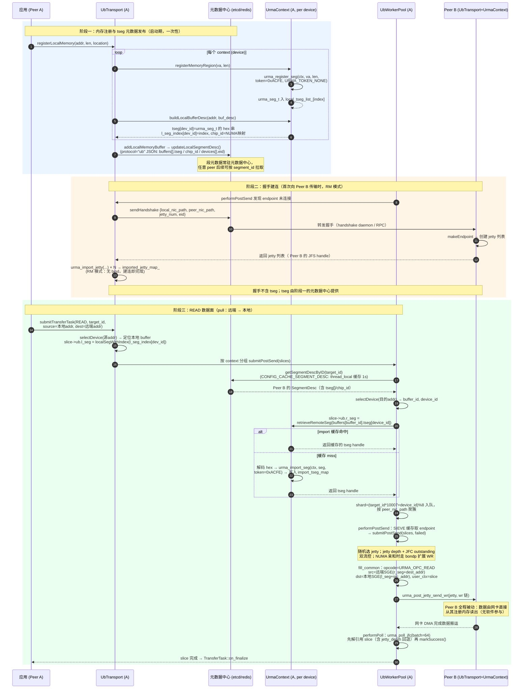

# Mooncake URMA 适配方案分析

> 分析对象：Mooncake 仓库（`/home/yuan/workspace/cloud-native/mooncake`）中基于 URMA（UMDK，openEuler Unified Bus 生态）的 UB Transport 适配实现。
> 结论速览：Mooncake 没有为 URMA 单独设计一套传输，而是复用其 RDMA Transport 的成熟框架（元数据 / 握手 / Slice 切分 / Worker Pool 轮询），通过一层「抽象 UB 传输层（Ub*）+ URMA 具体实现（Urma*）」的桥接结构，把 URMA 的 context/JFC/JFR/Jetty/Seg 模型逐一映射到 verbs 风格的资源模型上。架构上还预留了 OBMM 端点类型，但目前未实现。

## 1. 背景

UB（Unified Bus，统一总线）是与 RDMA/CXL/NVLink/TCP 同层的传输协议。URMA（Unified Remote Memory Access，umdk 仓库）是 UB 的用户态编程库，提供类似 RDMA verbs 的远程内存读写语义；OBMM 是同一协议族的另一套端点实现（目前 Mooncake 中仅是预留枚举，无实现，见 `UB_ENDPOINT_TYPE`）。

Mooncake 侧的入口是 `ub` 协议：

- Transfer Engine 安装传输时按协议名安装：`transfer_engine_impl.cpp:278` 调用 `installTransport("ub", ...)`；
- `multi_transport.cpp:332` 中 `proto == "ub"` 时 `new UbTransport()`（默认 `URMA_ENDPOINT`）；
- 元数据序列化按 `protocol == "ub"` 分支处理（`transfer_metadata.cpp:449, 858`）。

## 2. 总体架构

### 2.1 分层结构

```
MultiTransport (协议路由, "ub")
  └── UbTransport                          —— 传输框架层（照搬 RDMA Transport 骨架）
        ├── UbContext (抽象, per device)   —— 设备上下文抽象
        │     └── UrmaContext (实现)       —— URMA 资源: urma_context/JFC/JFR/JFCE/Seg
        ├── UbWorkerPool (per context)     —— 提交/轮询线程池（分片队列 + 重派 + 监控）
        ├── UbEndpointStore (SIEVE 缓存)   —— Endpoint 管理（NSDI'24 SIEVE 算法）
        └── UbEndPoint (抽象, per peer)
              └── UrmaEndpoint (实现)      —— URMA Jetty 建连 / 收发 WR
```

关键设计：**抽象层与实现层分离**。`UbContext` / `UbEndPoint` 是纯虚接口（`ub_context.h`、`ub_endpoint.h`），URMA 只是其中一种实现（`urma_endpoint.h` 中的 `UrmaContext` / `UrmaEndpoint`）。`UbTransport::buildContext()` 按 `endpoint_type_` 工厂化创建 context，目前只有 `URMA_ENDPOINT` 分支可用，`OBMM_ENDPOINT` 直接报"not support now"。这意味着将来接入 OBMM（或其他 UB 软件栈）只需新增一个 Context/Endpoint 实现。

### 2.2 源码索引

| 文件 | 职责 |
|---|---|
| `mooncake-transfer-engine/include/transport/kunpeng_transport/ub_transport.h` | UbTransport 声明，UB_ENDPOINT_TYPE 枚举 |
| `mooncake-transfer-engine/include/transport/kunpeng_transport/ub_context.h` | UbContext 抽象、UbWorkerPool、SIEVE Endpoint 缓存 |
| `mooncake-transfer-engine/include/transport/kunpeng_transport/ub_endpoint.h` | UbEndPoint 抽象（连接状态机） |
| `mooncake-transfer-engine/include/transport/kunpeng_transport/urma/urma_endpoint.h` | UrmaContext / UrmaEndpoint 声明 |
| `mooncake-transfer-engine/src/transport/kunpeng_transport/ub_transport.cpp` | install、内存注册、提交、selectDevice、资源初始化 |
| `mooncake-transfer-engine/src/transport/kunpeng_transport/ub_context.cpp` | Worker Pool、分片队列、poll/redispatch、SIEVE 实现 |
| `mooncake-transfer-engine/src/transport/kunpeng_transport/urma/urma_endpoint.cpp` | URMA 全部落地逻辑（设备打开、建连、post/poll） |
| `mooncake-transfer-engine/src/transport/kunpeng_transport/urma/mock_urma.cpp` | URMA API 的 mock 实现（无硬件测试用） |
| `mooncake-transfer-engine/src/transport/kunpeng_transport/ub_allocator.cpp` | UB 场景的 NUMA 内存分配器（libnuma） |
| `mooncake-common/FindUrma.cmake` | FetchContent 拉取 umdk 源码提供头文件 |
| `mooncake-transfer-engine/src/transport/kunpeng_transport/CMakeLists.txt` | ub_transport 目标构建，liburma.so 探测与 mock 回退 |

## 3. URMA 资源模型 → Mooncake 对象的映射

URMA 侧核心概念与 Mooncake 适配对象的对应关系（与 verbs 类比便于理解）：

| URMA 概念 | 类比 verbs | Mooncake 承载对象 | 说明 |
|---|---|---|---|
| `urma_context_t` | `ibv_context` | `UrmaContext::urma_context_` | 设备上下文，`urma_create_context(dev, eid_index)` 创建 |
| `urma_jfc_t`（Jetty Factory Completion） | `ibv_cq` | `UrmaJFC { native, outstanding }` | 每个 context `num_jfc_per_ctx` 个；发送/接收各一组（`jfc_list_` / `jfc_r_list_`） |
| `urma_jfce_t`（JFC Event Channel） | `ibv_comp_channel` | `UrmaContext::jfce_` | 本适配中 JFC 与 JFCE 一对一创建（代码注释明确说明），但创建 JFC 时 `jfce=NULL`，实际走轮询模式 |
| `urma_jfr_t`（Jetty Factory Receive） | shared `ibv_srq` | `UrmaJFR { native, outstanding }` | Jetty 通过 `share_jfr=1` 共享 JFR；注释标注"one-side write/read, jfr no used"（读/写为单边操作） |
| `urma_jetty_t`（JFS，Jetty Factory Send） | `ibv_qp` | `UrmaEndpoint::jetty_list_` | 每个 endpoint `num_jetty_per_ep` 个 jetty；每 jetty 有软件 `wr_depth_list_[i]` 深度记账 |
| `urma_target_jetty_t`（import 的对端 jetty） | 对端 QPN | `imported_jetty_map_` | `urma_import_jetty()` 导入对端 jetty；RM 模式直接把 `wr.tjetty` 指向它，RC 模式额外 `urma_bind_jetty()` 绑定 |
| `urma_target_seg_t`（本地注册内存段） | `ibv_mr` | `seg_region_list_` / `local_tseg_list_` | `urma_register_seg()`，token 固定 `0xACFE`，`URMA_TOKEN_NONE` 策略 |
| `urma_seg_t` → import 的 `urma_target_seg_t` | 对端 rkey | 元数据 `BufferDesc.tseg`（hex 字符串） | 对端把 `urma_seg_t` 序列化为 hex 放进元数据，本端 `urma_import_seg()` 导入并缓存到 `import_tseg_map` |

几个与 verbs 显著不同的适配要点：

1. **寻址方式**：URMA 用 EID（16 字节，形如 `01:02:...:10` 的字符串）代替 GID/地址。`openDevice()` 枚举 `urma_get_eid_list` 取第一个 EID，握手中对端 EID 从元数据 `DeviceDesc.eid` 读取，`transEidFromString` 做字符串→`urma_eid_t` 转换。
2. **传输模式**：`MC_URMA_TRANS_MODE` 支持 RM（默认）/ RC / UM（`parseTransMode`）。RM 模式下连接就是"导入对端 jetty + 写 `wr.tjetty`"，无显式绑定；RC 模式才有 `urma_bind_jetty`（类似 QP->RTS），且 deconstruct/disconnect 需要 `urma_unbind_jetty`。这一差异贯穿 `doSetupConnection` / `disconnectUnlocked` / `deconstruct` 三处分支。
3. **多路 bonding**：通过 `urma_user_ctl(BONDP_USER_CTL_SET_BONDING_MODE)` 在设备上设置 bonding——开启 multipath 时为 `BALANCE/IODIE`（chip 感知负载均衡），关闭时显式设置 `STANDALONE/PORT`（而不是留默认）。jetty 创建时 `jfs_cfg.flag.bs.multi_path` 同步该开关。

## 4. 数据路径

### 4.1 提交路径（initiator 侧）

`submitTransferTask`（`ub_transport.cpp`）：

1. `selectDevice` 按**源地址**在本地 SegmentDesc 的 BufferDesc 中定位 buffer 与设备（UB 的内存按 NUMA 节点各自独立成段，buffer 名即 `cpu:N` 位置，无需 RDMA 那种 offset→location 查表）；
2. 按 `slice_size` 切分为 `Slice`，末片可合并（`merge_final_slice`，容忍 `fragment_limit` 超限）；每个 slice 填充 `slice->ub.*` 专有字段：`l_seg`（本地 tseg 指针，由 `localSegWithIndex` 取出）、`dest_addr`、`src/dst_chip_id`；
3. NUMA 亲和开启时，从 `BufferDesc.chip_id`（注册时预计算的 NUMA→chip 映射）或 `parseCpuNumaNode` 填 `src_chip_id`；
4. 按 context 分组后调用 `context->submitPostSend`，攒够 watermark（`max_wr * num_qp_per_ep`）即提前 flush，避免大批量时内存膨胀。

`UbWorkerPool::submitPostSend`（`ub_context.cpp`）继续补全对端信息：

- 查对端 SegmentDesc（支持 `CONFIG_CACHE_SEGMENT_DESC` 的 thread_local 缓存，1 秒失效）；
- 对**目的地址**再做一次 `selectDevice`（支持 `enable_dest_device_affinity` 用本端设备名做 hint）；
- `slice->ub.r_seg = context_.retrieveRemoteSeg(tseg_string)` —— 命中 `import_tseg_map` 缓存或触发 `urma_import_seg`；
- 填 `dst_chip_id`（远端 buffer 的 chip 信息）；
- 按 `(target_id * 10007 + device_id) % 8` 分片进 8 个 shard 队列，再按 `peer_nic_path` 聚簇——保证同连接的 WR 在同一线程按序提交。

`performPostSend`：从 shard 队列搬运到线程本地 `local_slice_queue`（仍按 peer_nic_path 聚簇），经 SIEVE 缓存取 endpoint，未连接则 `setupConnectionsByActive` 建连，然后 `endpoint->submitPostSend(entry.second, failed_slice_list)`。

`UrmaEndpoint::submitPostSend`（`urma_endpoint.cpp:1155` 附近）是真正贴 URMA 的地方：

- 随机选一个 jetty（负载分摊），受两级流控：jetty 软件深度 `max_wr_depth_` 和 JFC outstanding `max_jfc_e`，满了直接返回（上层队列暂存，配合 `urma_queue_depth` 采样日志暴露 `jetty_full` / `jfc_full`）；
- 批量组 WR 链（`urma_jfs_wr_t.next`），`fill_common` 统一填 SGE：**按数据流向决定 src/dst**（READ 时 src 是远端 SGE），opcode `URMA_OPC_READ/WRITE`，`user_ctx = slice`；
- **NUMA/chip 亲和分支**：`MC_UB_NUMA_AFFINITY_ENABLE` 开启时改用扩展结构 `bondp_jfs_wr_t`，携带 `src_chip_id/dst_chip_id`（均取远端 chip，避免跨 chip 传输），通过 bondp 扩展 post；
- `urma_post_jetty_send_wr` 失败时遍历 `bad_wr` 链回滚 jetty/JFC 计数并把失败 slice 交给上层重派；
- 每个 slice 记 `jetty_depth = &wr_depth_list_[jetty_index]`，用于完成后批量回退深度。

### 4.2 完成路径

`UbWorkerPool::performPoll`（`ub_context.cpp:436` 附近）：

- 每个 worker 线程按 `thread_id` 步进认领若干 JFC，`UrmaContext::poll` 调 `urma_poll_jfc`（64 个/批）；
- 成功的 slice **就地 `markSuccess()` 且不返回**——注释强调所有对 slice 的解引用（包括聚合 `jetty_depth`）必须在 `markSuccess()` 之前完成，因为一旦发布完成，提交线程可能立刻回收 slice。这是一个显式处理的 use-after-free 风险点；
- 失败 slice 返回给调用方：`retry_cnt++`，未到上限的放入重派队列（`redispatch_counter_` 触发各线程重新分派）；达到 `max_retry_cnt` 则删除对端 endpoint 并最终 `markFailed()`；
- 错误熔断：连续 32 次失败且零成功则 `context_.set_active(false)`，设备级故障（async 事件 `URMA_EVENT_DEV_FATAL/JFC_ERR/PORT_DOWN/EID_CHANGE`）同样把 context 置 inactive 并断开全部 endpoint，`PORT_ACTIVE` 恢复。

### 4.3 连接建立（握手）

沿用 Mooncake 元数据中心（P2PHANDSHAKE/etcd/redis）的 RPC 握手框架，UB 版本只交换 `{local_nic_path, peer_nic_path, jetty_num, eid}`：

- 主动方 `setupConnectionsByActive`：`sendHandshake` 拿到对端 jetty 列表后逐个 `urma_import_jetty`（RC 模式再 `urma_bind_jetty`）；
- 被动方 `onSetupConnections`（`ub_transport.cpp`）：按 `peer_desc.peer_nic_path` 中的 NIC 名匹配本地 context，`context->endpoint(peer_nic_path)` 经 SIEVE 缓存创建/复用 endpoint 后 `setupConnectionsByPassive`；
- 全链路有 SpDiag 性能埋点（`PerfKey::UB_ENDPOINT_*`）和结构化的 `urma_active_setup_breakdown` / `urma_import_jetty_breakdown` 等日志，握手/建连/jetty 导入耗时分段可观测。

### 4.4 内存注册与元数据发布

- `registerLocalMemory`：对**每个** context 调 `urma_register_seg`（超过 `max_seg_size` 截断告警），然后 `buildLocalBufferDesc` 把 `urma_seg_t` 序列化为 hex 追加到 `BufferDesc.tseg`（vector，按设备序），同时记录 `l_seg_index`（本地 tseg 列表下标）——对端每个设备各有一份 tseg，与 context_list_ 下标对齐；
- `BufferDesc.chip_id`：注册时把 `cpu:N` 的 NUMA 节点经 `numaNodeToChipId` 预计算，运行时直接读，免去每 slice 解析；
- `ub_allocator.cpp`：UB 专用分配器，用 `numa_alloc_local/onnode`（libnuma 家族）而非裸 mmap+mbind——注释说明原因是保证 URMA 能成功注册；维护全局 range 表支撑 `ub_is_store_memory` 判断与释放。

## 5. 设备发现与拓扑

- `topology.cpp`（`USE_UB` 编译条件下）：`listUBDevices` 调 `urma_init` + `urma_get_device_list` 枚举设备（含 PCI/NUMA 信息），`discoverCpuTopology` 挂到拓扑矩阵；探测完即 `urma_uninit` 释放；
- `initializeUbResources`：按拓扑 HCA 列表逐个 `buildContext`；拓扑为空时回退 `mock_urma_device`（配合 mock 库测试）；单设备构造失败则 `topology->disableDevice` 剔除，全部失败才报 `ERR_DEVICE_NOT_FOUND`；
- `UrmaContext::construct` 中 `updateUrmaGlobalConfig` 会按 `urma_query_device` 返回的设备能力（`max_jetty` / `max_jfc`）下调全局配置，防止配置超出硬件容量。

## 6. 构建集成

两条获取 URMA 头文件/库的路径并存：

1. **系统安装**（官方文档 `docs/source/design/transfer-engine/kunpeng_ub_transport.md`）：`yum install umdk-urma-devel` 或源码编译，构建时 `-DUSE_UB=ON -DURMA_INCLUDE_DIR=... -DURMA_LIBRARY=/usr/lib64/liburma.so`；
2. **FetchContent**（`mooncake-common/FindUrma.cmake`）：`USE_UB` 开启时由 `common.cmake:103-106` include，自动拉取 `atomgit.com/openeuler/umdk` v25.12.0.B081，取其 `src/urma/lib/urma/core/include` 与 `bond/include` 作为 `urma_INCLUDE_DIR`（bond 目录对应 bondp 扩展头文件）。

`kunpeng_transport/CMakeLists.txt` 的策略：

- `find_library(URMA_LIBRARY urma PATHS /usr/lib64)`；
- 找到 → `ub_transport` OBJECT 库链接真实 `liburma.so`；
- 找不到 → **把 `urma/mock_urma.cpp` 追加进源码**，构建内置 mock 版本并打 WARNING（注释明确：mock 永不进 ub_transport 库的正式构建，测试直接单独编译 mock 源文件）。

## 7. 测试与 Mock

- `mock_urma.cpp`：用进程内 map/deque 模拟 `urma_init/get_device_list/create_context/jfc/jfr/jetty/register_seg/import_*/post/poll` 全套 API，设备属性/EID 均为固定假值（EID `01:02:...:10`，1 个 ACTIVE 端口，100G/MTU4096）。这让无鲲鹏 950/UB 硬件的环境可以跑通整条软件路径；
- `tests/ub_transport_test.cpp` + `tests/CMakeLists.txt`：测试目标直接把 mock_urma.cpp 编进可执行文件并排除真实库，覆盖 `MultiWrite` / `MultipleRead`（含数据校验），环境变量 `MC_METADATA_SERVER` / `MC_LOCAL_SERVER_NAME` 可配；
- 真机验证用 `transfer_engine_bench --protocol=ub --device_name=urma0,...`，支持多设备。

## 8. 配置项一览（URMA 相关）

| 环境变量 | 默认 | 作用 |
|---|---|---|
| `MC_URMA_TRANS_MODE` | RM | 传输模式 RM/RC/UM，影响 jetty import/bind 行为 |
| `MC_URMA_ACTIVE_PORT` | -1（自动扫描） | 指定活动端口号 |
| `MC_URMA_BONDING_MULTIPATH_ENABLE` | off | 开启 bondp BALANCE/IODIE 多路径 |
| `MC_UB_NUMA_AFFINITY_ENABLE` | off | 开启 chip 亲和（`bondp_jfs_wr_t` 携带 src/dst chip） |
| `MC_URMA_BONDING_BALANCE` | off | 记录 bonding balance 标志 |
| `MC_EID_INDEX` | 0 | EID 索引（全零 EID 会被 `CONFIG_SKIP_NULL_GID_CHECK` 之外的路径拒绝） |
| `MC_NUM_CQ_PER_CTX` | - | 同时设置 `num_jfc_per_ctx` / `num_jfce_per_ctx`（JFC 与 JFCE 一对一） |
| `MC_MAX_EP_PER_CTX` / jetty/JFC 深度等 | - | 复用全局传输配置，构造时受设备能力上限约束 |

## 9. 设计评价与可借鉴点

**做得好的：**

1. **接口抽象先行**：UbContext/UbEndPoint 纯虚接口 + 工厂（buildContext/makeEndpoint），URMA 只是第一个实现，OBMM 预留了扩展位——新增 UB 软件栈不必改动传输框架；
2. **最大限度复用 RDMA 框架资产**：Slice 模型、批量提交、SIEVE endpoint 缓存、redispatch 重试、元数据握手协议、拓扑发现全部与 RDMA Transport 同构，`selectDevice` 甚至是静态共用逻辑；学习成本和回归风险低；
3. **并发安全考虑细致**：poll 路径"先解引用后 markSuccess"的注释与实现、post 失败按 bad_wr 链精确回滚计数、jetty/JFC 两级软件流控、slice 的 `jetty_depth` 指针批量回退，都是围绕 slice 生命周期竞态的针对性设计；
4. **可观测性**：SpDiag 性能点 + 分段耗时日志（handshake/import/create_jetty/queue_depth）+ NUMA 采样日志（万分之一采样率）；
5. **渐进降级**：拓扑空→mock 设备；单设备失败→disable 其余继续；无 liburma→mock 库；multipath 关闭时也显式设置 STANDALONE 而非依赖隐式默认。

**可关注的风险/局限：**

1. **Jetty 选择纯随机**：`SimpleRandom::Get().next(jetty_list_.size())`，同一连接可能集中打在一个 jetty 上造成深度不均（JFC 满时直接返回 0，靠上层队列缓冲），无 per-jetty 负载均衡；
2. **`seg()` 线性扫描**：`buildLocalBufferDesc` 按地址线性查 `seg_region_list_`（读锁内），注册 buffer 很多时是 O(n)，与 RDMA 版的区段树结构不同；
3. **OBMM 仅占位**：`UB_ENDPOINT_TYPE` 的设计承诺尚未兑现，选 OBMM 会直接报错；
4. **token 硬编码**：`urma_token = {0xACFE}` 固定值、`URMA_TOKEN_NONE` 策略，未使用 URMA 的 token 校验能力（安全模型依赖部署环境）；
5. **接收侧几乎空转**：JFR 创建后仅服务于 RC 场景，单边 READ/WRITE 语义下接收端无 per-message 处理，若未来要用 SEND/RECV（如两边消息语义）需要补 JFR 轮询路径。

## 10. 对 Dragonfly URMA 适配工作的参照意义

结合 engineering-lab 中已有的 dragonfly-urma-adaptation 系列，Mooncake 方案提供了几个直接可复用的模式：

- **provider 抽象等价物**：Mooncake 的 UbContext/UbEndPoint 拆分即我们 downloader 设计里的 TransportProvider 接口思想——先抽象（init/post/poll/import seg/jetty 建连），后落地 URMA 实现；
- **seg import 缓存**：`import_tseg_map`（shared_mutex + 双检）+ 元数据 hex 序列化方案，可直接对照 dragonfly 的 buffer 生命周期管理（见 `urma-buffer-lifecycle-analysis.md`）；
- **软件流控**：jetty depth + JFC outstanding 双计数、满了不阻塞只暂存、poll 后批量回退——比简单 per-WR outstanding 更适合批量小片场景；
- **mock 优先的开发/测试策略**：mock_urma.cpp 全 API 模拟 + CMake 自动回退，验证了"无硬件跑通全链路、有硬件只换库"的可行性，与我们 phase-A 的 mock provider 路线一致；
- **RM 模式的极简建连**：RM 下建连 = import 对端 jetty + 记 tjetty 指针，无状态交换、无重连状态机（断连即 reset jetty），是当前阶段最合适的语义，与我们 RM-read 选型结论互相印证。

## 11. 数据操作与传输模式：Mooncake vs Dragonfly 方案对比

> 参照文档：`dragonfly-urma-adaptation/rm-read/dragonfly-urma-rm-read-design-and-roadmap.md`、
> `dragonfly-urma-adaptation/urma-stage-summary/Dragonfly-URMA-RC-RM-technical-solution-discussion-2026-09-10.md`。

### 11.1 Mooncake 的选择（源码确认）

- **传输模式**：默认 RM，可配 RC/UM（`MC_URMA_TRANS_MODE`，`parseTransMode` 默认 `URMA_TM_RM`）；
- **数据操作**：纯 one-sided READ/WRITE，无 SEND/RECV——`UrmaEndpoint::submitPostSend` 只发 `URMA_OPC_READ` / `URMA_OPC_WRITE`；JFR 创建处的注释直接写明 `/* one-side write/read, jfr no used */`；
- **RM 建连** = `urma_import_jetty` 对端 jetty + 写 `wr.tjetty`，无需 bind；RC 模式才多一步 `urma_bind_jetty`；
- **搬运方向**由 SGE 的 src/dst 按 opcode 交换决定，均以 import 的远端段（token 寻址）为目标。

### 11.2 多方案对比表

| 维度 | Mooncake | Dragonfly（RC 基线） | Dragonfly（RM 分支） | Dragonfly（RM+READ 目标方案） |
|---|---|---|---|---|
| 传输模式 | RM（默认）/RC 可配 | RC per-peer persistent Lane | RM 共享 endpoint | RM 共享 endpoint |
| 数据操作 | one-sided READ/WRITE | SEND_IMM + RECV（双边） | SEND/RECV + RecvPosted credit | **纯 one-sided READ pull** |
| 接收端角色 | 被动，数据直接写远端段 | post RECV、发 credit | post RECV、发 credit | **主动 pull，本地控制 RX buffer** |
| Endpoint 组织 | per-device Context + SIEVE 缓存 per-peer endpoint | per-peer Lane（Jetty/JFR/bind） | 进程级 shared Jetty/JFS/JFR + PeerTarget | 同左 |
| 内存注册 | 注册即常驻（store 内存），tseg hex 走元数据交换 | 进程级预注册 64 KiB slot pool | 同左 | **per-Piece 动态 mmap/register/export/revoke** |
| 控制面 | 元数据中心（P2PHANDSHAKE/etcd）+ 握手 RPC | TCP（PieceRequest/RecvPosted/Done） | TCP | TCP（+SegmentOffer/ReadDone/Done gate） |
| 流控 | jetty depth + JFC outstanding 双软件计数 | RecvPosted credit + pool 背压 | 同左 + 全局 RX admission | byte-budget permit + export 预算 |
| 失败边界 | slice 级重试，超限删 endpoint | 整 Piece reset + TCP fallback | 整 Piece reset + TCP fallback | 整 Piece 失败 + TCP fallback |

### 11.3 本质差异

1. **数据方向语义**。Mooncake 是"写入方决定"：发起端直接操作远端已注册内存（READ pull 或 WRITE push 均可）。Dragonfly RM+READ 方案刻意选了 Child pull，理由是接收端控制内存/背压、Parent 免 per-Chunk SEND、可消除 source-fill copy；WRITE 明确排除在第一阶段外（迟到 DMA 覆盖新 generation 的风险）。Mooncake 的 READ 本质上就是同样的 pull 模式——但其场景是 KV cache 预注册大段常驻内存，不需要 Dragonfly 那套 per-Piece offer/revoke 协议。

2. **内存注册生命周期完全不同**。Mooncake：store 内存长期驻留、注册一次、tseg 发布到元数据中心被任意 peer import（固定 token `0xACFE`，信任部署环境）。Dragonfly：RM+READ 是 per-Piece 短租约——mmap → register → SegmentOffer → import → READ → ReadDone → **验证式 revoke** → unregister，且有 quarantine 处理"撤权不可证明"的情况。这是动态 P2P 与常驻 KV pool 的核心区别：Mooncake 方案直接照搬会不安全（固定 token + 无撤权验证）。

3. **完成语义**。Mooncake 发起端 poll 本地 CQE 即完成（one-sided 无对端确认）。Dragonfly 保留 ReadDone/Done 的 terminal gate——Parent 无对称 CQE，需要协议层声明才能安全撤权释放 source。这是 Dragonfly 设计中最关键的正确性约束；Mooncake 因内存常驻而完全回避了这个问题（其设计评价中"token 硬编码"的风险即来源于此）。

4. **RM 的价值定位一致**。两者都用 RM 降低动态 peer 下的连接资源/churn：Mooncake 的 SIEVE endpoint 缓存 + 共享 JFC/JFR 本质等价于 Dragonfly 的 shared RM endpoint + PeerTarget；且都不把"直接提带宽"当切换理由。

### 11.4 结论

Mooncake 当前形态 = **RM + one-sided READ/WRITE over 常驻注册内存**，可视为 Dragonfly RM+READ 目标方案的"简化终态"；Dragonfly 设计中新增的 per-Piece offer/revoke、ReadDone/Done gate、quarantine 与字节预算，正是把该形态改造成动态 P2P 语义所必须补的部分。

## 12. tseg 元数据发布与 READ 完整时序

> 以下时序全部对照源码验证：`ub_transport.cpp`（registerLocalMemory / submitTransferTask / onSetupConnections）、`ub_context.cpp`（submitPostSend / performPostSend / performPoll）、`urma_endpoint.cpp`（registerMemoryRegion / buildLocalBufferDesc / retrieveRemoteSeg / submitPostSend / poll）、`transfer_metadata.cpp`（updateLocalSegmentDesc / getSegmentDescByID）。

### 12.1 关键前置事实

1. **每个 device（context）一份 tseg**：同一块内存对每个 URMA 设备各 `urma_register_seg` 一次，`BufferDesc.tseg` 是 vector，下标与 `context_list_` 对齐；`l_seg_index[device_id]` 记录本端取回 tseg 句柄的下标（`ub_transport.cpp:329-331`）。
2. **tseg 走元数据中心而非握手**：握手 RPC 只交换 `{local_nic_path, peer_nic_path, jetty_num, eid}`（用于 import jetty）；段信息（含 tseg hex、chip_id）由 `updateLocalSegmentDesc()` 序列化成 `protocol=="ub"` 的 JSON 发布到 etcd/redis（`transfer_metadata.cpp:858`），对端按需 `getSegmentDescByID` 拉取。
3. **import 有进程级缓存**：`retrieveRemoteSeg` 先读 `import_tseg_map`（shared_mutex 双检），miss 才 `urma_import_seg` 并缓存（`urma_endpoint.cpp:414-435`）。
4. **READ 数据方向**：`fill_common` 按 opcode 决定 SGE src/dst——READ 时 src 是远端 SGE（`r_seg + dest_addr`）、dst 是本地 SGE（`l_seg + src_addr`），即 pull。

### 12.2 时序图



### 12.3 时序要点解读

1. **"发布"是一次性的、"import"是按需的**：tseg hex 在注册期就进元数据中心；对端直到第一次真正要碰这块内存（阶段三第 12-14 步）才 `urma_import_seg`，且进程内只 import 一次。对比 Dragonfly per-Piece 短租约，这里 import 后 tseg 永不 revoke——因为 KVCache store 内存生命周期等同进程。
2. **READ 发起端只用两根指针**：`l_seg`（本地句柄，注册期预建、`l_seg_index` 直取）+ `r_seg`（对端句柄，import 缓存直取），提交路径上无任何锁竞争点（各自读锁查缓存）。
3. **失败重试与缓存失效**：`getSegmentDescByID(target_id, force_update=true)` 仅在 selectDevice 失败时强制重拉元数据；`retrieveRemoteSeg` 失败会让 slice markFailed 走 redispatch。tseg 本身永不变化（地址固定），所以缓存无失效问题。
4. **对端零参与**：READ/WRITE 完成不需 Peer B 任何确认（无 Done gate），这是常驻内存假设带来的简化——Dragonfly 无法照搬此点，是其必须保留 ReadDone gate 的根源（见 11.3）。

### 12.4 根因总结：内存生命周期差异 → 复杂度差异（Done gate 详解）

核心在于一个安全前提：**"你还能读我的内存"这件事，在数据被读走之后还能不能继续成立**。

Mooncake 的 READ 场景：Peer A 读 Peer B 的 KVCache，内存生命周期为：

```
注册（进程启动）→ 挂在元数据中心被任意 peer import → ...永远可读... → 进程退出
```

发起端 poll 到本地 CQE，就证明网卡已经从 Peer B 的内存里把数据读完了（硬件保证）；之后这块内存**继续原样放着**，下一个 peer 还能来读同一份 KVCache。B 不需要知道"谁读走了、读完了没有"，因为读完之后内存内容不变、也不释放——**"读完"这个事件对数据源没有任何后果**，所以确认消息没有存在的意义，发起端 CQE 就是完备的完成语义。

Dragonfly RM+READ 的场景：数据本体在磁盘文件上，URMA 传输必须走一条"临时管道"：

```
磁盘读出 → mmap 到内存 → register → SegmentOffer → 对端 READ → revoke → unmap → 内存复用
```

每传一个 Piece 都要走一遍这个生命周期。Parent 是数据源，**不在 READ 事务的完成路径上**（硬件完成事件只通知发起方 Child），却在什么时刻才能安全 revoke + unmap 的问题上束手无策：凭时间猜不行（Child 可能还在读，unmap 会导致 Child 网卡 DMA 到已释放地址）。所以必须由 Child poll 到 CQE 后**主动回报**：

```
Child: CQE 到了 → 数据确认落在我这了
Child → Parent: ReadDone
Parent: 收到 ReadDone → 此刻才确定没人再会碰这块内存 → revoke/unregister 安全
```

这条 ReadDone 就是 **terminal gate**：不是性能优化，而是"撤权安全性证明"的唯一依据。Child 崩溃导致 ReadDone 永远不来时，Parent 不能无限期锁着内存也不能贸然回收——这是 **quarantine**（超时未确认的 segment 隔离挂起、不回收）存在的原因。

| | 数据源内存 | 读走之后 | 谁知道完成 | 需要 Done 吗 |
|---|---|---|---|---|
| Mooncake | 常驻、内容不变、不释放 | 继续可读 | 发起端 CQE | 不需要 |
| Dragonfly | 短租约、读完要回收复用 | 必须收回/复用 | 只有发起端知道 → 必须回报 | 必须（否则撤权不安全） |

**一句话：one-sided READ 把"完成事件"只送到了发起方手里；谁掌握回收权，谁就需要这个事件。** Mooncake 回收权跟内存生命周期同寿（进程退出才回收），发起方知道即等于世界知道；Dragonfly 回收权在 Parent 手里，事件必须跨一跳送回去。

### 12.5 复杂度守恒：差异不在数据形态，而在内存是否"租的"

- **Mooncake**：KVCache 本来就常驻在注册好的大块内存里（Store 的 pool），数据**天生就在 URMA 可访问的内存中**，适配只需解决"怎么让对方知道这块内存"+"怎么读写"，其余全是数据面优化（缓存、流控、NUMA 亲和）。
- **Dragonfly**：数据本体在磁盘文件上，每个 Piece 都要完整走一遍 mmap → register → offer → READ → revoke → unmap 的生命周期。复杂度不来自"读到内存"本身，而来自**内存是租的**之后的连锁问题：
  1. **谁保证读完才回收** → ReadDone gate；
  2. **读一半 Peer 崩了怎么办** → quarantine、超时策略；
  3. **回收时怎么证明撤权生效** → 验证式 revoke（不能发条消息就当生效）；
  4. **元数据缓存全部失效** → Mooncake 的 tseg 永不变化可无限缓存；Dragonfly 的 seg 是短租约，元数据需要 TTL/generation，迟到请求可能拿到已 revoke 的旧 token；
  5. **背压控制** → 常驻内存随便读，租的内存需要字节预算限制同时在途量。

**对照推论**：假如 Dragonfly 的文件能整块常驻注册内存（如超大内存缓存的热文件），可做到与 Mooncake 一样简单；反之 Mooncake 若做 KVCache 动态驱逐/换出，也得立刻长出 offer/revoke/Done 这套机制。对 Dragonfly 适配工作的启发：**第一期若只做"整文件常驻注册内存"场景，可直接采用 Mooncake 的简化终态；一旦要支持内存复用/按需加载，才进入完整方案中的 offer/revoke、Done gate、quarantine 等设计。**
