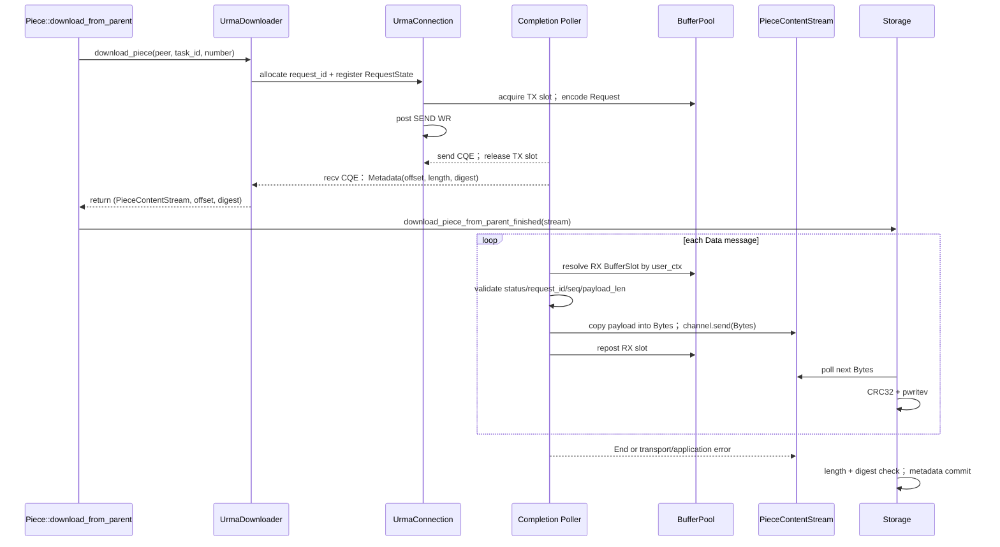
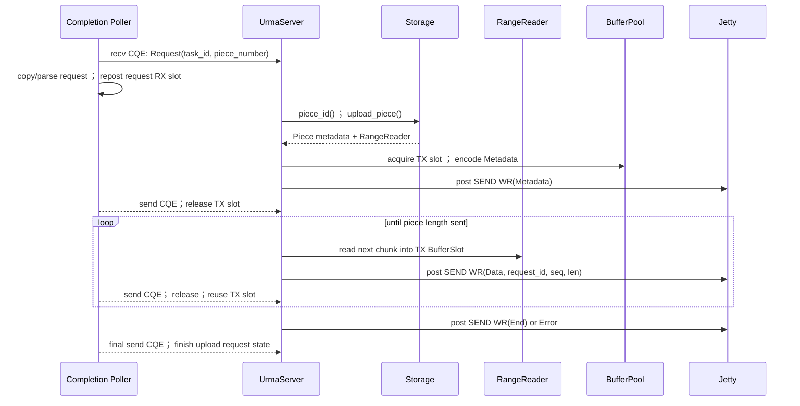

# Dragonfly * URMA 适配

## 1. Dragonfly 组件介绍

### 1.1 定位

Dragonfly 是一个基于 P2P 的文件分发系统，主要用于：

- 容器镜像加速
- 大文件分发
- AI 模型文件分发

核心思想：

> 将一次文件下载转换为多个 Peer 之间的数据协同传输，降低源站压力，提高分发效率。

### 1.2 核心组件

```text
                 Manager
                    |
              Scheduler
                    |
      +-------------+-------------+
      |                           |
    Peer                       Peer
      |
   dfdaemon
      |
 下载 / 缓存 / 上传
```

|组件|职责|
|-|-|
|Manager|集群管理、配置管理|
|Scheduler|任务调度、Peer选择|
|Peer|数据传输节点|
|dfdaemon|客户端代理，负责下载、缓存|
|Seed Peer|源数据节点|

---

## 2. Dragonfly 架构

### 2.1 控制面

```text
Manager
   |
Scheduler
   |
Peer状态管理
Task调度
Parent选择
```

负责：

- Peer注册
- Task管理
- Parent Peer选择
- 调度策略

---

### 2.2 数据面

```text
Child Peer

dfdaemon

    |
 Downloader

    |
 TCP / QUIC

    |

Parent Peer
```

负责：

- Piece请求
- Piece传输
- 数据校验
- 缓存管理

---

## 3. Dragonfly 数据流转

当前 Dragonfly standard Piece 数据路径：

```text
用户请求文件

      |
      v

dfdaemon(Client)

      |
      v

Scheduler

选择 Parent Peer

      |
      v

Piece 下载任务

      |
      v

Downloader

      |
      +----------------+
      |                |
      v                v

 TCP Transport    QUIC Transport

      |                |

      +-------网络------+

              |
              v

        Parent Peer

              |
              v

       Piece Cache / Storage

              |
              v

        Piece Data返回

              |
              v

          Child Storage

              |
              v

          文件合并
```

核心调用关系：

```text
Piece

 |

Downloader

 |

TCPDownloader / QUICDownloader

 |

PieceContentStream

 |

Storage
```

Dragonfly 已经通过 Downloader 抽象隔离传输实现，Storage 只依赖 PieceContentStream，因此理论上可以增加新的 Transport 实现。

---

## 4. URMA 组件介绍

### 4.1 定位

URMA 是灵衢 UB 提供的数据通信接口，提供面向硬件通信资源的数据传输模型。

与传统 Socket 不同，URMA 使用：

- Context
- Jetty
- Completion Queue
- Registered Memory

等对象管理通信。

---

### 4.2 核心对象

```text
Application

    |
    v

URMA API

    |
    v

Context

    |
    +------ JFR
    |
    +------ JFC
    |
    +------ Jetty
    |
    +------ Memory Segment

    |
    v

Provider / Hardware
```

| 对象 | 回答的问题 | 典型生命周期 |
|---|---|---|
| liburma | 应用通过什么统一接口访问 URMA能力 | 进程级初始化到退出 |
| Context | 使用哪个设备、通信资源归属在哪里 | 一组通信资源的总生命周期 |
| Jetty | 通信双方的逻辑端点是什么 | 通信关系建立到断开 |
| JFS| 发送数据时，提交哪些发送请求 | 与Jetty共同存在，直到通信关闭 |
| JFR| 接收数据时，提前准备哪些接收Buffer | 与Jetty共同存在，通过post_recv持续补充 |
| JFC | 到哪里获取异步操作完成结果 | 与关联JFS/JFR共同存在 |
| Segment | 设备可以访问哪块注册内存 | 注册成功到注销释放 |
| WR| 这一次请求设备执行什么操作 | 构造、提交、完成 |
| CQE/完成结果 | 哪个WR完成、执行结果如何 | 设备产生到应用消费 |

---

## 5. URMA 通信

### 5.1 URMA初始化

```text
urma_init

    |
    v

获取 Device

    |
    v

创建 Context

    |
    v

创建 JFR

    |
    v

创建 JFC

    |
    v

创建 Jetty

    |
    v

注册 Memory

    |
    v

交换 Descriptor

    |
    v

Bind

    |
    v

Ready
```

### 5.2 URMA 收发时序图

~~~mermaid
sequenceDiagram
    participant RApp as 接收方应用
    participant RJ as 接收方 Jetty/JFR
    participant RDev as 接收方 UB 设备
    participant SApp as 发送方应用
    participant SJ as 发送方 Jetty/JFS
    participant SDev as 发送方 UB 设备

    RApp->>RApp: 准备并注册接收 Segment
    RApp->>RJ: 提前 post RECV WR
    RJ->>RDev: 接收队列就绪

    SApp->>SApp: 准备并注册发送 Segment
    SApp->>SJ: post SEND WR
    SJ->>SDev: 提交发送工作
    SDev->>RDev: 通过 UB Fabric 传输消息
    RDev->>RDev: DMA 写入已投递的接收 buffer

    SDev-->>SJ: 产生发送 CQE
    RDev-->>RJ: 产生接收 CQE
    SApp->>SJ: poll JFC
    SJ-->>SApp: 发送完成结果
    RApp->>RJ: poll JFC
    RJ-->>RApp: 接收完成结果与实际长度
~~~

## 6. 数据路径对比

### 6.1 TCP 数据路径

```text
Application

    |
    v

User Buffer

    |
    | copy

    v

Kernel Socket Buffer

    |
    v

NIC

    |
    v

Network

    |
    v

NIC

    |
    v

Kernel Socket Buffer

    |
    | copy

    v

User Buffer

    |
    v

Application
```

---

### 6.2 QUIC 数据路径

``` text
Application

    |
    v

User Buffer

    |
    v

QUIC Library
(User Space)

    |
    v

UDP Socket

    |
    v

Kernel UDP/IP Stack

    |
    v

NIC

    |
    v

Network

    |
    v

NIC

    |
    v

Kernel UDP/IP Stack

    |
    v

UDP Socket

    |
    v

QUIC Library
(User Space)

    |
    v

User Buffer

    |
    v

Application

```

### 6.3 URMA 数据路径

```text
Application

    |
    v

Registered Memory

    |
    v

WR

    |
    v

URMA Provider

    |
    v

NIC

    |
    v

Network

    |
    v

NIC

    |
    v

Remote Jetty

    |
    v

Remote Registered Memory

    |
    v

CQE

    |
    v

Application
```

核心流程：

```text
Application Buffer

        |

Registered Memory

        |

SEND WR

        |

Jetty

        |

Remote Jetty

        |

CQE
```

---

### 6.3 TCP 、QUIC、 URMA 核心区别

|        | TCP              | QUIC                    | URMA                 |
| ------ | ---------------- | ----------------------- | -------------------- |
| 传输基础   | TCP              | UDP                     | UB/URMA              |
| 可靠性实现  | Kernel TCP Stack | User Space QUIC Library | Provider/Hardware    |
| 协议处理位置 | Kernel           | User Space              | Provider + Hardware  |
| 通信模型   | Byte Stream      | Stream/Frame            | Message + Completion |
| 主要接口   | Socket           | QUIC API                | URMA API             |
| 完成通知   | read/epoll       | QUIC事件                  | CQE                  |

---

## 7. Dragonfly 接入 URMA 涉及的关键适配点

### 7.1. URMA 通信层（Transport）

解决：

Dragonfly 的 Piece 数据如何通过 URMA 从 Parent 传输到 Child。

当前：

```
Downloader

    |

TCP / QUIC

    |

Parent Peer
```

接入后：

```

Downloader

    |

UrmaDownloader

    |

URMA Transport

    |

Jetty / SEND / RECV

    |

Parent Peer
```

需要处理：

URMA连接建立
Jetty创建与绑定
Request/Response消息设计
Peer间通信管理
重连和异常处理

### 7.2. 数据面处理

解决：

```text
URMA收到的数据如何转换成 Dragonfly 能消费的数据。
```

Dragonfly当前接口：

```text
Downloader

    |

PieceContentStream

    |

Storage
```

因此 URMA需要实现：

```text
URMA CQE

    |

Buffer处理

    |

Bytes

    |

PieceContentStream

    |

Storage

```
需要处理：

Piece Request
Piece Metadata
Data Chunk
End/Error消息
request_id映射
Buffer生命周期
CQE处理
数据校验

### 7.3. URMA 生命周期管理（Runtime）

解决：

URMA通信资源如何初始化、维护和释放。

包括：

```text
urma_init

    |

Device

    |

Context

    |

JFC

    |

Jetty

    |

Memory Register

    |

Shutdown
```

需要管理：

liburma初始化
Device选择
Context生命周期
JFC/CQ管理
Jetty连接池
Registered Memory
Buffer Pool
异常恢复

这个属于 URMA 基础设施层，

### 7.4. Scheduler / 控制面适配

解决：

```text
Scheduler如何知道哪些Peer支持UB/URMA，以及如何选择。
```

当前：

```text
Scheduler

    |

Parent Peer

    |

TCP Port
QUIC Port
```

未来可能：

```text
Scheduler

    |

Parent Peer

    |
    + TCP endpoint
    + QUIC endpoint
    + URMA endpoint
    + UB capability
```

需要：
UB节点发现方式
URMA能力上报
Peer能力模型扩展
调度策略是否考虑：
UB网络拓扑
带宽
延迟
内存资源

### 7.5 Dragonfly 接入 URMA 数据面初步流程

#### 7.5.1 Child 流程



- [架构推断] `download_piece()` 只需等待 Metadata message，不需等待整个 body；RequestState 中的 bounded channel receiver 被包装为 `PieceContentStream`。
- [架构推断] 第一版允许 copy：poller 从已完成 RX slot 复制有效 payload 为独立 `Bytes`，再 repost slot；Storage 后续持有的是普通 Bytes，不再引用注册 Segment。
- [架构推断] bounded channel 提供应用层背压；当 channel 满时，poller 不应阻塞所有 Peer 的 CQ 处理，而应将拷贝后的 chunk 交给非 poller 的 async dispatcher，或以 credit 限制 Parent 发送。
- [待实验验证] 原型在单 Piece 下可先用小的固定 RX depth 与“一个 chunk 确认/一个 credit”限制 outstanding body 数；是否需要专门 credit message 取决于目标 Jetty/transport 的 RNR 行为和 queue depth。

#### 7.5.2  Parent 流程



- [源码确认] Parent 的可复用数据源是 `Storage::upload_piece()` 返回的 RangeReader；URMA SEND/RECV 无法直接复用 Linux TCP server 的 `sendfile` 快路径。
- [架构推断] Parent 必须把 RangeReader 分块读入已注册 TX slot，并在对应 send CQE 成功后才能重写或回收该 slot。
- [URMA源码确认] post API 的同步返值只反映 WR 是否成功入队；数据面异步结果必须检查 send CQE/`urma_cr_t.status`。
- [架构推断] Parent send CQE 不等于 Child 已经落盘、digest 正确或 Piece metadata 已提交；Dragonfly 的最终成功条件仍由 Child Storage 决定。

## 8.测试方案

### 8.1 功能正确性验证

目标：

验证 URMA 作为 Dragonfly 数据传输后端后，数据链路是否正确。

测试环境：

```text
Parent Peer                  Child Peer

Dragonfly Server             Dragonfly Client

     |                            |
     |                            |
     +------ URMA Transport ------+
```

测试内容：

#### 8.1.1 单文件下载

验证：

文件完整性
Piece数据校验

检查：

下载文件 hash 与源文件一致；
Piece offset、length、digest正确；
数据传输无丢失、无错误。

#### 8.1.2 多 Piece 并发下载

验证：

多请求并发处理；
Buffer资源管理；
CQE完成事件映射。

关注：

request_id是否正确匹配Piece；
多buffer是否正常复用；
数据乱序情况下是否正确处理。

#### 8.1.3 缓存场景

验证：

第一次：

```text
Origin

  |

Parent Cache

  |

Child
```

后续：

```text
Parent Cache

  |

Child
```

检查：

是否减少Origin访问；
Cache命中是否正常。

### 8.2 性能对比测试

目标：

评估 URMA 相比现有 TCP/QUIC 的收益。

对比方案：

| 方案   | 说明       |
| ---- | -------- |
| TCP  | 现有传输方式 |
| QUIC | 现有传输方式 |
| URMA | 新增传输方式   |

测试变量：

**文件规模**
例如：

```text
MB级文件
GB级文件
AI模型文件
``` 

**并发规模**
例如：

```text
单任务
多任务
多Peer并发
```

测试指标：

- 端到端时延
- 网络吞吐率
- Peer资源占用
- CPU利用率
- 内存占用

### 8.3 稳定性测试

目标：

    验证长时间运行和异常情况下可靠性。

测试：

    长时间大文件传输；
    Parent异常退出；
    网络异常；
    URMA连接断开；
    Buffer耗尽。

关注：

    是否存在资源泄漏；
    是否可以恢复；
    是否影响其他任务。

## 9. 当前进展与后续计划

### 已完成

已完成前期技术分析、方案设计及基础原型验证：

- Dragonfly架构及数据路径分析；
- Dragonfly Downloader数据面接入点分析；
- URMA通信模型及数据传输流程分析；
- Dragonfly接入URMA初步方案设计
- URMA Transport Demo实现；
- URMA Parent/Child通信链路验证；
- SEND/RECV流程及CQE完成处理验证。

---

### 待完成

后续围绕Dragonfly接入URMA开展：

#### 1. Dragonfly URMA数据面适配

完成：

- UrmaDownloader模块设计与实现；
- Piece请求/响应流程适配；
- URMA Buffer生命周期管理；
- Piece数据流转验证。

#### 2. Dragonfly + URMA功能验证

完成：

- 单文件下载验证；
- 多Piece并发下载验证；
- Cache场景验证；

#### 3. Dragonfly + URMA性能测试

完成：

- TCP/QUIC/URMA方案对比；
- 不同文件规模测试；
- 不同任务并发量测试；
- 时延、吞吐率、Peer资源占用分析。

#### 4. Dragonfly + URMA 稳定性测试

完成：

- 长时间运行测试；
- 大规模文件持续传输测试；
- 多Peer并发运行稳定性测试；
- 异常场景恢复测试。
