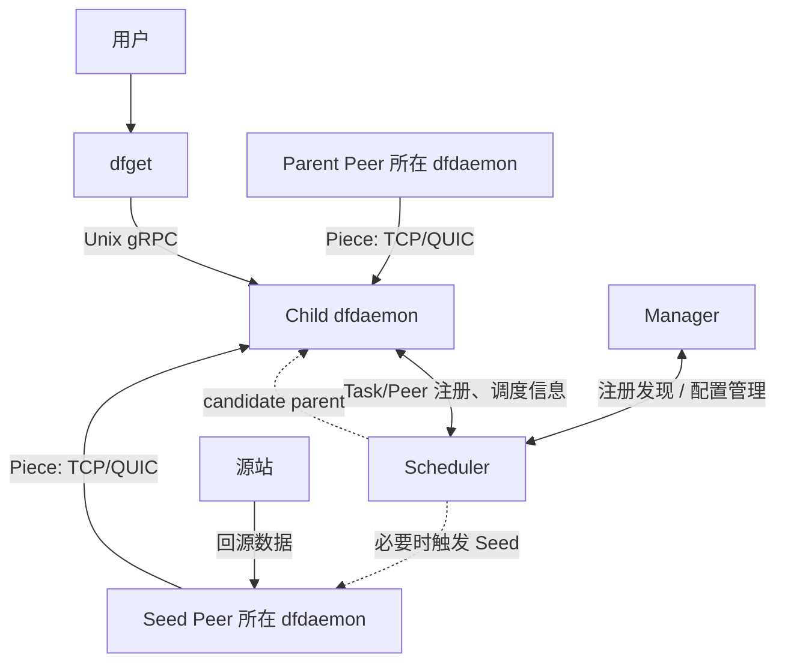
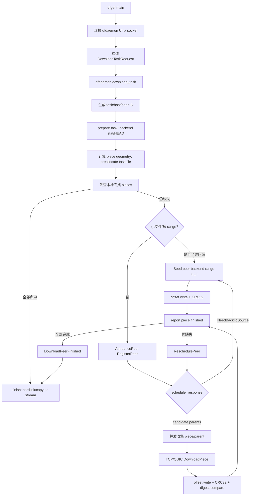

# Dragonfly 与 URMA：P2P 数据分发与高性能通信基础

---

## 1. 背景：为什么需要研究数据分发和高性能通信

### 1.1 数据交付已经成为云原生系统的基础能力

云原生集群中的“数据分发”并不只是用户下载一个文件。它常常发生在业务启动、扩容、升级和训练任务调度的关键路径上：

- 容器节点拉取镜像，决定 Pod 能否及时启动；
- AI 训练或推理节点加载模型，决定算力能否尽快进入工作状态；
- 大规模软件包、数据集和离线文件下发，决定批处理任务何时开始；
- 同一个版本在短时间内被大量节点同时请求，形成明显的突发流量。

单个镜像或模型的下载并不复杂，困难来自“同一份大数据在很短时间内被很多节点同时需要”。假设一个 20 GiB 模型需要下发到 1,000 个节点，即使不考虑协议和重试，系统也要交付约 20 TiB 数据。如果所有节点都直接访问中心对象存储或镜像仓库，中心服务、出口带宽和跨域链路都会承受近似线性增长的压力。

### 1.2 传统单点下载的问题不只是“带宽不够”

传统模式通常是“每个节点分别连接中心源站”。它简单、通用，但在集群规模增大后会同时暴露几类问题：

| 问题 | 直接表现 | 对业务的影响 |
|---|---|---|
| 中心出口成为热点 | 大量连接和重复流量集中到少数源站 | 下载排队、超时、扩容变慢 |
| 重复传输 | 同一份数据被跨网络边界重复发送 | 带宽成本和跨域流量增加 |
| 突发并发 | 发布、扩容、训练启动在短时间集中发生 | 源站在最关键时刻被冲击 |
| 故障放大 | 源站或链路抖动同时影响所有节点 | 重试风暴进一步加重负载 |
| 远距离访问 | 节点忽略本地已有副本，仍访问远端 | 时延升高，网络利用不合理 |

因此，问题的本质不是简单地为源站增加一块更快的网卡，而是改变数据的分发方式：一份数据一旦进入集群，就应该尽量在节点之间复用，而不是让每个节点都回到原始来源重新获取。

### 1.3 P2P 如何改变扩展方式

P2P 数据分发把已经获得数据的节点变成新的供应者。中心源站主要负责把数据引入集群，后续节点可以从附近或负载合适的 Peer 获取数据。

~~~mermaid
flowchart TB
    subgraph Traditional[传统中心化下载]
      O1[中心源站] --> A1[节点 A]
      O1 --> B1[节点 B]
      O1 --> C1[节点 C]
      O1 --> D1[节点 D]
    end

    subgraph P2P[P2P 分发]
      O2[中心源站] --> A2[节点 A]
      A2 --> B2[节点 B]
      A2 --> C2[节点 C]
      B2 --> D2[节点 D]
      C2 --> E2[节点 E]
    end
~~~

这个变化带来两个重要结果：

1. 源站发送的副本数下降，系统的分发能力可以随 Peer 数量增长；
2. 数据传输从少量“源站到节点”链路，转化为大量“节点到节点”链路。

第二点正是研究高性能通信的原因。P2P 解决了中心化瓶颈，却把节点间通信提升为核心数据面。网络带宽继续提高后，Socket 读写、内核协议栈处理、数据复制、CPU 消耗、内存管理以及落盘速度都可能决定最终吞吐。此时，调度算法即使找到了理想 Parent，如果 Piece 传得不够快，整体完成时间仍然无法下降。

可以把这条逻辑概括为：

~~~text
数据规模和并发增加
        ↓
中心源站、出口带宽和连接数压力增加
        ↓
P2P 通过多节点协同分散压力
        ↓
Peer 间 Piece 传输成为主数据路径
        ↓
节点间通信效率成为新的性能边界
~~~

---

## 2. Dragonfly 基础介绍

### 2.1 Dragonfly 是什么

Dragonfly 是面向云原生场景的 P2P 文件与镜像分发系统。它解决的核心问题是：当大量节点需要同一份内容时，如何减少对中心源站的重复访问，并利用集群中已经存在的数据副本完成可扩展分发。

Dragonfly 的核心思想可以归纳为三点：

1. **内容任务化**：把一次数据获取抽象成 Task，统一识别和管理同一份内容；
2. **文件分片化**：把 Task 切成 Piece，使不同片段可以由不同节点提供；
3. **调度与传输分离**：Scheduler 决定合适的数据来源，dfdaemon 负责真正的数据下载、缓存和上传。

Dragonfly 不是简单的“下载代理”。代理通常仍然围绕一个缓存节点展开；Dragonfly 则把众多 dfdaemon 组织成一个可调度的分发网络，让普通下载节点在拥有 Piece 后也能为其他节点服务。

### 2.2 Dragonfly 整体架构

#### Manager：集群管理入口

Manager 位于管理控制面，负责维护 Scheduler、Seed Peer 等集群信息，提供动态配置、服务发现以及管理能力。它帮助 dfdaemon 找到可用的 Scheduler，但不参与普通 Piece 字节的转发。

可以把 Manager 理解为“这个 Dragonfly 集群由哪些服务组成、如何被管理”的回答者。

#### Scheduler：P2P 调度中枢

Scheduler 维护 Host、Task、Peer 及其状态，组织每个任务的 Peer 关系，并根据拓扑、负载、节点状态和可用 Piece 等信息选择候选 Parent。冷任务缺少可用 Peer 时，Scheduler 还可以协调 Seed Peer 回源。

Scheduler 传递的是控制信息，例如“去哪个地址找哪些 Piece”，而不是文件内容本身。因此它是调度热点，但不是大文件流量热点。

#### dfdaemon：真正的数据节点

dfdaemon 是每台节点上的常驻数据面进程。它承接本机下载请求，创建 Task 和 Peer，向 Scheduler 报告状态，从 Parent 下载 Piece，把数据写入本地 Storage，并把已经完成的 Piece 提供给后续 Child。

一个很容易混淆的点是：**Peer 不是另一个独立进程**。在 Scheduler 的资源模型中，Peer 表示某个 dfdaemon 对某个 Task 的一次参与；dfdaemon 才是常驻的实际进程。

#### Seed Peer：冷启动时的数据入口

Seed Peer 本质上也是以特定角色运行的 dfdaemon。普通 Peer 尚未拥有目标数据时，它可以受 Scheduler 协调从源站获取内容，并成为后续分发的早期 Parent。Seed Peer 解决的是“P2P 网络里一开始还没有这份数据”的冷启动问题。

#### 一句话区分控制面与数据面

| 平面 | 典型组件 | 核心问题 | 是否承载 Piece 字节 |
|---|---|---|---|
| 控制面 | Manager、Scheduler | 数据在哪里、应从谁获取 | 否 |
| 数据面 | dfdaemon、Peer、Seed Peer、Storage | 数据怎样传输、校验、保存和再次提供 | 是 |



---

## 3. Dragonfly 核心机制

### 3.1 为什么采用 Piece 分片模型

传统文件下载常被理解为：

~~~text
一个文件 → 一个服务端 → 一条连接 → 顺序接收完整文件
~~~

这种模型中，服务端一旦变慢或连接中断，整个文件下载都会受影响；同一时刻也难以利用多个节点上的不同数据副本。

Dragonfly 的模型是：

~~~text
一个 Task → 多个 Piece → 多个 Parent 协同提供 → 本地按偏移写回完整内容
~~~

Piece 是 Task 内容中的一个逻辑范围，具有编号、偏移、长度和校验信息。它不是必须独立保存的小文件；在当前 Dragonfly Storage 中，普通 Task 通常对应一个预分配的内容文件，Piece 表示这个文件中的不同 offset/length 区间。

~~~mermaid
flowchart TB
    F[Task：一个大文件]
    F --> P0[Piece 0<br/>offset 0]
    F --> P1[Piece 1<br/>offset L]
    F --> P2[Piece 2<br/>offset 2L]
    F --> P3[Piece 3<br/>尾部分片]

    A[Parent A] -->|提供 Piece 0、2| C[Child dfdaemon]
    B[Parent B] -->|提供 Piece 1| C
    S[Seed Peer] -->|提供 Piece 3| C
    C --> O[(按 offset 写入 Task 内容文件)]
~~~

采用 Piece 模型主要有五个原因：

1. **并行性**：Child 可以并发下载多个 Piece，不必把整个任务绑定在单一连接和单一 Parent 上；
2. **多源协同**：不同 Parent 只要拥有部分数据，就可以参与分发，无需等待整份文件完成后才能贡献能力；
3. **故障隔离**：一个 Piece 下载失败时，可以更换 Parent 或只重试该 Piece，而不是重新下载整个文件；
4. **细粒度调度**：Scheduler 与 Peer 能以 Piece 完成状态描述任务进度，数据可用性更清晰；
5. **边下边分发**：节点已经完成的 Piece 可以较早服务其他 Child，形成流水式扩散。

Piece 大小并非越小越好。过大时并行度和重试粒度不足；过小时，调度消息、请求、校验、metadata 和连接处理的固定开销会增加。Dragonfly 当前会结合内容长度确定 Piece 几何，体现的正是“数据并行度”和“控制开销”之间的平衡。

### 3.2 Parent Peer、Child Peer 与 Seed Peer

在一次 Piece 传输中：

- **Parent Peer**：已经拥有目标 Piece，并向其他节点提供数据；
- **Child Peer**：当前需要该 Piece，从 Parent 下载并写入本地；
- **Seed Peer**：在普通 Peer 缺少数据时负责回源，并为 P2P 网络提供初始副本。

这些角色描述的是某个 Task、某个时刻的数据关系，不是固定的机器身份。同一个 dfdaemon 在下载 Piece 0 时可能是 Child；当 Piece 0 完成后，它可以立即成为其他节点的 Parent；对另一个尚未缓存的 Task，它仍然又是 Child。

~~~mermaid
stateDiagram-v2
    [*] --> Child: 请求新 Task
    Child --> PartialParent: 已完成部分 Piece
    PartialParent --> Parent: Task 全部完成
    PartialParent --> Child: 仍继续获取缺失 Piece
    Parent --> Child: 请求另一未缓存 Task
~~~

角色动态变化使 P2P 网络能够随数据传播自然扩展。它也意味着调度不能只看机器是否在线，还要看该机器对当前 Task 拥有哪些 Piece、当前负载如何、是否允许共享，以及把它作为 Parent 是否会破坏任务 DAG 的约束。

### 3.3 Dragonfly 数据路径

一次典型下载可以用以下主路径理解：



如果只保留主干，它就是：

~~~text
用户请求
  ↓
dfdaemon
  ↓
Task
  ↓
Scheduler
  ↓
Parent Peer
  ↓
Downloader
  ↓
TCP / QUIC
  ↓
Storage
~~~

这里有三个值得强调的边界：

- Scheduler 返回 Parent 信息，但 Piece body 不经过 Scheduler；
- Downloader 把不同传输协议适配成统一数据流；
- Storage 不关心流来自 TCP 还是 QUIC，它关心长度、偏移、校验和状态是否正确。

---

## 4. Dragonfly 当前数据面通信

### 4.1 TCP 和 QUIC

当前 Dragonfly Peer 间普通 Piece 数据可以通过 TCP 或 QUIC 传输。两者都是成熟的可靠传输选择，但实现路径和运行特征不同。

| 维度 | TCP | QUIC |
|---|---|---|
| 基本抽象 | 可靠、有序字节流 | 可靠连接上的多路逻辑流 |
| 协议位置 | 主要由内核协议栈处理 | 主要由用户态 QUIC 实现处理 |
| 生态与兼容性 | 非常成熟，普遍可用 | 需要 UDP 网络条件与 QUIC 运行库 |
| 连接演进 | 受内核 TCP 能力约束较多 | 用户态演进和扩展更灵活 |
| 加密 | 通常额外叠加 TLS | 协议设计中内建安全握手 |
| Dragonfly 上层看到的结果 | PieceContentStream | PieceContentStream |

#### 4.1.1 TCP数据路径

```text
Application
    |
    v
Kernel Socket Buffer
    |
    v
Kernel TCP/IP Stack
    |
    v
NIC Driver
    |
    v
NIC
    |
    v
Network
```

#### 4.1.2 QUIC数据路径

```text
Application
    |
    v
QUIC Library
    |
    v
Kernel UDP/IP Stack
    |
    v
NIC Driver
    |
    v
NIC
    |
    v
Network
```

### 4.2 Downloader 抽象

Dragonfly 不让 Task、Piece 和 Storage 直接依赖 TCP socket 或 QUIC stream，而是在中间设置 Downloader 抽象。上层给出 Parent 地址、Task 和 Piece 信息；底层协议实现负责发起请求、读取响应元数据，并返回统一的 Piece 内容流。

~~~mermaid
flowchart LR
    P[Piece 业务逻辑] --> D[Downloader 统一抽象]
    D --> T[TCPDownloader]
    D --> Q[QUICDownloader]
    T --> S[PieceContentStream]
    Q --> S
    S --> ST[Storage]
~~~

PieceContentStream 可以理解为“连续产生字节块的异步流”。每次产生一个 Bytes chunk，Storage 就可以消费一部分，而不需要 Downloader 先把整个 Piece 放进一个大缓冲区。Downloader 同时返回 Piece 的 offset 和 digest 等必要元数据，使 Storage 能把内容放到正确位置并验证完整性。

这种抽象的价值不是为了隐藏所有差异，而是建立稳定的职责边界：

- Piece 层关心“向哪个 Parent 请求哪一个 Piece”；
- Downloader 关心“用选定协议拿到数据流”；
- Storage 关心“如何正确消费、写入并确认这条流”。

因此，底层协议发生变化时，上层调度和 Piece 管理不需要理解 socket 句柄、QUIC 接收流或协议包边界。

### 4.3 Storage 如何消费数据

Storage 接收 PieceContentStream 后，不是等待整个 Piece 到齐再一次性写入，而是逐块拉取数据、累计校验，并按 Piece offset 写入 Task 内容文件。

~~~mermaid
flowchart LR
    A[PieceContentStream] --> B[逐个读取 Bytes chunk]
    B --> C[累计长度与 CRC32]
    C --> D[聚合为写入批次]
    D --> E[按 Piece offset 分块写入]
    E --> F{长度和 digest 是否正确}
    F -->|是| G[提交 Piece metadata<br/>标记完成]
    F -->|否| H[标记失败并重新调度]
~~~

这里包含四层语义：

1. **流式读取**：网络数据到达一部分就可以被处理，避免为整个 Piece 额外分配同等大小的连续缓冲区；
2. **分块写入**：多个 chunk 可以形成写入批次，并按固定 offset 落到同一个 Task 文件；
3. **数据校验**：接收过程累计长度和 CRC32，并与 Parent 返回的 digest 比较，防止不完整或错误数据进入可共享状态；
4. **metadata 提交**：只有内容写入与校验成功后，Piece 才被标记为完成，后续才能作为可靠数据提供给 Child。

所以，网络传输结束不等于 Piece 业务完成。真正的完成条件是：数据已接收、已写入正确位置、长度正确、校验通过并更新 metadata。这一点对后面理解 URMA 的“完成通知”尤其重要——通信完成和 Dragonfly Piece 完成不是同一层语义。

---

## 5. 高性能通信技术背景

### 5.1 传统 Socket 路径

应用使用 TCP Socket 时，通常通过 read/write 或异步运行时提供的等价接口与内核交互。简化后的发送路径是：

~~~mermaid
flowchart TB
    A[Application Buffer] --> B[Socket API]
    B --> C[Kernel Socket Buffer]
    C --> D[TCP/IP 协议栈]
    D --> E[NIC Driver / DMA]
    E --> F[Network]
~~~

接收方向则反过来：网卡把数据放入内核可管理的缓冲区，内核完成协议处理，应用再从 Socket 读取到用户态缓冲区。现代内核、网卡 offload、批处理、sendfile 等机制已经能显著优化这条路径，因此不能把 Socket 简化成“必然低性能”。

不过在高速网络、低时延或高消息率场景中，传统路径可能暴露以下成本：

- 数据在内核缓冲区、用户缓冲区和文件缓冲区之间移动；
- 每次系统调用、上下文切换和协议栈处理都需要 CPU；
- 大量并发连接会增加内核状态、队列和调度开销；
- 当链路已经很快时，CPU 可能先于网卡达到瓶颈；
- 小消息很多时，单位有效数据分摊到的固定处理成本更高。

### 5.2 RDMA 类高性能通信的核心思想

RDMA （Remote Direct Memory Access）类技术的共同出发点，是让应用提前准备可供设备访问的内存和通信资源，把数据搬运描述成异步工作请求，再由硬件执行并通过完成队列通知结果。

~~~mermaid
flowchart LR
    A[应用准备并注册内存] --> B[构造工作请求 WR]
    B --> C[提交到发送/接收队列]
    C --> D[设备执行 DMA 与网络传输]
    D --> E[生成完成信息]
    E --> F[应用轮询或等待完成]
~~~

其核心不是某个具体 API 名称，而是三种思维变化：

1. 从“调用一次发送函数并交给内核”转为“提前准备资源并提交异步操作”；
2. 从“应用不断拷贝字节”转为“设备可以直接访问已授权的内存区域”；
3. 从“函数返回即完成”转为“提交与完成分离，以完成事件确认资源何时可复用”。

这类技术通常希望降低内核协议栈参与度、减少不必要的数据复制，并降低单位数据的 CPU 成本。但它也把更多责任交给应用：内存必须注册，接收缓冲区可能要提前投递，异步操作完成前不能随意释放或改写相关内存，连接和错误恢复也更加显式。

---

## 6. URMA 基础介绍

### 6.1 URMA 是什么

URMA 可以理解为灵衢 UnifiedBus（UB）通信体系面向软件提供的一套用户态通信资源与操作模型。应用通过 liburma 使用设备、Context、Jetty、JFC、Segment、WR 等对象，底层由用户态 provider、内核组件和 UB 设备共同完成资源管理与数据传输。

### 6.2 与传统 Socket 的直观区别

| 维度 | Socket | URMA |
|---|---|---|
| 应用看到的主要对象 | socket、连接、字节流 | Context、Jetty、JFC、Segment、WR |
| 数据表达 | 连续 byte stream | 一次次显式异步操作或消息 |
| 缓冲区 | 内核管理大量协议缓冲细节 | 应用显式准备并注册可访问内存 |
| 接收方式 | read 时由内核提供已有字节 | SEND/RECV 中通常先准备 RECV WR |
| 完成方式 | 同步返回、可读/可写事件等 | 轮询或等待 JFC 中的完成结果 |
| 快速数据路径 | 通常经过内核网络协议栈 | 目标是由用户态队列与设备协同执行 |
| 应用责任 | 相对较少 | 资源、队列、buffer 生命周期更显式 |

URMA 解决的是高速互联环境下，如何让应用以更直接、可批量、可异步的方式使用通信设备。它提供高性能潜力，但也要求上层软件认真处理资源生命周期和完成语义。

---

## 7. URMA 核心架构

### 7.1 从软件栈到核心对象

~~~mermaid
flowchart TB
    A[Application]
    L[liburma<br/>用户态接口]
    C[Context<br/>设备与通信资源上下文]
    J[Jetty<br/>通信端点]
    JFC[JFC<br/>完成队列]
    SEG[Segment<br/>注册内存区域]
    WR[WR<br/>待执行工作请求]
    DEV[Provider / UB Device]
    CQE[CQE / Completion Result<br/>完成信息]

    A --> L --> C
    C --> J
    C --> JFC
    C --> SEG
    A -->|准备| WR
    WR -->|引用 Segment 并提交到 Jetty| J
    J --> DEV
    SEG <--> DEV
    DEV --> CQE --> JFC --> A
~~~

### 7.2 liburma：用户态接口门面

liburma 是应用使用 URMA 能力的用户态入口。它负责暴露统一对象和操作、校验公共参数、发现设备，并把具体动作分派给对应 provider。具体硬件队列格式并不是由应用直接处理，也不是由 liburma 单独包办。

可以把 liburma 理解为“统一语言和分派层”：上层用一致的 URMA 资源模型表达需求，下层 provider 根据实际设备完成实现。

### 7.3 Context：资源管理上下文

Context 代表应用针对某个 URMA 设备建立的使用上下文。后续 JFC、Jetty、Segment 等资源都依附于它。Context 通常关联设备能力、端点身份、命令通道和 provider 操作表。

对初学者而言，可以把 Context 理解成“进入某个通信设备资源域的根对象”，但它本身不是一条数据连接。

### 7.4 Jetty：通信端点

Jetty 是 URMA 中的通信端点。它组织发送与接收方向的能力，可关联发送功能、接收功能和完成队列。Jetty 可以帮助类比 socket endpoint，但它不是一个透明的字节流：应用仍要显式提交发送或接收工作请求，并通过完成结果管理资源。

### 7.5 JFC：完成队列

JFC（Jetty Function Completion）承载操作完成信息。应用提交 WR 后，提交函数成功通常只表示请求已进入可执行路径，并不表示数据已经传完。设备完成操作后产生硬件完成条目，provider 解析后，应用通过轮询 JFC 获得完成结果。

因此 JFC 是异步模型的“收口点”：发送成功、接收成功、长度、状态和错误最终要从完成结果中确认。

### 7.6 Segment：注册内存区域

Segment 表示经过注册、可以按授权方式被设备访问的内存区域。注册过程建立虚拟地址、长度、权限、标识或 token 与设备可用映射之间的关系。

内存注册的意义是让设备能够安全、明确地执行 DMA，而不必在每个 WR 到来时重新解释一块任意应用内存。相应代价是应用必须管理好生命周期：只要尚未完成的 WR 仍引用某个 Segment 中的 buffer，就不能提前释放、取消注册或无约束复用它。

### 7.7 WR：提交给设备的工作请求

WR（Work Request）描述应用希望设备执行的动作，例如 SEND 或准备 RECV。它通常包含操作类型、数据所在 Segment 的地址与长度、用于完成关联的上下文，以及必要的远端信息。

WR 是“任务描述”，不是数据完成本身。应用可以一次提交一个或一批 WR，设备异步执行；提交之后，应用继续做其他工作或处理别的完成事件。

### 7.8 CQE：硬件完成事件

CQE（Completion Queue Entry）是设备写入完成队列的底层完成条目。它可以包含状态、操作类型、实际长度和请求关联信息。当前 UMDK provider 会解析 CQE，并通过 liburma 的 JFC 轮询接口向应用返回完成记录。

分享中可以把“CQE”泛化理解为完成事件，但需要记住层次：**硬件产生 CQE，应用通过 poll JFC 获得可消费的完成结果**。

### 7.9 对象关系小结

| 对象 | 回答的问题 | 典型生命周期 |
|---|---|---|
| liburma | 应用用什么统一接口访问 URMA | 进程级初始化到退出 |
| Context | 使用哪个设备、资源归属在哪里 | 一组通信资源的总生命周期 |
| Jetty | 从哪个端点发送或接收 | 通信关系建立到断开 |
| JFC | 到哪里获取异步完成结果 | 与关联队列共同存在 |
| Segment | 设备可以访问哪块内存 | 注册到所有相关 WR 完成 |
| WR | 这次要设备做什么 | 构造、提交、等待完成 |
| CQE/完成结果 | 哪个操作完成、结果如何 | 设备产生到应用消费 |

---

## 8. URMA 数据传输流程

### 8.1 Socket 是数据流模型

Socket 对上层提供连续字节流。发送方多次写入的数据，在接收方可能以不同的读取边界返回；应用不能假设“一次 write 对应一次 read”。协议边界通常由上层长度字段、分隔符或固定格式恢复。

~~~text
发送方：write(A) + write(B)
网络：  连续可靠字节流 AABB...
接收方：read(部分 A) + read(剩余 A 与部分 B) + ...
~~~

内核负责大量缓存、重传、有序交付和流量控制细节。应用主要关心“还有多少字节可读”。

### 8.2 URMA 是异步操作模型

以最容易理解的 SEND/RECV 为例，接收方不能等消息到达后才临时找内存，而要提前准备注册内存并投递 RECV WR。发送方准备发送 buffer，提交 SEND WR。设备匹配发送与接收资源，完成数据搬运，然后在双方相应的完成队列中产生完成信息。

~~~mermaid
sequenceDiagram
    participant RApp as 接收方应用
    participant RJ as 接收方 Jetty/JFR
    participant RDev as 接收方 UB 设备
    participant SApp as 发送方应用
    participant SJ as 发送方 Jetty/JFS
    participant SDev as 发送方 UB 设备

    RApp->>RApp: 准备并注册接收 Segment
    RApp->>RJ: 提前 post RECV WR
    RJ->>RDev: 接收队列就绪

    SApp->>SApp: 准备并注册发送 Segment
    SApp->>SJ: post SEND WR
    SJ->>SDev: 提交发送工作
    SDev->>RDev: 通过 UB Fabric 传输消息
    RDev->>RDev: DMA 写入已投递的接收 buffer

    SDev-->>SJ: 产生发送 CQE
    RDev-->>RJ: 产生接收 CQE
    SApp->>SJ: poll JFC
    SJ-->>SApp: 发送完成结果
    RApp->>RJ: poll JFC
    RJ-->>RApp: 接收完成结果与实际长度
~~~

这条流程可以拆成四个关键动作：

1. **发送：post SEND WR**
   发送方把“从哪块 Segment、发送多少字节、如何关联完成”的描述提交给 Jetty。提交成功不等于发送已完成。

2. **接收：提前准备 RECV**
   接收方把可写 buffer 以 RECV WR 的形式放入接收队列。没有可用接收资源时，远端 SEND 不能被简单理解成 Socket 那样“先堆进任意大的内核接收缓冲区”。

3. **完成：产生 CQE**
   设备完成本地发送处理或把远端数据写入接收 Segment 后，产生完成条目。完成状态是回收或复用 buffer 的依据。

4. **应用：poll CQ/JFC**
   应用轮询 JFC，识别完成的是哪个请求、是否成功、接收了多少数据，并推进自己的消息状态机。

### 8.3 “发送完成”不等于“业务完成”

这是 URMA 与 Dragonfly 结合时最重要的概念之一。一次发送 CQE 通常说明相应通信操作达到了 URMA 所定义的完成条件，但它并不自动代表：

- 对端已经把 Piece 写入文件；
- 对端已经完成 CRC 或 digest 校验；
- Dragonfly metadata 已提交；
- 整个 Piece 或整个 Task 已经完成。

完整语义至少分为三层：

~~~mermaid
flowchart LR
    A[WR 完成<br/>buffer 可按语义回收] --> B[消息完成<br/>一次完整消息已接收]
    B --> C[Piece 完成<br/>长度、落盘、校验、metadata 成功]
~~~

通信层完成负责“这次数据搬运动作结束”；Dragonfly 业务层仍要负责“这是不是正确而完整的 Piece”。

### 8.4 READ/WRITE & SEND/RECV

|             | READ/WRITE              | SEND/RECV        |
| ----------- | ----------------------- | ---------------- |
| 模型          | 单边通信（one-sided）         | 双边通信（two-sided）  |
| 谁发起         | 主动方                     | 发送方              |
| 远端 CPU 是否参与 | 基本不参与                   | 需要接收方参与          |
| 访问对象        | 远端注册内存                  | 消息/接收缓冲区         |
| 需要远端提前准备    | WRITE 不一定，READ 需要远端数据存在 | RECV 必须提前 post   |
| 典型用途        | 共享内存、数据搬运               | RPC、消息通知、控制信息    |
| 类似          | memcpy 到远端地址            | send/recv socket |

---

## 9. Dragonfly 与 URMA 为什么可能结合

### 9.1 两者处在互补的层次

Dragonfly 已经具备完整的 P2P 分发思想：识别 Task、切分 Piece、维护 Peer 状态、选择 Parent、失败重调度、回源、校验和缓存。它不需要 URMA 来重新发明调度系统。

URMA 提供的潜在价值位于更低层：在具备 UB 设备和相应软件栈的节点之间，用注册内存、异步工作队列和完成通知完成高性能数据搬运。它不负责判断哪个 Parent 拥有 Piece，也不理解 Task DAG。

~~~mermaid
flowchart TB
    U[用户请求]

    subgraph Dragonfly[Dragonfly：分发与控制]
      T[Task / Piece 管理]
      S[Scheduler<br/>Parent 选择与重调度]
      P[Peer 状态与分发策略]
      V[校验、Storage、metadata]
    end

    subgraph Transport[可选择的数据传输层]
      TCP[TCP]
      QUIC[QUIC]
      URMA[URMA<br/>高性能消息与数据搬运]
    end

    PP[Parent Peer Storage]
    CP[Child Peer Storage]

    U --> T --> S --> P
    PP --> TCP --> CP
    PP --> QUIC --> CP
    PP -.探索.-> URMA -.探索.-> CP
    P --> TCP
    P --> QUIC
    P -.探索.-> URMA
    CP --> V
~~~

更准确的组合关系是：

~~~text
Dragonfly 控制与分发语义
          +
URMA 节点间高性能数据搬运能力
          =
面向云原生 P2P 分发的新型数据面探索
~~~

这里说“Dragonfly 控制面 + URMA 数据面”是架构层面的简写，不代表 Dragonfly 现有数据面只剩 URMA。Piece 管理、Storage、校验和 metadata 仍然属于 Dragonfly 数据面；URMA 可能承担的是 Parent 与 Child 之间的传输子路径。

### 9.2 可能获得的价值

在高速 UB 网络和大规模 P2P 场景中，结合方向可能带来以下收益，但都需要真实环境验证：

- 降低 Peer 间大数据传输的 CPU 开销；
- 减少传统内核网络协议栈参与和不必要的数据复制；
- 通过批量提交和异步完成提高设备利用率；
- 在大量并发 Piece 传输时提供更明确的队列与 backpressure 控制；
- 让 Dragonfly 的分发策略更充分地利用高性能互联资源。

需要特别谨慎的是：链路更快不等于 Task 一定同比更快。若瓶颈在 Parent 磁盘读取、Child 落盘、校验、buffer 等待或 Scheduler 调度，单独提升网络搬运能力只能改善其中一段。

### 9.3 为什么 Dragonfly 的 Piece 模型适合作为研究单位

Piece 天然具有边界、长度、编号和校验信息，比无限字节流更容易映射到有边界的消息传输。单个大 Piece 又可以被拆成多条有序消息，并通过多个完成事件管理 buffer。

因此，Piece 是连接两种模型的自然业务单位：Dragonfly 仍以 Piece 表达可调度和可校验的数据；URMA 以一组异步消息完成这段 Piece 的搬运。但“自然”不代表“直接等价”，中间仍需解决下一节列出的语义差异。

---

## 10. 两种模型的差异和挑战

### 10.1 Stream 与 Message

TCP 给出连续 byte stream，没有天然消息边界。Dragonfly 当前可以在读取协议头和 Piece 元数据后，持续消费到期望长度。

URMA SEND/RECV 更接近有边界的消息操作：每个接收 WR 提供一块明确容量的 buffer，每个完成结果对应一次操作。一个 4～64 MiB 的 Piece 不一定适合放入单条消息，通常要被拆为多个数据消息，再由上层按序重组成 Piece 流。

这意味着必须回答：消息如何编号、如何表示 Piece 开始与结束、如何检测缺失或重复、单条消息多大、多个消息如何形成 backpressure。

### 10.2 Buffer 生命周期

Socket 模型中，应用读到一块数据后，通常可以把 buffer 交给下游；底层内核接收状态与这块用户 buffer 的关联相对弱。

URMA 中，发送或接收 buffer 属于注册 Segment，并被未完成 WR 引用。在完成事件到达前，应用不能随意释放、取消注册或重用。接收侧还要持续补充 RECV buffer，否则可能出现接收队列耗尽。

映射到 Dragonfly 时，至少要协调三种所有权：

- URMA 设备何时不再使用 buffer；
- Piece 内容流何时把数据交给 Storage；
- Storage 何时完成校验和写入，可以释放或复用上游内存。

### 10.3 完成通知模型

TCP/QUIC 的内容流以“下一个 chunk 是否可读”驱动。错误可以在连接或 stream 读取时向上传播，读到预期长度和 EOF 后进入业务校验。

URMA 以完成结果驱动：应用不断 poll JFC，根据请求上下文把发送完成、接收完成和错误分派到正确的 Piece。一次 Piece 可能跨越多个 WR 和 CQE，因此还需要聚合完成状态。

更重要的是，必须区分：

- **post 成功**：请求已成功提交；
- **WR/CQE 完成**：设备完成一次通信操作；
- **消息完成**：一条协议消息完整并通过基础检查；
- **Piece 完成**：所有数据到齐、长度正确、落盘和 digest 校验成功；
- **Task 完成**：所有目标 Piece 都满足业务完成条件。

### 10.4 连接管理模型

TCP/QUIC 使用 IP 地址、端口、连接和流建立 Peer 关系。网络中间设备、超时和重连行为都有成熟语义。

URMA 通常需要设备发现、Context 创建、端点信息交换、远端 Jetty 导入或绑定、队列和注册内存准备等步骤。控制资源的建立成本可能明显高于发送单个消息，因此不能默认每个 Piece 都临时创建一整套通信资源。

未来研究需要回答：通信资源如何复用、Peer 变化如何更新、断链后未完成 WR 如何清理、Scheduler 返回的逻辑 Parent 如何映射到 URMA 可达端点，以及 UB 能力不可用时如何维持系统可用性。

---

## 附录 A：核心术语速查

| 术语 | 简明解释 |
|---|---|
| Task | Dragonfly 对一次内容下载与分发的任务抽象 |
| Piece | Task 内容中的逻辑分片，具有编号、偏移、长度和校验信息 |
| Peer | 某个 dfdaemon 对某个 Task 的一次参与 |
| Parent Peer | 为当前 Child 提供目标 Piece 的 Peer |
| Child Peer | 正在从 Parent 获取 Piece 的 Peer |
| Seed Peer | 在冷任务阶段回源并提供初始数据的 dfdaemon 角色 |
| Downloader | Dragonfly 对不同 Piece 传输协议的统一抽象 |
| PieceContentStream | Downloader 向 Storage 提供的异步字节块流 |
| UB | UnifiedBus，灵衢统一互联体系 |
| URMA | UB 体系下的用户态通信资源与操作模型 |
| Context | URMA 设备与通信资源的管理上下文 |
| Jetty | URMA 通信端点 |
| JFC | URMA 完成队列，应用从中获取异步完成结果 |
| Segment | 注册后可供设备按权限访问的内存区域 |
| WR | 提交给设备执行的工作请求 |
| CQE | 设备产生的底层完成队列条目 |

