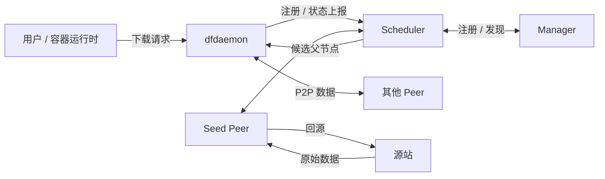
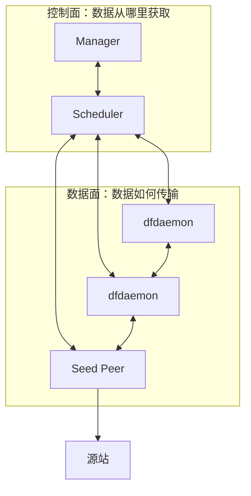
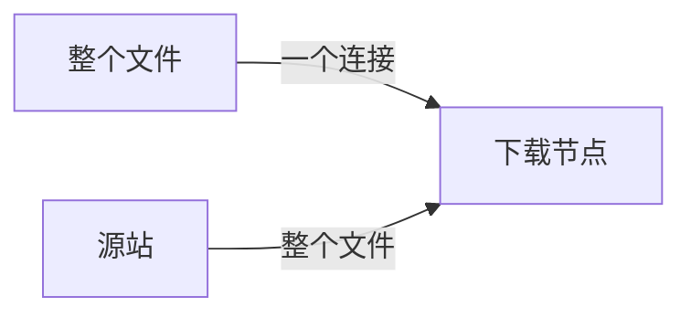
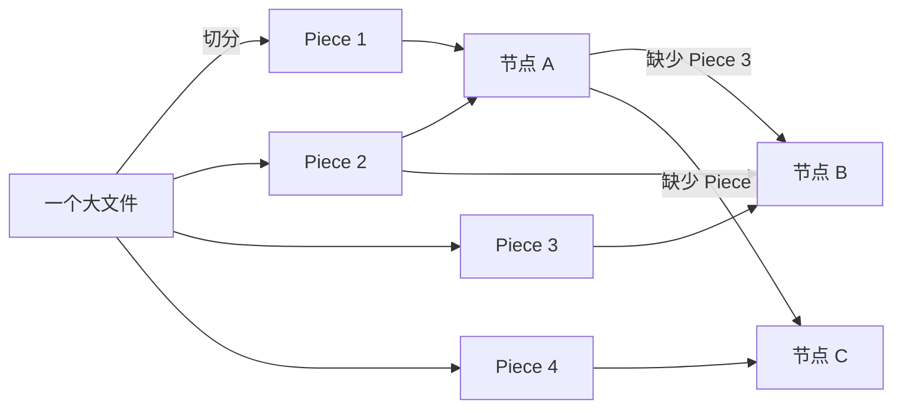
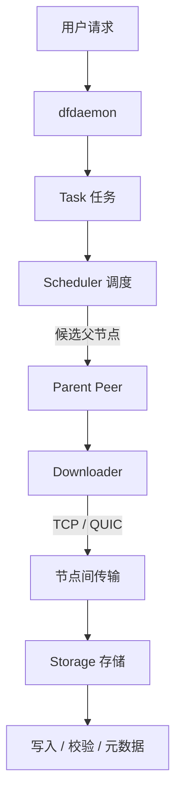
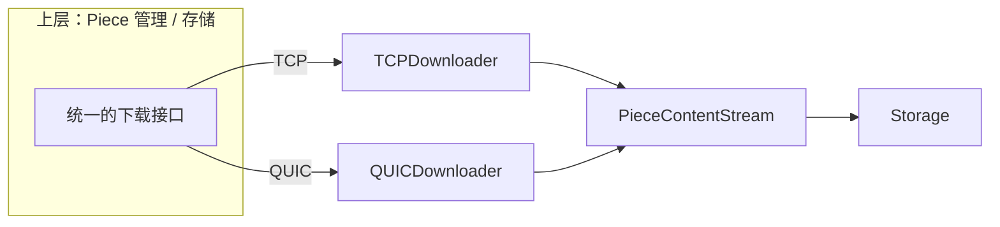
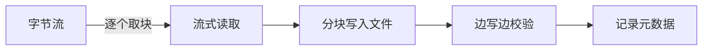
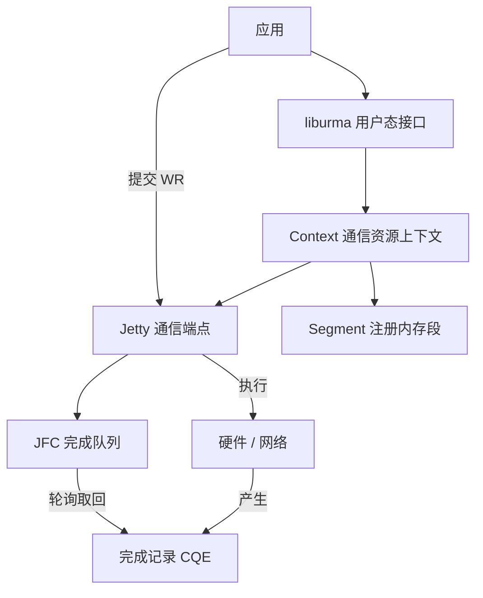
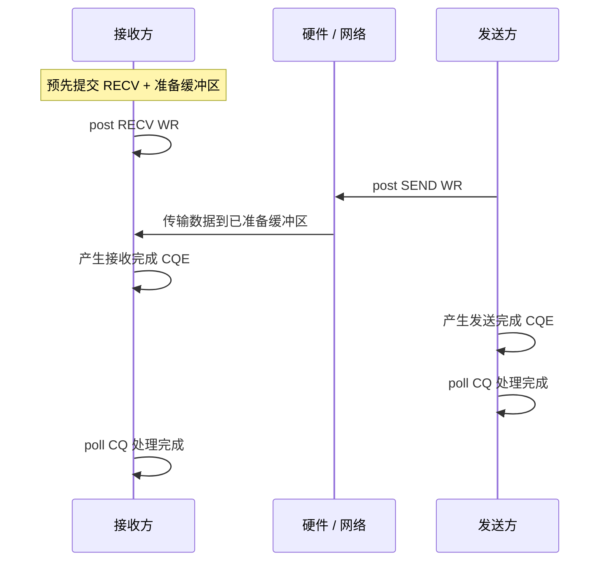
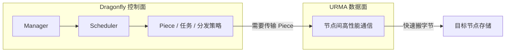

# Dragonfly 与 URMA：P2P 数据分发与高性能通信基础

> 技术知识分享文档（面向公司内部研发人员）
>
> 听众假设：可能不了解 Dragonfly、URMA、RDMA 类通信技术。
>
> 本文重点讲清楚三件事：**是什么、为什么、怎么工作**。
>
> 本文不写具体接入实现，不展开 UrmaDownloader、Rust module、FFI 设计，不讨论代码修改方案，作为后续 PPT 的内容基础。
>
---


# 1. 背景：为什么需要研究数据分发和高性能通信

## 1.1 云原生、大规模集群的数据分发需求

云原生时代，一个业务系统往往运行在成百上千台机器组成的集群上。任何一个需要"把数据送达所有节点"的操作，都是大规模数据分发问题：

- 发布新版本时，所有节点都要拉取最新的容器镜像；
- AI 平台训练/推理前，要把大模型权重分发到计算节点；
- 大数据平台要把数据集同步到各个工作节点。

这些场景的共同点是：**同一份数据，要被很多节点获取**。

## 1.2 容器镜像、AI 模型、大文件分发场景

- **容器镜像**：由多层文件系统组成，动辄几百 MB 到数 GB；集群扩容时往往需要同时拉取。
- **AI 模型**：权重文件可达 GB 到 TB 级；模型越大，分发的数据量和时间成本越高。
- **大文件 / 大数据集**：数据湖、离线计算等场景会分发非常大的数据文件。

这些数据有一个共同特征：**体积大、要发往的节点多**。

## 1.3 传统单点下载的问题

"每个节点直接从源站下载"是直觉上最简单的方案，但会遇到几个明显的瓶颈：

| 问题 | 说明 |
|---|---|
| 源站带宽瓶颈 | 所有节点同时回源，源站出口带宽被占满，整体速度被拉低 |
| 重复传输浪费 | 同一份数据在骨干网上被重复传输多次，浪费带宽 |
| 冷启动慢 | 大规模节点同时拉取时互相争抢带宽，出现长尾 |
| 源站稳定性压力 | 大量并发请求集中打到源站，容易造成源站过载 |

## 1.4 为什么需要 P2P 数据分发

P2P（点对点）分发的核心思想是：**让节点之间互相共享已经下载的数据**，而不是每个节点都回源。

这样做的收益非常直接：

- 源站只需被"少量节点"访问，压力大幅下降；
- 每个节点优先从"近处的、空闲的"节点取数据，骨干带宽利用更充分；
- 节点越多，能共享的数据源越多，整体分发能力反而越强。

## 1.5 为什么数据传输性能会成为新的瓶颈

当数据分发从"单点"演进到"P2P"后，问题的重心发生了变化：

```text
数据规模增加
     ↓
中心节点压力增加
     ↓
P2P 分发出现
     ↓
节点间通信成为关键
```

也就是说：**一旦解决了"去哪拿数据"（调度），剩下的瓶颈就是"数据怎么在节点间高效传输"（数据面）**。当集群内网络带宽越来越高、数据量越来越大时，节点间通信的效率——吞吐、延迟、CPU 开销——就成为了新的关键问题。这正是本分享要介绍的两个技术交汇的地方。

---

# 2. Dragonfly 基础介绍

## 2.1 Dragonfly 是什么

Dragonfly 是一个面向云原生场景的 **P2P 文件分发与镜像加速系统**。

- **定位**：为大规模数据（镜像、模型、文件）提供高效、稳定的分发能力。
- **解决的问题**：避免"每节点回源"带来的源站瓶颈、带宽浪费和冷启动慢问题。
- **核心思想**：把一个大文件拆成多个分片（Piece），让持有分片的节点互相共享，形成"多点对多点"的分发网络。

一句话概括：**Dragonfly 让数据分发从"一点对多点"变成"多点对多点"。**

## 2.2 Dragonfly 整体架构

Dragonfly 由**控制面**和**数据面**两部分组成，二者职责清晰分离。

### 控制面（回答"数据从哪里获取？"）

| 组件 | 职责 |
|---|---|
| **Manager** | 集群管理控制面：维护集群信息、提供 Scheduler 发现与动态配置、承载任务/预取等管理能力。不参与字节转发。 |
| **Scheduler** | 下载调度控制面：接收各节点状态，为每个任务维护"节点关系"，选出候选父节点，必要时触发 Seed Peer 回源。 |

### 数据面（回答"数据如何传输？"）

| 组件 | 职责 |
|---|---|
| **dfdaemon** | 每台机器上的常驻数据节点：既下载也上传，负责与 Scheduler 通信、与 Peer 传输数据、写入本地存储。 |
| **Peer** | 一次下载任务的参与节点，其常驻进程就是 dfdaemon。 |
| **Seed Peer** | 特殊角色：任务全网无缓存时，由它从源站拉取，再提供给其他 Peer。本质是开启 seed 角色的 dfdaemon。 |



### 控制面与数据面的分工



关键认知：**控制面只负责"指挥"，数据面负责"搬运"**。Scheduler 返回"去哪拿、从谁拿"的信息，但真正的数据字节是在 Peer 之间直接传输的，不经过 Scheduler。

---

# 3. Dragonfly 核心机制

## 3.1 为什么采用 Piece 分片模型

### 传统文件下载

传统方式下，**一个文件对应一条连接**：下载方从源站整文件拉取，数据只能来自一个地方，一个节点拿不到其他节点的数据。



### Dragonfly 的分片模型

Dragonfly 的做法是：**一个文件 → 多个 Piece → 多节点协同**。

- **Piece 是什么**：大文件被切分成的若干连续区间，每个 Piece 有自己的偏移、长度和校验信息。
- **为什么需要 Piece**：只有切分后，才能让"不同节点持有不同分片、互相补全"，实现真正的多点协同。
- **Piece 带来的优势**：
  - 多个父节点可并行提供不同分片，传输更快；
  - 一个分片可同时被多个子节点请求，形成共享；
  - 下载粒度更细，便于并发与去重。



## 3.2 Parent Peer 和 Child Peer

在分片模型下，节点的角色是按"某一个 Piece 的获取关系"来区分的：

| 角色 | 含义 |
|---|---|
| **Parent Peer（父节点）** | 向别人提供 Piece 的节点 |
| **Child Peer（子节点）** | 从别人那里获取 Piece 的节点 |
| **Seed Peer（种子节点）** | 负责从源站拉取数据、把数据"引入"集群的节点 |

### 节点角色为什么是动态的

关键点：**Parent 和 Child 不是固定身份**。

- 一个节点在任务 A 中是子节点（向别人要 Piece），在任务 B 中完全可能成为父节点（把已有 Piece 提供给别人）；
- 即使是同一个任务，一个节点下载完某个 Piece 后，也可以立刻把它提供给其他还在等这个 Piece 的节点。

调度器会为每个任务维护一张"节点关系图（DAG）"，避免形成环路，并尽量让每个子节点从"最合适"的父节点取数据。 这种动态角色让集群里的数据"越用越全、越分越快"。

## 3.3 Dragonfly 数据路径

从源码分析可以总结出一次下载的完整数据路径：

```text
用户请求
   ↓
dfdaemon
   ↓
Task（任务：切分 Piece、预分配文件）
   ↓
Scheduler（调度：返回候选父节点）
   ↓
Parent Peer（从父节点取 Piece）
   ↓
Downloader（下载抽象）
   ↓
TCP / QUIC（传输）
   ↓
Storage（写入本地存储 + 校验 + 元数据）
```



补充说明几个关键细节（不展开函数实现）：

- **Task** 会先探测源站大小，把文件切成 Piece，并在本地预分配一个完整文件；
- **Scheduler** 只返回候选父节点信息，不转发字节；
- **Downloader** 从父节点取到某个 Piece 的数据流；
- **Storage** 把数据按偏移写入预分配文件，边写边校验并记录元数据。

---

# 4. Dragonfly 当前数据面通信

## 4.1 TCP 和 QUIC

Dragonfly 的 Peer 数据面目前支持两种传输协议：

| 协议 | 特点 | 为什么选用 |
|---|---|---|
| **TCP** | 可靠、有序、通用，生态成熟 | 默认、稳定、兼容性最好 |
| **QUIC** | 基于 UDP 的用户态可靠传输，自带加密与多流复用 | 用于应对 TCP 在内核协议栈/队头阻塞等方面的限制，提供更高可控性 |

- **为什么使用 TCP**：TCP 是通用可靠传输的"事实标准"，实现简单、兼容性好，适合绝大多数网络环境。
- **为什么引入 QUIC**：QUIC 把可靠传输放到用户态，支持多路复用、连接迁移，并减少队头阻塞，适合高并发、动态网络场景。

需要客观认识的是：QUIC 并不天然"一定比 TCP 快"。它把协议处理和加密放到了用户态，增加了 CPU 开销；当前 Dragonfly 每个 Piece 都会新建连接，未充分发挥 QUIC 长连接多流的理论优势。

## 4.2 Downloader 抽象

Dragonfly 设计了一个 **Downloader 抽象**：无论底层用 TCP 还是 QUIC，上层都以统一的方式获取一个 Piece 的内容。

- `TCPDownloader`：用 TCP 获取 Piece；
- `QUICDownloader`：用 QUIC 获取 Piece。

它们统一对外提供：

```text
PieceContentStream（Piece 内容的字节块异步流）
    + Piece 在文件中的偏移
    + 预期的校验值
```



**为什么让上层不关心底层协议**：把"如何取数据"与"数据长什么样"解耦。上层只需要消费一个有序的字节流，底层换成 TCP、QUIC（甚至未来其他机制）都不影响上层逻辑。这为数据面的演进留下了空间。

## 4.3 Storage 如何消费数据

Storage 对 PieceContentStream 的消费方式是**流式的**：

1. **流式读取**：从流中逐个取出字节块，不把整个 Piece 一次性装入内存；
2. **分块写入**：把字节按偏移写入预分配文件（同一文件，多个 Piece 各自写到自己的区间）；
3. **校验**：每个字节块边接收边计算校验值，写完后与父节点给出的预期值比对；
4. **metadata**：把 Piece 的偏移、长度、校验、来源等元数据记录下来，用于后续复用。



由此引出本分享的核心动机之一：**数据面传输效率的重要性**。

- 数据到达后要经过"接收 → 写入 → 校验"的处理；
- 如果传输本身（TCP/QUIC 的内核路径、用户态/内核态拷贝、CPU 参与）成为成本大头，那么即使调度再优，整体分发速度也上不去；
- 因此"如何让节点间数据传输更快、CPU 开销更低"就成了值得研究的方向。

---

# 5. 高性能通信技术背景

## 5.1 为什么传统 Socket 在高速网络环境可能成为瓶颈

要理解 URMA 的价值，先要理解传统网络传输（TCP Socket）在高性能场景下可能的瓶颈。

传统 Socket 数据路径：

```text
Application
    ↓
Socket
    ↓
Kernel（内核协议栈）
    ↓
Network
```

这条路径上存在几个典型开销：

| 问题 | 说明 |
|---|---|
| **数据复制** | 用户态缓冲区 → 内核缓冲区 → 网卡，数据往往被复制多次 |
| **内核协议栈开销** | TCP/IP 处理（分片、重传、拥塞控制、校验）消耗 CPU |
| **CPU 参与** | 系统调用、用户态/内核态切换、软中断处理都要占用 CPU |

当数据量很大、网络带宽很高时，**CPU 往往成为比带宽更早出现的瓶颈**：数据搬运和处理占用了大量 CPU，而 CPU 本可以用于应用计算。

## 5.2 RDMA 类技术的核心思想

为了突破上述瓶颈，出现了一类"高性能通信"技术（RDMA 是其代表）。它的核心思想可以概括为：

> **让数据更直接地在节点间传输，减少内核协议栈和 CPU 的参与。**

具体手段通常包括：

- **内存注册**：把应用的一块内存注册给硬件，让硬件能直接访问；
- **硬件队列**：应用直接向硬件队列提交操作，绕过内核；
- **异步完成**：硬件执行完毕后产生完成记录，应用轮询获知结果；
- **Kernel Bypass**：绕开传统内核网络协议栈，让应用与设备更直接地交互。

本分享不深入 RDMA 协议细节，只需要建立一个大方向：**高性能通信 = 减少中间环节、让数据更直接地在节点间流动。** 

---

# 6. URMA 基础介绍

## 6.1 URMA 是什么

URMA（Unified Remote Memory Access，统一远程内存访问）是灵衢（UnifiedBus / UB）体系中**面向高性能通信的异步编程模型与通信库**。

- **在灵衢 UB 中的位置**：UB 是一套面向算力基础设施的统一互联体系；URMA 是其中"通信能力"在用户态的重要入口，通过 `liburma` 用户态库暴露给应用。
- **解决的问题**：提供高吞吐、低延迟的节点间数据搬运，减少内核协议栈与拷贝开销。
- **与传统 Socket 的区别**：Socket 是"字节流 + 读写回调"，URMA 是"异步操作 + 完成轮询"，需要应用显式管理通信端点、内存注册、队列与完成通知。

### 重要提醒：不要简单等同 RDMA

URMA 与 RDMA 在"高性能通信思想"上有相似之处（内存注册、硬件队列、异步完成、绕过内核），但：

> **URMA 具有高性能通信思想，但具体语义以 UB / URMA 的定义为准。**

也就是说，URMA 的对象、字段、状态机和语义都是 UB 体系自己定义的，不能照搬 RDMA 的假设。这一点在研究时尤其重要。

---

# 7. URMA 核心架构

## 7.1 核心概念

URMA 的编程模型围绕一组核心对象展开。下面用"是什么 + 作用"来介绍：

| 概念 | 是什么 | 作用 |
|---|---|---|
| **liburma** | URMA 的用户态接口库 | 向应用提供创建资源、提交数据操作的 API；它分为 USER API（用户接口）与 CMD API（命令接口）两层。 |
| **Context** | 应用打开 URMA 设备后得到的操作上下文 | 通信资源的管理上下文，后续 Jetty、JFC、Segment 等资源都归属于它。 |
| **Jetty** | URMA 的通信端点 | 类似"通信端点"（类比 Socket 的位置）：承载异步事务的下发与执行，可同时包含发送、接收和完成关系。 |
| **JFC** | 完成队列（Completion Queue） | 保存各操作的完成结果；应用通过轮询它来获知操作是否完成。 |
| **Segment** | 被 URMA 注册和管理的一段内存区域 | 数据操作的内存基本对象；必须注册后才可用于传输，未注销前底层内存不能随意释放。 |
| **WR** | 工作请求（Work Request） | 应用提交给硬件/设备执行的异步操作描述（如发送、接收、读写）。 |
| **CQE** | 完成队列条目（Completion Queue Entry） | 一次 WR 操作完成的结果，含状态、长度等信息。 |

## 7.2 架构图



## 7.3 软件栈位置

URMA 的软件栈大致为：

```text
应用
  ↓
liburma（用户态 USER API）
  ↓
用户态 Provider（快速路径：操作映射队列 + doorbell，绕过内核）
  ↓
内核模块（uburma / ubcore）
  ↓
UB 设备 / 网络
```

- **liburma**：用户态接口，管理与分派各类资源操作；
- **uburma / ubcore**：内核模块，负责设备与通信资源的管理；
- 在快速路径上，数据提交和完成轮询可**直接操作映射到用户态的队列**，实现 kernel bypass（绕过内核协议栈）。

对上层应用而言，URMA 的意义是：**应用使用一块注册过的内存，向远端的通信端点发起异步数据操作，然后通过完成队列获知结果。** 

---

# 8. URMA 数据传输流程

## 8.1 两种模型对比

```text
Socket：数据流模型
Application
    ↓
Socket（读写）
    ↓
Kernel
    ↓
Network
```

```text
URMA：异步操作模型
Application
    ↓ 提交 WR
Hardware（用户态 + 硬件协同）
    ↓ 完成产生 CQE
Completion / CQ Polling
```

核心转变：**应用提交异步工作请求（WR）给硬件，硬件执行后产生完成记录（CQE），应用轮询完成队列（CQ）取回结果**，而不是依赖内核的中断与回调。

## 8.2 发送 / 接收 / 完成 / 轮询

### 发送：post SEND WR

发送方构造一个发送工作请求（SEND WR），提交给发送队列，指定要发送的数据（来自某个已注册的 Segment）。提交后硬件负责实际传输。

### 接收：提前准备 RECV

与 Socket 不同，URMA 的接收方需要**预先提交接收工作请求（RECV）并准备好接收缓冲区**。数据到达时，会被直接写入已经准备好的缓冲区，然后产生完成记录。

### 完成：CQE

一次 WR 被硬件执行完毕，会在完成队列中产生一条完成记录（CQE）。它告诉应用"哪个操作完成了、结果是否成功、涉及多少数据"。

### 应用：poll CQ

应用轮询完成队列，取出 CQE 并处理对应事务。要注意：**"提交成功（post 成功）"不等于"操作完成"，必须轮询拿到 CQE 才确认数据真正可用。** 

## 8.3 时序图



---

# 9. Dragonfly 与 URMA 为什么可能结合

## 9.1 两者在架构上的天然互补

回顾前文，Dragonfly 已经把数据分发拆成两块：

- **控制面（调度）**：Manager + Scheduler 负责发现、调度、选父节点、Piece 管理与分发策略——回答"数据从哪来、从谁拿"；
- **数据面（传输）**：Peer 之间通过 TCP/QUIC 实际搬字节——回答"字节怎么传"。

URMA 关注的正是**数据面**这一层：它要提供节点间高性能、低延迟、高吞吐的通信，减少内核协议栈与拷贝开销。

## 9.2 分工：控制面 + 数据面

- **Dragonfly 负责**：调度、Piece 管理、数据分发策略（怎么去重、怎么校验、怎么落盘）；
- **URMA 负责**：节点间高性能数据搬运（把 Piece 字节快速、低开销地从一个节点搬到另一个节点）。

从而形成 **"Dragonfly 控制面 + URMA 数据面"** 的架构形态：



## 9.3 结合的价值

结合的潜在价值在于：

- **调度逻辑（Dragonfly）与数据搬运（URMA）解耦**；
- Dragonfly 仍然负责"分发得聪明"（P2P 协同、分片、去重、校验）；
- URMA 负责"传输得快"（高性能节点间通信）；
- 当 P2P 节点间传输成为瓶颈时，用更高效的通信机制替换数据面，可能带来整体分发吞吐与延迟的收益。

需要强调：这只是**架构层面的思路**。真实落地还面临许多问题，详见下一章。

---

# 10. 两种模型的差异和挑战

要把"TCP 数据面"和"URMA 数据面"结合，首先得正视两种通信模型在本质上的差异。理解这些差异，是研究结合方案的前提。

## 10.1 Stream vs Message（字节流 vs 消息完成）

| 维度 | TCP | URMA |
|---|---|---|
| 抽象 | **字节流（byte stream）** | **消息 / 完成（message completion）** |
| 边界 | 无消息边界，靠上层协议定界 | 每个操作有明确边界，靠完成记录确认 |
| 语义 | 连续读写 | 提交 WR → 产生 CQE |

Dragonfly 现在用 Vortex 在字节流上做消息定界（"这是哪个 Piece、长度多少"）。而 URMA 本身以"操作 + 完成"为单元，二者对"一段数据何时算完整"的语义定义不同。

## 10.2 Buffer 生命周期

- **TCP**：数据从 socket 缓冲区读入业务缓冲区，业务层何时处理完、何时释放，由业务逻辑决定。
- **URMA**：数据要写入**预先注册的 Segment 缓冲区**。这个缓冲区在"对应操作完成、数据被应用消费完之前"不能随便释放或重新投递，否则可能被下一条消息覆盖。

也就是说，URMA 需要**更严格地管理接收缓冲区的安全复用时机**——这是与 TCP 流式模型差异很大的地方。

## 10.3 完成通知模型

- **TCP**：通过读写返回、可读事件等方式通知。
- **URMA**：通过**轮询完成队列（poll CQ）**获取完成记录（CQE）。

Dragonfly 的"一个 Piece 完成"有自己的一套完整语义（收到预期长度 + 校验通过 + 写入成功 + 元数据更新）。URMA 的完成只能代表"某个通信/内存操作完成"，**不能直接等同于 Dragonfly 的 Piece 完成**。两者需要做语义映射。

## 10.4 连接管理模型

- **TCP / 当前 Dragonfly**：每个 Piece 请求新建一条连接（TCP 新建连接；QUIC 新建 Endpoint + Connection）。连接是无状态、即用即弃的思路。
- **URMA**：资源（Context、Jetty、JFC、Segment）创建、注册和建链成本更高，**更适合长期复用**，而不是每个 Piece 都重建。

这要求结合方案必须重新设计资源与连接的生命周期，不能照搬"每 Piece 建链"的现有模型。

## 10.5 小结

| 差异点 | TCP 模型 | URMA 模型 | 带来的挑战 |
|---|---|---|---|
| Stream vs Message | 字节流 | 消息完成 | 数据完整性 / 边界语义映射 |
| Buffer 生命周期 | 业务层自行管理 | 注册缓冲区需严格复用 | 缓冲区安全归还时机 |
| 完成通知 | 读写返回 / 事件 | 轮询 CQ 取 CQE | Completion 与业务完成对齐 |
| 连接管理 | 每请求建链 | 长期复用资源 | 资源生命周期重新设计 |

这些差异正是未来结合需要重点研究的问题，也是判断 URMA 数据面可行性与收益的关键。

---

# 11. 总结

| 技术 | 解决的问题 |
|---|---|
| **Dragonfly** | 解决"**大规模数据如何高效分发**"——通过 P2P 分片，让节点互相共享，降低源站压力，提升整体分发效率。 |
| **URMA** | 解决"**节点间数据如何高性能传输**"——通过用户态 + 硬件协同的异步模型，减少内核协议栈与拷贝开销，实现高吞吐、低延迟搬运。 |
| **二者结合** | 探索"**云原生数据分发的新型数据面**"——Dragonfly 控制面 + URMA 数据面，让分发"分得聪明"的同时"传得快"。 |

一句话：**Dragonfly 解决"分发给谁"，URMA 解决"怎么传得快"；二者的结合，是把"聪明的调度"与"高效的数据面"放在一起。** 

---

# 12. 后续研究方向

1. **Dragonfly 源码深入分析**：进一步梳理控制面与数据面、Piece 生命周期、缓存与存储语义。

2. **URMA 真实环境验证**：在真实 UB 环境中验证 liburma/URMA 的建链、内存注册、SEND/RECV 与完成轮询的实际行为与资源开销。

3. **TCP / QUIC / URMA 性能对比**：对当前 TCP、QUIC 数据面做分层压测，量化吞吐、延迟、CPU 与拷贝开销，建立性能基线并与 URMA 对照。

4. **Piece 传输模型映射研究**：研究"字节流 + 消息定界"与"消息 + 完成"两种模型之间，Piece 语义、缓冲区生命周期与完成通知如何映射。

5. **原型验证**：以最小原型验证"Dragonfly 控制面 + URMA 数据面"的可行性，重点验证流式语义、缓冲区复用与完成通知的对接。

---

## 附：如何用本文快速检验理解

读完本文，你应该能回答：

1. **Dragonfly 为什么存在？**
   因为大规模、多节点、重复的数据分发，传统"每节点回源"会造成源站瓶颈、带宽浪费和冷启动慢；Dragonfly 用 P2P 分片让节点互相共享数据，从而高效分发。

2. **URMA 为什么出现？**
   因为当传输成为瓶颈时，传统 Socket 的内核协议栈、数据拷贝和 CPU 参与限制了下限；URMA 用用户态 + 硬件协同的异步模型，提供高吞吐、低延迟的节点间搬运。

3. **两者为什么可能结合？**
   因为 Dragonfly 已把"调度（控制面）"与"传输（数据面）"分离，而 URMA 正是一种更高效的数据面底座；二者结合，可形成"Dragonfly 控制面 + URMA 数据面"，在保持丰富分发能力的同时提升节点间传输性能。
