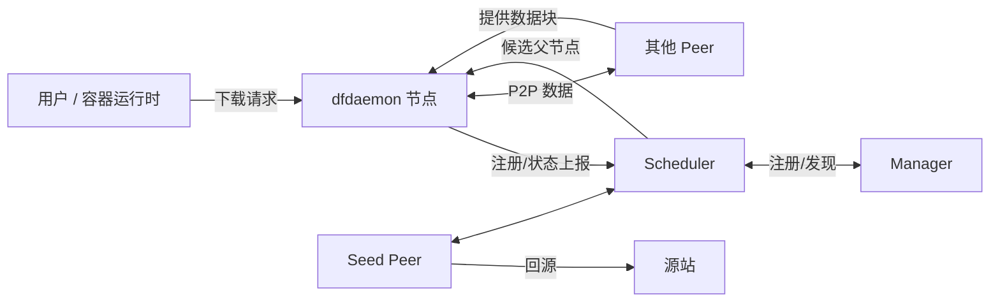
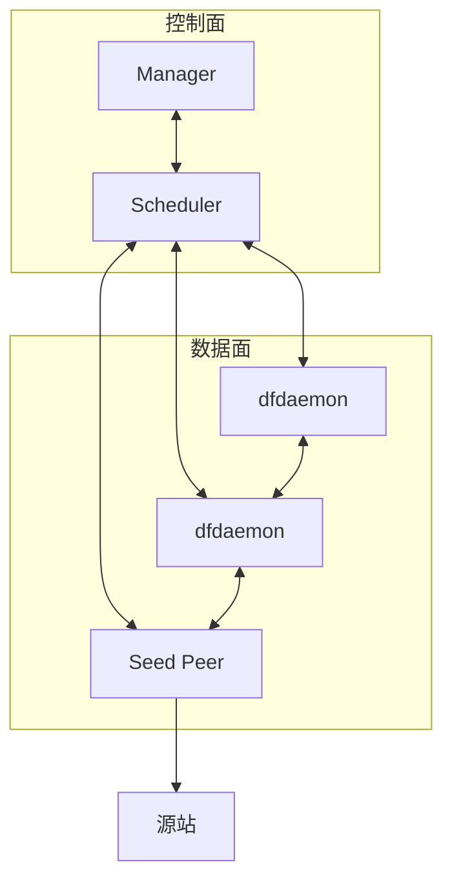
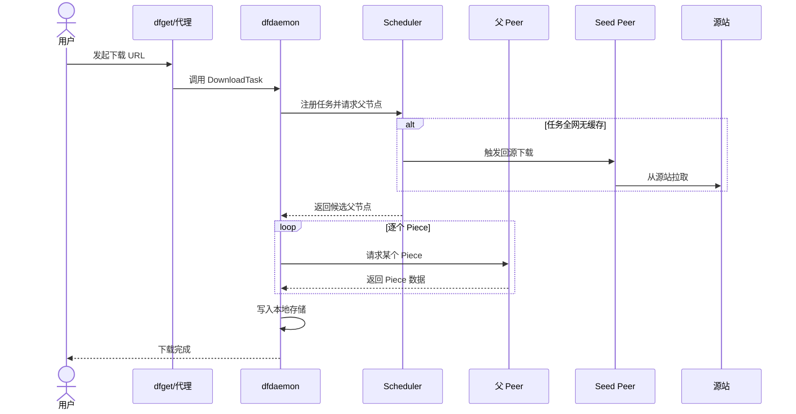
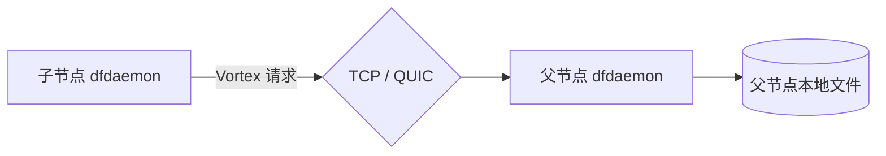
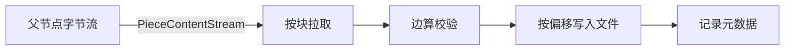
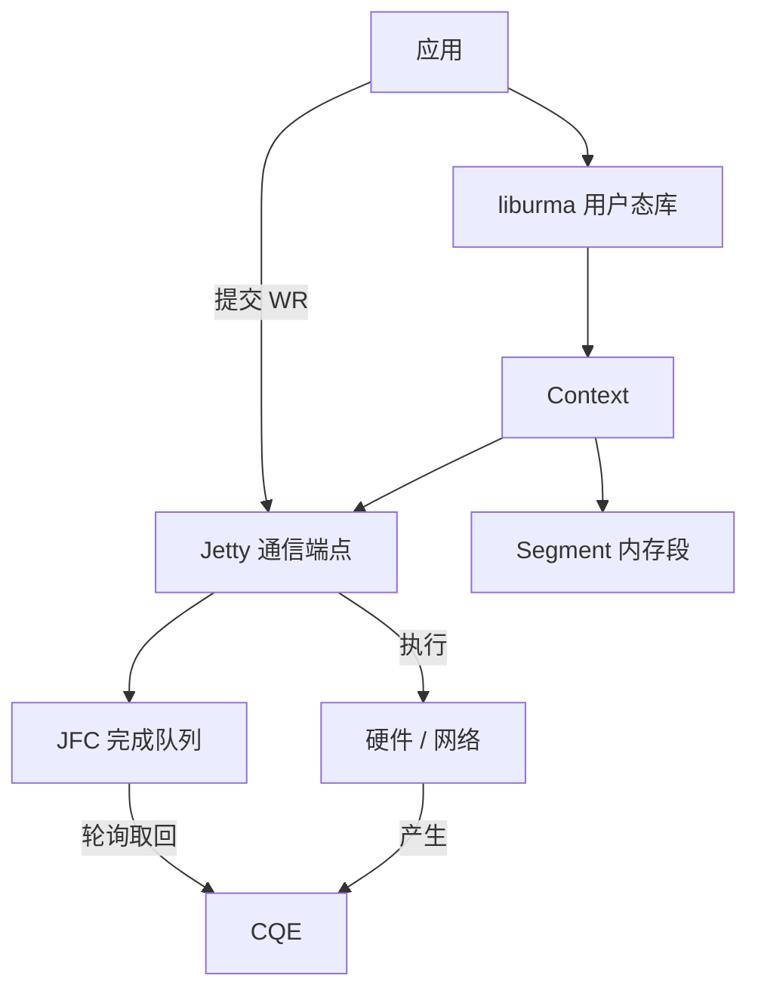
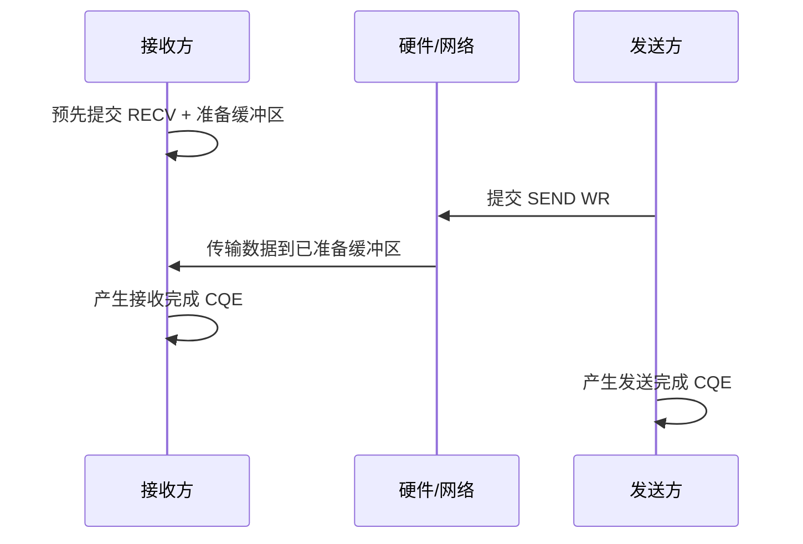
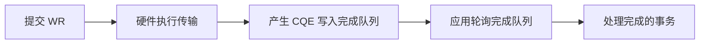
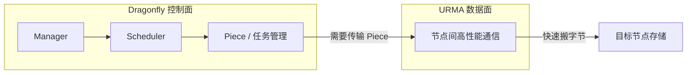

# Dragonfly 与 URMA：P2P 分发与高性能通信基础

> 技术分享文档（面向未深入了解 Dragonfly 与 URMA 的研发人员）
>
> 目的：介绍两个技术是什么、解决什么问题、核心架构与数据流程，以及为什么二者可能产生结合。
>
> 本文不讨论具体接入实现，不展开 UrmaDownloader、FFI、Rust module 等设计细节。
>
> 结论来源标记：
> - `[源码确认]`：可由 Dragonfly / UMDK 源码直接确认；
> - `[官方文档确认]`：来自 UB 官方规范/参考设计文档；
> - `[架构分析]`：基于已确认接口与数据路径做出的结构化理解；
> - `[待验证]`：需要真实环境、硬件或实验进一步验证。

---

# 1. 背景介绍

## 1.1 云原生为什么需要高效数据分发

在云原生场景中，应用交付、镜像拉取、模型加载都依赖"把一份大数据从源头分发到大量节点"。Kubernetes 集群拉取容器镜像、AI 平台分发大模型权重、大数据平台下发数据集，本质上都是同一种问题：**大规模、多节点、重复地传输同一份数据**。

如果每个节点都直接从远端源站拉取完整数据，会产生几个问题：

- **源站带宽瓶颈**：所有请求集中打到源站，源站出口带宽成为天花板，拉取速度被拖慢；
- **重复传输浪费**：同一份数据在多个节点上被重复下载，占用大量骨干带宽；
- **长尾慢**：冷启动时大量节点同时拉取，彼此争抢带宽，整体拉取时间很长。

## 1.2 大规模数据传输的挑战

以 AI 模型和容器镜像为例：

- 模型/镜像体积通常为 **GB 到 TB 级**，不再是几 MB 的小文件；
- 需要分发到的节点数量可以是 **几十到上千个**；
- 传输对 **吞吐**、**延迟**、**稳定性** 都有要求，模型加载还希望尽快拿到首块数据。

面对这种"大文件 × 多节点 × 高并发"的组合，传统"每个节点单独回源"的模型越来越吃力。

## 1.3 为什么需要研究 Dragonfly

Dragonfly 提供了一种典型的解决方案：**P2P 分发**。它让节点之间互相共享已下载的数据，把"一点对多点"变成"多点对多点"，从而降低源站压力、提升整体分发效率。

理解 Dragonfly 的价值，才能进一步思考：当节点间传输本身成为瓶颈时，是否值得引入更高性能的通信机制（URMA），让"调度得好"和"传输得快"结合起来。这构成了研究这两个技术的出发点。[架构分析]

---

# 2. Dragonfly 基础介绍

## 2.1 Dragonfly 是什么

Dragonfly 是一个面向云原生场景的 **P2P 文件分发与镜像加速系统**。它的核心思想是：当一个节点下载数据时，不只是从源站取，而是优先从集群中已经拥有该数据块的其他节点（Peer）获取，从而把下载压力分散到整个集群。[官方文档确认]

## 2.2 整体架构

Dragonfly 由控制面和数据面两部分组成。控制面负责"谁给谁服务"，数据面负责"字节怎么传"。[源码确认]

| 组件 | 作用 |
|---|---|
| **Manager** | 集群管理控制面：维护集群信息、提供 Scheduler 发现与动态配置、承载 Job/预取等管理能力。它不参与具体字节转发。[源码确认] |
| **Scheduler** | 下载调度控制面：接收各节点的状态，维护"任务-节点"关系，为每个下载任务选出合适的父节点（Parent Peer），必要时触发 Seed Peer 回源。[源码确认] |
| **Peer** | 一次下载任务的参与节点。常驻进程是 dfdaemon，它既当"下载者"，也当"上传者"。[源码确认] |
| **Seed Peer** | 特殊角色：当任务全网都没有缓存时，由 Seed Peer 从源站拉取，再提供给其他 Peer。它实际上是开启了 seed 角色的 dfdaemon。[源码确认] |
| **dfdaemon** | 每台机器上的常驻数据节点，负责与 Scheduler 通信、与其他 Peer 传输数据、把数据写入本地存储。[源码确认] |



简单理解架构分层：[架构分析]

- **Manager + Scheduler** 组成控制面：负责发现、调度、选父节点，不碰字节；
- **dfdaemon / Peer / Seed Peer** 组成数据面：负责真正搬数据。



---

# 3. Dragonfly 数据分发流程

一次典型的下载，数据是这样流动的：[源码确认]



## 3.1 用户请求如何进入 dfdaemon

用户（或容器运行时）通过 CLI（dfget）或 HTTP 代理发起下载，请求通过本机的 gRPC 通道进入 dfdaemon。dfdaemon 会先生成任务 ID、探测源站大小、把大文件**切成若干 Piece（分片）**，然后在本地存储中预分配一个文件，为后续按偏移写入做准备。[源码确认]

## 3.2 Scheduler 如何参与调度

dfdaemon 把自己的节点信息、任务信息上报给 Scheduler。Scheduler 负责：

- 维护每个任务有哪些 Peer 正在参与；
- 从已有 Peer 中筛选、排序，选出**候选父节点**返回给请求方；
- 当任务全网无缓存时，触发 Seed Peer 回源，让数据先进入集群。

值得注意的是：**Scheduler 只返回"去哪拿"的信息（父节点的地址、分片元数据），不转发 Piece 的字节**。真正的数据在 Peer 之间直接传输。[源码确认]

## 3.3 Peer 之间如何传输 / 什么是 Piece

大文件在下载前会被切成多个 **Piece（分片）**。每个 Piece 是原文件的一个连续区间（含偏移、长度、校验信息）。[源码确认]

父节点（Parent Peer）持有某几个 Piece，子节点（Child Peer）需要这些 Piece 时，就连接父节点，按 Piece 粒度拉取。同一个 Piece 可以同时被多个子节点请求，这就是 P2P 的分发优势。

## 3.4 Parent Peer / Child Peer 的关系

- **Parent Peer**：向别人提供 Piece 的节点；
- **Child Peer**：从别人那里获取 Piece 的节点。

两者不是固定身份：一个节点在某任务中是子节点，在另一个任务中完全可能成为父节点。调度器通过为每个任务维护"节点关系图（DAG）"，保证不会形成环路，并尽可能让每个节点从"最合适"的父节点取数据。[源码确认]

## 3.5 数据最终如何写入 Storage

Piece 并不是作为独立文件保存的。dfdaemon 在任务开始时就在本地存储中**预分配一个完整文件**，每个 Piece 到达后按自己的偏移写入文件对应区间，同时计算校验值并记录元数据。[源码确认]

因此：

- 所有 Piece 都写进**同一个预分配文件**；
- Piece 不是"下载完再拼接"，而是"边下载边按偏移写入"；
- 全部 Piece 写完，文件就完整了，直接可作为缓存复用；
- 元数据（分片编号、偏移、长度、校验、来源等）记录在 RocksDB 中。[源码确认]

---

# 4. Dragonfly 数据面通信机制

## 4.1 当前数据传输方式

Peer 之间的数据面目前支持两种传输协议：[源码确认]

- **TCP**：通用、可靠的字节流传输；
- **QUIC**：基于 UDP 的用户态可靠传输（自带加密与多路复用）。

两者之上使用同一套自定义应用层协议（Vortex）来描述"请求哪个 Piece、Piece 的元数据与内容"。[源码确认]



## 4.2 Downloader 抽象

Dragonfly 将"如何从父节点下载一个 Piece"抽象为一个 **Downloader**。无论底层是 TCP 还是 QUIC，下载方都以统一的接口拿到：Piece 的内容流、它在文件中的偏移、以及预期的校验值。[源码确认]

这个抽象的意义在于：**上层的 Piece 管理和存储逻辑不关心底层具体用什么协议**，只要它能吐出一个有序的字节流即可。

## 4.3 PieceContentStream 与 Storage 消费数据流

下载到的 Piece 内容被表示成 **PieceContentStream**——一个按需拉取的字节块（chunk）异步流，而不是一次性装入内存的完整块。[源码确认]

Storage 端这样消费它：[源码确认]

1. 从流中逐个取出字节块；
2. 每个块边接收边计算校验值；
3. 把字节按偏移写入预分配文件；
4. 写完后与父节点提供的预期校验值比对，通过才标记该 Piece 完成。

这种"流式、边收边写、边写边校验"的方式，避免了把整块数据先完整缓存在内存里再落盘，对大文件分发非常关键。[架构分析]



---

# 5. URMA 基础介绍

## 5.1 URMA 是什么

URMA（Unified Remote Memory Access，统一远程内存访问）是灵衢（UnifiedBus / UB）体系中**面向高性能通信的异步编程模型与通信库**。[官方文档确认] 它支持异步内存访问和双边消息，提供比传统 Socket 更直接、更低开销的数据搬运方式。

URMA 是 UB 通信能力在用户态的一个重要入口：通过 `liburma` 用户态库暴露给应用程序使用。[官方文档确认]

## 5.2 它解决什么问题

传统 Socket 通信中，数据往往要经过：

```text
应用缓冲区 → 内核 Socket 缓冲区 → 内核协议栈 → 网卡
```

每一次内核态/用户态切换、每一次缓冲区拷贝、内核协议栈处理，都会带来 CPU 开销和延迟。[架构分析]

URMA 要解决的核心问题，就是**减少这些中间环节，让应用的数据尽可能直接地交给硬件/网络搬运**，从而获得：

- **高吞吐**：减少 CPU 参与数据搬运，让网络带宽更接近上限；
- **低延迟**：缩短首字节到达时间与单次操作完成时间。

## 5.3 与传统 Socket 通信模型区别

| 维度 | 传统 Socket | URMA |
|---|---|---|
| 编程模型 | 字节流 + 读写回调 | 提交异步操作 + 轮询完成队列 [源码确认] |
| 接收方式 | 数据来了被动读 | 接收方**预先准备接收缓冲区**再等数据 [源码确认] |
| 数据搬运 | 经过内核协议栈 | 用户态 + 硬件协同，接近直连 [架构分析] |
| 完成通知 | 读写系统调用返回 | 轮询完成队列（CQ）获得完成记录 [源码确认] |

关键差异是：URMA 需要应用**显式管理通信端点、内存注册、发送/接收队列和完成通知**，换来的是更高的性能和更可控的资源使用。[架构分析]

---

# 6. URMA 核心架构

## 6.1 核心概念

| 概念 | 是什么 | 作用 |
|---|---|---|
| **liburma** | URMA 的用户态库 | 向应用提供创建 Context、Jetty、Segment 等资源以及提交数据操作的 API。[官方文档确认] |
| **Context** | 应用打开某个 URMA 设备后得到的操作上下文 | 后续所有通信资源都归属于它，是资源创建的入口。[源码确认] |
| **JFC** | 完成队列（Completion Queue） | 保存发送/接收等操作的完成结果；应用通过轮询它来获知操作是否完成。[源码确认] |
| **Jetty** | URMA 的通信端点（类似 socket 的概念） | 承载异步事务的下发与执行，可同时包含发送、接收和完成关系。[官方文档确认] |
| **Segment** | 一段被 URMA 描述和管理的内存区域 | 是数据操作的内存基本对象；需要注册后才能用于传输，且未注销前底层内存不能随意释放。[官方文档确认] |
| **WR** | 工作请求（Work Request） | 应用提交给硬件/设备的异步操作描述（如发送、接收、读写）。[源码确认] |
| **CQE** | 完成队列条目（Completion Queue Entry） | 表示一次 WR 操作完成的结果，含状态、长度等信息。[源码确认] |



## 6.2 软件栈位置

URMA 用户态调用路径大致为：[官方文档确认] + [源码确认]

```text
应用 → liburma（用户态 API）→ 用户态 Provider → 内核模块（uburma/ubcore）→ UB 设备
```

- **liburma**：用户态 API 库，管理各类资源对象；
- **uburma**：内核模块，把内核能力暴露给用户态；
- **ubcore**：内核核心框架，统一管理设备与通信资源，是 UMS、URMA 等能力的共同基础。

对上层应用而言，URMA 的意义是：**应用可以直接使用一块注册过的内存，向远端的通信端点发起异步数据操作，然后通过完成队列获知结果**。[架构分析]

---

# 7. URMA 数据传输流程

## 7.1 两种模型的对比

传统 Socket 的数据路径：

```text
Application
    ↓ Socket 调用
    Socket / 内核协议栈
    ↓
Kernel
    ↓
Network
```

URMA 的数据路径：

```text
Application
    ↓ 提交 WR
    Hardware（用户态 + 硬件协同）
    ↓ 完成产生 CQE
    Completion / CQ Polling
```

核心转变：应用**提交异步工作请求（WR）给硬件**，硬件执行传输后**产生完成记录（CQE）**，应用**轮询完成队列（CQ）**取回结果，而不是依赖内核的中断和回调。[架构分析]

## 7.2 SEND / RECV

SEND 与 RECV 是 URMA 的一对**双边操作**：双方都需要参与。[源码确认]

- 接收方先向接收队列提交一个 **RECV（接收 WR）**，同时准备好接收缓冲区；
- 发送方提交一个 **SEND（发送 WR）**，把数据发给对方；
- 数据到达后，双方各自产生完成记录。



## 7.3 Completion 与 CQ Polling

- **Completion（完成）**：一个 WR 被硬件执行完毕，就会在完成队列中产生一条完成记录（CQE）。它告诉应用"哪个操作完成了、结果是否成功、涉及多少数据"。[源码确认]
- **CQ Polling（轮询完成队列）**：应用不断轮询完成队列，取出 CQE 并处理对应的事务。

值得注意的是：**"提交成功（post 成功）"不等于"操作完成"**。应用必须轮询完成队列，拿到 CQE 才确认数据真正可用。[架构分析]



---

# 8. Dragonfly 与 URMA 的结合思路

## 8.1 两者的分工

在现有 Dragonfly 中，数据分发被清晰分成两部分：[源码确认]

- **控制面（调度）**：Manager + Scheduler 负责发现、调度、选父节点、Piece 管理、P2P 协同——回答"数据从哪来、从谁拿"；
- **数据面（传输）**：Peer 之间通过 TCP/QUIC 实际搬字节——回答"字节怎么传"。

URMA 关注的正是数据面这一层：它要提供**节点间高性能、低延迟、高吞吐的通信**，替代或优化当前 TCP/QUIC 的用户态/内核传输开销。[架构分析]

## 8.2 可能的结合：Dragonfly 控制面 + URMA 数据面

一个自然的结合思路是：

- **Dragonfly 负责**：数据调度、Piece 管理、P2P 协同（谁给谁、怎么去重、怎么校验、怎么落盘）；
- **URMA 负责**：高性能的节点间通信（把 Piece 字节快速、低开销地从一个节点搬到另一个节点）。

即形成 **"Dragonfly 控制面 + URMA 数据面"** 的形态：[架构分析]



这里的价值在于：**调度逻辑（Dragonfly）和数据搬运（URMA）解耦**。Dragonfly 仍然负责"分发得聪明"，URMA 负责"传输得快"。当 P2P 节点间传输成为瓶颈时，用更高效的通信机制替换数据面，可能带来整体分发吞吐和延迟的收益。[架构分析]

需要强调的是，这只是一个**架构层面的思路**。真正落地还面临许多待验证问题，例如 URMA 的资源生命周期如何匹配 Piece 的流式语义、接收缓冲区的安全复用时机、完成通知与 Piece 完成语义的对应等。[待验证]

---

# 9. 总结

- **Dragonfly 解决什么问题**：云原生场景下大规模、多节点、重复的文件分发问题。它通过 P2P 分片传输，让节点之间互相共享数据，降低源站压力、提升整体分发效率，并统一了调度（控制面）与传输（数据面）的分工。[源码确认]

- **URMA 解决什么问题**：节点间高性能通信问题。它通过用户态 + 硬件协同的异步编程模型，减少内核协议栈与数据拷贝开销，实现高吞吐、低延迟的数据搬运。[官方文档确认]

- **为什么研究二者结合**：Dragonfly 已经把"调度"和"传输"分离开，而 URMA 正是一种更高效的传输底座。两者天然可以在架构上互补——**Dragonfly 负责分发得聪明，URMA 负责传输得快**。研究二者的结合，是为了探索在大规模 AI 模型、容器镜像分发场景下，能否在保持 Dragonfly 丰富调度能力的同时，显著提升节点间数据传输的性能。[架构分析]

---

# 后续研究方向

1. **Dragonfly 源码深入分析**：进一步梳理控制面与数据面、Piece 生命周期、缓存与存储语义，为可能的传输替换打基础。

2. **URMA 实验验证**：在真实 UB 环境中验证 liburma/URMA 的建链、内存注册、SEND/RECV 与完成轮询的实际行为与资源开销。

3. **数据面性能测试**：对当前 TCP / QUIC 数据面做分层压测，量化吞吐、延迟、CPU 与拷贝开销，建立性能基线。

4. **Dragonfly + URMA 原型探索**：以最小原型验证"Dragonfly 控制面 + URMA 数据面"的可行性，重点解决流式语义、缓冲区生命周期与完成通知的对接问题。
