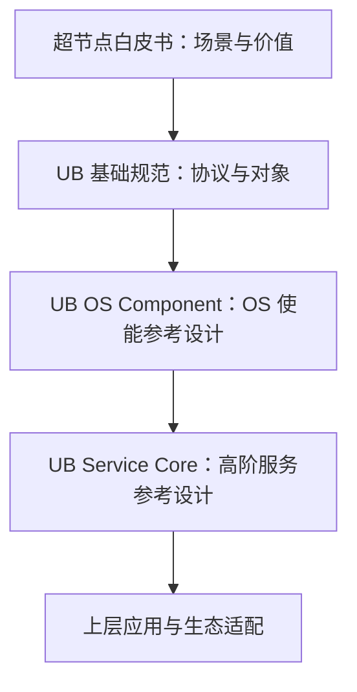

# UB PDF 文档清单

## 1. 文档目标

建立当前仓库 `ub/` 下 PDF 的可核验清单、证据层级、适用问题与阅读顺序。UB 在本文中固定指灵衢 UnifiedBus。

## 2. 主要来源

| 文件名 | 文档标题 | 版本 / 发布 | 发布机构 | 类型 | 页数 | 主要范围 |
| --- | --- | --- | --- | --- | ---: | --- |
| `UB-Base-Specification-2.0.1-zh-clean.pdf` | 灵衢基础规范 | 2.0.1 / 2026-04 | 华为技术有限公司 | 基础规范 | 545 | 系统组成、六层协议栈、事务与编程模型、内存/资源管理、安全、寄存器及附录 |
| `UB-Software-Reference-Design-for-OS-2.0-zh.pdf` | 灵衢使能操作系统参考设计 | 2.0 / 2025-09 | 华为技术有限公司 | OS 参考设计 | 57 | Device Mgmt、Memory Mgmt、Communication、Virtualization、RAS |
| `UB-Service-Core-SW-Arch-RD-2.0-zh.pdf` | 灵衢系统高阶服务软件架构参考设计 | 2.0 / 2025-09 | 华为技术有限公司 | 高阶服务参考设计 | 26 | UBS Engine、UBS Mem、UBS Comm、UBS IO、UBS Virt |
| `UB-SuperPoD-Architecture-White-Paper-zh.pdf` | 基于灵衢的超节点参考架构白皮书 | [文档未说明] / [文档未说明] | 华为技术有限公司（版权页） | 白皮书 | 29 | 超节点概念、10 类应用场景、六项架构特征、协议与软件概览 |

封面和版权页证据：前三份文档的标题、版本、发布日期见各自 PDF 第 1 页 / 正文第 1 页，发布机构见第 2 页；白皮书标题见页眉和目录，机构见 PDF 第 2 页，封面未列版本与发布日期。[规范确认] [参考设计确认] [白皮书确认]

## 3. 核心概念

### 3.1 文档层级

- 白皮书回答“为何需要超节点、UB 在其中处于什么位置”，但不能代替协议条款或工程接口说明。[白皮书确认] 来源：白皮书 §2、§4，PDF 第 5-7、21-28 页 / 正文同页。
- 基础规范是协议与对象语义的最高证据，覆盖物理层至功能层、UMMU、UBFM、资源管理和安全。[规范确认] 来源：基础规范 §1.1-1.3、§2.2，PDF 第 8、15-16 页 / 正文同页。
- OS 参考设计描述在 Linux 既有框架上扩展出的四类 OS 能力，不等于 UB 协议本身。[参考设计确认] 来源：OS 参考设计 §1.2、§2，PDF 第 8、10-11 页 / 正文同页。
- Service Core 是 OS 之上的五类集群级高阶服务，不是所有 UB 软件组件的统称。[参考设计确认] 来源：高阶服务参考设计 §2.2，PDF 第 8-9 页 / 正文同页。

### 3.2 每份文档适合与不适合回答的问题

| 文档 | 适合回答 | 不能单独回答 |
| --- | --- | --- |
| 基础规范 2.0.1 | 线协议、包格式、事务/顺序/可靠性、EID/Entity/Token/UMMU、UBFM、安全与规范性虚拟化 | Linux 模块是否已实现、具体 API ABI、产品部署与性能实测 |
| OS 参考设计 2.0 | OS 组件边界、模块关系、URMA/URPC/UMS 使用流程、内存导入导出、设备直通、OS RAS | 2.0.1 的全部协议修订、具体源码状态、Service Core 的五类服务实现成熟度 |
| Service Core 参考设计 2.0 | 五类高阶服务的定位、参考模块与应用场景 | 协议包格式、内核细节、所有图中模块的真实交付状态与公开 API 完整性 |
| 超节点白皮书 | 场景、总体架构、六项特征、软件/协议全景 | 规范性行为、工程接口、性能数据的测试条件和可复现性 |

## 4. 架构或机制

推荐阅读顺序：白皮书 §2、§4 → 基础规范 §1-2、§7-11 → OS 参考设计 §2-7 → 高阶服务参考设计 §2-7。基础规范物理层与寄存器附录可按研究主题回看，不必首轮通读。[基于文档归纳]

## 5. 关键对象与关系

- 基础规范 2.0.1 的修订历史明确：2.0 于 2025-09 初始发布，2.0.1 于 2026-04 基于 2.0 澄清/补充物理层、链路重传、网络标记、传输超时、事务包头与字节序、配置空间及缩略语等。[规范确认] 来源：基础规范“修订历史”，PDF 第 7 页 / 正文第 7 页。
- 两份 2.0 参考设计引用的是《灵衢基础规范 2.0》，而当前仓库协议文档为 2.0.1。[文档间存在差异] 来源：OS 参考设计 §1.3，PDF 第 9 页；高阶服务参考设计 §1.3，PDF 第 6 页；基础规范修订历史，PDF 第 7 页。
- 白皮书未给出文档版本和发布日期；PDF 元数据的生成时间不能替代文档正式发布日期。[文档未说明]

## 6. 文档明确结论

实际发现并读取 4 份 PDF，无损坏或加密阻断；文本层均可抽取，关键页面可渲染。[基于文档归纳]

## 7. 文档未说明内容

- 四份文档没有给出源码提交号、构建版本、接口稳定性承诺或完整测试矩阵。[文档未说明]
- 白皮书性能数字缺少统一的测试环境、样本和复现步骤，不能据此给出工程收益承诺。[文档未说明]

## 8. 待确认问题

- 需要用源码/SDK 确认 2.0 OS 与 Service Core 参考设计中的模块是否与当前实现一一对应。[待源码确认]
- 需要确认 2.0.1 协议修订是否要求 2.0 软件参考设计同步调整。[待源码确认] [待环境验证]

