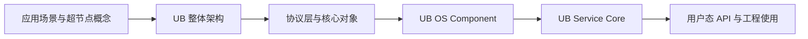

# UB 阅读指南

## 1. 文档目标

按“场景 → 架构 → 协议 → OS → Service Core → 用户 API”建立循序渐进的 UB 阅读路线。

## 2. 主要来源

四份 PDF 的目录：基础规范 PDF 第 3-6 页，OS 参考设计第 3-7 页，高阶服务参考设计第 3-5 页，白皮书第 3 页。[规范确认] [参考设计确认] [白皮书确认]

## 3. 核心概念

| 阶段 | 阅读材料与章节 | 核心问题 | 首轮可跳过 | 完成标志 |
| --- | --- | --- | --- | --- |
| 1 场景与超节点 | 白皮书 §1-3、§4.2 | 为什么需要超节点；“总线级互联、协议归一、平等协同、全量池化、大规模组网、高可用”分别指什么 | 各业务案例的细粒度性能数字 | 能说明超节点是逻辑计算机形态，UB 是其基础互联协议 |
| 2 UB 整体架构 | 基础规范 §1-2；白皮书 §4.1 | UBPU、Controller、Switch、Link、Domain、Fabric、UBoE、UMMU、UBFM 的关系 | 物理编码细节 | 能画出 UB 六层协议栈及旁路管理组件 |
| 3 基础协议与对象 | 基础规范 §5-8、§10.2-10.3 | EID/网络地址/UPI；RTP/CTP/UTP；事务与 Jetty/Segment | 包头逐位定义、寄存器附录 | 能区分网络、传输、事务、功能层责任 |
| 4 OS 使能 | OS 参考设计 §2-7 | Linux 如何扩展设备、内存、通信、虚拟化和 RAS | 命令示例和维测细节 | 能区分 ubus/ubcore/liburma/UMS 等组件边界 |
| 5 Service Core | 高阶服务参考设计 §2-7 | 五类高阶服务怎样封装 OS/UB 能力 | 场景宣传数字 | 能说明 UBS Engine/Mem/Comm/IO/Virt 各自边界 |
| 6 用户 API | OS 参考设计 §4.3、§5.3-5.5；基础规范 §8 | EXPORT/IMPORT、URMA、URPC、UMS 的使用模式 | 未涉及当前问题的虚拟化 XML/HMP | 能解释 Jetty/Segment/CQ 的最小工作流及其证据限制 |

## 4. 架构或机制

每阶段建议先读“概述/架构图”，再读对象定义，最后读流程。遇到“支持”“参考架构”“可选”时保留其原始模态，不能转写成“已交付”。[基于文档归纳]

## 5. 关键对象与关系

- 在进入 API 前先掌握：Entity/EID 是通信对象与身份；Segment/UBMD 是内存对象与描述符；Jetty/队列承载异步操作；TP Channel 是传输层共享通道。这些对象分属不同层，不能互换。[规范确认] 来源：基础规范 §1.5、§6.1、§8.2、§9.3，PDF 第 9-12、152、244-250、264 页。
- URMA 是功能层异步编程模型/高速通信库；URPC 是在编程模型之上的函数调用协议；UMS 是 OS 参考设计中的 Socket 兼容组件；UVS 出现在 UBS Virt 参考设计中。[文档间存在差异]

## 6. 文档明确结论

首轮阅读不需要先掌握 545 页规范的每个位域。基础规范自身将架构、协议栈和编程模型分层，允许按问题回到对应章节。[规范确认] 来源：基础规范 §1.3、§2.2，PDF 第 8、15-16 页。

## 7. 文档未说明内容

文档未提供统一的课程时长、先修知识或实验环境。[文档未说明]

## 8. 待确认问题

完成阅读后仍需通过头文件和示例确认 API 名称、结构体字段、错误码与线程安全约束。[待源码确认]

