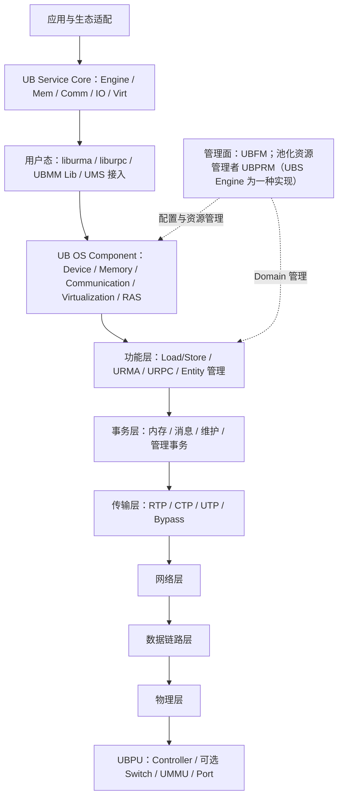

# UB 架构

## 1. 文档目标

梳理硬件、协议、操作系统、用户态库、管理面、高阶服务与应用的分层关系。

## 2. 主要来源

基础规范 §2、§8-10；OS 参考设计 §2；高阶服务参考设计 §2；白皮书 §4.3。[规范确认] [参考设计确认] [白皮书确认]

## 3. 核心概念

UB 协议栈与软件栈是两个观察维度：协议栈描述包和事务如何工作；软件栈描述 OS 与高阶服务怎样暴露、管理和组合这些能力。[基于文档归纳]

## 4. 架构或机制

图中每个节点的证据：基础规范 §2.2、§8、§10（PDF 15-16、244-262、292-346）；OS 参考设计 §2（PDF 10-11）；高阶服务参考设计 §2.2（PDF 8-9）。[规范确认] [参考设计确认]

## 5. 关键对象与关系

- 硬件层：UBPU 中包含执行协议栈的 Controller，可选 Switch，并可含 UMMU。[规范确认]
- 协议层：物理、数据链路、网络、传输、事务、功能六层；UMMU 和 UBFM 是横向支撑对象。[规范确认]
- OS 层：在 Linux 既有设备、内存、通信和虚拟化框架上扩展 UB。[参考设计确认]
- 用户态：liburma、liburpc、UBMM Lib 等向应用或资源管理者提供接口；接口细节需源码确认。[参考设计确认]
- 高阶服务：五类 Service Core 位于 UB Enabled OS 节点之上，面向集群/超节点能力。[参考设计确认]

## 6. 文档明确结论

UBFM 与 UBS Engine 不同：前者是基础规范中的 Domain 管理角色；后者是 Service Core 中的超节点控制引擎参考实现。OS 文档还明确 UBPRM 可由用户实现，UBS Engine 只是其中一种实现。[文档间存在差异] 来源：基础规范 §10.1，PDF 第 292 页；OS 参考设计 §2 注 1，PDF 第 11 页；高阶服务参考设计 §3，PDF 第 10-12 页。

## 7. 文档未说明内容

上述层次图不表示所有实现必须把每个模块部署在同一节点，也不表示所有参考模块已经开源或交付。[文档未说明]

## 8. 待确认问题

实际进程、内核模块、守护进程、服务发现与部署拓扑需结合源码/安装包确认。[待源码确认]

