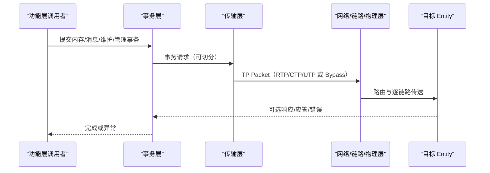

# UB 协议模型

## 1. 文档目标

解释六层协议怎样关联，以及数据单位、事务、可靠性、流控、路由与 UBoE 的位置。

## 2. 主要来源

基础规范 §2.2、§3-7、附录 E-F；白皮书 §4.1-4.2。[规范确认] [白皮书确认]

## 3. 核心概念

| 层 | 责任 | 关键单位/机制 |
| --- | --- | --- |
| 物理层 | 物理介质上的比特流、速率/FEC/Lane 管理 | Lane、Symbol、FEC |
| 数据链路层 | 单 Link 点到点可靠传送 | Flit、DLLDP/DLLCB、信用流控、链路重传、虚通道 |
| 网络层 | Domain 内/跨 Domain 路由 | NTH、CNA/IP 地址、多路径、NPI |
| 传输层 | 端到端传输服务 | TP Packet、TPEP、TP Channel/TPG、RTP/CTP/UTP |
| 事务层 | 统一内存、消息、维护、管理操作 | Request/Response、TAH、ROI/ROT/ROL/UNO |
| 功能层 | 编程模型与高级功能 | Load/Store、URMA、URPC、Jetty、Entity 管理 |

[规范确认] 来源：基础规范 §2.2，PDF 第 15-16 页；各层正文范围见目录 PDF 第 3-6 页。

## 4. 架构或机制

该图只表达规范明确的层间职责，不附加具体实现线程或缓存。[规范确认]

## 5. 关键对象与关系

- 数据链路层以 20 字节 Flit 为基本单位，并以信用流控和点到点重传提供链路可靠性。[规范确认] 来源：基础规范 §1.5、§4，PDF 第 9、87-138 页。
- RTP 通过 PSN、TPACK/TPNAK/TPSACK 和重传提供端到端可靠、同一 TP Packet 仅向事务层执行一次；CTP 借助下层可靠性；UTP 不保证送达；Bypass 不提供传输层服务。[规范确认] 来源：基础规范 §6.1、§6.3，PDF 第 152-163 页。
- 事务层可靠模式为 ROI、ROT、ROL，不可靠模式为 UNO；它区分事务执行序 TEO 与完成序 TCO。[规范确认] 来源：基础规范 §1.5、§7.1-7.3，PDF 第 10、201-226 页。
- 事务类型包括内存、消息、维护、管理；典型操作包括 Write/Read/Atomic、Send、Prefetch、Management。[规范确认] 来源：基础规范 §7.4，PDF 第 226-243 页。
- UBoE 是通过以太/IP 承载 UB 事务并跨 Domain 互通的方式，不是把 UB 简化为普通以太报文。[规范确认] 来源：基础规范 §1.5、§2.1，PDF 第 12、14 页。

## 6. 文档明确结论

可靠性是分层协作而非单一机制：物理层可降速/降 Lane，链路层可重传，网络层可多路径，传输层 RTP 可端到端重传，资源层按 A/B/C 类错误就近处理。[规范确认] 来源：基础规范 §2.1、§10.6，PDF 第 14、339-346 页。

## 7. 文档未说明内容

具体算法参数选择、TP Channel 建立协商方式及某些拥塞算法实现由实现决定或未定义。[文档未说明] 来源：基础规范 §6.2-6.3，PDF 第 159、162 页。

## 8. 待确认问题

具体产品使用哪种传输模式、重传算法、拥塞算法及 UBoE 封装组合需配置和环境验证。[待环境验证]

