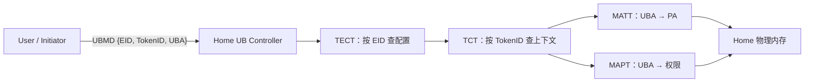

# UB 地址与资源模型

## 1. 文档目标

梳理 Entity/EID、网络地址、UBMD/UBA、资源发现、导入导出、权限、隔离和 UMMU。

## 2. 主要来源

基础规范 §8.2、§9、§10、§11；OS 参考设计 §3-4。[规范确认] [参考设计确认]

## 3. 核心概念

- Entity 是 Controller/Switch 分配自身资源的基本单元，具有配置空间和可选资源空间；Entity 0 还管理公共资源。[规范确认] 来源：基础规范 §10.2.2，PDF 第 294-295 页。
- EID 是 128-bit、唯一 ID 地址空间中的 Entity 身份；线路可携带全长、20-bit 简短格式或隐式 EID。EID 与拓扑网络地址绑定但不是同一对象。[规范确认] 来源：基础规范 §10.3.1，PDF 第 295-296 页。
- UBMD = EID + TokenID + UBA；Home 侧 UMMU 将其转换为 PA 并校验权限。[规范确认] 来源：基础规范 §9.2-9.4，PDF 第 263-265 页。

## 4. 架构或机制

[规范确认] 来源：基础规范 §9.3-9.4，PDF 第 264-265 页。

OS 的 EXPORT/IMPORT 流程：Home 调用 `obmm_export` 生成含 UBA/TokenID 的描述，UBPRM 填充拓扑/地址信息，User 调用 `obmm_import`，再上线为 NUMA node 或 char device。[参考设计确认] 来源：OS 参考设计 §4.3.1，PDF 第 19-20 页。

## 5. 关键对象与关系

- 资源发现：规范由 UBFM 管理 Domain 内 Entity/Port，OS 由 ubfi 解析 UBRT 并由 UBus Driver 枚举设备。[规范确认] [参考设计确认] 来源：基础规范 §10.1-10.4，PDF 第 292-336 页；OS 参考设计 §3.2，PDF 第 13-16 页。
- 隔离：UPI 定义 Entity 分区，一个 Entity 只属于一个 UB Partition；NPI 用于网络分区。[规范确认] 来源：基础规范 §10.3.2、§11.3，PDF 第 296-297、351 页。
- 权限：内存访问可带 TokenID/TokenValue 并由 UMMU 校验；Jetty 使用 TCID/TokenValue，不依赖 UMMU。[规范确认] 来源：基础规范 §11.4，PDF 第 351-353 页。
- UMMU 与 IOMMU/SVA：OS 参考设计说明在 Linux DMA/SVA 框架上扩展管理 UMMU，并给出 USVA/KSVA/DMA/IMPORT-EXPORT 接口类别；PDF 未给出与 IOMMU 的完整等价或替代关系。[参考设计确认] [文档未说明] 来源：OS 参考设计 §2、§4.2，PDF 第 10-11、18-19 页。

## 6. 文档明确结论

“统一地址空间”在文档中至少包括 EID 唯一身份空间、UBA/UBMD 表达的远端内存寻址，以及 Service Core MemFabric 的跨机虚拟编址参考能力；这些不是同一个地址字段。[基于文档归纳]

## 7. 文档未说明内容

EID 分配策略、EID 与网络地址绑定算法、应用如何获得远端 EID/Token/UBA，不由基础规范完整规定。[文档未说明] 来源：基础规范 §10.3.1，PDF 第 295-296 页。

## 8. 待确认问题

实际页表格式选择、TLB 行为、IOMMU/SVA 互操作、Token 安全分发与回收需源码和环境验证。[待源码确认] [待环境验证]

