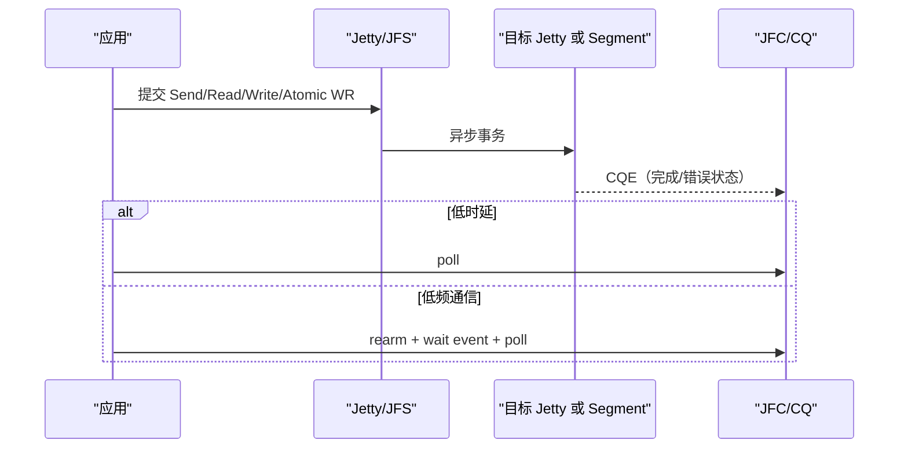

# UB 通信模型

## 1. 文档目标

解释消息/内存语义、单边/双边、Jetty、完成通知，以及 URMA、UMS、UVS、URPC 的分层关系。

## 2. 主要来源

基础规范 §7-8、附录 H；OS 参考设计 §5；高阶服务参考设计 §5、§7.2。[规范确认] [参考设计确认]

## 3. 核心概念

- 双边消息：接收端必须显式提交接收请求；支持一对多消息语义。[参考设计确认] 来源：OS 参考设计 §5.3.3.3，PDF 第 32 页。
- 单边内存：本端给出本地/远端地址发起 Read/Write，对端应用无需感知。[参考设计确认] 来源：OS 参考设计 §5.3.3.4，PDF 第 33 页。
- 原子操作：OS 文档列 CAS/FAA；基础规范还定义多种 Atomic 子类型和 1-64 Bytes 操作数约束。[规范确认] [参考设计确认] 来源：OS 参考设计 §5.3.3.5，PDF 第 33 页；基础规范 §7.4.2.3，PDF 第 234-238 页。

## 4. 架构或机制

[规范确认] [参考设计确认] 来源：基础规范 §8.2.2-8.2.3，PDF 第 245-250 页；OS 参考设计 §5.3.3，PDF 第 31-34 页。

## 5. 关键对象与关系

- Jetty 类型包括标准 Jetty、单边 JFS/JFR 与 Jetty Group；JFC 接收完成通知，JFCE 以事件/中断通知，JFAE 接收异步异常。[规范确认] 来源：基础规范 §8.2.2，PDF 第 245-249 页。
- SQ/RQ/CQ/EQ 是 FIFO 事务队列；同队列可施加事务序要求，不同队列无保序要求。[规范确认] 来源：基础规范 §8.2.3，PDF 第 250 页。
- 完成记录意味着操作已进入完成状态；提交成功本身不等于完成。轮询用于低时延，中断等待用于低频通信。[参考设计确认] 来源：OS 参考设计 §5.3.3.6，PDF 第 33-34 页。

### 软件层次

| 名称 | 层次 | 解决的问题 | 与其它组件关系 |
| --- | --- | --- | --- |
| URMA | 功能层/OS 通信 API | Jetty/Segment、单边/双边/原子与完成 | liburma → uburma/ubcore → UDMA driver |
| URPC | URMA/LD-ST 之上的函数语义 | Channel/Queue/Function 的远程调用 | 可把 Queue 映射到 Jetty 或 Memory |
| UMS | OS Socket 兼容 | AF_UB 或启动脚本适配，使用 URMA Jetty/LD-ST | 位于 Socket 抽象与内核 URMA 之间 |
| UVS | UBS Virt 参考组件 | 虚拟网络 TP 层协商建链 | 属于 Virt OVS，不是 URMA 的同义词 |

[参考设计确认] 来源：OS 参考设计 §5.3-5.5，PDF 第 29-39 页；高阶服务参考设计 §7.2.2，PDF 第 23 页。

## 6. 文档明确结论

可靠性与顺序必须分层描述：RTP 提供包级端到端可靠；事务层 ROI/ROT/ROL/UNO 定义事务可靠与执行/完成顺序；队列 FIFO 提供可承载顺序约束的上下文。[规范确认]

## 7. 文档未说明内容

四份 PDF 未把“UB 消息队列”或 `libumq` 定义为正式组件；基础规范定义消息事务与队列对象，OS 文档定义 URPC Queue，但两者不能据名称合并。[文档未说明]

## 8. 待确认问题

背压的用户态可见语义、线程安全、CQ 溢出恢复、默认超时/重试参数和 UMS 兼容边界需源码/实验确认。[待源码确认] [待环境验证]

