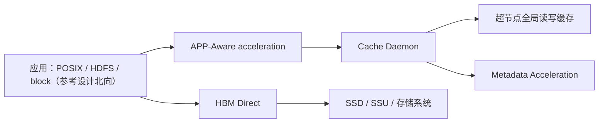

# UB I/O 模型

## 1. 文档目标

区分“UB 可访问存储资源”与“UBS IO 提供的高阶数据服务”，避免推导不存在的文件系统能力。

## 2. 主要来源

基础规范 §7.4、§8.5、附录 I；高阶服务参考设计 §6；白皮书 §3.9。[规范确认] [参考设计确认] [白皮书确认]

## 3. 核心概念

UB 基础协议可用内存/消息/URPC 等方式调用远端功能或存储设备；附录 I 给出 PLOG 的 URPC 存储示例。这只能证明协议表达与示例，不能证明存在通用 POSIX 文件系统。[规范确认] 来源：基础规范 §8.5、附录 I，PDF 第 258-261、522-545 页。

## 4. 架构或机制

[参考设计确认] 来源：高阶服务参考设计 §6.1-6.2，PDF 第 19-20 页。该图是参考设计能力关系，不代表已实现的部署拓扑。

## 5. 关键对象与关系

- 全局数据访问：UBS IO 参考设计以超节点全局读写缓存缩短 I/O 路径。[参考设计确认]
- 缓存/预取/淘汰：APP-Aware 模块识别访问模式并预取或淘汰；Cache Daemon 管理空间、访问与跨节点读取。[参考设计确认]
- 北向接口：参考设计列出 POSIX/HDFS/block 多协议支持。[参考设计确认] 这不是“基础 UB 协议原生提供 POSIX”。
- HBM Direct：参考设计描述 HBM 到 SSD/SSU 或存储系统的直通加速。[参考设计确认]
- 场景：Spark/Hive、CKPT、KV Cache、HPC 小文件缓存。[参考设计确认] 来源：高阶服务参考设计 §6.3，PDF 第 21 页。

## 6. 文档明确结论

基础规范定义 Prefetch_tgt 维护事务，但 Target 可选是否预取且不返回确认；它与 UBS IO 的应用感知预取不是同一层能力。[规范确认] [参考设计确认] 来源：基础规范 §7.4.4，PDF 第 242 页；高阶服务参考设计 §6.2，PDF 第 20 页。

## 7. 文档未说明内容

四份 PDF 未定义统一的持久化域、刷盘屏障、崩溃一致性、文件/对象生命周期、缓存一致性协议或数据亲和算法。[文档未说明]

## 8. 待确认问题

POSIX/HDFS/block 的具体接入方式、缓存回写策略、元数据一致性、故障恢复及 HBM Direct 支持设备矩阵需源码与实验确认。[待源码确认] [待环境验证]

