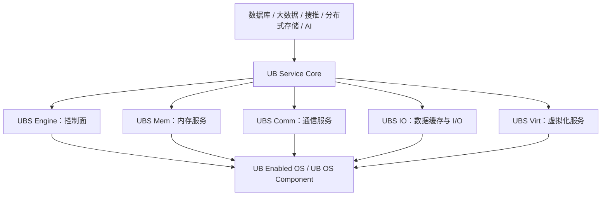

# UB Service Core

## 1. 文档目标

严格按 Engine、Memory、Communication、IO、Virt 五类能力整理，并与 OS Component 划清边界。

## 2. 主要来源

高阶服务参考设计 §2-7；OS 参考设计 §2 注 1。[参考设计确认]

## 3. 核心概念

### UBS Engine

- 超节点控制引擎，提供池化资源管理/调度、简化北向 API、去中心化高可用和监控运维接口。[参考设计确认] 来源：Service Core §3.1，PDF 第 10 页。
- 参考模块 EngineBase、uCache、RMRS、VirtAgent；当前文档重点是内存与 DPU 池化，未给出通用计算调度器的完整接口。[参考设计确认] 来源：§3.2-3.3，PDF 第 11-12 页。

### UBS Memory（PDF 正式名：UBS Mem）

- MemFabric、SHMEM、MemCache、MemStore 分别提供统一编址/访问基础、共享内存、弱一致缓存、强一致可靠内存存储服务。[参考设计确认] 来源：§4，PDF 第 13-15 页。
- PDF 未写 “UBS Memory”，而写 “UBS Mem”。[文档间存在差异]

### UBS Communication（PDF 正式名：UBS Comm）

- HCOM 提供多协议高级 API；Socket over UB 透明兼容；HCAL 面向异构直传；RoUB 提供 Verbs over UB 适配。[参考设计确认] 来源：§5，PDF 第 16-18 页。
- UMS、URMA、UVS 属于不同层或不同子系统，不能全部并列为 UBS Comm 内部模块：本文只确认 HCOM/RoUB/Socket/HCAL 为该参考设计的四特性。[文档间存在差异]

### UBS IO

- 提供全局读写缓存、应用访问模式感知、预取/淘汰、多协议接入、元数据加速与 HBM Direct。[参考设计确认] 来源：§6，PDF 第 19-21 页。
- 文档没有给出持久化语义、缓存一致性算法或灾难恢复协议。[文档未说明]

### UBS Virt

- Virt OVS：虚拟网络、租户隔离、QoS；Virt Optimizer：xPU 虚拟化加速/调优；Virt VM：跨服务器边界的超大规格虚机。[参考设计确认] 来源：§7，PDF 第 22-25 页。
- 场景陈述包括内存借用、极速热迁移、容器热迁移与快速启动，但接口、时序和完成标准未说明。[参考设计确认] [文档未说明]

## 4. 架构或机制

[参考设计确认] 来源：Service Core §2.2 图 2-3，PDF 第 9 页。

## 5. 关键对象与关系

| 维度 | UB OS Component | UB Service Core |
| --- | --- | --- |
| 定位 | OS 原有框架扩展 UB，统一抽象和管理 | 封装底层与集群拓扑的高阶集群服务 |
| 主要块 | Device/Memory/Communication/Virtualization/RAS | Engine/Mem/Comm/IO/Virt |
| 典型接口 | 总线/内存/URMA/Socket/vfio 等 | 资源控制、SHMEM/Cache/Store、HCOM、IO 缓存、虚拟化套件 |
| 证据性质 | OS 参考设计 | 高阶服务参考设计 |
| 是否同义 | 否 | 否 |

[参考设计确认] 来源：OS §1-2，PDF 第 8-11 页；Service Core §2，PDF 第 7-9 页。

## 6. 文档明确结论

UBS Engine 是 UBPRM 的一种实现，而不是 UBFM，也不是整个 UB 软件栈。[参考设计确认] 来源：OS §2 注 1，PDF 第 11 页。

## 7. 文档未说明内容

五类服务的正式发布状态、开源仓库、部署单元、API 版本和兼容性均未说明。[文档未说明]

## 8. 待确认问题

需要源码确认每类服务的真实组件边界、依赖、对外 API、故障语义和交付成熟度。[待源码确认]

