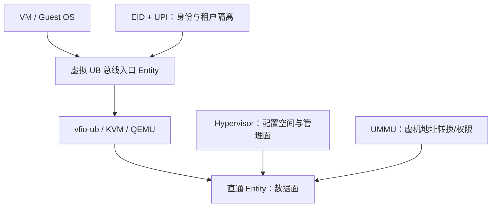

# UB 虚拟化

## 1. 文档目标

区分基础规范的硬件辅助虚拟化、OS 的设备直通参考实现和 UBS Virt 高阶服务。

## 2. 主要来源

基础规范 §10.5；OS 参考设计 §6；高阶服务参考设计 §7；白皮书 §3.6。[规范确认] [参考设计确认] [白皮书确认]

## 3. 核心概念

- 规范层：Entity 可在 Hypervisor/平台硬件辅助下直通虚机，数据面直通、管理面接管；虚机有独立总线入口 Entity、EID 和 UPI。[规范确认] 来源：基础规范 §10.5，PDF 第 337-338 页。
- OS 层：qemu 扩展 Bus Controller/UB 设备/UMMU，libvirt 扩展创建删除，vfio-ub 基于 vfio 实现直通。[参考设计确认] 来源：OS §2、§6，PDF 第 11、40-47 页。
- 高阶服务层：UBS Virt 提供 Virt OVS、Virt Optimizer、Virt VM 参考能力。[参考设计确认]

## 4. 架构或机制

[规范确认] [参考设计确认] 来源：基础规范 §10.5，PDF 第 337-338 页；OS §6.2，PDF 第 42-43 页。

## 5. 关键对象与关系

- 设备直通不等于 SR-IOV。四份 PDF 描述 Entity 级直通和 vfio-ub，但未明确把 SR-IOV 定为 UB 的机制。[文档未说明]
- 内存注册/隔离依赖 UMMU 与独立总线入口；OS 示例还要求大页以满足权限表内存连续性。[参考设计确认] 来源：OS §6.3，PDF 第 43-45 页。
- 容器：UBS Virt 文档称支持超级容器、容器热迁移和快速启动，但未给出容器运行时接口或资源隔离流程。[参考设计确认] [文档未说明]
- 热迁移/快恢：属于 UBS Virt 场景能力；基础规范只定义 Entity 虚拟化/复位等基础机制，未定义完整虚机迁移协议。[文档间存在差异]

## 6. 文档明确结论

规范要求 Entity 重新分配前可做安全处理（如 Entity 级复位）；不同用户虚机/设备可用 UB Partition 隔离。[规范确认] 来源：基础规范 §10.5.1-10.5.2，PDF 第 337-338 页。

## 7. 文档未说明内容

文档未定义虚机热迁移的一致性点、停机窗口、脏页算法、容器 checkpoint 格式、SR-IOV 对应关系或快速恢复 RPO/RTO 验证方法。[文档未说明]

## 8. 待确认问题

QEMU/KVM/libvirt 补丁状态、vfio-ub 安全模型、容器接入、热迁移流程和故障恢复需源码/环境验证。[待源码确认] [待环境验证]

