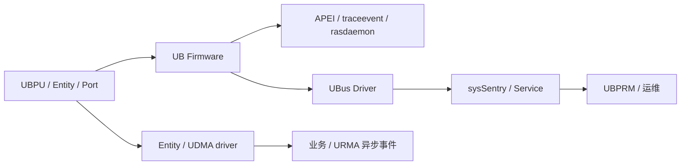

# UB 安全与 RAS

## 1. 文档目标

整理身份、隔离、访问控制、数据通路保护，以及错误检测、上报、隔离和恢复。

## 2. 主要来源

基础规范 §10.6、§11；OS 参考设计 §7。[规范确认] [参考设计确认]

## 3. 核心概念

安全五类功能：设备认证、资源分区隔离、访问控制、数据通路保护（CIP）、TEE 扩展。[规范确认] 来源：基础规范 §11.1.3，PDF 第 348 页。

RAS 指 Reliability、Availability、Serviceability。OS 文档覆盖 UB 设备、远端内存、通信、OOM 与节点故障的检测/隔离/恢复参考流程。[参考设计确认] 来源：OS §7.1，PDF 第 48 页。

## 4. 架构或机制

[参考设计确认] 来源：OS §7.2-7.4，PDF 第 49-56 页。

## 5. 关键对象与关系

### 安全

- 身份：接入认证由 UBFM 验证身份/度量或管理员注册；Entity 间可双向认证。[规范确认] 来源：基础规范 §11.2，PDF 第 349-350 页。
- 隔离：UPI 实现 Entity 分区，NPI 实现网络分区。[规范确认] 来源：§11.3，PDF 第 351 页。
- 访问控制：内存使用 TokenID/可选 TokenValue + UMMU；Jetty 使用 TCID/可选 TokenValue。[规范确认] 来源：§11.4，PDF 第 351-353 页。
- 数据通路：CIP 为事务层包提供机密性、完整性与抗重放；可由 UBFM 集中配钥或双方协商。[规范确认] 来源：§11.5，PDF 第 354-358 页。
- TEE：以 EE_bits 区分地址空间并结合 UMMU/Decoder、可信度量和可选 CIP 扩展跨 UBPU TEE。[规范确认] 来源：§11.6，PDF 第 358-365 页。

### RAS

- A 类可对应单事务，通常经 CQE 上报；B 类对应 Entity/TP Channel/Jetty，通常经异步事件；C 类是设备/Port 公共资源错误，通常经 Firmware/UBFM 处理。[规范确认] 来源：基础规范 §10.6.2，PDF 第 340-345 页。
- 可靠性分层：链路重传、动态升降 Lane、多路径、RTP 端到端重传和资源级隔离恢复共同工作。[规范确认] [白皮书确认] 来源：基础规范 §2.1，PDF 第 14 页；白皮书 §4.2.6，PDF 第 27 页。

## 6. 文档明确结论

基础规范明确排除部分可用性攻击（DoS、资源耗尽、劫持 Switch 破坏流程）于安全章节范围之外，因此不能把五类安全功能描述成覆盖所有威胁。[规范确认] 来源：基础规范 §11.1.1.2，PDF 第 347 页。

## 7. 文档未说明内容

密钥管理基础设施、证书生命周期、算法性能代价、故障恢复时限、数据恢复点和 HA 编排实现未完整规定。[文档未说明]

## 8. 待确认问题

CIP/TEE 的硬件支持矩阵、密钥轮换、故障注入覆盖、A/B/C 错误到业务错误码映射和节点故障恢复的数据一致性需源码/实验确认。[待源码确认] [待环境验证]
