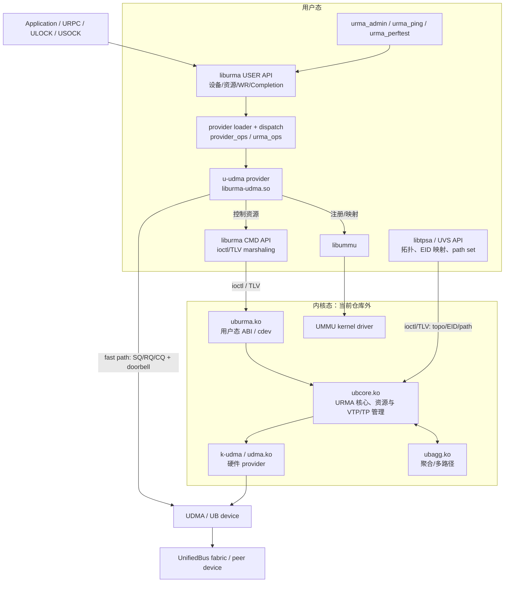
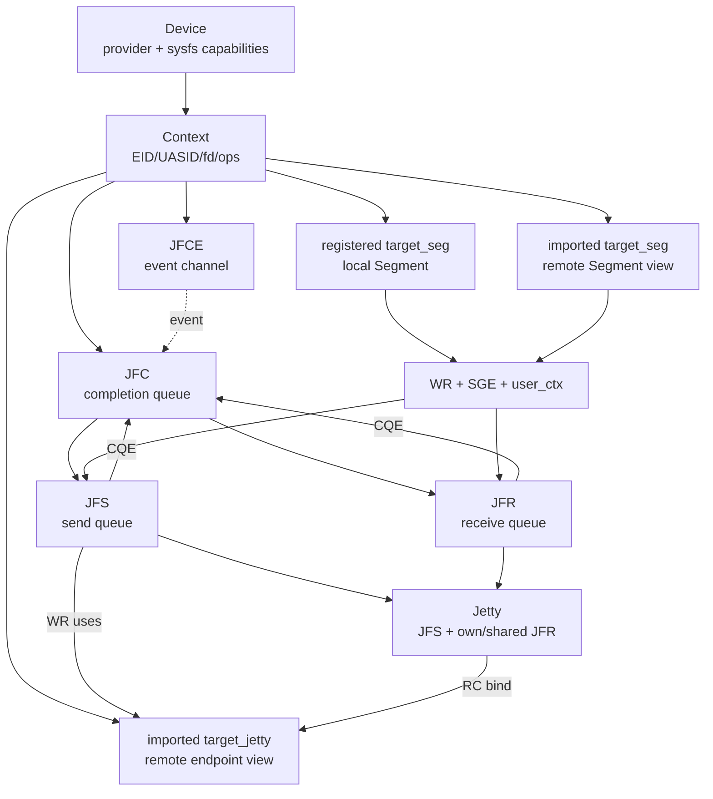

# openEuler UMDK / URMA 总体架构与 Dragonfly 前置研究

> 研究基线：UMDK 提交 `2a958bb4`（`!3222 urma: optimize pjfc number of bondp rearm jfc`），分析日期 2026-08-06。
>
> 范围：先建立 UMDK/URMA 软件栈地图，再分析资源、控制面、数据面和通信语义；`urma_perftest` 只用于形成后续验证清单，不作为本轮架构推导入口。Dragonfly 部分只做现状映射与问题识别，不给出最终接入方案。

## 0. 证据规则与版本边界

本文使用以下证据标签：

- **[已从源码确认]**：当前 UMDK 检出版本中的 CMake、头文件或 C 源码可直接闭环。
- **[已从官方文档确认]**：仓内 openEuler UMDK 官方 User Guide、API Guide、QuickStart 或 u-udma 文档明确说明。
- **[已实验验证]**：已在当前研究主机实际运行检查或实验。
- **[基于架构分析]**：由多个源码事实推导，但不是接口直接承诺。
- **[尚待源码确认]**：当前仓库没有实现源码，或只能从 ABI/官方说明间接观察。
- **[尚待环境验证]**：必须在具有 UB 设备、驱动和双机网络的环境验证。

### 0.1 必须先说明的仓库边界

**[已从源码确认]** 当前仓库没有顶层 `liburma/`、`uburma/`、`ubcore/`、`provider/` 这些同名目录。实际用户态实现位于：

- `src/urma/lib/urma`：`liburma.so`；
- `src/urma/lib/uvs`：`libtpsa.so`（UVS/TPSA 用户态接口）；
- `src/urma/hw/udma`：用户态 UDMA provider，即 `liburma-udma.so`；
- `src/urma/tools`：管理、连通性和性能工具；
- `src/urma/lib/urma/core/include` 等：安装到 `/usr/include/ub/umdk/urma` 的头文件。

**[已从官方文档确认]** `ubcore.ko`、`uburma.ko` 和内核态 UDMA provider（`udma.ko`，下文称 k-udma）属于 openEuler 内核/设备驱动树。QuickStart 指示在内核源码 `drivers/ub/urma` 构建 `ubcore.ko`、`uburma.ko`；README 又要求从设备驱动目录加载 `udma.ko`。它们不是当前 UMDK Git 工作树中的完整 C 实现。

因此，用户给出的简化链：

```text
Application -> liburma -> uburma -> ubcore -> provider -> UB device
```

在当前 UDMA 用户态 fast path 中应展开为：

```text
Application
  -> liburma USER API
  -> u-udma 用户态 provider
       |-- 控制面 -> liburma CMD API -> /dev/uburma -> uburma.ko
       |                                      -> ubcore.ko -> k-udma -> UDMA hardware
       `-- 数据面 -> 用户态 WQE/RQE/CQE + mmap doorbell/queue -> UDMA hardware
```

**[已从官方文档确认]** 官方 User Guide 将 `liburma.so` 明确分成 USER API 与 CMD API 两层，将 `uburma.ko` 定义为把 `ubcore.ko` 能力封装成用户态系统调用的模块。**[已从源码确认]** u-udma 文档和实现进一步确认，控制面依赖 k-udma ioctl，数据面直接访问映射队列和 doorbell，实现 kernel bypass。

### 0.2 当前环境能力

**[已实验验证]** 当前研究主机不存在 `/sys/class/ubcore`、`/sys/class/uburma`、`/dev/uburma`，也未发现已加载的 `ubcore/uburma/udma/ubagg` 模块。因此本文没有把任何吞吐、延迟、原子能力、完成时序或故障恢复结论标成“已实验验证”；这些均进入第 11 节实验清单。

---

## 1. UMDK / URMA 总体架构图



重要边界：

1. **[已从源码确认]** `liburma` 不实现具体 UDMA 队列格式；它校验公共参数后通过 `urma_context_t.ops` 分派给 provider。
2. **[已从源码确认]** u-udma 同时承担用户态控制适配与 fast data path。资源创建/销毁会调用 `urma_cmd_*` 进入内核，WR 提交和 CQ 轮询直接操作用户态映射队列。
3. **[已从官方文档确认]** ubcore 是内核 URMA 核心；uburma 是用户态 ABI 包装；k-udma 管理硬件相关连接和资源。
4. **[基于架构分析]** “provider”不是单一层：用户态有 `urma_provider_ops/urma_ops` provider，内核态还有 `ubcore_ops` 硬件 provider。若只画一个 provider，容易把数据面错误画成每个 WR 都经过 ioctl。

---

## 2. 模块职责、边界与平面划分

| 用户要求中的模块 | 当前源码位置 | 主要职责 | 用户/内核边界 | 平面 | 证据 |
|---|---|---|---|---|---|
| `liburma` | `src/urma/lib/urma/core` | 公共 API、参数/能力校验、provider 动态装载、设备发现、对象引用计数、CMD/TLV 封装、数据面分派 | 用户态；CMD API 通过 fd/ioctl 跨界 | 控制面 + 数据面 API 门面 | [已从源码确认] `CMakeLists.txt` 生成 `liburma.so`；`urma_main.c`、`urma_cp_api.c`、`urma_dp_api.c` |
| `uburma` | 当前仓库无实现；ABI 入口为 `/dev/uburma` | 将 ubcore 能力暴露为用户态系统调用/cdev；传递资源命令、事件 fd、wait/ack | 用户态与内核态的直接边界 | 主要是控制面/事件面 | [已从官方文档确认] User Guide；[已从源码确认] `urma_main.c` 与 `urma_cmd*.c` 使用 `/dev/uburma`/ioctl |
| `ubcore` | 当前仓库无实现；sysfs/ABI 和官方 API 文档可见 | 内核 URMA 核心、设备抽象、资源生命周期、EID、VTP/TP、管理消息、向下调用驱动 ops | 内核态 | 控制面 + 管理面；也提供内核数据面接口 | [已从官方文档确认] API Guide；[尚待源码确认] 当前内核实际实现细节 |
| `uvs` / TPSA | `src/urma/lib/uvs/core` | 当前版本公开 API 主要管理聚合设备、拓扑、main-UE EID 映射、path set，并经 ioctl/TLV 配置 ubcore/ubagg | 用户态库到内核 ioctl | 管理面 | [已从源码确认] `uvs_api.h`、`tpsa_api.c`、`uvs_ubagg_ioctl.c` |
| 完整 UVS 连接服务 | 当前仓库未包含 daemon 全量实现 | 可靠连接管理、TP 创建/复用/断开、协商与状态机 | 可分布式/集中式、前后端分离 | 管理面 | [已从官方文档确认] User Guide 5.1；[尚待源码确认] 本版本 daemon 实现与部署边界 |
| `provider`（用户态） | `src/urma/hw/udma` | 实现 `urma_provider_ops_t` 和 `urma_ops_t`；创建用户态队列、mmap buffer/doorbell、组装 WQE/RQE、解析 CQE | 用户态；控制操作调用 CMD API | 控制面适配 + 数据面 fast path | [已从源码确认] `udma_u_ops.c`、`udma_u_main.c` |
| `provider`（内核态） | 当前仓库外的 k-udma/`udma.ko` | 实现 ubcore 驱动接口，创建硬件对象/TP/VTP，配置硬件与 UMMU | 内核态到硬件 | 控制面 + 硬件管理 | [已从官方文档确认] u-udma README/API Guide；[尚待源码确认] 具体实现 |
| `tools` | `src/urma/tools` | `urma_admin` 管理/查询，`urma_ping` 连通性，`urma_perftest` SEND/READ/WRITE/ATOMIC 性能与语义验证 | 普通用户态应用 | 运维/验证，不是库主路径 | [已从源码确认] tools CMake 与源文件 |
| `include` | `src/urma/lib/urma/core/include`、`lib/uvs/core/include`、`hw/udma/include`、`common/include` | USER API、provider SPI、类型/opcode、UVS API、UDMA 扩展、公共容器工具 | 头文件边界 | API/ABI 定义 | [已从源码确认] 安装规则 |
| `bond` / ubagg provider | `src/urma/lib/urma/bond` + 内核 `ubagg.ko` | 聚合、多路径调度、健康检测、failback、WR 转换 | 用户态 provider + 内核聚合驱动 | 控制面 + 数据面调度 | [已从源码确认] bond 文件布局与 provider ops；本研究仅标出，不展开算法 |

### 2.1 构建关系

**[已从源码确认]** `src/urma/CMakeLists.txt` 依次构建 `common -> lib -> examples -> tools -> hw`；`lib/urma/core/CMakeLists.txt` 生成动态/静态 `urma` 并链接 `dl/rt`；`hw/udma/CMakeLists.txt` 生成 `liburma-udma.so`，链接 `urma`、`urma_common` 和 `ummu`，安装到 `/usr/lib64/urma`。这与 `liburma` 运行时扫描同目录、`dlopen` 以 `liburma` 开头的 provider 完全对应。

### 2.2 控制面、管理面与数据面不要混为一谈

- **控制面**：Device/Context、JFC/JFS/JFR/Jetty、Segment/Token、event 等事务层对象的创建、查询、修改和销毁。**[已从源码确认]** u-udma 最终调用 `urma_cmd_*` ioctl。
- **管理面**：Jetty 与底层 TP/VTP 的映射、连接协商、拓扑和状态机。**[已从官方文档确认]** 可采用分布式或集中式部署，完整 UVS/连接管理模块不等同于 `liburma`。
- **数据面**：提交 WQE/RQE、硬件 DMA/事务传输、产生 CQE、poll/wait completion。**[已从源码确认]** u-udma fast path 不为每个 WR 进入内核。

---

## 3. 从 Application 到 UB device 的完整调用链

### 3.1 初始化、provider 装载和 Device discovery

```text
Application
  -> urma_init()
     -> urma_open_drivers()
        -> 扫描 <liburma.so 所在目录>/urma/liburma*.so
        -> dlopen(liburma-udma.so)
           -> provider constructor
              -> urma_register_provider_ops(&g_udma_provider_ops)
     -> provider_ops.init()
     -> 扫描 /sys/class/ubcore（兼容旧 /sys/class/uburma）
     -> 读取 driver_name / transport_type / vendor / device / capabilities
     -> 将 sysfs device 与 provider 匹配，形成 urma_device_t
```

关键位置：`urma_main.c:161,214`、`urma_device.c:27,578,612`、`udma_u_main.c`、`udma_u_ops.c:371`。**[已从源码确认]**

**Device 获取方向**：`urma_get_device_list()` 会再次扫描/合并 sysfs；`urma_get_eid_list()` 在新 ABI 下打开 cdev 并调用 `urma_cmd_get_eid_list()`，旧 ABI 才读旧 sysfs EID 文件。**[已从源码确认]**

### 3.2 Context 创建链

```text
Application
  -> urma_create_context(dev, eid_index)                 liburma USER API
     -> 查询 EID，open(dev->path, O_RDWR)                cdev fd
     -> dev->ops->create_context()                       provider_ops
        -> udma_u_create_context()                       u-udma
           -> urma_cmd_create_context()                  liburma CMD API
              -> TLV ioctl(dev_fd, CREATE_CONTEXT)       uburma ABI
                 -> uburma.ko -> ubcore.ko -> k-udma     仓外内核
           <- async_fd + provider private capabilities
           -> mmap doorbell/reserved SQ/可选 DTU
           -> ctx->ops = &g_udma_ops
```

主要结构体：`urma_device_t`、`urma_context_t`、provider 扩展 `struct udma_u_context`。关键位置：`urma_main.c:502`、`udma_u_ops.c:264`、`urma_cmd.c::urma_cmd_create_context`。**[已从源码确认]**

### 3.3 资源创建链（以 JFS 为例）

```text
urma_create_jfs(ctx, cfg)
  -> liburma 校验 trans_mode/order/depth/SGE/inline/JFC
  -> ctx->ops->create_jfs
  -> udma_u_create_jfs
     -> 分配 struct udma_u_jfs、SQ buffer、WRID、doorbell
     -> urma_cmd_create_jfs
        -> ioctl/TLV -> uburma -> ubcore -> k-udma -> hardware object
  <- urma_jfs_t（内嵌在 provider 私有对象中）
```

JFC、JFR、Jetty、Segment 都采用相同的“两段式”模式：用户态 provider 分配/映射 fast-path 状态，CMD API 创建相应内核/硬件资源。**[已从源码确认]**

### 3.4 数据发送 fast path

```text
Application
  -> urma_post_jfs_wr() / urma_post_jetty_send_wr()
     -> liburma 校验句柄并取 ctx->ops
     -> udma_u_post_jfs_wr()
        -> udma_u_post_sq_wr()
           -> 遍历 WR 链
           -> opcode/SGE/inline/队列空间检查
           -> udma_u_post_one_wr(): 把 WR 编码为 UDMA SQE/WQEBB
           -> 记录 wr->user_ctx 到 wrid[]
           -> 更新 SQ producer index
           -> UDMA_TO_DEVICE_BARRIER()
           -> 写 direct WQE 或 SQ doorbell
  -> UDMA hardware 取 WQE
  -> 本地 DMA 读取 Segment、通过 TP/UB fabric 传输
  -> 远端事务引擎/JFR/Segment
```

关键位置：`urma_dp_api.c:322,360`、`udma_u_jfs.c:981,1019,1042-1050`。**[已从源码确认]** 每次 WR fast path 没有 ioctl。

### 3.5 接收预投递 fast path

```text
Application
  -> urma_post_jfr_wr() / urma_post_jetty_recv_wr()
     -> udma_u_post_jfr_wr()
        -> 为每个 WR 取得空闲 RQE index
        -> 写入本地 SGE(addr,len,token_id)
        -> 保存 user_ctx，更新 RQ PI/index queue
        -> UDMA_TO_DEVICE_BARRIER()
        -> 写 JFR software doorbell producer index
  -> 远端 SEND 到达后，硬件消费 RQE 并 DMA 写接收 Segment
```

关键位置：`urma_dp_api.c:341,379`、`udma_u_jfr.c:478-498`。**[已从源码确认]**

### 3.6 Completion 返回链

```text
UDMA hardware 完成事务
  -> DMA 写 CQE 到 JFC CQ
  -> 可选触发 JFCE/中断事件
Application
  -> urma_poll_jfc()
     -> ctx->ops->poll_jfc()
     -> udma_u_poll_jfc()
        -> owner bit 判断 CQE 是否有效
        -> UDMA_FROM_DEVICE_BARRIER()
        -> 解析 status/opcode/len/local_id/remote_id/tpn/user_ctx
        -> 更新 CQ consumer index 和 software doorbell
  <- urma_cr_t[]
```

关键位置：`urma_dp_api.c:250`、`udma_u_jfc.c:771,806-841`。**[已从源码确认]** 事件模式为 `rearm -> submit -> wait_jfc -> poll_jfc -> ack_jfc`；`wait/ack` 需要内核事件 fd，但 CQE 内容仍由用户态 poll 读取。

---

## 4. URMA 核心资源模型与生命周期

### 4.1 关系总图



### 4.2 生命周期表

| 对象 | 定义 | 创建/获取 | 销毁/释放 | 生命周期约束与关系 | 证据 |
|---|---|---|---|---|---|
| Device | `urma_types.h:371 urma_device_t` | `urma_init` 扫描；`urma_get_device_list/by_name/by_eid` 获取 | `urma_free_device_list` 只释放指针数组；全局 device 在 `urma_uninit` 清理 | 保存 name/path/type、provider ops 和 sysfs device；不是独占硬件打开句柄 | [已从源码确认] |
| Context | `urma_types.h:390 urma_context_t`；provider 扩展 `udma_u_context` | `urma_create_context` -> provider -> CMD create context | `urma_delete_context` -> provider -> CMD delete；关闭 fd | 所有资源的根；保存 EID/EID index/UASID、`dev_fd/async_fd`、`urma_ops`。引用计数大于 1 时返回 `URMA_EAGAIN`，必须先释放子资源 | [已从源码确认] |
| JFCE | `urma_types.h:413 urma_jfce_t` | `urma_create_jfce` | `urma_delete_jfce` | completion event channel；JFC 引用它。仍被 JFC 使用时不能安全删除 | [已从源码确认] |
| JFC | `urma_types.h:488 urma_jfc_t` | `urma_create_jfc(ctx,cfg)` 或 alloc/set/active | `urma_delete_jfc`；分阶段 API 为 deactive/free | cfg 指向 JFCE；被 JFS/JFR/Jetty 绑定；保存 CQ depth、event ack、handle、ID。删除前应停止生产 completion、poll/flush 完 outstanding、处理已取得 async event | [已从源码确认]；最后一点亦由官方 User Guide 确认 |
| JFS | `urma_types.h:575 urma_jfs_t` | `urma_create_jfs(ctx,cfg)` | `urma_delete_jfs`；或 deactive/free | 必须绑定 JFC；cfg 指定 RM/RC/UM、depth、SGE、inline、retry/order；提交 `urma_jfs_wr_t`；错误状态可 flush outstanding WR | [已从源码确认] |
| JFR | `urma_types.h:673 urma_jfr_t` | `urma_create_jfr(ctx,cfg)` | `urma_delete_jfr`；或 deactive/free | 必须绑定 JFC；保存 token policy、接收队列和 posted receive；可被 Jetty 共享。SEND/RECV 下需持续补充 RQE | [已从源码确认] |
| Jetty | `urma_types.h:816 urma_jetty_t` | `urma_create_jetty(ctx,cfg)` | `urma_delete_jetty`；或 deactive/free | 聚合 send 与 own/shared receive；RC 模式删除前必须 unbind，源码在 `remote_jetty != NULL` 时拒绝删除；可加入 Jetty group | [已从源码确认] |
| Remote Jetty/JFR view | `urma_types.h:787 urma_target_jetty_t` | `urma_import_jetty/jfr(_ex/_async)`；远端描述来自 OOB | `urma_unimport_jetty/jfr` | 含远端 EID/UASID/id、trans_mode、VTPN/TP、token policy；RC Jetty 需 bind/unbind，RM 可 advise/unadvise；unimport 可能触发 TP 引用下降和断链 | [已从源码确认] API；断链语义 [已从官方文档确认] |
| Segment 描述 | `urma_types.h:988 urma_seg_t` | 从已注册 `target_seg.seg` 导出并经 OOB 交换 | `urma_put_seg_ctx` 释放导出副本 | 可跨进程/节点交换的 UBVA、len、attr、token_id 描述，不等同于本地注册句柄 | [已从源码确认] |
| Target Segment | `urma_types.h:995 urma_target_seg_t` | 本地：`urma_register_seg`；远端：`urma_import_seg` | 本地：`urma_unregister_seg`；远端：`urma_unimport_seg` | 同一类型承载本地注册与远端导入视图；本地含 token_id，远端含映射 `mva`。Context 引用计数阻止提前删除 | [已从源码确认] |
| Work Request | `urma_types.h:1115/1129` | 应用栈/堆构造，`next` 可链批量提交 | post 返回后 WR 描述自身可释放，但被 DMA 的数据 buffer 不能提前复用 | JFS WR 含 opcode、flags、tjetty、user_ctx 及 RW/SEND/CAS/FAA union；JFR WR 含 receive SG 和 user_ctx | [已从源码确认]；buffer 时序 [已从官方文档确认] |
| Completion | `urma_types.h:1151 urma_cr_t` | 硬件写 CQE，`urma_poll_jfc` 转换为 CR | 应用消费；事件模式另需 ack event | status、user_ctx、recv opcode、send/recv 标志、length、local/remote ID、imm/token、TPN；用 user_ctx 关联 WR | [已从源码确认] |

### 4.3 推荐的销毁顺序（资源约束，不是 Dragonfly 设计）

```text
停止提交新 WR
 -> 等待/轮询完成，错误对象执行 flush
 -> unbind / unadvise
 -> unimport remote Jetty/JFR
 -> unimport remote Segment
 -> unregister local Segment
 -> delete Jetty/JFS/JFR
 -> delete JFC
 -> delete JFCE
 -> delete Context
 -> urma_uninit
```

**[基于架构分析]** 这是由源码引用计数、RC 删除检查、completion/async event 约束组合出的安全拓扑序；精确错误恢复顺序仍需按目标 transport mode 实验。

### 4.4 Segment 注册与权限规则

**[已从源码确认]** `urma_register_seg` 对 UB 自动分配或引用 Token ID，经 provider 调用 `urma_cmd_register_seg`；u-udma 与 libummu/UMMU 共同支持地址转换。权限规则为：

- `LOCAL_ONLY` 不能与远端 READ/WRITE/ATOMIC 同设；
- WRITE 必须同时有 READ；
- ATOMIC 必须同时有 READ 和 WRITE；
- SGE 中本地内存必须引用已注册 `target_seg`；remote SGE 引用 imported target_seg 或受限的 user target seg。

这意味着“是否需要预注册内存”的准确答案不是所有操作一律相同：常规非 inline SEND、RECV、READ、WRITE、ATOMIC 均需要相关本地/远端 Segment；只有 provider 支持且 WR 设置 inline 时，发送源 `src_tseg` 可为空。**[已从源码确认]**

---

## 5. SEND/RECV、READ、WRITE、ATOMIC 通信模型

### 5.1 总表

| 模型 | 发起方 / 接收方 | 必需资源 | 内存注册 | Completion | 数据完成语义 | 主要失败 |
|---|---|---|---|---|---|---|
| SEND/RECV | sender post SEND；receiver 预先 post RECV | sender JFS/Jetty + target JFR/Jetty；receiver JFR/Jetty；两侧 JFC；RM/RC 所需远端 endpoint/连接 | 发送 buffer 注册，inline 例外；接收 buffer 必须注册 | sender 可按 `complete_enable` 得到 send CR；receiver receive 完成会得到 CR | send CR 后本地发送 buffer 可复用；recv CR 后接收 buffer 可读，`completion_len` 是有效长度。它不等于远端业务逻辑已消费 | 本地参数/队列满在 post 同步返回；无 RQE 产生 RNR/retry exceeded；权限/长度/远端处理/ACK timeout 通过 CR；资源/端口异常通过 async event |
| READ | initiator 读 remote target Segment；target CPU 不参与 | initiator JFS/Jetty + target endpoint；本地 destination Segment；imported remote source Segment；JFC | 本地 dst、远端 src 都须注册；远端描述必须 import | 通常 initiator JFS JFC；可由 flag 控制是否产生 | 成功 CR 表示返回数据已放入本地 destination，之后可读/复用 | access/token、remote response length、unsupported、timeout、data poison 等 CR；post 失败不代表产生 CR |
| WRITE | initiator 写 remote target Segment；target CPU 不参与 | initiator JFS/Jetty + target endpoint；本地 source Segment；imported remote dst Segment；JFC | 两端都须注册；inline source 可例外 | initiator local completion；WRITE_IMM 可使远端产生带 immediate 的 completion，具体资源/支持需查设备能力 | 官方数据路径描述为 target 存储完成后回 TAACK；initiator 收成功 completion 后本地 source 可复用。持久化到介质不由该语义保证 | 与 READ 类似；另有远端写权限、ordering/fence 问题 |
| ATOMIC | initiator 对 remote Segment 原子 RMW；target CPU 不参与 | JFS/Jetty、target endpoint、remote atomic Segment、本地 original-value/result Segment、JFC | remote 需 READ+WRITE+ATOMIC；local result 注册 | initiator JFS JFC | opcode 定义 CAS/SWAP/FADD/FSUB/FAND/FOR/FXOR；成功 CR 表示原子事务完成，原值写回 src/result buffer这一点需硬件实测确认 | capability/opcode/size/alignment/access/token/timeout；当前设备 feature table 与 provider opcode 支持不能互相替代，必须 query device + perftest |

除特别标注外，表中资源与 CR 字段为 **[已从源码确认]**，非阻塞和 buffer 可复用时机为 **[已从官方文档确认]**。

### 5.2 SEND/RECV 细化

1. **接收方先准备**：`urma_post_jfr_wr` 把一个或多个注册 buffer 放入 RQ。**[已从官方文档确认]** SEND 只有在远端有可消费 RECV 时才能成功。
2. **发送方提交**：`urma_jfs_wr_t.opcode = URMA_OPC_SEND/SEND_IMM/SEND_INVALIDATE`，`send.src` 指向本地 SG，`tjetty` 指向 imported remote JFR/Jetty。**[已从源码确认]**
3. **完成位置**：发送侧 JFS 所关联 JFC 可产生 send CR；接收侧 JFR 所关联 JFC 产生 receive CR，后者带 remote ID、实际长度、可选 imm/token invalidation。**[已从源码确认]**
4. **流控本质**：JFR depth 和补 RQE 速率构成 receiver credit。`URMA_CR_RNR_RETRY_CNT_EXC_ERR` 明确表示远端 JFR 无 buffer且 RNR 重试耗尽。**[已从源码确认]**
5. **失败恢复**：同步 post 返回 `EINVAL/ENOMEM` 时从 `bad_wr` 继续处理；异步 CR 错误需依据 status；Jetty/JFS 进入 SUSPENDED/ERROR 时对 outstanding WR 使用 flush，不能只重投所有 WR。**[已从源码确认]/[已从官方文档确认]**

### 5.3 READ 细化

`urma_read()` 只是构造单 src/single dst 的 `urma_jfs_wr_t` 后调用 provider；通用 `urma_post_jfs_wr` 可表达本地非连续 SG，但 UB 协议只支持一个 remote SGE。READ 中 `rw.src` 是远端地址，`rw.dst` 是本地地址。**[已从源码确认]/[已从官方文档确认]**

**完成语义**：**[已从官方文档确认]** `urma_poll_jfc > 0` 且 CR success 后，read 完成，本地接收 buffer 可读/复用。目标应用不需 post RECV，也不产生常规 target receive completion。

### 5.4 WRITE 细化

WRITE 中 `rw.src` 是本地地址，`rw.dst` 是远端地址；remote dst 只支持一个 SGE。源码 opcode 还包括 `WRITE_IMM`、`WRITE_NOTIFY` 和 provider 的 atomic-store 扩展。**[已从源码确认]**

**完成语义**：**[已从官方文档确认]** 官方路径描述 target 将数据存入指定内存后返回 TAACK。**[基于架构分析]** 这可用作“远端内存可见”的网络事务完成边界，但不能推导为远端应用已处理、文件已写盘或断电持久化；Dragonfly Piece 完成仍有 CRC/长度/metadata 语义，不能直接等同于 WRITE CR。

### 5.5 ATOMIC 细化

**[已从源码确认]** 公共 WR union 定义 CAS 与 FAA 族参数；opcode 定义 CAS、SWAP、FADD、FSUB、FAND、FOR、FXOR。CAS/FAA 的 `dst` 指远端操作数，`src` 是本地原值写回 buffer。u-udma 会根据 opcode/SGE 和设备 `atomic_add_en` 编码 WQE。

必须保留两个限制：

- **[已从官方文档确认]** 当前 User Guide 的具体 KP950/ST910D feature 表把 CAS/FAA 标为不支持；
- **[已从源码确认]** API 和 provider 代码存在不代表目标硬件/固件已支持，实际以 `urma_query_device().dev_cap.atomic_feat`、最大 atomic size 和 perftest 为准。

---

## 6. 控制面与连接管理

### 6.1 Device discovery 与 Context 初始化

- **[已从源码确认]** 首选 `/sys/class/ubcore`，兼容旧 `/sys/class/uburma`；读取 `ubdev`、`driver_name`、transport type、vendor/device、capacity/port attrs。
- **[已从源码确认]** 新 ABI 的 EID list/query 通过 cdev command，Context 创建时保存选中的 `eid_index/eid`。
- **[已从源码确认]** provider 根据 transport type 与可选 match table 匹配；UDMA provider 声明 `URMA_TRANSPORT_UB`、version 1。
- **[已从源码确认]** Context ioctl 返回 `async_fd` 及 CQE size、DWQE、reduce、reserved SQ、DTU、atomic 等 provider 私有能力；随后 mmap doorbell。

### 6.2 EID

**[已从源码确认]** EID 是 128 bit，出现在 Device EID list、Context、本地/远端 Jetty ID 和 UBVA 中；Jetty 完整标识是 `{eid, uasid, id}`。因此它既不是 IP 地址的简单别名，也不是 Dragonfly `host_id`。

当前 `urma_ops` 还提供 `get_eid_by_ip/get_ip_by_eid/get_smac/get_dmac`，u-udma 通过 command 调用内核。**[已从源码确认]** 这些映射的配置来源、生命周期以及跨节点一致性 **[尚待环境验证]**。

### 6.3 Remote resource exchange/import

应用必须通过 OOB 通道自行交换：

- remote endpoint 描述：`urma_rjetty_t` 或 `urma_rjfr_t`（EID/UASID/id、trans_mode、tp_type、policy/flags）；
- remote memory 描述：`urma_seg_t`（UBVA、len、access/cache/token_id）及 token value；
- 应用协议自己的请求标识、长度、Piece metadata 等。

**[已从官方文档确认]** URMA 不替应用提供上述 OOB 业务协议。收到描述后，应用调用 `urma_import_jetty/jfr`、`urma_import_seg` 得到本地 target handle。Import 是把远端能力映射为本地可引用对象，不会替代业务身份验证和 framing。

### 6.4 Jetty 建链与 transport mode

| mode | endpoint 行为 | 建链动作 | 可靠/有序语义 | 证据 |
|---|---|---|---|---|
| RC | one-to-one；Jetty 与一个 target process 绑定 | import remote Jetty 后 `bind_jetty`；销毁前 `unbind` | 可靠，支持 ordering/fence/completion order | [已从源码确认] API 限制；[已从官方文档确认] 语义 |
| RM | 一个 JFS/Jetty 可面向多个 remote JFR/Jetty | import；某些 transport/provider 可 `advise` 预建/优化，官方称 UB JFS 原生一对多无需 IB 式 advise | 可靠；具体 ordering 取决于底层实现 | [已从官方文档确认] |
| UM | 无连接、一对多 message | import target 描述供寻址；无可靠连接 | 不可靠、无 ordering；不支持 one-sided | [已从官方文档确认] |

**[已从源码确认]** 当前 u-udma `g_udma_ops` 注册的是 `import_*_ex`、`bind_jetty_ex`，普通 API 在 provider 旧入口为空时兼容转调 `_ex`。这表明公共 API 同时覆盖 management-plane 建链和 user-TP 显式配置路径，但空 `active_tp_cfg` 的具体内核决策在当前仓库中不可见。

### 6.5 Connection state machine 与 UVS 职责

需区分三层状态：

1. **事务对象状态**：源码公开 JFS/Jetty `RESET -> READY -> SUSPENDED/ERROR`，JFR `RESET -> READY/ERROR`。**[已从源码确认]**
2. **用户可见 TP 属性状态**：`urma_tp_state_t` 为 `RESET/PASSIVE/ACTIVE/BRAKE/ERROR`，供 user-TP 路径配置。**[已从源码确认]**
3. **管理协议状态机**：官方文档描述 REQ sent/received、REP sent/received、initiator/target established、reuse、disconnect、timeout、peer-compare 等状态；底层驱动 TP 使用 RESET/RTR/RTS/ERR 一类状态。**[已从官方文档确认]**

可靠连接基本协议是 `CONN_REQ -> CONN_REP -> CONN_ACK`：target 创建 TP 并进入 RTR，initiator 收 reply 后进入 RTS，再 ACK；超时/拒绝需要回滚未复用的本地资源；双向同时建链使用 peer compare 和 TP reuse。**[已从官方文档确认]**

UVS/管理面职责总结：

- 维护 transaction Jetty 到 transport TP/VTP 的映射和生命周期；
- 创建、复用、断开可靠连接并驱动状态机；
- 支持分布式/集中式、前后端隔离部署；
- 当前仓内 `libtpsa` 还负责把聚合拓扑、EID 映射、path set 配置到 ubcore/ubagg。

前三项 **[已从官方文档确认]**，最后一项 **[已从源码确认]**。当前仓库没有 daemon 全量实现，故 UVS 进程间协议、持久表结构、重启恢复和生产部署关系 **[尚待源码确认]**。

---

## 7. 数据面：WR、DMA 与 Completion

### 7.1 WR 提交路径的关键事实

1. **[已从源码确认]** liburma 的 `urma_post_*` 只做公共句柄检查和 provider dispatch。
2. **[已从源码确认]** u-udma 将链式 WR 批量编码到 SQ；保存 `user_ctx` 到与 WQEBB 对齐的 `wrid[]`，以后从 CQE 恢复业务 request id。
3. **[已从源码确认]** WQE 发布前执行 to-device barrier，再写 DSQE 或 doorbell；RQ 同样先写 SGE/RQE/index，再 barrier 和 producer doorbell。
4. **[已从源码确认]** queue overflow、SGE/opcode/inline 不合法在 post 阶段同步失败并通过 `bad_wr` 给出首个失败 WR；已经成功发布但传输失败则通过 CR/async event 返回。

### 7.2 DMA/传输路径

```text
registered user VA
  -> UMMU/IOMMU translation + token/access metadata
  -> UDMA local DMA fetch/store
  -> transaction engine + TP/VTP
  -> UB fabric
  -> remote transaction engine
  -> remote registered Segment or posted JFR buffer
```

本地 user VA 到 UMMU 映射、queue/doorbell mmap、WQE 中 `(va, token_id, len)` **[已从源码确认]**；k-udma 如何编程具体 DMA descriptor、cache coherency、PCIe/UB 链路和远端硬件流水线 **[尚待源码确认]**，需要内核驱动和硬件资料。

### 7.3 Completion 与错误面

- **同步提交错误**：invalid handle/opcode/SGE、queue full、资源不足；API 直接返回且定位 `bad_wr`。**[已从源码确认]**
- **异步 WR completion**：`urma_cr_status_t` 包含 local length/operation/access、remote response/unsupported/operation/access、ACK timeout、RNR retry exhausted、flush/suspend、data poison。**[已从源码确认]**
- **对象/设备 async event**：JFC/JFS/JFR/Jetty error/limit、port active/down、device fatal、EID change、ELR。需 `get_async_event -> handle -> ack_async_event`。**[已从源码确认]/[已从官方文档确认]**
- **flush**：SUSPENDED/ERROR 下区分 hardware 已处理、未处理、伪 CQE 的 done marker。只有在 outstanding RQE/WQE 都有明确归属后，软件才能安全释放 buffer/queue。**[已从官方文档确认]**

### 7.4 ordering 与 completion 不是同一件事

`urma_jfs_wr_flag_t` 分别有 `place_order`、`comp_order`、`fence`、`complete_enable`。**[已从源码确认]**：

- `place_order` 管目标执行/放置顺序；
- `comp_order` 管 completion 与前序 WR 的报告关系；
- `fence` 约束前序 READ/ATOMIC；
- `complete_enable` 只决定是否通知本地完成。

**[基于架构分析]** Dragonfly 若未来依赖多个 WR 拼成一个 Piece，不能把“每个 WR 有 success CR”“CR 按序”“Piece CRC/长度验证完成”“metadata 提交完成”视作同一个状态。

---

## 8. RDMA 辅助对照（只作类比）

| RDMA 概念 | URMA 近似概念 | 相同点 | 必须区分之处 | 证据等级 |
|---|---|---|---|---|
| HCA/RDMA device | `urma_device_t` / UDMA device | 能力发现和 context 根 | URMA transport type 可为 UB/IB/IP；EID/UBVA 是 UB 模型 | [已从源码确认] + [基于架构分析（RDMA 类比）] |
| verbs context / PD 的部分职责 | `urma_context_t` | 设备打开、资源根、异步 fd | 当前公共模型没有一个可直接等同于 PD 的独立对象；安全域还含 UASID、EID、Token | [已从源码确认] + [基于架构分析（RDMA 类比）] |
| QP SQ | JFS | post send/read/write/atomic WR | JFS 可一对多 target；mode 为 RM/RC/UM，不等同固定 RC QP | [已从源码确认] + [基于架构分析（RDMA 类比）] |
| QP RQ / SRQ | JFR | post receive buffers | JFR 有完整 EID/UASID/id 和 token policy；可被 Jetty 共享 | [已从源码确认] + [基于架构分析（RDMA 类比）] |
| QP | Jetty | send+receive endpoint，RC bind | Jetty 是 UB transaction-layer port；可 own/share JFR、加入 group | [已从官方文档确认] + [基于架构分析（RDMA 类比）] |
| CQ | JFC | 硬件 CQE、poll、event arm | completion record 字段和 event/ack API 不完全相同 | [已从源码确认] + [基于架构分析（RDMA 类比）] |
| completion channel | JFCE | wait event 后 poll CQ | API 和 fd 语义以 URMA 为准 | [已从源码确认] + [基于架构分析（RDMA 类比）] |
| MR | registered Segment / `target_seg` | pin/map memory、访问权限、远端访问 key | URMA 用 UBVA、TokenID/TokenValue、imported target_seg；同一 `target_seg` 类型兼作 local/remote handle | [已从源码确认] + [基于架构分析（RDMA 类比）] |
| rkey + remote addr | `urma_seg_t` + token + imported target_seg + addr | 远端寻址与授权 | 不是只交换一个 rkey；还含 EID/UASID/UBVA/access/token policy | [已从源码确认] + [基于架构分析（RDMA 类比）] |
| SGE/WR | `urma_sge_t` / `urma_jfs_wr_t` / `urma_jfr_wr_t` | batch、opcode、user context | URMA 有 target Jetty、target hint、place/comp order、UB-specific opcode/flag | [已从源码确认] + [基于架构分析（RDMA 类比）] |
| WC | `urma_cr_t` | status、wr context、length/opcode | remote/local ID、TPN、imm/token 等字段不同 | [已从源码确认] + [基于架构分析（RDMA 类比）] |
| CM / QP state machine | UVS management + import/advise/bind + TP/VTP | 建链、路由、状态迁移 | UVS 支持集中/分布、TP reuse、前后端隔离；不能直接套用 RDMA CM | [已从官方文档确认] + [基于架构分析（RDMA 类比）] |

文中“QP/CQ/MR/WR”仅用于降低理解成本。凡是 URMA API、权限、完成和状态机，均应以源码/官方文档为准，不能用 verbs 经验填空。

---

## 9. Dragonfly TCP/QUIC 数据路径与 URMA 概念映射

本节优先复用 `/home/yuan/workspace/docs/source-learning/dragonfly` 的既有分析，特别是 `05-data-path.md`、`09-data-plane-and-ub-integration-analysis.md` 和 `10-piece-stream-and-storage-path-analysis.md`；未重新阅读 Dragonfly 源码。

### 9.1 当前数据路径对应关系

| Dragonfly 当前概念/阶段 | URMA 可对应概念 | 对应程度与边界 | 证据 |
|---|---|---|---|
| Scheduler candidate parent、parent IP/ports | Device/EID discovery、remote endpoint descriptor 的 OOB 分发 | 都提供“找谁通信”的信息；Scheduler host/peer/task 身份不等于 EID/UASID/Jetty ID | Dragonfly [已从源码确认]；映射 [基于架构分析] |
| `Downloader` / TCPClient / QUICClient | URMA transport adapter + Context/JFS/Jetty | `Downloader` 是现有 payload transport 最窄抽象；Context/JFS 是 URMA 发起资源，但不是 Rust stream 本身 | [基于架构分析] |
| TCP connection / QUIC connection+stream | RC bind，或 RM endpoint targeting | 可靠 point-to-point 可类比 RC；多 parent/多 piece 也可能更接近 RM。一一选型尚不能由静态架构决定 | [基于架构分析]、[尚待环境验证] |
| Vortex DownloadPiece header/TLV | SEND/RECV 控制消息或保留 OOB framing | URMA 提供传输语义，不提供 task_id/piece_id/range/digest/error framing；Vortex 业务信息仍须存在于某种协议中 | Dragonfly [已从源码确认]；URMA [已从源码确认] |
| `PieceContentStream<Item=Bytes>` | WR/SGE 批次 + completion-driven buffer ownership | 都是异步 payload 流；URMA completion 不是 Rust Stream item，需要适配生命周期、backpressure 和错误 | [基于架构分析] |
| Parent task file range | registered local Segment | 只有已在内存中的 staging/cache buffer 可直接成为 Segment；普通文件 range/sendfile 不能自动等同 Segment | Dragonfly [已从源码确认]；URMA [已从源码确认] |
| Child `Bytes` batch + `pwritev(offset)` | registered receive/write buffer，完成后继续 CRC+pwritev | URMA 可把网络 payload 放入注册 buffer；不会自动完成 Dragonfly CRC、range 截断、文件写和 metadata commit | [基于架构分析] |
| Piece digest/length + RocksDB finished | CR status/length + Dragonfly application completion | CR 只覆盖 transport transaction；Piece success 还需长度、CRC、storage write 和 metadata 状态 | [基于架构分析] |
| TCP/QUIC timeout、stream error、parent retry | post error、CR error、async event、flush、Scheduler retry | 可建立错误分类映射，但不是错误码直接替换 | [基于架构分析] |
| connection/window/bandwidth limiter | JFS/JFR depth、outstanding WR、RNR、priority、TP congestion control | 都参与流控，但计量单位和反馈位置不同 | [基于架构分析] |

### 9.2 哪些 URMA 能力“可能”替换 TCP 数据面

以下只是能力边界，不是最终方案：

1. **SEND/RECV**：**[基于架构分析]** 最接近现有 request/response 和 receiver-provided buffer 模型，可能承载 Vortex metadata 或 Piece chunk；代价是显式 RQE credit、注册 buffer 与 completion 驱动。
2. **WRITE**：**[基于架构分析]** 可能把 Piece payload 直接写入 Child 暴露的注册 staging region，减少 socket receive/协议栈路径；但 remote address/token 分发、buffer ownership、完成通知、CRC/落盘仍需上层处理。
3. **READ**：**[基于架构分析]** Child 可能从 Parent 已注册缓存读取 Piece range，符合 pull 语义；但 Parent 文件数据当前常驻 page cache/文件而非长期注册连续内存，注册缓存策略决定可行性。
4. **inline SEND**：**[基于架构分析]** 可能适合小控制消息/metadata，是否优于保留现有控制通道需实测。
5. **JFC polling/event、batch WR、SGE**：**[基于架构分析]** 可替代 socket readiness/stream chunk 的传输完成驱动，并支持批量；需要桥接 Tokio 任务与 poll/event fd。
6. **RM/RC、priority、ordering、multi-path/ubagg**：**[基于架构分析]** 可能提供可靠多目标、优先级和 fabric path 能力；实际硬件、UVS 和拓扑部署是前提。

明确不能直接替换的内容：Scheduler DAG/parent selection、task/peer 身份、Piece range 与 digest、Vortex 业务错误、Child CRC、文件 `pwritev`、RocksDB metadata、GC 以及 fallback 策略。**[已从源码确认]**（既有 Dragonfly 研究）/**[基于架构分析]**

### 9.3 必须进一步实验的问题

1. 注册/注销成本相对 Piece 大小和并发度；长期注册 pool 与临时注册的内存占用、pin/UMMU 开销。
2. SEND/RECV、READ、WRITE 在目标 UDMA 上的带宽、p50/p99、CPU、最优 WR/SGE/queue depth、inline threshold。
3. JFR 缺 credit 时的 RNR、重试和 backpressure，如何与 `PieceContentStream`/Tokio 消费速率对应。
4. local CR、remote visibility、remote notification 的准确时序；WRITE success 后何时可开始 CRC/落盘。
5. RC 与 RM 的连接建立/复用成本、UVS 依赖、跨 Piece/跨 parent 规模上限。
6. 一个 Piece 拆多个 WR 时 ordering、completion aggregation、部分失败和 retry 的最小安全粒度。
7. Parent 文件 range 到注册 buffer 的数据移动：sendfile 当前优势会否被 staging copy 抵消；page cache、mmap、direct I/O 的实际成本。
8. Child receive buffer 到 `pwritev` 的 copy、CRC 和磁盘瓶颈；网络加速后存储是否成为主瓶颈。
9. EID/IP/Dragonfly host_id 的发现、发布、变化和失效；容器、网络 namespace、权限与多租户 token 隔离。
10. 断链、进程 crash、UVS 重启、设备 fatal、EID change 时资源回收与 Scheduler 可观测错误映射。
11. UB MTU/最大消息/最大 read-write/atomic size、端口带宽、拥塞控制、多路径的实际 capability。
12. TCP/QUIC/URMA 在同一数据集和磁盘配置下的端到端 Piece throughput、首字节、CPU、内存峰值、校验/metadata latency。

以上全部 **[尚待环境验证]**。

---

## 10. 关键结论与未决项

### 10.1 已能确认

1. **[已从源码确认]** UMDK 用户态栈的核心是 `liburma` 公共门面 + 动态 provider；当前 UB provider 是 u-udma。
2. **[已从源码确认]** 控制面资源操作通过 CMD/TLV/ioctl 进入 `/dev/uburma`；数据面 WR/CQ 通过 mmap queue/doorbell fast path，不能画成每 WR 经过 uburma/ubcore。
3. **[已从官方文档确认]** uburma 是 user syscall wrapper，ubcore 是内核 URMA 核心，k-udma 是硬件 provider；当前仓库没有它们的完整实现源码。
4. **[已从源码确认]** Device -> Context -> JFC/JFS/JFR/Jetty/Segment 构成引用有向图，Context 不能先于子资源销毁；RC Jetty 必须先 unbind。
5. **[已从源码确认]** SEND/RECV 是 receiver-buffer message 语义；READ/WRITE/ATOMIC 是 initiator 发起的 remote memory 语义，均异步完成。
6. **[已从官方文档确认]** URMA management plane 独立管理 Jetty 到 TP/VTP 的映射、连接协议和状态机；完整 UVS 职责大于当前仓内 `libtpsa` 几个拓扑 API。
7. **[基于架构分析]** 对 Dragonfly，最关键的不是“把 socket API 换成 WR API”，而是保持 transport completion 与 Piece integrity/storage completion 的双层状态边界。

### 10.2 尚未确认

- **[尚待源码确认]** 当前目标 openEuler kernel 中 uburma/ubcore/k-udma 的实际函数链、锁、VTP/TP 表和硬件命令细节。
- **[尚待源码确认]** 当前发行版本完整 UVS daemon 的源码位置、进程拓扑、网络协议、重启恢复和 HA 行为。
- **[尚待环境验证]** 目标设备真正支持的 RM/RC/UM、atomic、multi-path、ordering、inline、non-pin、最大资源数。
- **[尚待环境验证]** CR success 的硬件可见性/一致性边界、缓存一致性、持久内存/文件语义。
- **[尚待环境验证]** Dragonfly 当前 Linux TCP sendfile 优势与 URMA staging/register 成本的净收益。

---

## 11. 后续通过 `urma_perftest` 验证的问题

本轮没有从 perftest 反推架构。下一阶段应先用它验证下列假设，并记录命令、两端设备能力、驱动/固件版本和原始结果。

### 11.1 环境与能力基线

- `urma_admin`/sysfs：设备、EID、port active、MTU/speed、RM/RC/UM、max JFS/JFR/JFC/depth/SGE、max message/read/write/atomic、inline、atomic feature。
- `/dev/uburma`、ubcore/uburma/udma/UVS/ubagg 模块与服务版本；双端 EID/IP 映射和基本 `urma_ping`。
- 默认 management-plane 建链与 `--enable_user_tp` 路径是否都可用，错误行为是否一致。

### 11.2 四类语义矩阵

对 SEND、READ、WRITE、ATOMIC 分别跑 latency/bandwidth，并至少扫描：

- message size：64 B、inline 边界、4 KiB、64 KiB、256/512 KiB、1 MiB、典型 Dragonfly Piece 大小；
- queue depth/outstanding、batch WR 数、SGE 数；
- polling 与 event；RC/RM（支持时）；单连接与多 pair；
- completion enabled/稀疏 completion；ordering/fence；
- CPU affinity/NUMA、本地/跨节点、不同 port/path。

### 11.3 正确性与失败注入

- SEND 先于 RECV、JFR credit 耗尽、RNR retry；
- access/token/length/alignment/opcode 错误对应同步返回还是异步 CR；
- queue overflow 与 `bad_wr` 边界；
- 断链/port down/device reset/EID change 下 CR、async event、flush 和资源释放；
- WRITE/READ completion 时读取目标 buffer，确认数据可见时序；
- atomic 支持的 opcode/size/alignment、返回原值和竞争正确性；
- UVS timeout/reject/reuse/unimport 后 TP 回收。

### 11.4 Dragonfly 相关观测量

- 以典型 Piece 大小比较 SEND/RECV、READ、WRITE 的端到端 transport 时间；
- 注册、import、connect/bind 与稳定态 WR 的成本分开计时；
- 记录每 Piece 所需 WR/CR 数、CPU cycles、内存注册量和 buffer 峰值；
- 与既有 TCP sendfile、QUIC path 在同一硬件/文件系统上比较，网络与 CRC/pwritev/RocksDB 分段计时；
- 验证“transport success -> CRC success -> file write return -> metadata finished”四个时间点，避免只报链路带宽。

全部条目目前为 **[尚待环境验证]**。

---

## 12. 源码与官方文档证据索引

### 12.1 构建与模块

- `README.md`
- `src/urma/CMakeLists.txt`
- `src/urma/lib/urma/core/CMakeLists.txt`
- `src/urma/lib/uvs/core/CMakeLists.txt`
- `src/urma/hw/udma/CMakeLists.txt`
- `src/urma/hw/udma/README.md`
- `src/urma/hw/udma/doc/liburma-udma.md`

### 12.2 liburma 与资源模型

- `src/urma/lib/urma/core/include/urma_api.h`
- `src/urma/lib/urma/core/include/urma_types.h:371-1175`
- `src/urma/lib/urma/core/include/urma_opcode.h:106-201`
- `src/urma/lib/urma/core/include/urma_provider.h`
- `src/urma/lib/urma/core/urma_main.c:161-570`
- `src/urma/lib/urma/core/urma_device.c:27-612`
- `src/urma/lib/urma/core/urma_cp_api.c:303-3125`
- `src/urma/lib/urma/core/urma_dp_api.c:133-398`
- `src/urma/lib/urma/core/urma_cmd.c`
- `src/urma/lib/urma/core/urma_cmd_tlv.c`

### 12.3 UDMA provider fast path

- `src/urma/hw/udma/udma_u_main.c`
- `src/urma/hw/udma/udma_u_ops.c:36-383`
- `src/urma/hw/udma/udma_u_common.h`
- `src/urma/hw/udma/udma_u_jfs.c:900-1080`
- `src/urma/hw/udma/udma_u_jfr.c:430-510`
- `src/urma/hw/udma/udma_u_jfc.c:740-910`
- `src/urma/hw/udma/udma_u_segment.c:90-245`
- `src/urma/hw/udma/udma_u_db.c`
- `src/urma/hw/udma/kernel_headers/udma_abi.h`

### 12.4 UVS/TPSA 与官方说明

- `src/urma/lib/uvs/core/include/uvs_api.h`
- `src/urma/lib/uvs/core/tpsa_api.c`
- `src/urma/lib/uvs/core/tpsa_ioctl.c`
- `src/urma/lib/uvs/core/uvs_ubagg_ioctl.c`
- `doc/en/urma/URMA User Guide.md`：第 4、5 章
- `doc/en/urma/URMA API Guide.md`：liburma、ubcore、UVS、driver ops 部分
- `doc/en/urma/URMA QuickStart Guide.md`

### 12.5 Dragonfly 既有研究

- `/home/yuan/workspace/docs/source-learning/dragonfly/05-data-path.md`
- `/home/yuan/workspace/docs/source-learning/dragonfly/07-ub-analysis-points.md`
- `/home/yuan/workspace/docs/source-learning/dragonfly/09-data-plane-and-ub-integration-analysis.md`
- `/home/yuan/workspace/docs/source-learning/dragonfly/10-piece-stream-and-storage-path-analysis.md`
