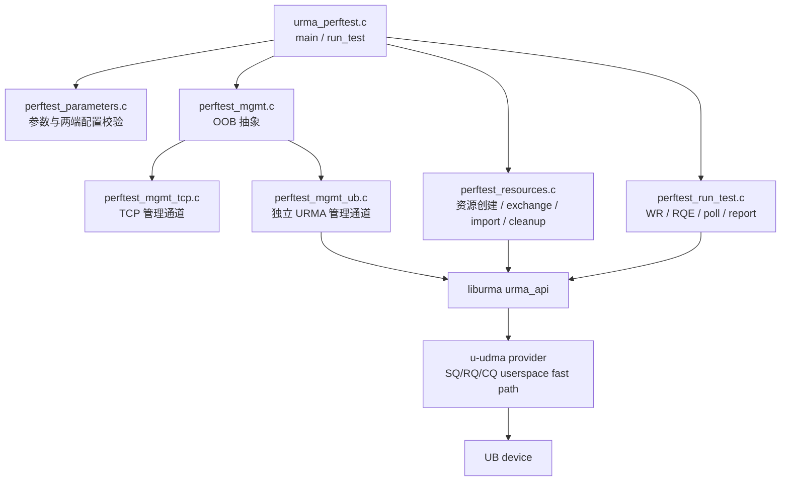
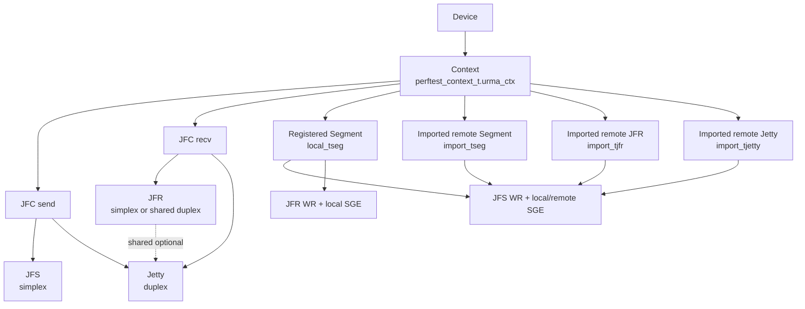
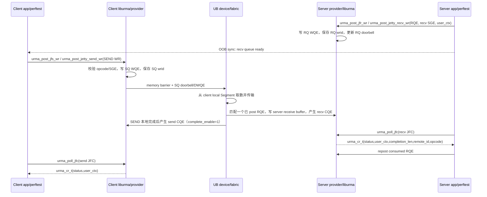
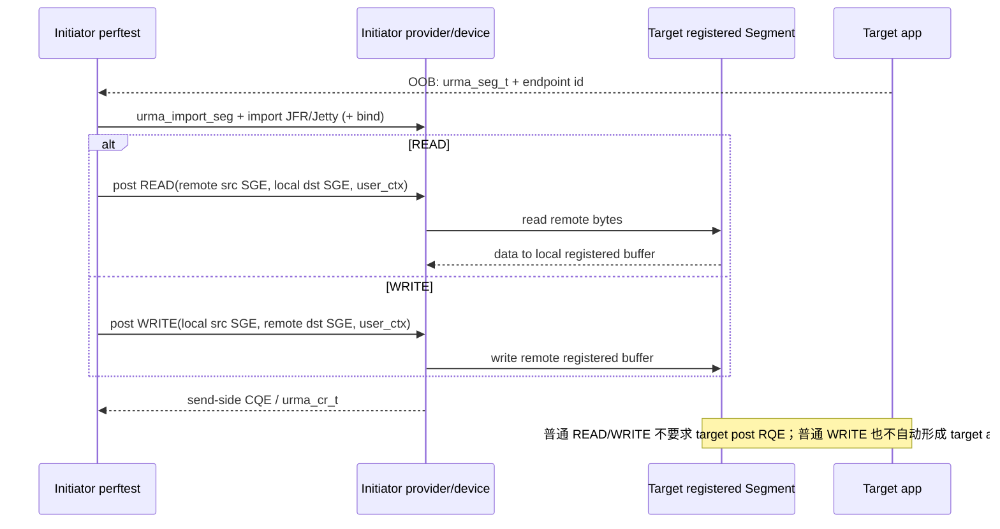

# openEuler UMDK `urma_perftest` 源码分析

> 研究范围：仅分析 UMDK 仓库 `src/urma/tools/urma_perftest/` 如何使用 URMA API；为解释 WR 到 CQE 的闭环，只向下追到 `liburma` 数据面分派和当前 `u-udma` provider。本文不重新展开 UMDK 整体架构。
>
> 源码基线：UMDK commit `2a958bb4212d`。Dragonfly 映射复用 `/home/yuan/workspace/docs/source-learning/dragonfly/05-data-path.md`、`09-data-plane-and-ub-integration-analysis.md`、`10-piece-stream-and-storage-path-analysis.md` 的既有结论。
>
> 证据标记：`[源码确认]`、`[官方文档确认]`、`[架构推断]`、`[待实验验证]`。本文未引入独立官方规范结论，因此不以 `[官方文档确认]` 代替源码证据。

## 1. 结论摘要

1. `[源码确认]` `urma_perftest` 是一个对称的双进程程序：是否为 client 由 `cfg.server_ip != NULL` 判断；双方先通过 TCP 或另一个小型 URMA SEND/RECV 管理通道交换配置和资源描述，再创建并运行被测数据面。
2. `[源码确认]` 默认 duplex 路径使用 Jetty；`--simplex_mode` 使用独立 JFS + JFR。两者不是“先创建 JFS/JFR 再创建 Jetty”的串行叠加关系，而是两种互斥资源模型。
3. `[源码确认]` SEND 是双边操作：接收方必须预先向 JFR 或 Jetty receive queue post `urma_jfr_wr_t`；READ/WRITE 是单边数据操作，发起方使用本地已注册 Segment 和已导入的 remote Segment，不消耗对端 RQE。
4. `[源码确认]` perftest 的普通资源交换包含 `urma_seg_t` 和 remote JFR/Jetty identity；EID 已嵌在 `urma_jetty_id_t` 和 Segment UBVA 中。token value 并未随普通 descriptor 发送，而是两端共同使用硬编码 `g_perftest_token`。
5. `[源码确认]` WR 的 `user_ctx` 被 u-udma 保存到 SQ/RQ 的 `wrid[]`，CQE poll 时恢复到 `urma_cr_t.user_ctx`；接收 completion 还给出 `completion_len`、来源 remote id、opcode/imm_data 等。它是把 completion 重新关联到 Piece/chunk request 的直接机制。
6. `[架构推断]` Dragonfly 第一版最容易保持现有流式语义的参考是 SEND/RECV：应用控制消息携带 Piece identity/metadata，固定数量的注册接收 buffer 形成 buffer pool，recv completion 驱动 `Bytes` chunk。READ/WRITE 也能承载 Piece bytes，但需要额外定义远端内存发布、所有权、完成通知和流控协议；perftest 本身没有解决这些 Dragonfly 语义。

## 2. 目录结构与文件职责

`tools/urma_perftest` 在本仓库中的实际路径是 `src/urma/tools/urma_perftest/`。

| 文件 | 职责 | 关键入口/对象 | 证据 |
|---|---|---|---|
| `CMakeLists.txt` | 将下列 `.c` 文件编译成 `urma_perftest`，链接 `urma`、`pthread`、`m` | `add_executable(urma_perftest ...)` | `[源码确认]` |
| `urma_perftest.c` | 程序 main、总调度、测试类型 dispatch、准备与统一清理 | `main()`、`run_test()`、`prepare_test()`、`context_cfg_t` | `[源码确认]` |
| `perftest_parameters.c/.h` | 命令/选项解析、默认值、范围和两端一致性校验、配置打印 | `perftest_parse_args()`、`check_local_cfg()`、`check_remote_cfg()`、`perftest_config_t` | `[源码确认]` |
| `perftest_mgmt.c/.h` | 管理通道抽象，按 `mgmt_type` 分派 TCP/UB backend | `establish_connection()`、`sync_data()`、`sync_time()`、`comm_send/recv/poll()` | `[源码确认]` |
| `perftest_mgmt_tcp.c/.h` | TCP client/server socket 建立、全量收发、barrier/data exchange | `tcp_establish_connection()`、`client_connect()`、`server_connect()`、`tcp_sync_data()` | `[源码确认]` |
| `perftest_mgmt_ub.c/.h` | 用独立的 URMA Jetty + SEND/RECV 实现管理通道；不是被测资源本身 | `ub_create_local_resources()`、`ub_server_handshake()`、`ub_client_handshake()`、`ub_sync_data()`、`ub_post_one_recv()` | `[源码确认]` |
| `perftest_resources.c/.h` | Device/Context/JFC/JFS/JFR/Jetty/Segment 创建；资源描述交换、import/bind；run context；错误化、drain、逆序销毁 | `create_ctx()`、`create_simplex_ctx()`、`create_duplex_ctx()`、`perftest_context_t`、`run_test_ctx_t` | `[源码确认]` |
| `perftest_run_test.c/.h` | 构造 SGE/WR，预投 RQE，运行 READ/WRITE/SEND/ATOMIC latency/BW，poll completion，计时与流控 | `prepare_jfs_wr()`、`prepare_jfr_wr()`、`run_*()` | `[源码确认]` |
| `perftest_log.c/.h` | quiet/error/verbose 日志级别与输出函数 | `set_verbosity()`、`print_log()` | `[源码确认]` |

### 2.1 核心状态结构

- `perftest_config_t`（`perftest_parameters.h`）：命令、client/server、device/eid index、simplex/duplex、transport mode、queue depth、message size、iteration、SGE、inline、completion moderation、管理通道等配置。`[源码确认]`
- `perftest_context_t`（`perftest_resources.h`）：本地 URMA context/resources、本地注册内存、对端 wire descriptor、import 后的 target resources，以及 `run_ctx`。`[源码确认]`
- `run_test_ctx_t`（`perftest_resources.h`）：`urma_jfs_wr_t`/`urma_jfr_wr_t`、SGE 数组、计数器、timestamp 和 credit WR。`[源码确认]`

## 3. `urma_perftest` 架构图



`[源码确认]` TCP/UB management channel 只负责配置、barrier 和 resource descriptor 交换。被测 WR/CQE 使用 `perftest_context_t` 中另一套资源；选择 UB management 时，管理通道自身也会先 `urma_init()`，因此 `init_device()` 接受 `URMA_EEXIST`。

## 4. 从 `main()` 开始的完整调用链

### 4.1 总链路

```text
src/urma/tools/urma_perftest/urma_perftest.c::main()
  perftest_parameters.c::perftest_parse_args()       -> perftest_config_t
  perftest_parameters.c::check_local_cfg()
  perftest_mgmt.c::establish_connection()            -> TCP 或 UB OOB
  perftest_parameters.c::check_remote_cfg()          -> sync_data(cfg 前 360 bytes)
  perftest_resources.c::create_ctx()
    create_simplex_ctx() 或 create_duplex_ctx()
      init_device()                                  -> Device / Context
      create_simplex_jettys() 或 create_duplex_jettys()
                                                     -> JFC + (JFS/JFR 或 Jetty)
      register_mem()                                 -> local_tseg
      exchange_connection_info()                     -> remote descriptors
      import_seg_for_simplex/duplex()                -> import_tseg
      connect_jfr() 或 connect_jetty()               -> import target + bind/advise
      create_run_ctx()                               -> run_test_ctx_t
  urma_perftest.c::prepare_test()
  urma_perftest.c::run_test()
    perftest_run_test.c::run_{read,write,send,atomic}_{lat,bw}()
      prepare_jfs_wr() / prepare_jfr_wr()
      urma_post_*()
      urma_poll_jfc()
  perftest_resources.c::destroy_ctx()
  perftest_mgmt.c::close_connection()
  perftest_parameters.c::destroy_cfg()
```

以上顺序均为 `[源码确认]`。一个常见误读是“URMA 初始化后才建 OOB”；实际 `main()` 先建 management connection，之后 `create_ctx()` 才初始化被测 URMA context。

### 4.2 每一步、函数与结构体

| 步骤 | 文件与函数 | 关键结构体/API | 结果与调用方向 | 证据 |
|---|---|---|---|---|
| main | `urma_perftest.c::main()` | `perftest_config_t`、`perftest_context_t` | 单进程同时包含 client/server 分支 | `[源码确认]` |
| 参数解析 | `perftest_parameters.c::perftest_parse_args()` | `perftest_config_t` | 先解析 command，再 `init_cfg()`，再 getopt options | `[源码确认]` |
| 本地校验 | `check_local_cfg()` | queue depth、mode、size 等 | 在任何被测资源创建前拒绝冲突配置 | `[源码确认]` |
| OOB 建立 | `perftest_mgmt.c::establish_connection()` | `comm_tcp_cfg_t` / `comm_ub_cfg_t` | 分派至 TCP 或 UB backend | `[源码确认]` |
| 两端配置校验 | `check_remote_cfg()` | `perftest_config_t remote_cfg` | 每 pair 用 `sync_data()` 交换固定 `OFF_SET=360` bytes，再逐项比对 | `[源码确认]` |
| URMA 初始化 | `perftest_resources.c::init_device()` | `urma_init_attr_t` | `urma_init()` | `[源码确认]` |
| device 获取 | 同上 | `urma_device_t`、`urma_device_attr_t` | `urma_get_device_by_name()` → `urma_query_device()` | `[源码确认]` |
| context 创建 | 同上 | `urma_context_t`、EID | `urma_create_context(dev, eid_idx)`；保存 `ctx->eid` | `[源码确认]` |
| JFC/JFCE | `create_jfc()` | `urma_jfc_cfg_t` | 分别创建 send/recv JFC；event mode 可另建 JFCE | `[源码确认]` |
| simplex JFS/JFR | `create_jfs()`、`create_jfr()` | `urma_jfs_cfg_t`、`urma_jfr_cfg_t` | JFS 绑定 send JFC；JFR 绑定 recv JFC | `[源码确认]` |
| duplex Jetty | `create_jetty()` | `urma_jetty_cfg_t` | Jetty 内含 send config 和 embedded/shared JFR；不是另建 JFS 对象 | `[源码确认]` |
| Segment 注册 | `register_mem()` | `urma_seg_cfg_t`、`urma_target_seg_t` | 分配 buffer/token id，`urma_register_seg()` | `[源码确认]` |
| 资源交换 | `exchange_connection_info()` | `urma_seg_t`、`urma_jetty_id_t` / `urma_rjetty_t` | 通过 `sync_data()` 互换 descriptor | `[源码确认]` |
| Segment import | `import_seg_for_*()` | `urma_import_seg_flag_t`、`import_tseg[]` | `urma_import_seg(..., &g_perftest_token, ...)` | `[源码确认]` |
| endpoint import/connect | `connect_jfr()` / `connect_jetty()` | `urma_rjfr_t` / `urma_rjetty_t`、`urma_target_jetty_t` | simplex import JFR；duplex import Jetty，RC 再 bind，非 UB RM 可 advise | `[源码确认]` |
| WR 准备 | `prepare_jfs_wr()` / `prepare_jfr_wr()` | `urma_jfs_wr_t`、`urma_jfr_wr_t`、`urma_sge_t` | 构造链表与 local/remote SGE | `[源码确认]` |
| post | 各 `run_*()` | JFS 或 Jetty API | simplex `urma_post_jfs_wr()`；duplex `urma_post_jetty_send_wr()` | `[源码确认]` |
| completion | `poll_jfc_until_expected_cqe()` 或 BW loops | `urma_cr_t` | `urma_poll_jfc()`，检查 `status`，用 `user_ctx` 归属 request/jetty | `[源码确认]` |
| 清理 | `destroy_simplex_ctx()` / `destroy_duplex_ctx()` | 各资源 | error → drain → disconnect/unimport → delete → unregister → delete context/uninit | `[源码确认]` |

## 5. 资源模型与生命周期

### 5.1 对象关系



`[源码确认]` `local_tseg` 虽然类型也是 `urma_target_seg_t *`，语义是本地注册 Segment；`import_tseg` 是从 `urma_seg_t` 导入的远端 Segment handle。不要仅凭 C 类型把二者等同。

### 5.2 创建顺序

**Simplex**：

```text
urma_init
→ get/query device
→ urma_create_context
→ [urma_create_jfce]
→ urma_create_jfc(send) + urma_create_jfc(recv)
→ urma_create_jfs(send JFC)
→ urma_create_jfr(recv JFC)
→ alloc buffer/token → urma_register_seg
→ exchange urma_seg_t + local JFR id
→ urma_import_seg
→ urma_import_jfr [→ advise for applicable RM]
→ create_run_ctx
```

**Duplex**：

```text
urma_init
→ get/query device
→ urma_create_context
→ [urma_create_jfce]
→ urma_create_jfc(send) + urma_create_jfc(recv)
→ [urma_create_jfr(shared receive)]
→ urma_create_jetty(embedded or shared JFR)
→ alloc buffer/token → urma_register_seg
→ exchange urma_seg_t + Jetty id
→ urma_import_seg
→ urma_import_jetty
→ [urma_bind_jetty for RC / advise where applicable]
→ create_run_ctx
```

两条顺序均为 `[源码确认]`。bonding duplex 会改用 `urma_get_seg_ctx()`/`urma_get_rjetty()` 交换可变长 descriptor；最小单设备 Demo 不必先复制这条扩展路径。`[源码确认]`

`[源码确认]` `register_mem()` 的具体内存策略是：按页/huge page 对齐分配，`buf_size=max(message_size,page_size)` 再按 cache line 对齐，整个 `buf_len` 分为 receive/send 两半；UB device 先 `urma_alloc_token_id()`，再以 `URMA_NON_CACHEABLE`、`READ|WRITE|ATOMIC` access、`token_id_valid=1` 和 `g_perftest_token` 调 `urma_register_seg()`。远端导入使用 `URMA_SEG_NOMAP` 以及同样的 READ/WRITE/ATOMIC access。SEND 的接收 SGE 和 READ/WRITE 的本地 SGE 都引用 `local_tseg`；单边操作的 remote SGE 引用 `import_tseg`。

### 5.3 销毁顺序

```text
destroy_run_ctx
→ modify JFS/JFR/Jetty to ERROR
→ drain send/recv completion（含 FLUSH_ERR_DONE）
→ unbind/unadvise + unimport remote endpoint
→ unimport remote Segment
→ peer barrier
→ free exchanged descriptors
→ delete local JFR/JFS/Jetty/JFC/JFCE
→ urma_unregister_seg + free token/buffer
→ close management channel
→ urma_delete_context
→ urma_uninit
```

`[源码确认]` 依赖对象按大体逆序销毁，但清理前额外执行 state-to-error 和 drain，以回收 outstanding WR。UB management 必须在 `urma_uninit()` 前关闭，因为源码注释明确 `urma_uninit` 非引用计数并会 `dlclose` provider。

## 6. 带外交换与建链

### 6.1 普通单设备路径实际交换什么

| 数据 | 产生/交换位置 | 是否包含 | 说明 | 证据 |
|---|---|---:|---|---|
| 两端配置 | `check_remote_cfg()` | 是 | 固定交换 `perftest_config_t` 前 360 bytes，用于一致性检查 | `[源码确认]` |
| Segment descriptor | `exchange_seg_info()` | 是 | `local_tseg[i]->seg`，类型 `urma_seg_t` | `[源码确认]` |
| EID | descriptor 内 | 是 | remote endpoint ID 和 Segment UBVA 都含 EID；没有单独发送一条裸 EID | `[源码确认]` |
| JFR id（simplex） | `exchange_jetty_id()` | 是 | 取 `ctx->jfr[i]->jfr_id`，类型仍为 `urma_jetty_id_t` | `[源码确认]` |
| Jetty id（duplex） | `exchange_jetty_id()` | 是 | 取 `ctx->jetty[i]->jetty_id` | `[源码确认]` |
| token id/policy | `urma_seg_t` descriptor | 是 | 远端 Segment 的授权 descriptor 字段 | `[源码确认]` |
| token value | 普通 exchange | **否** | `g_perftest_token` 是两端共同编译进程序的静态值，import JFR/Jetty/Segment 时直接传地址 | `[源码确认]` |
| Segment VA/len | `urma_seg_t` | 是 | remote SGE 从 `remote_seg.ubva.va` 加 offset 构造 | `[源码确认]` |
| TP handle/PSN | `create_tp_info()` / `exchange_tp_info()` | 配置相关 | TP-aware/CTP 等高级模式需要 | `[源码确认]` |
| credit/notify Segment | `exchange_credit_info()` / `exchange_notify_info()` | 配置相关 | BW 流控、WRITE notify 扩展 | `[源码确认]` |

`[架构推断]` 生产系统不能照搬固定 token value；需要身份认证、授权范围、token 分发/撤销和 descriptor 生命周期。perftest 只证明最小互通，不提供安全控制面。

### 6.2 Client 如何获得 remote resource

perftest 不是“server 单向发布、client 单向导入”的专用实现，而是双方对称执行：

1. `exchange_seg_info()` 通过 OOB 得到 `ctx->remote_seg[]`；`import_seg_for_simplex/duplex()` 调 `urma_import_seg()` 得到 `ctx->import_tseg[]`。`[源码确认]`
2. simplex：交换的是对端 JFR id，`connect_jfr_default()` 构造 `urma_rjfr_t`，调用 `urma_import_jfr()` 得到 `import_tjfr[]`。`[源码确认]`
3. duplex：交换的是对端 Jetty id，`connect_jetty_default()` 构造/取得 `urma_rjetty_t`，`urma_import_jetty()` 得到 `import_tjetty[]`；RC 模式随后 `urma_bind_jetty()`。`[源码确认]`
4. client/server role 只影响谁运行单向 BW sender/receiver、READ latency 是否执行，以及 ping-pong 首发顺序，不改变上述对称资源交换。`[源码确认]`

## 7. SEND/RECV 深入分析

### 7.1 Server 接收资源如何创建

以单向 SEND BW 的 server 为例（`cfg.server_ip == NULL`）：

1. `create_ctx()` 创建 recv JFC；simplex 再创建 JFR，duplex 创建带 embedded/shared JFR 的 Jetty。`[源码确认]`
2. `register_mem()` 注册本地 buffer；perftest 把第一半用于 receive、第二半用于 send/local RW。`[源码确认]`
3. `run_send_bw_one_size()` 在 server 路径调用 `prepare_jfr_wr()`。后者用 `init_jfr_wr()` 建立 `urma_jfr_wr_t`：`src.sge[].addr` 指向第一半 receive buffer，`len` 为消息长度，`tseg=local_tseg[i]`，`user_ctx=i`。`[源码确认]`
4. `prepare_jfr_wr()` 预填整个 receive depth：simplex 调 `urma_post_jfr_wr()`；duplex 调 `urma_post_jetty_recv_wr()`。`[源码确认]`
5. `run_once_bw_recv()` poll recv JFC；每消费一批 CR 就 repost 对应 RQE，维持 receive window。`[源码确认]`

SEND latency 是双方 ping-pong，双方都创建同样的 JFC/JFR/Jetty，并在 `send_lat_post_recv()` 或 `send_lat_post_jetty_recv()` 中先填满 receive queue，再 `sync_time("send_lat_post_recv")`。`[源码确认]`

### 7.2 SEND WR、SGE、`user_ctx`、completion

- `init_jfs_wr_base()`：opcode 为 `URMA_OPC_SEND`/`SEND_IMM`；按 `cq_mod` 设置 `complete_enable`；小消息可 `inline_flag=1`；simplex 的 `tjetty=import_tjfr[i]`，duplex 为 `import_tjetty[i]`。`[源码确认]`
- `init_send_jfs_wr_sg()`：`wr->send.src` 只含 local SGE；每个 `urma_sge_t` 给出 address、length 和 `local_tseg`。SEND 不直接给 remote Segment 地址。`[源码确认]`
- `user_ctx`：latency 路径递增 `rid`；BW 初始化时用 jetty index，poll 后据此更新 `ccnt[cr_id]`。`[源码确认]`
- send completion：只有 `complete_enable=1` 的 WR 请求本地 send CR；completion moderation 会让一个 CR 代表一组已完成 WR 的进度，perftest 以 `cq_mod` 推进计数。`[源码确认]`
- recv completion：每个被消费的 RQE 对应一个 receive CR，包含原 RQE 的 `user_ctx` 和 `completion_len`。`[源码确认]`

### 7.3 SEND 调用时序图



图中从 WQE/doorbell 到硬件 CQE 的路径为当前 u-udma 源码闭环：

```text
perftest urma_post_*
→ lib/urma/core/urma_dp_api.c：按对象取得 urma_ops_t，调用 provider op
→ hw/udma/udma_u_ops.c：udma_u_post_jfs_wr / post_jfr_wr / post_jetty_*
→ udma_u_post_sq_wr() 或 post_recv_one()
→ 写 SQ/RQ WQE + wrid[]，memory barrier，doorbell
→ device 执行并写 CQE
→ urma_poll_jfc()
→ udma_u_poll_jfc() / udma_u_poll_one()
→ parse CQE，按 SQ/RQ wrid[] 恢复 urma_cr_t.user_ctx
```

以上为 `[源码确认]`；真实设备何时执行 DMA、跨 fabric 的包化/重传细节和“CQE 相对持久化内存/文件”的含义不在 perftest 中，属于 `[待实验验证]`。

### 7.4 为什么必须提前 post recv；RQE 在哪里

- `[源码确认]` SEND 的目的端 buffer 由接收方 `urma_jfr_wr_t.src.sge` 提供；没有预投 RQE，就没有可消费的目的 buffer。JFS 配置还设置了 `rnr_retry`，说明 receive-not-ready 是协议需要处理的状态。
- `[源码确认]` perftest 特意在 SEND latency 中先填 RQ 再 OOB barrier，源码注释直接说明是避免 client 在 server post receive WQE 之前发送。
- `[源码确认]` RQE 的应用表达位于 `run_ctx.jfr_wr[]`/`jfr_sge[]`；u-udma provider 将其编码到 JFR RQ WQE，`post_recv_one()` 把 `wr->user_ctx` 写入 `jfr->rq.wrid[wqe_idx]`，随后更新 receive doorbell。
- `[源码确认]` 收包后 u-udma 用 CQE `entry_idx` 找回 `rq.wrid[]`，填到 `urma_cr_t.user_ctx`。因此 Demo 可令 `user_ctx` 指向/索引一个 buffer-slot/request 状态对象；perftest 只用递增 id 或 jetty index。

### 7.5 SEND/RECV 完成与错误语义

- `[源码确认]` post API 的同步返回值只说明 WR 是否成功入队；若失败，`bad_wr` 指向链中第一个失败 WR。
- `[源码确认]` 数据面异步结果由 `urma_cr_t.status` 给出；perftest latency 遇非 `URMA_CR_SUCCESS` 立即退出，BW 可由 `enable_err_continue` 决定继续并 repost。
- `[源码确认]` send CR 与 recv CR 是两份独立 completion；send CR 不等于 Dragonfly 已落盘、digest 已验证或 metadata 已提交。
- `[架构推断]` Dragonfly request 的最终成功必须由应用层 ACK/状态机确认，不能把 sender CQE 当作 Piece 生命周期完成。

## 8. READ / WRITE 分析

### 8.1 READ

`init_read_jfs_wr_sg()` 明确设置：

- `wr->rw.src` = remote SGE：`addr=remote_seg.ubva.va + offset`，`tseg=import_tseg`；
- `wr->rw.dst` = local SGE：`addr=local buffer 第二半 + offset`，`tseg=local_tseg`；
- endpoint target = imported remote JFR/Jetty；opcode = `URMA_OPC_READ`。

均为 `[源码确认]`。所以 READ 的发起方必须有本地已注册 destination buffer、对端已注册且已发布/导入的 source Segment，以及可寻址的 remote JFR/Jetty。对端不 post RQE；数据和发起方 completion 都回到发起方。`run_read_lat()` 只让 client 执行，server 返回 0。`[源码确认]`

### 8.2 WRITE

`init_write_jfs_wr_sg()` 与 READ 方向相反：

- `wr->rw.src` = local SGE：本地第二半 buffer + `local_tseg`；
- `wr->rw.dst` = remote SGE：remote VA + `import_tseg`；
- opcode = `URMA_OPC_WRITE`，可选 `WRITE_IMM` 或 `WRITE_NOTIFY`。

均为 `[源码确认]`。普通 WRITE 不消耗对端 RQE。WRITE latency 为 ping-pong：双方写对端 buffer 的最后一个 byte，并在本地轮询第一半 buffer 的 marker；这是一种 benchmark 私有同步，不是普通 WRITE completion 自动通知远端应用。`[源码确认]`

`enable_imm` 时 `run_write_lat()`/`run_write_bw()` 转到 SEND 测试路径，说明 perftest 将 WRITE-with-imm 按需要 receive-side completion 的模型处理。`[源码确认]`

### 8.3 READ/WRITE 时序图



### 8.4 Completion 的边界

- `[源码确认]` READ/WRITE 发起方在 send JFC 轮询 CR，`complete_enable`/`cq_mod` 控制生成频率。
- `[源码确认]` perftest 只检查 CR status 并测量内存传输进度；它没有文件系统持久化、digest 或 application ACK。
- `[待实验验证]` 在目标 UB 设备/transport mode 上，READ CR、WRITE CR 对缓存可见性、跨 CPU 观察顺序的精确保证，需要结合官方规范和 litmus test 验证；不能由 benchmark 的 marker busy-poll 推广成通用语义。

## 9. ATOMIC 简述

虽然本次重点是 SEND/READ/WRITE，目录职责要求覆盖 atomic：`init_atomic_jfs_wr()` 为 CAS/FADD 构造 remote `dst` SGE 和 local `src` result buffer；opcode 为 `URMA_OPC_CAS`/`URMA_OPC_FADD`，测试执行复用 READ latency/BW 驱动。`[源码确认]` 它依赖 local/remote registered/imported Segment，不需要 RQE，完成在发起方 send JFC。`[源码确认]`

`[架构推断]` ATOMIC 更适合做共享计数器、状态/credit 协调实验，不是 Piece payload 主传输手段。

## 10. 关键 API 列表

### 10.1 初始化、发现与资源

| API | perftest 用途 | 最小 Demo 地位 | 证据 |
|---|---|---|---|
| `urma_init` / `urma_uninit` | 初始化/卸载 URMA/provider | 必须 | `[源码确认]` |
| `urma_get_device_by_name` | 按 CLI device name 获取 device | 必须（或等价枚举选择） | `[源码确认]` |
| `urma_query_device` | 校验 queue/inline/能力上限 | 强烈建议 | `[源码确认]` |
| `urma_create_context` / `urma_delete_context` | 按 EID index 打开/关闭设备 context | 必须 | `[源码确认]` |
| `urma_create_jfc` / `urma_delete_jfc` | 创建 send/recv completion queue | 必须 | `[源码确认]` |
| `urma_create_jfce`、`urma_rearm_jfc`、`urma_wait_jfc`、`urma_ack_jfc` | event-driven completion | 可选 | `[源码确认]` |
| `urma_create_jfs` / `urma_delete_jfs` | simplex send queue | simplex 必须 | `[源码确认]` |
| `urma_create_jfr` / `urma_delete_jfr` | simplex/shared receive queue | SEND simplex 必须 | `[源码确认]` |
| `urma_create_jetty` / `urma_delete_jetty` | duplex endpoint | duplex 必须 | `[源码确认]` |
| `urma_alloc_token_id` / `urma_free_token_id` | UB Segment token id | 当前 UB perftest 路径必须 | `[源码确认]` |
| `urma_register_seg` / `urma_unregister_seg` | 注册 payload buffer | 非 inline payload 必须 | `[源码确认]` |

### 10.2 远端资源与连接

| API | 用途 | 证据 |
|---|---|---|
| `urma_import_seg` / `urma_unimport_seg` | 将 OOB `urma_seg_t` 变为 remote target handle | `[源码确认]` |
| `urma_import_jfr` / `urma_unimport_jfr` | simplex 导入 remote JFR | `[源码确认]` |
| `urma_import_jetty` / `urma_unimport_jetty` | duplex 导入 remote Jetty | `[源码确认]` |
| `urma_bind_jetty` / `urma_unbind_jetty` | RC duplex 绑定 peer | `[源码确认]` |
| `urma_advise_jfr/jetty` / `unadvise_*` | 特定 RM/非 UB provider 路径 | `[源码确认]` |
| `urma_import_jetty_async`、notifier APIs | 批量异步 import/bind | `[源码确认]`，最小 Demo 非必需 |

### 10.3 数据面

| API | 用途 | 证据 |
|---|---|---|
| `urma_post_jfs_wr` | simplex post READ/WRITE/SEND/ATOMIC WR | `[源码确认]` |
| `urma_post_jfr_wr` | simplex post receive WR/RQE | `[源码确认]` |
| `urma_post_jetty_send_wr` | duplex post send-side WR | `[源码确认]` |
| `urma_post_jetty_recv_wr` | duplex post RQE | `[源码确认]` |
| `urma_send` / `urma_recv` | perftest `--use_flat_api` 的单 SGE 便捷 API | `[源码确认]` |
| `urma_read` / `urma_write` | perftest flat API 的单 SGE单操作 | `[源码确认]` |
| `urma_poll_jfc` | 返回 `urma_cr_t[]` | `[源码确认]` |

## 11. Perftest 与 Dragonfly 映射（仅映射，不做最终设计）

### 11.1 概念对照

| Dragonfly 现有语义 | perftest/URMA 可对应概念 | 边界 | 证据等级 |
|---|---|---|---|
| `DownloadPiece(task_id, piece_number)` request | 一条小 SEND/RECV 控制消息，或 OOB control plane 消息 | URMA opcode 不理解 task/piece；字段必须由应用协议携带 | `[架构推断]` |
| Parent endpoint | local Jetty/JFR identity + EID | 还需发现、发布、鉴权和生命周期 | `[架构推断]` |
| Piece metadata response（offset/length/digest） | SEND/RECV control message；不可由 CQE 自动表达 | `urma_cr_t` 只有 transport completion fields | `[架构推断]` |
| Piece bytes stream | 多个 SEND 对应预投 recv buffer；或 READ/WRITE 的分块 Segment range | 三种都只传 bytes，不提供 Dragonfly framing | `[架构推断]` |
| `PieceContentStream<Item=Bytes>` | recv CQE 驱动 buffer-slot 产出，`completion_len` 决定有效长度 | 必须管理 buffer 归还/repost、顺序、背压、取消 | `[架构推断]` |
| Child task file offset write | receive buffer completion 后继续现有 `write_range_from_stream()`/`pwritev` | URMA completion 不表示文件写完成 | `[架构推断]` |
| Parent file range | 注册的 staging buffer 或可访问 Segment range | perftest 内存来自 `memalign`，没有从文件直接注册 | `[源码确认]` + `[架构推断]` |
| transport error/retry | post 返回值 + `urma_cr_t.status` + timeout/async event | retry policy、peer reselect、幂等仍属 Dragonfly | `[架构推断]` |

### 11.2 `DownloadPiece request` 对应什么操作

`[架构推断]` 它最接近一个有应用 payload 的 SEND：Child 发 `task_id + piece_id/number + requested range`，Parent 的预投 receive buffer 收到请求并由 recv completion 分派。READ 本身只有“从给定 remote Segment/VA 取数据”，不能表达“按 task_id 查 metadata、等待 Piece ready、打开文件 range”的请求语义。

`[架构推断]` 如果另有长期控制面完成查询、鉴权、remote Segment 发布，则 `DownloadPiece` 也可映射为“控制面请求 + 后续 READ”，但 perftest 没有该应用协议。

### 11.3 Piece bytes：SEND/RECV、READ 还是 WRITE

| 模型 | 映射 | 优点（基于 perftest） | 必须补齐的问题 | 证据 |
|---|---|---|---|---|
| SEND/RECV | Parent SEND，Child 预投 receive buffers | completion 天然在接收端；`user_ctx` 可关联 slot/request；接近 chunk stream | RQE/credit、消息切分、ordering、EOF、取消 | `[源码确认]` + `[架构推断]` |
| READ | Child 从 Parent published Segment 拉取 | Child 控制 offset/length；无需 Parent RQE | Parent 文件→registered memory staging、descriptor 发布、数据就绪/过期、读取授权 | `[源码确认]` + `[架构推断]` |
| WRITE | Parent 写入 Child published Segment | Parent 主动 push；无需 Child RQE | Child buffer 发布、远端完成通知、slot ownership、覆盖保护 | `[源码确认]` + `[架构推断]` |

本文不排序三者，也不选最终方案。`[待实验验证]` 应以目标硬件上的吞吐、CPU、tail latency、注册/拷贝成本和 Dragonfly 端到端落盘时间决定。

### 11.4 `PieceContentStream` 如何由 completion 驱动

`[架构推断]` 可直接复用的机制链是：

```text
注册 N 个 receive buffers
→ 每个 buffer slot post 一个 RQE(user_ctx = slot/request key)
→ poll recv JFC
→ 检查 CR.status
→ 用 CR.user_ctx 找回 slot/request
→ 用 CR.completion_len 截取有效 bytes
→ 按消息序号/offset 交给 PieceContentStream consumer
→ consumer 释放 slot 后 repost RQE
```

`[源码确认]` perftest 已证明预投、poll、用 `user_ctx` 找回接收队列归属、按消费量 repost；`[架构推断]` 但它没有实现 Rust `Bytes` ownership、异步 waker、跨 chunk 顺序、取消安全或多 Piece multiplexing。

### 11.5 URMA 无法替代、必须保留的 Dragonfly 语义

以下都不是 URMA transport completion 提供的业务语义：

- `task_id`：任务寻址与 storage file 定位；
- `piece_id`/piece number：Piece 身份、并发去重和状态机 key；
- `offset`、`length`：Task 文件 range 与期望消费边界；
- `digest`：端到端内容完整性；
- retry：失败分类、重试次数、backoff、parent 重选与幂等；
- metadata：ready/wait、响应 framing、错误码、persistent task 类型等。

这组结论为 `[源码确认]`（现有 Dragonfly 文档确认这些位于 Vortex/storage/Piece 生命周期）与 `[架构推断]`（URMA transport 不能替代它们）。此外调度、peer discovery、鉴权、限速、落盘、metadata commit 也必须保留在 transport 之外。`[架构推断]`

## 12. 失败处理与最小 Demo 的正确性边界

1. `[源码确认]` 每次 post 同时检查函数 status 和 `bad_wr`；异步结果检查 `urma_cr_t.status`。
2. `[源码确认]` 接收失败时 perftest BW 可重新 post RQE；默认错误不继续。
3. `[源码确认]` 清理前将 queue/Jetty 置 ERROR 并 drain，不能在 outstanding WR 存在时直接释放 buffer/Segment。
4. `[架构推断]` Demo 必须把 transport completion、bytes delivered、bytes written、digest verified、Piece metadata committed 定义成不同状态。
5. `[待实验验证]` peer crash、进程被 kill、CQ overflow、RQ starvation、token 失效、timeout、链路 flap 时会得到哪些 status/async event，以及资源是否可无泄漏恢复。

## 13. 后续通过 `urma_perftest` 验证的问题

### 13.1 环境与基本互通

- `[待实验验证]` 目标机器 device name、EID index、active MTU、支持的 transport mode、priority/TP type。
- `[待实验验证]` simplex 与 duplex 在当前 u-udma/UB 设备上均可运行哪些 SEND/READ/WRITE case。
- `[待实验验证]` TCP management 与 UB management 是否得到一致的数据面结果；UB management 的资源/端口约束。

### 13.2 SEND/RECV（优先）

- `[待实验验证]` `jfr_depth`、`jfc_depth`、`jfs_depth`、message size、SGE 数和 `cq_mod` 对吞吐/P99/CPU 的影响。
- `[待实验验证]` RQ starvation/RNR 时 sender CR status、重试时长和恢复行为。
- `[待实验验证]` `user_ctx`、`completion_len`、remote id、SEND_IMM 在目标设备上的逐消息一致性。
- `[待实验验证]` 多 Jetty/多 Piece 并发时 ordering、shared JFC polling fairness 和 head-of-line behavior。
- `[待实验验证]` event JFC 与 busy polling 的 latency/CPU trade-off。
- `[待实验验证]` inline 临界点与 registered payload buffer 的实际 copy/DMA 成本。

### 13.3 READ/WRITE

- `[待实验验证]` remote Segment offset/length 边界、权限错误和 stale descriptor/token 的 status。
- `[待实验验证]` READ/WRITE completion 的 CPU visibility/ordering；WRITE_NOTIFY/WRITE_IMM 的对端通知行为。
- `[待实验验证]` 内存注册/注销、import/unimport 的固定成本，是否适合按连接、按 task 或按 buffer pool 摊销。
- `[待实验验证]` staging copy 与 Dragonfly 当前 Linux TCP `sendfile`、QUIC userspace buffer path 的端到端比较。

### 13.4 故障与生命周期

- `[待实验验证]` 进程异常退出、peer reboot、网络中断时 drain/unbind/unimport/delete 是否阻塞及超时。
- `[待实验验证]` completion moderation 下错误 WR 与成功 WR 的归属精度。
- `[待实验验证]` token 隔离、越界访问、descriptor 复用与撤销。

## 14. 《实现一个最小 URMA Piece 传输 Demo 需要哪些 API》

以下列表以“单设备、一个 client/一个 server、先做 SEND/RECV、一个注册 buffer pool、poll completion”为最小边界；它是 API 清单，不是 Dragonfly 最终代码设计。

### 14.1 必须 API

**初始化与本地资源**

- `urma_init()` / `urma_uninit()`；
- `urma_get_device_by_name()`（或等价 device 选择）、`urma_query_device()`；
- `urma_create_context()` / `urma_delete_context()`；
- `urma_create_jfc()` / `urma_delete_jfc()`：至少 send、recv 两个；
- 二选一：
  - simplex：`urma_create_jfs()` / `urma_delete_jfs()` + `urma_create_jfr()` / `urma_delete_jfr()`；
  - duplex：`urma_create_jetty()` / `urma_delete_jetty()`；
- UB Segment 路径：`urma_alloc_token_id()` / `urma_free_token_id()`；
- `urma_register_seg()` / `urma_unregister_seg()`。

**资源交换/import**

- 一个 URMA 之外或独立 URMA 的 OOB send/recv/barrier（不是单一 URMA API）；
- SEND-only payload 不必导入 remote Segment，但若还要 READ/WRITE：`urma_import_seg()` / `urma_unimport_seg()`；
- simplex：`urma_import_jfr()` / `urma_unimport_jfr()`；
- duplex：`urma_import_jetty()` / `urma_unimport_jetty()`，RC 再加 `urma_bind_jetty()` / `urma_unbind_jetty()`。

**数据与 completion**

- simplex：`urma_post_jfr_wr()`、`urma_post_jfs_wr()`；
- duplex：`urma_post_jetty_recv_wr()`、`urma_post_jetty_send_wr()`；
- `urma_poll_jfc()`；
- 对每个 CR 检查 `status`，用 `user_ctx` 关联 request/buffer slot，用 `completion_len` 形成有效 chunk；
- 清理前使用 `urma_modify_jfs/jfr/jetty()` 进入 ERROR，并 drain outstanding completion（perftest 的安全清理方式）。

上述均为 `[源码确认]` 的 perftest 最小机制；“Piece header 应有哪些字段”仍是 `[架构推断]` 的应用协议问题。

### 14.2 可选 API

- flat convenience APIs：`urma_send()`、`urma_recv()`、`urma_read()`、`urma_write()`；适合单 SGE 最小验证。`[源码确认]`
- `urma_create_jfce()`、`urma_rearm_jfc()`、`urma_wait_jfc()`、`urma_ack_jfc()`：事件模式。`[源码确认]`
- `urma_advise_jfr/jetty()`：适用 provider/transport mode 才需要。`[源码确认]`
- SEND_IMM / WRITE_IMM / WRITE_NOTIFY 对应 WR opcode/notify data：作为通知语义实验。`[源码确认]`
- credit Segment + WRITE credit：高吞吐流控实验。`[源码确认]`

### 14.3 后续优化 API/能力

- `urma_import_jetty_async()`、`urma_bind_jetty_async()`、`urma_create_notifier()`、`urma_wait_notify()`、`urma_ack_notify()`：批量异步建链。`[源码确认]`
- WR linked list、multi-SGE、inline、CQ moderation、shared JFC/JFR、multiple Jetty、lock-free queues。`[源码确认]`
- TP-aware、CTP、bonding descriptor (`urma_get_seg_ctx()`、`urma_get_rjetty()`)。`[源码确认]`
- `[待实验验证]` 这些优化对 Dragonfly Piece workload 的收益与复杂度；在最小 Demo 跑通前不应成为前置依赖。

## 15. 源码索引

| 主题 | 源码位置 |
|---|---|
| main/dispatch | `src/urma/tools/urma_perftest/urma_perftest.c` |
| CLI/config | `src/urma/tools/urma_perftest/perftest_parameters.c`、`.h` |
| management abstraction | `src/urma/tools/urma_perftest/perftest_mgmt.c` |
| TCP OOB | `src/urma/tools/urma_perftest/perftest_mgmt_tcp.c` |
| URMA OOB | `src/urma/tools/urma_perftest/perftest_mgmt_ub.c` |
| resource/context lifecycle | `src/urma/tools/urma_perftest/perftest_resources.c`、`.h` |
| WR/run/poll | `src/urma/tools/urma_perftest/perftest_run_test.c`、`.h` |
| URMA WR/SGE/CR definitions | `src/urma/lib/urma/core/include/urma_types.h` |
| liburma data-path dispatch | `src/urma/lib/urma/core/urma_dp_api.c` |
| u-udma ops table | `src/urma/hw/udma/udma_u_ops.c` |
| u-udma SQ post | `src/urma/hw/udma/udma_u_jfs.c` |
| u-udma RQ post | `src/urma/hw/udma/udma_u_jfr.c` |
| Jetty post wrapper | `src/urma/hw/udma/udma_u_jetty.c` |
| CQE poll/parse | `src/urma/hw/udma/udma_u_jfc.c` |

## 16. 最终边界判断

- `[源码确认]` perftest 足以作为“URMA resource + OOB descriptor + WR/RQE + completion + cleanup”的最小 C 参考。
- `[源码确认]` 对 SEND/RECV，最值得复用的是 receive prefill/repost、`user_ctx` 关联、send/recv 两个 JFC、错误检查与 drain，而不是 benchmark 的 ping-pong 计时逻辑。
- `[架构推断]` 对 Dragonfly，URMA 可替换的是 Piece bytes 的 transport data plane；Vortex 当前承载的 request/metadata/error 语义必须被保留或等价重建。
- `[待实验验证]` 最终应选 SEND/RECV、READ 或 WRITE，不能只靠 API 形状决定；必须在真实 UB 环境与 Dragonfly 文件 I/O/校验链上测量。
